# Collaborative Puzzle Platform - Architecture Overview

## System Architecture Diagram

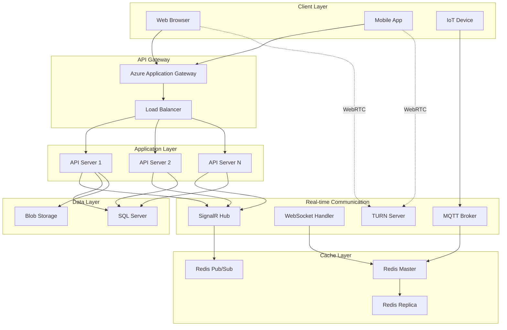

## Technology Interconnections

### 1. SignalR + Redis Backplane

SignalR uses Redis as a backplane to synchronize messages across multiple servers:

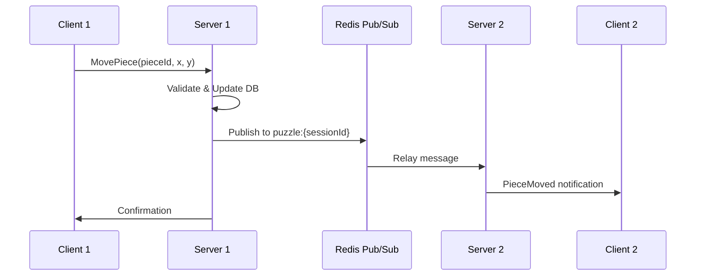

**Code Reference**: [`src/CollaborativePuzzle.Hubs/PuzzleHub.cs`](../src/CollaborativePuzzle.Hubs/PuzzleHub.cs#L232-L242)

### 2. Distributed Locking Pattern

Redis provides distributed locks to prevent race conditions:

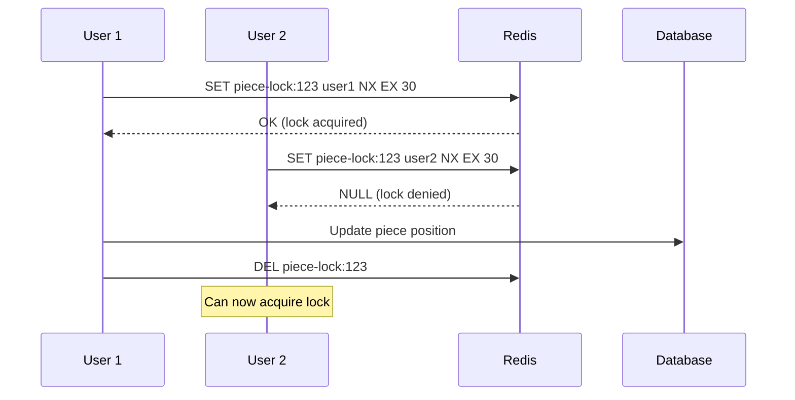

**Code Reference**: [`src/CollaborativePuzzle.Hubs/PuzzleHub.cs`](../src/CollaborativePuzzle.Hubs/PuzzleHub.cs#L285-L289)

### 3. WebSocket vs SignalR

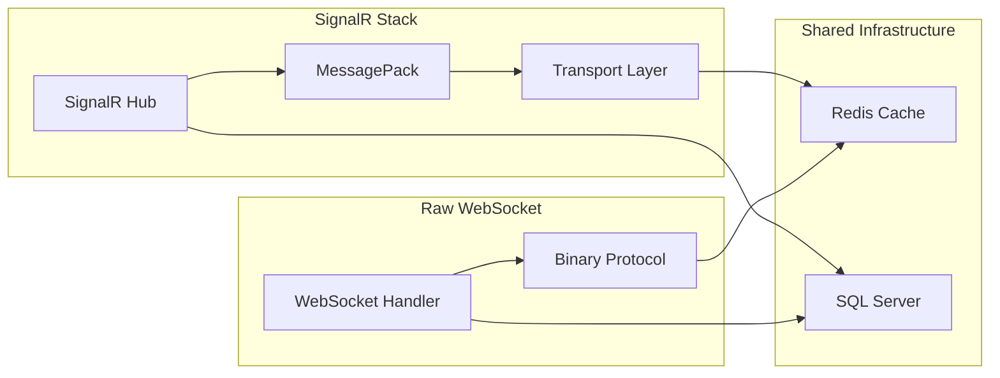

### 4. WebRTC Signaling Flow

```mermaid
sequenceDiagram
    participant A as Alice
    participant S as SignalR Hub
    participant R as Redis
    participant B as Bob
    participant T as TURN Server
    
    A->>S: CreateOffer()
    S->>R: Store offer
    S->>B: OfferReceived
    B->>S: CreateAnswer()
    S->>R: Store answer
    S->>A: AnswerReceived
    
    Note over A,B: ICE Candidate Exchange
    A->>S: ICE Candidate
    S->>B: ICE Candidate
    B->>S: ICE Candidate
    S->>A: ICE Candidate
    
    A<-->T: STUN/TURN
    B<-->T: STUN/TURN
    A<-->B: P2P Connection Established
```

### 5. MQTT Integration

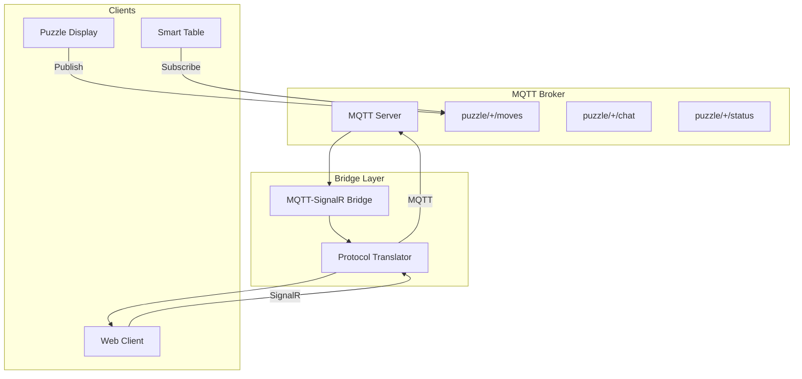

### 6. HTTP/3 QUIC Stack

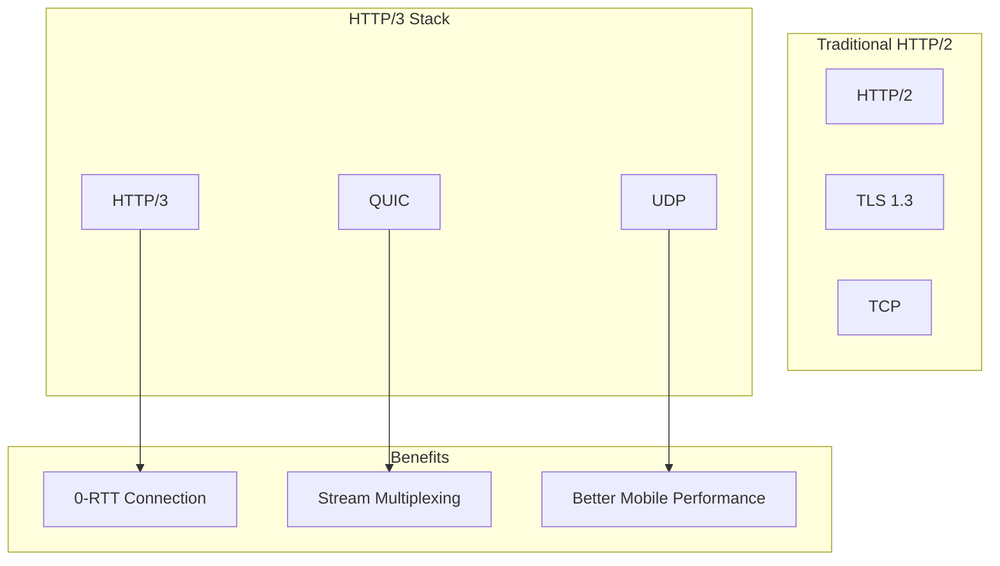

## Data Flow Patterns

### Real-time Piece Movement

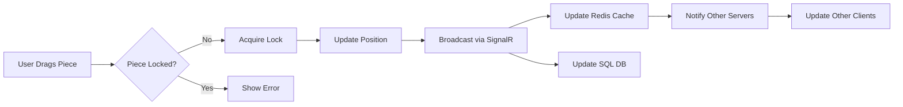

### Session State Management

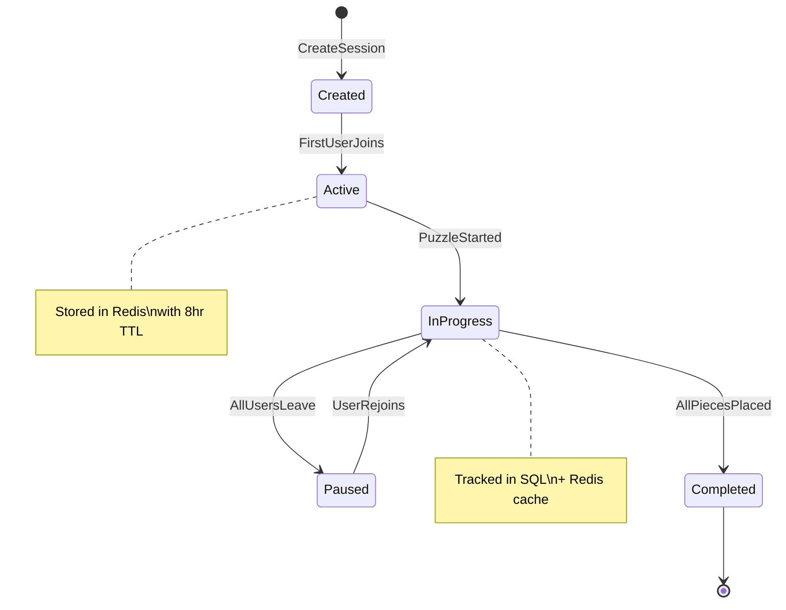

## Scalability Patterns

### Horizontal Scaling

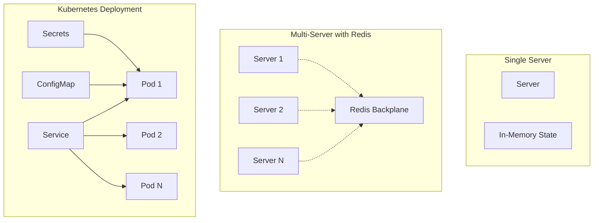

### Caching Strategy

```mermaid
graph LR
    subgraph "Cache Layers"
        L1[Browser Cache]
        L2[CDN Cache]
        L3[Redis Cache]
        L4[SQL Cache]
    end
    
    subgraph "Cache Keys"
        K1[puzzle:{id}]
        K2[session:{id}]
        K3[user:{id}:session]
        K4[piece-lock:{id}]
    end
    
    REQ[Request] --> L1
    L1 -->|Miss| L2
    L2 -->|Miss| L3
    L3 -->|Miss| L4
    L4 -->|Miss| DB[Database]
    
    L3 --> K1
    L3 --> K2
    L3 --> K3
    L3 --> K4
```

## Security Architecture

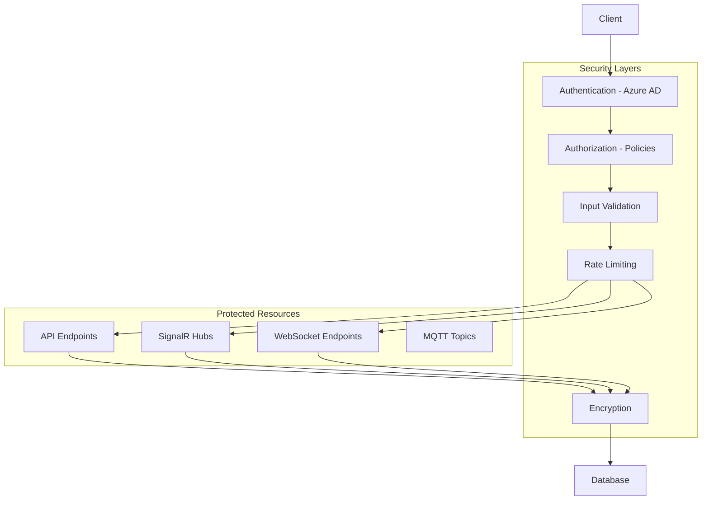

## Monitoring & Observability

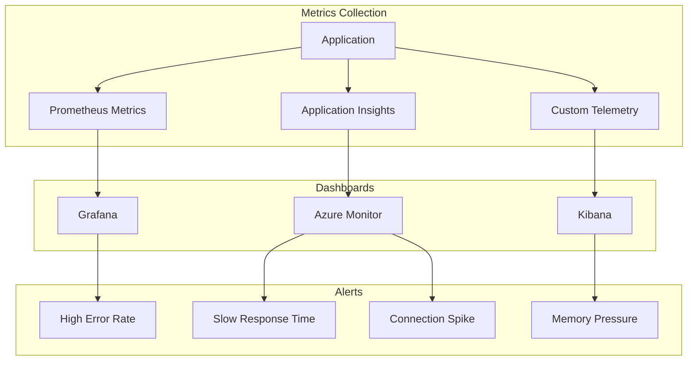

## Technology Decision Matrix

| Feature | SignalR | WebSocket | WebRTC | MQTT | Socket.IO |
|---------|---------|-----------|---------|------|-----------|
| Use Case | General real-time | Low-level control | P2P communication | IoT devices | Legacy support |
| Scaling | Excellent (Redis) | Manual | Complex | Good | Good |
| Browser Support | Excellent | Good | Good | Via bridge | Excellent |
| Protocol | Multiple | WS only | UDP/TCP | TCP | Multiple |
| Complexity | Low | Medium | High | Low | Low |
| Our Usage | Primary | Learning | Voice chat | IoT demo | Compatibility |

## References

- [SignalR Documentation](https://docs.microsoft.com/aspnet/core/signalr)
- [Redis Pub/Sub](https://redis.io/docs/manual/pubsub/)
- [WebRTC Specification](https://www.w3.org/TR/webrtc/)
- [MQTT Protocol](https://mqtt.org/mqtt-specification/)
- [HTTP/3 Explained](https://http3-explained.haxx.se/)