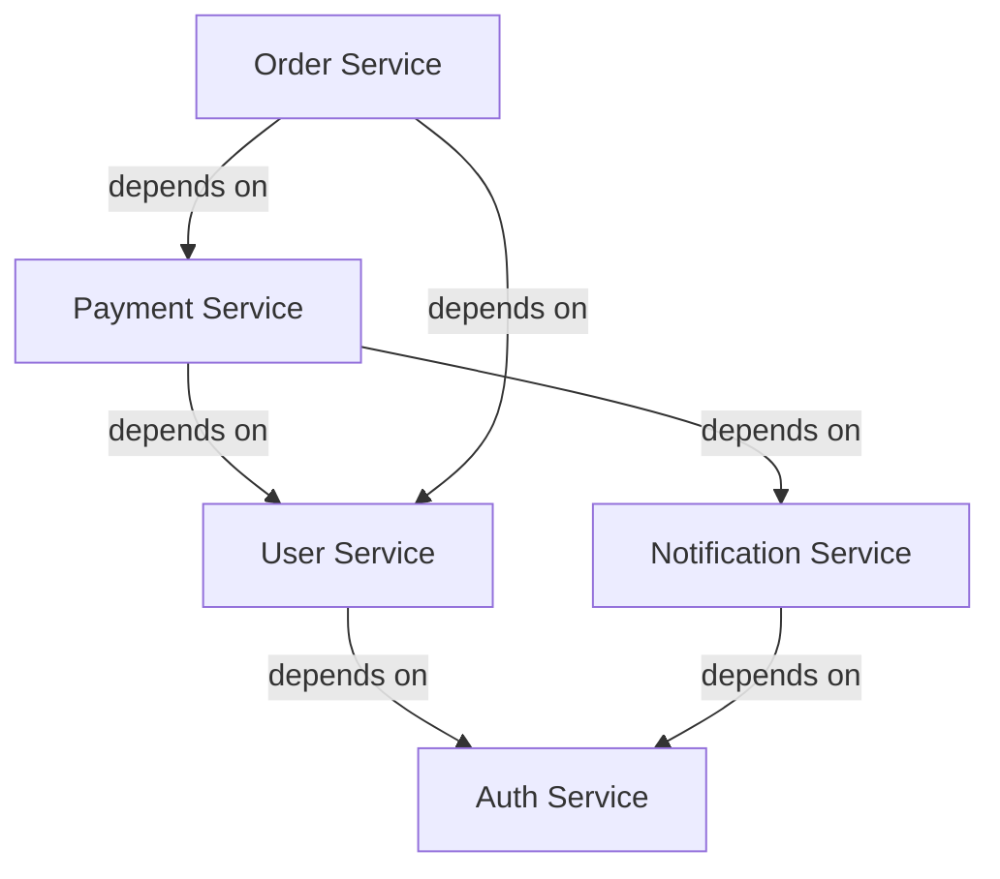

# Enterprise Project Management Primer
## A Guide for Developers Transitioning from Small to Large Teams

### Executive Summary

Transitioning from small team development to enterprise-scale project management requires fundamental shifts in communication, process, and mindset. This primer provides actionable guidance for seasoned developers taking on leadership roles in large, globally distributed teams.

## Table of Contents

1. [The Paradigm Shift](#the-paradigm-shift)
2. [Communication at Scale](#communication-at-scale)
3. [Process and Methodology](#process-and-methodology)
4. [Technical Leadership](#technical-leadership)
5. [Risk Management](#risk-management)
6. [Team Dynamics](#team-dynamics)
7. [Tools and Infrastructure](#tools-and-infrastructure)
8. [Metrics and Reporting](#metrics-and-reporting)
9. [Common Pitfalls](#common-pitfalls)
10. [Action Plan](#action-plan)

## The Paradigm Shift

### Small Team Reality
- Direct communication with all team members
- Shared context and implicit knowledge
- Flexible, informal processes
- Quick pivots and decisions
- Everyone knows the entire codebase

### Enterprise Reality
- Communication through layers and channels
- Explicit documentation required
- Formal processes and governance
- Change management procedures
- Specialized expertise in subsystems

### Key Mindset Changes

1. **From Doing to Enabling**
   - Small team: Write code, fix bugs, ship features
   - Enterprise: Enable others to write code, establish patterns, remove blockers

2. **From Implicit to Explicit**
   - Small team: "Everyone knows how we do things"
   - Enterprise: Document everything, assume nothing

3. **From Speed to Sustainability**
   - Small team: Ship fast, fix later
   - Enterprise: Build for maintenance, plan for scale

## Communication at Scale

### The Communication Pyramid

```
        Executive Leadership
       /                    \
    Program Managers      Technical Leads
   /                                    \
Team Leads                          Team Leads
/        \                          /        \
Dev  Dev  Dev                    Dev  Dev  Dev
```

### Effective Communication Strategies

#### 1. Structured Updates
```markdown
## Weekly Status Template
### Accomplished This Week
- [Feature/Task] - [Status] - [Owner]
- Completed API design review for payment service

### Planned Next Week
- Begin implementation of payment service
- Security review scheduled for Thursday

### Blockers
- Awaiting approval for AWS resource allocation
- Need clarification on compliance requirements

### Metrics
- Velocity: 47 points (target: 45)
- Bug escape rate: 2.3% (target: <3%)
```

#### 2. Asynchronous by Default
- **Documentation First**: Write it down before scheduling a meeting
- **Time Zone Awareness**: Rotate meeting times for global fairness
- **Response Time SLAs**: Set expectations (e.g., 24 hours for non-urgent)

#### 3. Communication Channels
```yaml
Channel Matrix:
  Urgent + Important:
    - Phone call
    - Incident channel
    
  Non-Urgent + Important:
    - Email with clear subject
    - Project documentation
    
  Urgent + Less Important:
    - Instant message
    - Team channel mention
    
  Non-Urgent + Less Important:
    - Team wiki
    - General channels
```

## Process and Methodology

### Scaling Agile

#### SAFe (Scaled Agile Framework) Essentials
1. **PI Planning** (Program Increment)
   - 8-12 week planning horizons
   - All teams align on objectives
   - Dependencies identified upfront

2. **Scrum of Scrums**
   - Daily sync between team representatives
   - Focus on impediments and dependencies
   - 15-minute timebox

3. **Architecture Runway**
   - Build infrastructure ahead of features
   - Maintain 1-2 sprints of architectural readiness

### Change Management

#### RFC (Request for Comments) Process
```markdown
# RFC-2024-001: Migrate to Microservices

## Status: Under Review
## Author: Jane Doe
## Reviewers: Architecture Team
## Decision Date: 2024-03-15

### Summary
Proposal to migrate monolithic application to microservices

### Motivation
- Current monolith becoming difficult to scale
- Team ownership boundaries unclear
- Deployment coupling causes delays

### Detailed Design
[Technical specification]

### Alternatives Considered
1. Modular monolith
2. Serverless functions

### Migration Plan
Phase 1: Extract authentication service
Phase 2: Extract payment service
Phase 3: Extract core business logic

### Risks and Mitigations
- Risk: Increased operational complexity
- Mitigation: Invest in observability tools
```

### Code Review at Scale

#### Review Hierarchy
1. **Automated Checks** (must pass)
   - Linting
   - Unit tests
   - Security scanning
   - Code coverage

2. **Peer Review** (1-2 reviewers)
   - Logic correctness
   - Design patterns
   - Performance implications

3. **Domain Expert Review** (for critical paths)
   - Business logic validation
   - Integration impacts
   - Compliance requirements

## Technical Leadership

### Architecture Decision Records (ADRs)

```markdown
# ADR-001: Use Event Sourcing for Audit Trail

## Status: Accepted
## Date: 2024-01-15
## Context

We need to maintain a complete audit trail of all system changes for compliance.

## Decision

We will implement Event Sourcing for all state changes in the system.

## Consequences

### Positive
- Complete audit trail by design
- Ability to replay events
- Natural fit for CQRS pattern

### Negative
- Increased complexity
- Additional storage requirements
- Team needs training

## Alternatives Considered
1. Audit tables: Rejected due to synchronization complexity
2. Change Data Capture: Rejected due to vendor lock-in
```

### Technical Debt Management

#### Debt Quadrants
```
         Reckless                 Prudent
    +-----------------+--------------------+
    |                 |                    |
Del-| "We don't have  | "We must ship now  |
ibe-| time for design"| and deal with      |
rate|                 | consequences"      |
    +-----------------+--------------------+
    |                 |                    |
Ina-| "What's layering| "Now we know how   |
dve-| ?"              | we should have     |
rtent|                | done it"           |
    +-----------------+--------------------+
```

#### Debt Tracking
```yaml
Technical Debt Register:
  - ID: TD-2024-001
    Title: Legacy authentication system
    Impact: High
    Effort: 13 points
    Risk: Security vulnerabilities
    Proposed Solution: Migrate to OAuth 2.0
    Business Value: Compliance + Security
    Priority: P1
```

## Risk Management

### Risk Register Template

| Risk ID | Description | Probability | Impact | Score | Mitigation | Owner | Status |
|---------|-------------|-------------|---------|--------|------------|--------|---------|
| R-001 | Key developer departure | Medium | High | 6 | Document critical systems, pair programming | Tech Lead | Active |
| R-002 | Cloud provider outage | Low | Critical | 8 | Multi-region deployment, DR plan | DevOps | Mitigated |
| R-003 | Security breach | Low | Critical | 8 | Security audits, penetration testing | Security | Ongoing |

### Dependency Management



#### Dependency Tracking
- **RACI Matrix** for cross-team dependencies
- **Service Level Agreements** between teams
- **API Contracts** with versioning strategy

## Team Dynamics

### Managing Distributed Teams

#### Cultural Considerations
```yaml
Team Distribution:
  USA:
    - Working Hours: 9 AM - 5 PM EST
    - Holidays: Thanksgiving, July 4th
    - Communication Style: Direct, informal
    
  India:
    - Working Hours: 9 AM - 6 PM IST
    - Holidays: Diwali, Holi
    - Communication Style: Formal, hierarchical
    
  Europe:
    - Working Hours: 9 AM - 5 PM CET
    - Holidays: August vacation period
    - Communication Style: Structured, process-oriented
```

### Building Team Cohesion

1. **Virtual Coffee Breaks**
   - 15-minute optional social calls
   - No work discussion allowed
   - Rotate time zones weekly

2. **Pair Programming Across Zones**
   - 2-hour overlap windows
   - Screen sharing tools
   - Knowledge transfer focus

3. **Documentation Culture**
   ```markdown
   ## Documentation Standards
   
   Every feature must include:
   - [ ] Architecture diagram
   - [ ] API documentation
   - [ ] Runbook for operations
   - [ ] Test scenarios
   - [ ] Performance benchmarks
   ```

### Conflict Resolution

#### Escalation Path
1. **Direct Discussion** (1-on-1)
2. **Team Lead Mediation**
3. **Skip-Level Meeting**
4. **HR Involvement**

#### Technical Disputes
```markdown
## Technical Dispute Resolution Process

1. Document positions clearly
2. Proof of Concept (if feasible)
3. Architecture review board
4. Data-driven decision
5. Document decision and rationale
```

## Tools and Infrastructure

### Essential Enterprise Tools

#### Project Management
- **Jira**: Issue tracking and sprint management
- **Confluence**: Documentation and knowledge base
- **Miro**: Collaborative diagramming
- **Microsoft Project**: Gantt charts and resource planning

#### Communication
- **Slack/Teams**: Instant messaging
- **Zoom**: Video conferencing
- **Loom**: Asynchronous video updates

#### Development
- **GitHub Enterprise**: Source control with advanced security
- **Jenkins/GitLab CI**: Build automation
- **SonarQube**: Code quality tracking
- **Artifactory**: Artifact management

### Tool Integration Strategy

```yaml
Integration Map:
  GitHub:
    - Webhooks → Jira (auto-link commits)
    - Actions → Slack (build notifications)
    - PRs → SonarQube (quality gates)
    
  Jira:
    - API → Custom dashboards
    - Automation → Slack notifications
    - Integration → Confluence docs
    
  Monitoring:
    - Prometheus → Grafana
    - Alerts → PagerDuty
    - PagerDuty → Slack
```

## Metrics and Reporting

### Key Performance Indicators (KPIs)

#### Development Metrics
```yaml
Velocity Metrics:
  - Story Points Completed: Target 200/sprint
  - Sprint Burndown: 90% completion rate
  - Cycle Time: <5 days average
  
Quality Metrics:
  - Defect Escape Rate: <3%
  - Code Coverage: >80%
  - Technical Debt Ratio: <5%
  
Operational Metrics:
  - MTTR: <30 minutes
  - Deployment Frequency: Daily
  - Change Failure Rate: <5%
```

#### Reporting Hierarchy

```
Daily:
- Team standups
- Blocker reports

Weekly:
- Sprint progress
- Risk updates
- KPI dashboard

Monthly:
- Executive summary
- Budget tracking
- Strategic alignment

Quarterly:
- OKR reviews
- Roadmap updates
- Team health surveys
```

### Dashboard Design

```markdown
## Executive Dashboard Components

1. **Health Indicators**
   - Overall project status (Red/Yellow/Green)
   - Budget utilization
   - Timeline adherence

2. **Progress Tracking**
   - Feature completion percentage
   - Milestone timeline
   - Dependency status

3. **Risk Overview**
   - Top 5 risks with mitigation status
   - Blocker count by team
   - Technical debt trends

4. **Team Metrics**
   - Velocity trends
   - Quality metrics
   - Team satisfaction scores
```

## Common Pitfalls

### 1. Over-Communication
**Problem**: Information overload from too many updates  
**Solution**: Establish clear communication protocols and summaries

### 2. Under-Documentation
**Problem**: Assuming everyone has context  
**Solution**: Document decisions, not just outcomes

### 3. Micromanagement
**Problem**: Trying to control every detail across teams  
**Solution**: Set clear objectives, trust teams to execute

### 4. Ignoring Time Zones
**Problem**: Scheduling meetings without considering global team  
**Solution**: Use scheduling tools, rotate meeting times

### 5. Tool Proliferation
**Problem**: Different teams using different tools  
**Solution**: Standardize on enterprise tool suite

### 6. Cultural Insensitivity
**Problem**: Assuming one communication style fits all  
**Solution**: Cultural awareness training, adapted communication

### 7. Technical Debt Ignorance
**Problem**: Always prioritizing features over maintenance  
**Solution**: Allocate 20% of capacity to technical debt

## Action Plan

### First 30 Days
1. **Week 1: Observe and Learn**
   - Shadow existing processes
   - Meet all stakeholders
   - Review documentation

2. **Week 2: Assess Current State**
   - Identify pain points
   - Map dependencies
   - Evaluate tool usage

3. **Week 3: Build Relationships**
   - 1-on-1s with team leads
   - Join team ceremonies
   - Establish communication channels

4. **Week 4: Create Initial Plan**
   - Document findings
   - Propose improvements
   - Set 90-day goals

### First 90 Days
1. **Days 31-60: Implement Quick Wins**
   - Standardize meeting formats
   - Improve documentation
   - Establish metrics

2. **Days 61-90: Build Foundation**
   - Implement key processes
   - Train team on new tools
   - Establish feedback loops

### Ongoing Practices
1. **Weekly**
   - Review metrics
   - Address blockers
   - Celebrate wins

2. **Monthly**
   - Team health checks
   - Process retrospectives
   - Stakeholder updates

3. **Quarterly**
   - Strategic alignment
   - Tool evaluation
   - Training needs assessment

## Conclusion

Success in enterprise project management comes from balancing structure with flexibility, process with pragmatism, and global thinking with local execution. Remember that your role is to enable success at scale, not to control every detail.

### Key Takeaways
1. **Communication is your primary tool** - Invest in making it effective
2. **Process enables scale** - But don't let it become bureaucracy
3. **Trust your teams** - Set clear expectations and let them execute
4. **Measure what matters** - Focus on outcomes, not activity
5. **Culture eats strategy** - Invest in building a healthy team culture

### Resources for Continued Learning
- "The Mythical Man-Month" by Frederick Brooks
- "Team Topologies" by Matthew Skelton and Manuel Pais
- "Accelerate" by Nicole Forsgren, Jez Humble, and Gene Kim
- SAFe certification and training
- Enterprise architecture frameworks (TOGAF)

Remember: The transition from individual contributor to enterprise leader is a journey, not a destination. Stay curious, remain humble, and always be learning.