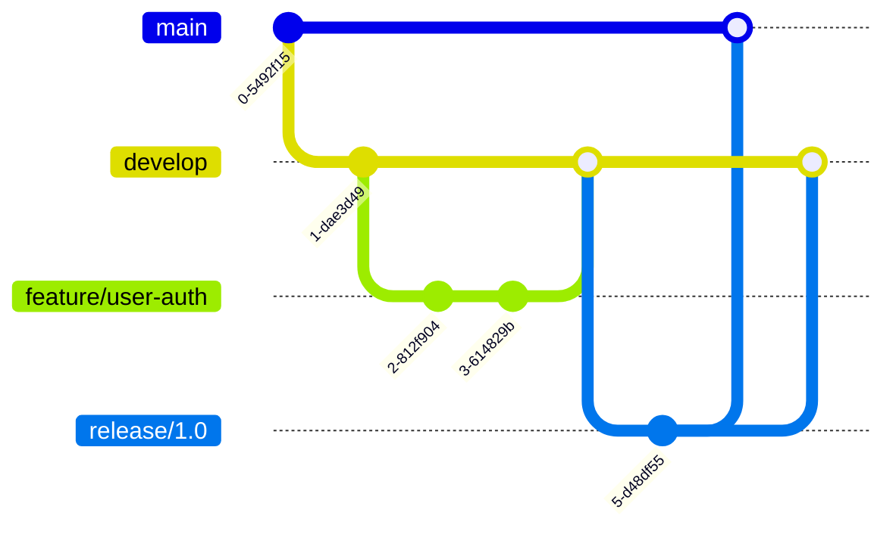

# GitHub for Enterprise Teams Primer
## Best Practices for Large-Scale Development

### Executive Summary

GitHub at enterprise scale requires different strategies than small team development. This primer covers best practices for pull requests, commit messages, branch strategies, and collaborative workflows that maintain quality and velocity across large, distributed teams.

## Table of Contents

1. [Repository Organization](#repository-organization)
2. [Branching Strategies](#branching-strategies)
3. [Commit Message Standards](#commit-message-standards)
4. [Pull Request Excellence](#pull-request-excellence)
5. [Code Review Culture](#code-review-culture)
6. [Automation and CI/CD](#automation-and-cicd)
7. [Security and Compliance](#security-and-compliance)
8. [Team Collaboration](#team-collaboration)
9. [Performance at Scale](#performance-at-scale)
10. [Good Behavior Guidelines](#good-behavior-guidelines)

## Repository Organization

### Monorepo vs Polyrepo

#### Monorepo Structure
```
company-monorepo/
├── services/
│   ├── authentication/
│   ├── payment/
│   └── notification/
├── libraries/
│   ├── common/
│   └── shared-components/
├── tools/
│   ├── build/
│   └── deploy/
├── docs/
└── .github/
    ├── workflows/
    ├── CODEOWNERS
    └── pull_request_template.md
```

#### When to Use Monorepo
- Shared code and dependencies
- Atomic cross-service changes
- Unified versioning
- Consistent tooling

#### When to Use Polyrepo
- Independent service lifecycles
- Different technology stacks
- Separate team ownership
- Compliance boundaries

### Repository Naming Conventions

```yaml
Naming Standards:
  Services: {company}-{service}-{type}
    Example: acme-payment-api
    
  Libraries: {company}-{language}-{purpose}
    Example: acme-java-commons
    
  Tools: {company}-tools-{name}
    Example: acme-tools-deploy
    
  Documentation: {company}-docs-{topic}
    Example: acme-docs-architecture
```

## Branching Strategies

### Git Flow for Enterprise



### Branch Naming Conventions

```yaml
Branch Types:
  Feature: feature/{ticket-id}-{brief-description}
    Example: feature/JIRA-1234-add-oauth-support
    
  Bugfix: bugfix/{ticket-id}-{brief-description}
    Example: bugfix/JIRA-5678-fix-memory-leak
    
  Hotfix: hotfix/{ticket-id}-{brief-description}
    Example: hotfix/JIRA-9012-critical-security-patch
    
  Release: release/{version}
    Example: release/2.1.0
    
  Experiment: experiment/{username}-{description}
    Example: experiment/jdoe-new-caching-strategy
```

### Branch Protection Rules

```yaml
Main Branch Protection:
  - Require pull request reviews: 2
  - Dismiss stale reviews: true
  - Require review from CODEOWNERS: true
  - Require status checks: true
  - Require branches up to date: true
  - Include administrators: false
  - Restrict push access: true

Develop Branch Protection:
  - Require pull request reviews: 1
  - Require status checks: true
  - No force pushes: true
```

## Commit Message Standards

### Conventional Commits

```
<type>(<scope>): <subject>

<body>

<footer>
```

#### Types
- **feat**: New feature
- **fix**: Bug fix
- **docs**: Documentation changes
- **style**: Code style changes (formatting, semicolons, etc.)
- **refactor**: Code refactoring
- **perf**: Performance improvements
- **test**: Adding or modifying tests
- **build**: Build system changes
- **ci**: CI configuration changes
- **chore**: Maintenance tasks
- **revert**: Revert previous commit

#### Examples

```bash
# Feature commit
feat(auth): implement OAuth 2.0 login flow

- Add OAuth provider configuration
- Implement callback handling
- Add token refresh mechanism

Closes #123

# Bug fix commit
fix(payment): resolve race condition in payment processing

The payment service was experiencing race conditions when processing
multiple transactions simultaneously. This fix implements proper
locking mechanisms using Redis distributed locks.

Bug: JIRA-5678
See-also: #456, #789

# Breaking change commit
feat(api)!: change user endpoint response format

BREAKING CHANGE: The /api/users endpoint now returns a paginated
response instead of a flat array. Clients need to update their
parsing logic.

Migration guide: docs/migrations/v2-api-changes.md
```

### Commit Message Template

```bash
# .gitmessage.txt
# <type>(<scope>): <subject>
# 
# <body>
# 
# <footer>

# Type: feat, fix, docs, style, refactor, perf, test, build, ci, chore, revert
# Scope: The area of the codebase affected (e.g., auth, payment, ui)
# Subject: Brief description in imperative mood (max 50 chars)
# 
# Body: Detailed explanation of what and why (wrap at 72 chars)
# - Use bullet points for multiple items
# - Explain the problem being solved
# - Describe any limitations or future work
# 
# Footer: References to issues, breaking changes, etc.
# - Closes #123
# - Bug: JIRA-456
# - BREAKING CHANGE: Description of the breaking change
```

Configure globally:
```bash
git config --global commit.template ~/.gitmessage.txt
```

## Pull Request Excellence

### PR Template

```markdown
<!-- .github/pull_request_template.md -->
## Description
Brief description of what this PR does.

## Type of Change
- [ ] Bug fix (non-breaking change which fixes an issue)
- [ ] New feature (non-breaking change which adds functionality)
- [ ] Breaking change (fix or feature that would cause existing functionality to not work as expected)
- [ ] Documentation update

## Related Issues
Closes #(issue number)

## Testing
- [ ] Unit tests pass
- [ ] Integration tests pass
- [ ] Manual testing completed

## Checklist
- [ ] My code follows the style guidelines
- [ ] I have performed a self-review
- [ ] I have commented my code in hard-to-understand areas
- [ ] I have made corresponding changes to the documentation
- [ ] My changes generate no new warnings
- [ ] I have added tests that prove my fix/feature works
- [ ] New and existing unit tests pass locally
- [ ] Any dependent changes have been merged

## Screenshots (if appropriate)

## Performance Impact
Describe any performance implications and benchmarks if relevant.

## Security Considerations
List any security implications of this change.

## Deployment Notes
Special instructions for deployment (if any).
```

### PR Size Guidelines

```yaml
PR Size Recommendations:
  Small (Preferred):
    - < 100 lines changed
    - Single logical change
    - Review time: < 30 minutes
    
  Medium (Acceptable):
    - 100-500 lines changed
    - Related changes
    - Review time: 30-60 minutes
    
  Large (Avoid):
    - > 500 lines changed
    - Should be split if possible
    - Review time: > 1 hour
    
  Exceptions:
    - Generated code
    - Vendor updates
    - Large refactoring (with prior discussion)
```

### Effective PR Descriptions

#### Good Example
```markdown
## Add distributed caching to user service

### What
Implements Redis-based distributed caching for user profile data to reduce database load.

### Why
- Database CPU utilization hitting 80% during peak hours
- User profile queries account for 40% of all database queries
- 95% of user profiles are accessed repeatedly within 5 minutes

### How
- Added Redis client configuration
- Implemented cache-aside pattern for user profile queries
- Set 5-minute TTL for cache entries
- Added cache invalidation on profile updates

### Performance Impact
- Reduced average response time from 150ms to 20ms
- Database load decreased by 35%
- Redis memory usage: ~2GB for 100k active users

### Testing
- Unit tests for cache operations
- Integration tests with Redis test container
- Load testing shows 5x throughput improvement
```

## Code Review Culture

### Review Checklist

```markdown
## Code Review Checklist

### Functionality
- [ ] Does the code do what it's supposed to do?
- [ ] Are edge cases handled?
- [ ] Is error handling appropriate?

### Design
- [ ] Is the code well-structured?
- [ ] Does it follow SOLID principles?
- [ ] Is it maintainable and extensible?

### Performance
- [ ] Are there any obvious performance issues?
- [ ] Is caching used appropriately?
- [ ] Are database queries optimized?

### Security
- [ ] Are inputs validated?
- [ ] Is authentication/authorization correct?
- [ ] Are secrets handled properly?

### Testing
- [ ] Is test coverage adequate?
- [ ] Are tests meaningful?
- [ ] Do tests cover edge cases?

### Documentation
- [ ] Is complex logic commented?
- [ ] Are public APIs documented?
- [ ] Is the README updated if needed?
```

### Review Comments Best Practices

#### Constructive Feedback

```markdown
# Good Examples

## Suggesting improvement
"Consider using a map here instead of repeated lookups. This would reduce complexity from O(n²) to O(n)."

## Asking for clarification
"I'm not sure I understand why we need this check. Could you explain the scenario where this would be necessary?"

## Praising good code
"Nice use of the builder pattern here! This makes the configuration much more readable."

## Security concern
"This SQL query appears to be vulnerable to injection. Consider using parameterized queries instead."

# Poor Examples

## Too vague
"This doesn't look right."

## Too harsh
"This is terrible code."

## Nitpicking
"Missing period at end of comment."

## Personal
"I wouldn't do it this way."
```

### Review Response Etiquette

```markdown
## Responding to Feedback

### Accepting suggestions
"Good catch! I'll update this to use parameterized queries."

### Explaining decisions
"I chose this approach because [reasoning]. However, I'm open to alternatives if you think there's a better way."

### Asking for clarification
"I'm not sure I follow your suggestion. Could you provide an example of what you mean?"

### Disagreeing respectfully
"I see your point, but I think the current approach might be better because [reasoning]. What do you think?"
```

## Automation and CI/CD

### GitHub Actions for Enterprise

```yaml
# .github/workflows/main.yml
name: Main CI/CD Pipeline

on:
  pull_request:
    branches: [main, develop]
  push:
    branches: [main, develop]

concurrency:
  group: ${{ github.workflow }}-${{ github.ref }}
  cancel-in-progress: true

jobs:
  validate:
    runs-on: ubuntu-latest
    steps:
      - uses: actions/checkout@v3
      
      - name: Validate PR Title
        if: github.event_name == 'pull_request'
        uses: amannn/action-semantic-pull-request@v5
        
      - name: Check Commit Messages
        uses: wagoid/commitlint-github-action@v5

  security:
    runs-on: ubuntu-latest
    steps:
      - uses: actions/checkout@v3
      
      - name: Run Trivy vulnerability scanner
        uses: aquasecurity/trivy-action@master
        
      - name: Run CodeQL analysis
        uses: github/codeql-action/analyze@v2
        
      - name: Check secrets
        uses: trufflesecurity/trufflehog@main

  quality:
    runs-on: ubuntu-latest
    steps:
      - uses: actions/checkout@v3
      
      - name: SonarQube Scan
        uses: sonarsource/sonarqube-scan-action@master
        
      - name: Code Coverage
        run: |
          npm test -- --coverage
          bash <(curl -s https://codecov.io/bash)

  build-and-test:
    runs-on: ubuntu-latest
    strategy:
      matrix:
        node-version: [16.x, 18.x, 20.x]
    steps:
      - uses: actions/checkout@v3
      
      - name: Use Node.js ${{ matrix.node-version }}
        uses: actions/setup-node@v3
        with:
          node-version: ${{ matrix.node-version }}
          cache: 'npm'
          
      - name: Install dependencies
        run: npm ci
        
      - name: Build
        run: npm run build
        
      - name: Test
        run: npm test
```

### Required Status Checks

```yaml
Branch Protection Status Checks:
  Required:
    - CI / build-and-test
    - CI / security
    - CI / quality
    - CodeQL
    - License Check
    
  Optional but Recommended:
    - Performance Tests
    - E2E Tests
    - Visual Regression Tests
```

## Security and Compliance

### CODEOWNERS File

```
# .github/CODEOWNERS

# Global owners
* @company/architects

# Frontend
/frontend/ @company/frontend-team
/frontend/payments/ @company/payments-team @company/frontend-team

# Backend services
/services/auth/ @company/security-team
/services/payment/ @company/payments-team @company/security-team
/services/user/ @company/platform-team

# Infrastructure
/infrastructure/ @company/devops-team
/k8s/ @company/devops-team @company/security-team

# Documentation
/docs/ @company/docs-team
*.md @company/docs-team

# Security-sensitive files
**/security/ @company/security-team
**/crypto/ @company/security-team
.github/workflows/ @company/devops-team @company/security-team
```

### Security Policies

```markdown
<!-- .github/SECURITY.md -->
# Security Policy

## Supported Versions

| Version | Supported          |
| ------- | ------------------ |
| 2.1.x   | :white_check_mark: |
| 2.0.x   | :white_check_mark: |
| 1.9.x   | :x:                |

## Reporting a Vulnerability

1. **DO NOT** create a public issue
2. Email security@company.com with:
   - Description of the vulnerability
   - Steps to reproduce
   - Potential impact
   - Suggested fix (if any)

## Security Review Process

All PRs modifying security-sensitive areas require:
1. Review from security team
2. Passing security scan
3. Threat modeling update (if applicable)
```

### Dependency Management

```yaml
# .github/dependabot.yml
version: 2
updates:
  - package-ecosystem: "npm"
    directory: "/"
    schedule:
      interval: "daily"
    security-updates-only: true
    labels:
      - "dependencies"
      - "security"
    reviewers:
      - "company/security-team"
    
  - package-ecosystem: "docker"
    directory: "/"
    schedule:
      interval: "weekly"
    labels:
      - "docker"
      - "dependencies"
```

## Team Collaboration

### Issue Templates

```markdown
<!-- .github/ISSUE_TEMPLATE/bug_report.md -->
---
name: Bug Report
about: Create a report to help us improve
title: '[BUG] '
labels: 'bug, needs-triage'
assignees: ''
---

## Bug Description
A clear and concise description of the bug.

## To Reproduce
Steps to reproduce the behavior:
1. Go to '...'
2. Click on '....'
3. Scroll down to '....'
4. See error

## Expected Behavior
What you expected to happen.

## Actual Behavior
What actually happened.

## Environment
- OS: [e.g. Ubuntu 20.04]
- Browser: [e.g. Chrome 91]
- Version: [e.g. 2.1.0]

## Additional Context
Add any other context, logs, or screenshots.
```

### Project Boards

```yaml
Project Board Structure:
  Backlog:
    - New issues
    - Refined stories
    - Tech debt items
    
  To Do:
    - Sprint committed items
    - Ready for development
    
  In Progress:
    - Actively being worked on
    - WIP limit: 2 per developer
    
  In Review:
    - PR opened
    - Awaiting review
    
  Testing:
    - Code review complete
    - QA testing
    
  Done:
    - Merged to develop
    - Deployed to staging
```

### Labels System

```yaml
Label Categories:
  Type:
    - bug
    - feature
    - enhancement
    - documentation
    - refactor
    
  Priority:
    - P0-critical
    - P1-high
    - P2-medium
    - P3-low
    
  Status:
    - needs-triage
    - ready
    - blocked
    - in-progress
    - needs-review
    
  Component:
    - frontend
    - backend
    - infrastructure
    - security
    
  Effort:
    - effort-1 (< 1 day)
    - effort-2 (1-3 days)
    - effort-3 (3-5 days)
    - effort-5 (1-2 weeks)
    - effort-8 (> 2 weeks)
```

## Performance at Scale

### Large Repository Optimization

```bash
# Clone with limited depth
git clone --depth 1 https://github.com/company/large-repo

# Use sparse checkout for monorepos
git sparse-checkout init --cone
git sparse-checkout set services/my-service

# Enable Git LFS for large files
git lfs track "*.psd"
git lfs track "*.zip"
git add .gitattributes

# Use partial clone
git clone --filter=blob:none https://github.com/company/repo
```

### CI/CD Optimization

```yaml
# Use caching effectively
- name: Cache dependencies
  uses: actions/cache@v3
  with:
    path: ~/.npm
    key: ${{ runner.os }}-node-${{ hashFiles('**/package-lock.json') }}
    restore-keys: |
      ${{ runner.os }}-node-

# Parallelize jobs
jobs:
  test:
    strategy:
      matrix:
        test-suite: [unit, integration, e2e]
    steps:
      - run: npm run test:${{ matrix.test-suite }}

# Use conditional jobs
security-scan:
  if: |
    github.event_name == 'pull_request' &&
    contains(github.event.pull_request.labels.*.name, 'security')
```

## Good Behavior Guidelines

### The Golden Rules

1. **Be Respectful**
   - Assume positive intent
   - Focus on the code, not the person
   - Acknowledge others' expertise

2. **Be Responsive**
   - Respond to PR reviews within 1 business day
   - Update PR status when working on feedback
   - Communicate delays or blockers

3. **Be Thorough**
   - Test your code before pushing
   - Self-review before requesting reviews
   - Document non-obvious decisions

4. **Be Collaborative**
   - Pair on complex problems
   - Share knowledge through comments
   - Mentor junior developers

### Communication Guidelines

```markdown
## Async Communication Best Practices

### PR Comments
- Use threads for discussions
- Resolve threads when addressed
- Tag relevant experts with @mentions

### Issue Updates
- Update status weekly for long-running issues
- Link related PRs and issues
- Close with clear resolution notes

### Notifications
- Configure notification settings appropriately
- Use @here sparingly in Slack integrations
- Respect focus time and time zones
```

### Escalation Process

```yaml
Escalation Path:
  Level 1:
    - Try to resolve with PR author
    - Seek clarification in comments
    
  Level 2:
    - Tag team lead for input
    - Schedule sync discussion if needed
    
  Level 3:
    - Involve engineering manager
    - Architecture review if design dispute
    
  Level 4:
    - CTO/VP Engineering decision
    - Document decision in ADR
```

## Best Practices Summary

### Do's
- ✅ Write clear, atomic commits
- ✅ Keep PRs small and focused
- ✅ Review code promptly and thoroughly
- ✅ Use automation to enforce standards
- ✅ Document decisions and context
- ✅ Be kind and constructive in reviews
- ✅ Test before pushing
- ✅ Keep dependencies up to date

### Don'ts
- ❌ Force push to shared branches
- ❌ Merge without required approvals
- ❌ Ignore CI failures
- ❌ Leave PRs open indefinitely
- ❌ Make personal attacks in reviews
- ❌ Commit secrets or credentials
- ❌ Skip documentation updates
- ❌ Bypass security scans

## Tools and Resources

### Essential Tools
- **GitHub CLI**: `gh` for command-line operations
- **Hub**: Alternative CLI tool
- **Refined GitHub**: Browser extension for enhanced UI
- **Octotree**: File tree sidebar
- **GitHub Desktop**: GUI for non-technical stakeholders

### Learning Resources
- GitHub Enterprise documentation
- GitHub Learning Lab
- "Effective Pull Requests" course
- Internal company Git guidelines
- Team-specific conventions

### Metrics and Monitoring
- Pull request cycle time
- Review response time
- Build success rate
- Mean time to merge
- Code coverage trends

## Conclusion

Success with GitHub at enterprise scale requires discipline, consistency, and strong team culture. These practices evolve with your team - regularly retrospect and refine them based on what works for your organization.

Remember: The goal is to ship quality code efficiently while maintaining a positive team dynamic. Tools and processes should enable this, not hinder it.