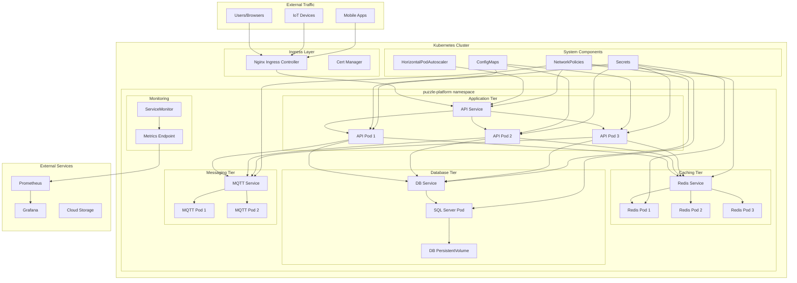
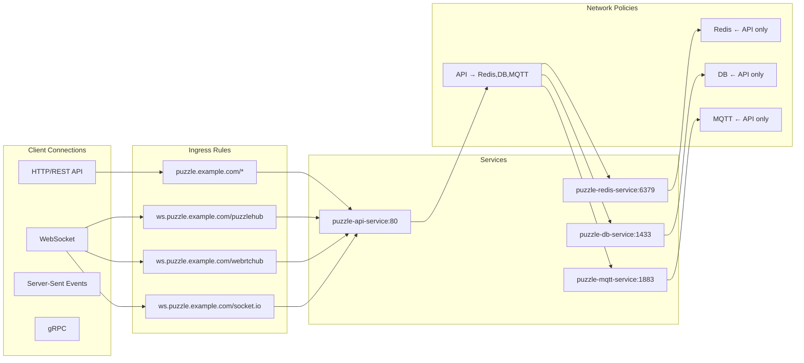
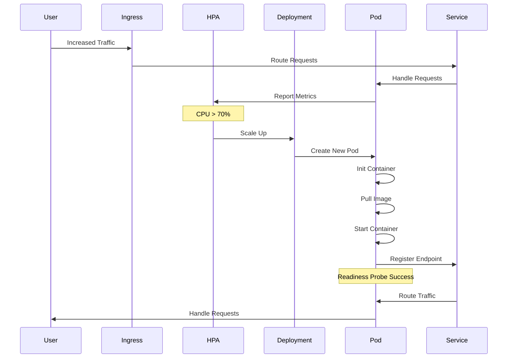
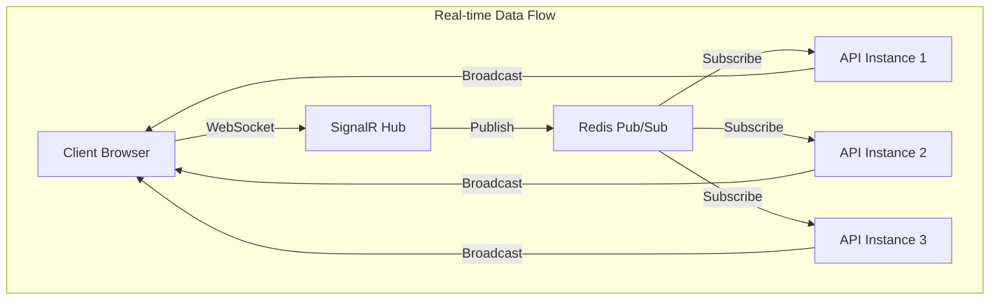
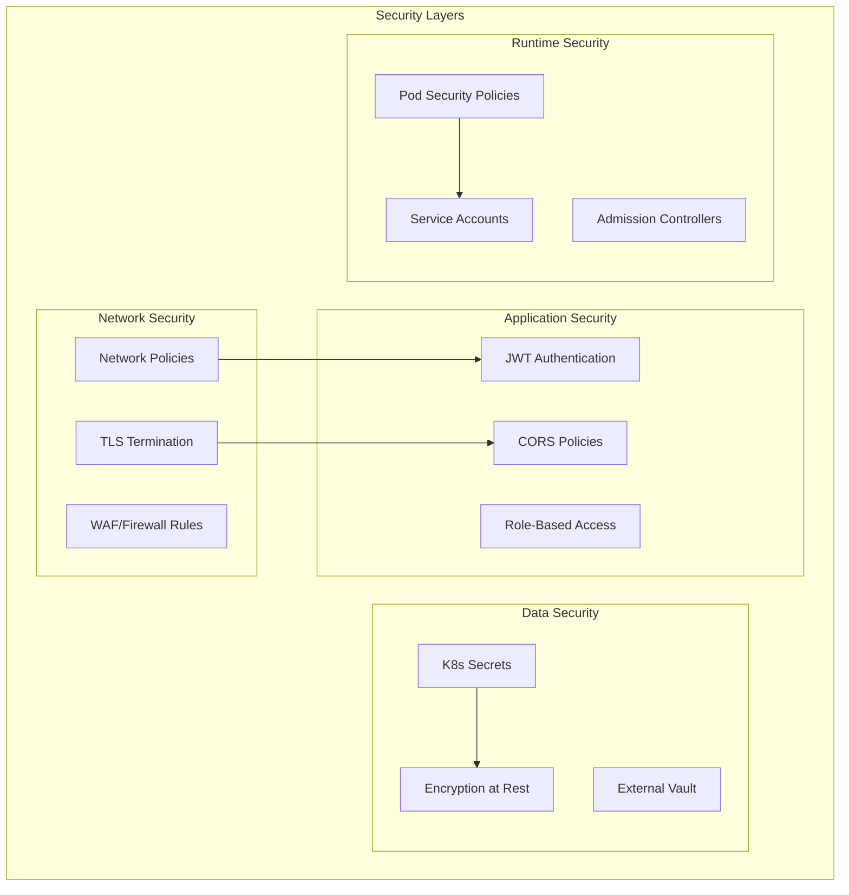
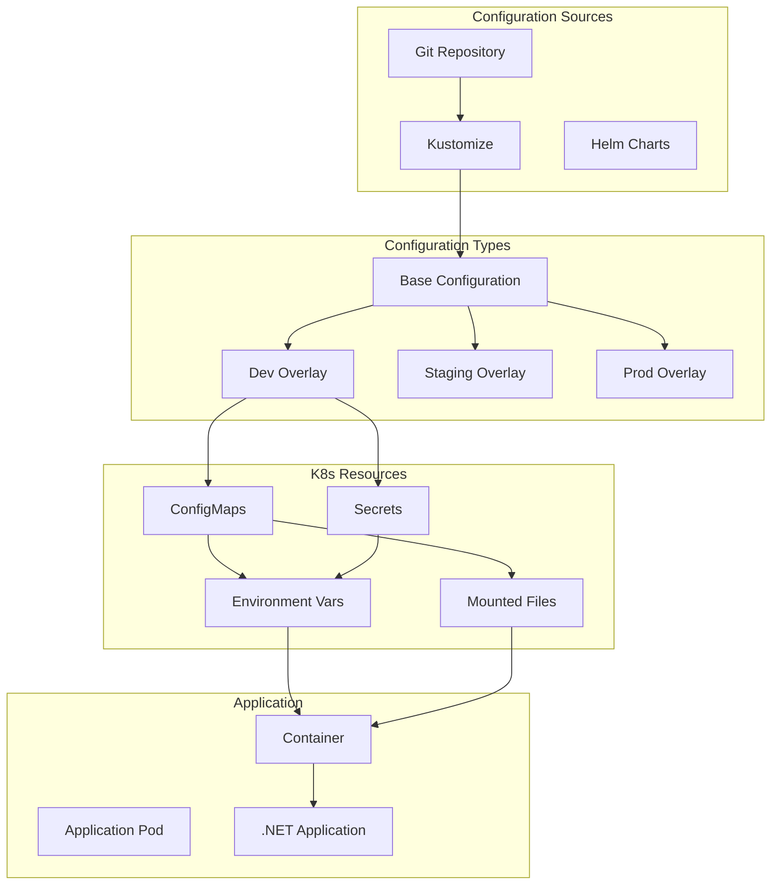
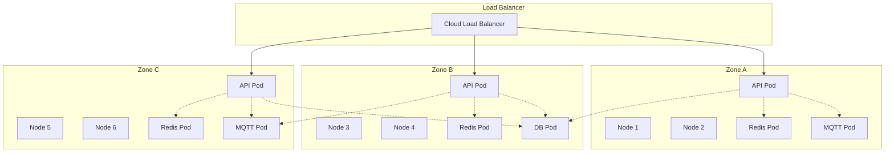
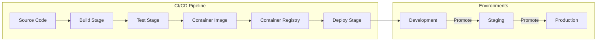

# Kubernetes Architecture - Collaborative Puzzle Platform

## System Architecture Diagram

## Network Flow Diagram

## Pod Lifecycle and Scaling

## Data Flow Architecture

## Security Architecture

## Storage Architecture

```mermaid
graph LR
    subgraph "Persistent Storage"
        subgraph "Database Storage"
            SQLPod[SQL Server Pod]
            SQLPVC[PVC: sql-data]
            SQLPV[PersistentVolume]
            Disk1[Azure Disk/AWS EBS]
        end
        
        subgraph "Cache Storage"
            RedisPod[Redis Pod]
            RedisPVC[PVC: redis-data]
            RedisPV[PersistentVolume]
            Disk2[SSD Storage]
        end
        
        subgraph "Message Storage"
            MQTTPod[MQTT Pod]
            MQTTPVC[PVC: mqtt-data]
            MQTTPV[PersistentVolume]
            Disk3[Standard Storage]
        end
    end
    
    SQLPod --> SQLPVC
    SQLPVC --> SQLPV
    SQLPV --> Disk1
    
    RedisPod --> RedisPVC
    RedisPVC --> RedisPV
    RedisPV --> Disk2
    
    MQTTPod --> MQTTPVC
    MQTTPVC --> MQTTPV
    MQTTPV --> Disk3
```

## Configuration Management

## High Availability Design

## Deployment Pipeline

This architecture demonstrates:
- **High Availability**: Multiple replicas across availability zones
- **Scalability**: Horizontal pod autoscaling based on metrics
- **Security**: Multiple layers of network and application security
- **Observability**: Integrated monitoring and metrics collection
- **Resilience**: Health checks, circuit breakers, and graceful shutdowns
- **Performance**: Caching layer, connection pooling, and load balancing