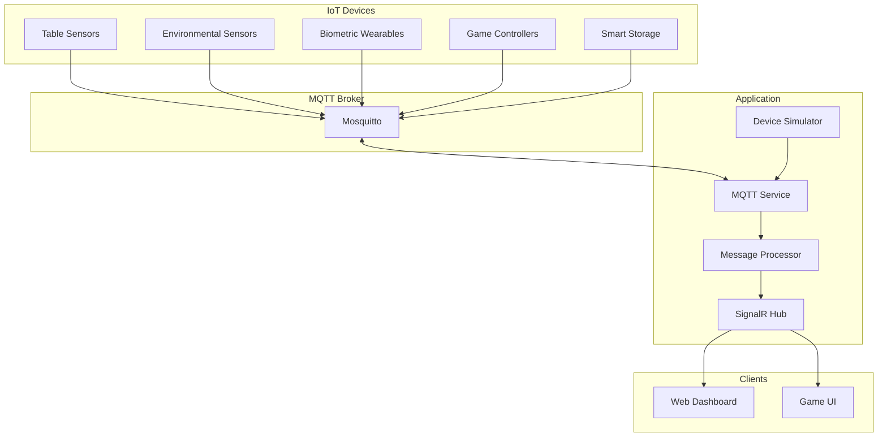

# MQTT IoT Integration Guide

## Overview

The Collaborative Puzzle Platform includes MQTT integration for IoT device connectivity, enabling physical devices to interact with the digital puzzle experience. This creates an immersive gaming environment where sensors, controllers, and environmental monitoring enhance gameplay.

## Architecture



## IoT Device Categories

### 1. Puzzle Table Sensors

Physical puzzle tables equipped with various sensors:

**Topics:**
- `puzzle/table/{tableId}/sensors` - Sensor data stream
- `puzzle/table/{tableId}/calibrate` - Calibration commands

**Data Structure:**
```json
{
  "deviceId": "table-001",
  "timestamp": "2025-07-26T10:30:00Z",
  "sensors": {
    "pressure": {
      "zones": [
        { "zone": 1, "pressure": 0.75, "active": true },
        { "zone": 2, "pressure": 0.0, "active": false }
      ],
      "totalWeight": 45.5,
      "activePieces": 12
    },
    "touch": {
      "points": [
        { "id": 0, "x": 500, "y": 300, "pressure": 0.8 }
      ],
      "gestures": "swipe"
    },
    "rfid": {
      "detectedPieces": [
        {
          "pieceId": "piece-1234",
          "position": { "x": 50, "y": 30 },
          "orientation": 90,
          "lastMoved": "2025-07-26T10:29:45Z"
        }
      ]
    }
  }
}
```

### 2. Environmental Sensors

Room monitoring for optimal gaming conditions:

**Topics:**
- `puzzle/environment/{roomId}` - Environmental data
- `puzzle/environment/{roomId}/alerts` - Comfort alerts

**Data Structure:**
```json
{
  "deviceId": "env-sensor-room-main",
  "timestamp": "2025-07-26T10:30:00Z",
  "environment": {
    "temperature": 22.5,
    "humidity": 45.2,
    "lightLevel": 450,
    "noiseLevel": 42,
    "airQuality": 95
  },
  "comfort": {
    "index": 0.82,
    "recommendations": [
      "Adjust room temperature",
      "Increase lighting"
    ]
  }
}
```

### 3. Player Biometrics

Wearable devices tracking player wellness:

**Topics:**
- `puzzle/player/{playerId}/biometrics` - Biometric data
- `puzzle/player/{playerId}/alerts` - Health alerts

**Data Structure:**
```json
{
  "deviceId": "biometric-player-001",
  "timestamp": "2025-07-26T10:30:00Z",
  "player": "player-001",
  "vitals": {
    "heartRate": 75,
    "heartRateVariability": 42,
    "stressLevel": 0.3,
    "focusScore": 0.85
  },
  "eyeTracking": {
    "gazePoint": { "x": 960, "y": 540 },
    "pupilDilation": 4.2,
    "blinkRate": 18,
    "focusArea": "center"
  },
  "posture": {
    "slouching": false,
    "headTilt": -5,
    "distance": 60
  }
}
```

### 4. Game Controllers

Custom hardware controllers with haptic feedback:

**Topics:**
- `puzzle/controller/{controllerId}/input` - Controller input
- `puzzle/controller/{controllerId}/haptic` - Haptic commands

**Data Structure:**
```json
{
  "deviceId": "controller-001",
  "timestamp": "2025-07-26T10:30:00Z",
  "input": {
    "buttons": {
      "select": false,
      "rotate": true,
      "zoom": false,
      "menu": false
    },
    "analog": {
      "x": 0.5,
      "y": -0.3,
      "pressure": 0.7
    },
    "motion": {
      "accelerometer": { "x": 0.1, "y": 0.2, "z": 0.9 },
      "gyroscope": { "pitch": 10, "roll": -5, "yaw": 0 }
    }
  },
  "haptic": {
    "enabled": true,
    "intensity": 0.8,
    "pattern": "pulse"
  },
  "battery": {
    "level": 85,
    "charging": false
  }
}
```

### 5. Smart Puzzle Storage

IoT-enabled puzzle boxes with inventory tracking:

**Topics:**
- `puzzle/storage/{boxId}/status` - Storage status
- `puzzle/storage/{boxId}/inventory` - Inventory updates

**Data Structure:**
```json
{
  "deviceId": "puzzle-box-001",
  "timestamp": "2025-07-26T10:30:00Z",
  "status": {
    "isOpen": false,
    "batteryLevel": 92,
    "temperature": 25.1,
    "humidity": 42.5
  },
  "inventory": {
    "totalPieces": 1000,
    "missingPieces": 2,
    "sortedCompartments": 12,
    "lastInventoryCheck": "2025-07-26T09:00:00Z"
  },
  "security": {
    "locked": true,
    "lastAccess": "2025-07-26T08:30:00Z",
    "accessedBy": "user-005"
  }
}
```

## Configuration

### Docker Compose Setup

```yaml
mosquitto:
  image: eclipse-mosquitto:latest
  ports:
    - "1883:1883"
    - "9001:9001"
  volumes:
    - ./mosquitto/config:/mosquitto/config
    - ./mosquitto/data:/mosquitto/data
    - ./mosquitto/log:/mosquitto/log
  networks:
    - puzzle-network
```

### Application Settings

```json
{
  "Mqtt": {
    "BrokerHost": "localhost",
    "BrokerPort": 1883,
    "ClientId": "puzzle-api",
    "Username": "puzzle",
    "Password": "puzzle123",
    "KeepAliveInterval": 60,
    "AutoReconnectDelay": 5
  }
}
```

### Mosquitto Configuration

```conf
# mosquitto.conf
listener 1883
listener 9001
protocol websockets

allow_anonymous false
password_file /mosquitto/config/passwords

# ACL for topic permissions
acl_file /mosquitto/config/acl

# Logging
log_type all
log_dest file /mosquitto/log/mosquitto.log
```

## Usage

### Publishing Messages

```csharp
// Inject the MQTT service
public class PuzzleController : ControllerBase
{
    private readonly IMqttService _mqttService;
    
    public PuzzleController(IMqttService mqttService)
    {
        _mqttService = mqttService;
    }
    
    [HttpPost("piece-placed")]
    public async Task<IActionResult> PiecePlaced(PiecePlacedRequest request)
    {
        // Publish to MQTT
        await _mqttService.PublishAsync(
            $"puzzle/table/{request.TableId}/piece-placed",
            new
            {
                pieceId = request.PieceId,
                position = request.Position,
                placedBy = request.UserId,
                timestamp = DateTime.UtcNow
            }
        );
        
        return Ok();
    }
}
```

### Subscribing to Topics

```csharp
public class CustomMessageHandler : IHostedService
{
    private readonly IMqttService _mqttService;
    
    public async Task StartAsync(CancellationToken cancellationToken)
    {
        // Subscribe to specific topic
        await _mqttService.SubscribeAsync(
            "puzzle/player/+/biometrics",
            async (topic, payload) =>
            {
                var data = JsonSerializer.Deserialize<BiometricData>(payload);
                // Process biometric data
                await ProcessBiometrics(data);
            }
        );
        
        // Subscribe with wildcards
        await _mqttService.SubscribeAsync(
            "puzzle/+/+",
            async (topic, payload) =>
            {
                // Handle all puzzle messages
            }
        );
    }
}
```

## Testing

### MQTT Explorer

Use MQTT Explorer or similar tools to:
1. Connect to the broker
2. Subscribe to topics
3. Publish test messages
4. Monitor message flow

### Command Line Testing

```bash
# Subscribe to all puzzle topics
mosquitto_sub -h localhost -p 1883 -u puzzle -P puzzle123 -t "puzzle/#" -v

# Publish a test message
mosquitto_pub -h localhost -p 1883 -u puzzle -P puzzle123 \
  -t "puzzle/test" -m '{"test": "message"}'

# Publish table sensor data
mosquitto_pub -h localhost -p 1883 -u puzzle -P puzzle123 \
  -t "puzzle/table/001/sensors" \
  -m '{"sensors": {"pressure": {"activePieces": 5}}}'
```

### Dashboard Access

Open the IoT Dashboard at: `http://localhost:5000/mqtt-dashboard.html`

Features:
- Real-time sensor visualization
- Player biometric monitoring
- Environmental condition tracking
- Controller input display
- MQTT message stream

## IoT Device Simulator

The built-in simulator generates realistic IoT data:

```csharp
// Simulator generates data for:
// - 1 puzzle table with sensors
// - Environmental monitoring
// - 4 player biometric trackers
// - 2 game controllers
// - 1 smart storage box

// Data generation intervals:
// - Table sensors: every 2 seconds
// - Environmental: every 10 seconds
// - Biometrics: every 5 seconds
// - Controllers: every 1 second (when active)
// - Storage: every 30 seconds
```

## Best Practices

### Topic Naming

```
puzzle/[device-type]/[device-id]/[data-type]

Examples:
- puzzle/table/001/sensors
- puzzle/player/user123/biometrics
- puzzle/environment/room-main
- puzzle/controller/001/input
```

### Message Format

1. Always include timestamp
2. Use consistent device IDs
3. Include data type identifiers
4. Keep payloads under 256KB
5. Use JSON for structured data

### Security

1. **Authentication**: Always use username/password
2. **TLS**: Enable TLS for production
3. **ACL**: Restrict topic access per client
4. **Rate Limiting**: Implement message throttling
5. **Validation**: Validate all incoming data

### Performance

1. **QoS Levels**:
   - QoS 0: Sensor data (fire-and-forget)
   - QoS 1: Important events (at least once)
   - QoS 2: Critical commands (exactly once)

2. **Retained Messages**: Use for status topics
3. **Clean Sessions**: Use for temporary connections
4. **Keep Alive**: Set appropriate intervals
5. **Payload Size**: Minimize for high-frequency data

## Integration Patterns

### 1. Sensor Fusion

Combine multiple sensor inputs:
```csharp
// Combine pressure + RFID for accurate piece detection
var pieceDetection = CombineSensorData(pressureData, rfidData);
```

### 2. Event Aggregation

Aggregate events before processing:
```csharp
// Buffer controller inputs for smooth movement
var throttledInput = await BufferControllerInput(inputStream, TimeSpan.FromMilliseconds(50));
```

### 3. Alert Thresholds

Implement smart alerting:
```csharp
// Only alert on significant changes
if (Math.Abs(currentTemp - lastTemp) > 2.0)
{
    await PublishTemperatureAlert(currentTemp);
}
```

## Troubleshooting

### Connection Issues

1. Check broker is running: `docker ps | grep mosquitto`
2. Verify credentials in config
3. Check firewall rules for port 1883
4. Review broker logs: `docker logs <container-id>`

### Message Flow Issues

1. Use MQTT Explorer to monitor topics
2. Check topic permissions in ACL
3. Verify JSON payload format
4. Enable debug logging in MqttService

### Performance Issues

1. Monitor message rates
2. Check payload sizes
3. Review QoS settings
4. Consider message aggregation
5. Implement client-side filtering

## Future Enhancements

1. **MQTT 5.0 Features**
   - User properties
   - Message expiry
   - Request/response pattern

2. **Advanced Analytics**
   - ML-based gesture recognition
   - Predictive maintenance for devices
   - Player behavior analysis

3. **Hardware Integration**
   - Arduino/ESP32 examples
   - Raspberry Pi sensor hubs
   - Custom PCB designs

4. **Cloud Integration**
   - AWS IoT Core bridge
   - Azure IoT Hub connector
   - Google Cloud IoT adapter