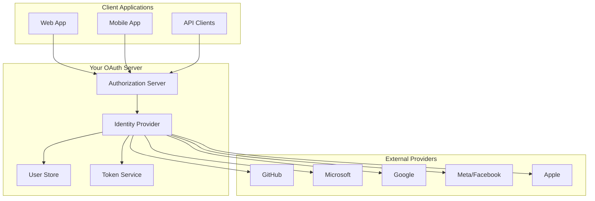

# OAuth Implementation and SSO Integration Primer
## Building Scalable Authentication for 100,000 Users with 2,000 Active

### Executive Summary

This primer covers implementing OAuth 2.0/OpenID Connect for your own authorization server while integrating with external providers (GitHub, Microsoft, Google, Apple, Meta) and maintaining cost-effective operations for a high-user, low-activity scenario.

## Table of Contents

1. [Architecture Overview](#architecture-overview)
2. [Self-Hosted OAuth Server](#self-hosted-oauth-server)
3. [External Provider Integration](#external-provider-integration)
4. [Email/Password Authentication](#emailpassword-authentication)
5. [SSO Implementation](#sso-implementation)
6. [Cost Optimization Strategies](#cost-optimization-strategies)
7. [Security Best Practices](#security-best-practices)
8. [Implementation Guide](#implementation-guide)
9. [Monitoring and Maintenance](#monitoring-and-maintenance)
10. [Decision Framework](#decision-framework)

## Architecture Overview

### High-Level Design



### Component Responsibilities

```yaml
Authorization Server:
  - OAuth 2.0 flows (authorization code, PKCE)
  - OpenID Connect implementation
  - Token issuance and validation
  - Client application management
  
Identity Provider:
  - User authentication orchestration
  - External provider integration
  - Account linking
  - MFA coordination
  
User Store:
  - Profile management
  - Credentials (for email/password)
  - Linked accounts
  - Permissions and roles
  
Token Service:
  - JWT generation
  - Refresh token management
  - Token revocation
  - Session management
```

## Self-Hosted OAuth Server

### Technology Stack Options

#### Option 1: IdentityServer (C#/.NET)
```csharp
// Program.cs
builder.Services.AddIdentityServer(options =>
{
    options.Events.RaiseErrorEvents = true;
    options.Events.RaiseInformationEvents = true;
    options.Events.RaiseFailureEvents = true;
    options.Events.RaiseSuccessEvents = true;
})
.AddInMemoryIdentityResources(Config.IdentityResources)
.AddInMemoryApiScopes(Config.ApiScopes)
.AddInMemoryClients(Config.Clients)
.AddAspNetIdentity<ApplicationUser>()
.AddDeveloperSigningCredential(); // Use proper certs in production

// Config.cs
public static class Config
{
    public static IEnumerable<IdentityResource> IdentityResources =>
        new IdentityResource[]
        {
            new IdentityResources.OpenId(),
            new IdentityResources.Profile(),
            new IdentityResources.Email()
        };

    public static IEnumerable<ApiScope> ApiScopes =>
        new ApiScope[]
        {
            new ApiScope("api", "My API"),
            new ApiScope("api.read", "Read access to API"),
            new ApiScope("api.write", "Write access to API")
        };

    public static IEnumerable<Client> Clients =>
        new Client[]
        {
            // SPA with PKCE
            new Client
            {
                ClientId = "spa",
                ClientName = "Single Page Application",
                AllowedGrantTypes = GrantTypes.Code,
                RequireClientSecret = false,
                RequirePkce = true,
                
                RedirectUris = { "https://app.example.com/callback" },
                PostLogoutRedirectUris = { "https://app.example.com" },
                AllowedCorsOrigins = { "https://app.example.com" },
                
                AllowedScopes = new List<string>
                {
                    IdentityServerConstants.StandardScopes.OpenId,
                    IdentityServerConstants.StandardScopes.Profile,
                    IdentityServerConstants.StandardScopes.Email,
                    "api"
                },
                
                AccessTokenLifetime = 3600, // 1 hour
                RefreshTokenUsage = TokenUsage.ReUse,
                RefreshTokenExpiration = TokenExpiration.Sliding,
                SlidingRefreshTokenLifetime = 86400 // 24 hours
            }
        };
}
```

#### Option 2: Keycloak (Java)
```yaml
# docker-compose.yml
version: '3.8'
services:
  keycloak:
    image: quay.io/keycloak/keycloak:latest
    environment:
      KC_DB: postgres
      KC_DB_URL: jdbc:postgresql://postgres/keycloak
      KC_DB_USERNAME: keycloak
      KC_DB_PASSWORD: ${DB_PASSWORD}
      KEYCLOAK_ADMIN: admin
      KEYCLOAK_ADMIN_PASSWORD: ${ADMIN_PASSWORD}
    command:
      - start
      - --auto-build
      - --http-enabled=true
      - --hostname-strict-https=false
      - --hostname-strict=false
    depends_on:
      - postgres
    ports:
      - "8080:8080"
      
  postgres:
    image: postgres:15
    environment:
      POSTGRES_DB: keycloak
      POSTGRES_USER: keycloak
      POSTGRES_PASSWORD: ${DB_PASSWORD}
    volumes:
      - keycloak_data:/var/lib/postgresql/data
      
volumes:
  keycloak_data:
```

#### Option 3: Custom Implementation (Node.js)
```javascript
// oauth-server.js
const express = require('express');
const { Issuer, generators } = require('openid-client');
const jose = require('jose');

class OAuthServer {
  constructor(config) {
    this.config = config;
    this.clients = new Map();
    this.codes = new Map();
    this.tokens = new Map();
    this.app = express();
    this.setupRoutes();
  }
  
  async generateKeyPair() {
    const { publicKey, privateKey } = await jose.generateKeyPair('RS256');
    this.publicKey = publicKey;
    this.privateKey = privateKey;
  }
  
  setupRoutes() {
    // Authorization endpoint
    this.app.get('/authorize', async (req, res) => {
      const {
        client_id,
        redirect_uri,
        response_type,
        scope,
        state,
        code_challenge,
        code_challenge_method
      } = req.query;
      
      // Validate client and redirect_uri
      const client = this.clients.get(client_id);
      if (!client || !client.redirect_uris.includes(redirect_uri)) {
        return res.status(400).json({ error: 'invalid_client' });
      }
      
      // Generate authorization code
      const code = generators.random();
      this.codes.set(code, {
        client_id,
        redirect_uri,
        scope,
        code_challenge,
        code_challenge_method,
        expires_at: Date.now() + 600000 // 10 minutes
      });
      
      // Redirect with code
      const params = new URLSearchParams({
        code,
        state
      });
      res.redirect(`${redirect_uri}?${params}`);
    });
    
    // Token endpoint
    this.app.post('/token', async (req, res) => {
      const {
        grant_type,
        code,
        redirect_uri,
        client_id,
        code_verifier,
        refresh_token
      } = req.body;
      
      if (grant_type === 'authorization_code') {
        // Validate code
        const codeData = this.codes.get(code);
        if (!codeData || codeData.expires_at < Date.now()) {
          return res.status(400).json({ error: 'invalid_grant' });
        }
        
        // Validate PKCE
        if (codeData.code_challenge) {
          const challenge = generators.codeChallenge(code_verifier);
          if (challenge !== codeData.code_challenge) {
            return res.status(400).json({ error: 'invalid_grant' });
          }
        }
        
        // Generate tokens
        const accessToken = await this.generateAccessToken(client_id, codeData.scope);
        const refreshToken = generators.random();
        const idToken = await this.generateIdToken(client_id);
        
        this.tokens.set(refreshToken, {
          client_id,
          scope: codeData.scope,
          expires_at: Date.now() + 2592000000 // 30 days
        });
        
        res.json({
          access_token: accessToken,
          token_type: 'Bearer',
          expires_in: 3600,
          refresh_token: refreshToken,
          id_token: idToken
        });
      }
    });
  }
  
  async generateAccessToken(clientId, scope) {
    const jwt = await new jose.SignJWT({
      iss: this.config.issuer,
      sub: 'user123', // User ID
      aud: clientId,
      exp: Math.floor(Date.now() / 1000) + 3600,
      iat: Math.floor(Date.now() / 1000),
      scope: scope
    })
    .setProtectedHeader({ alg: 'RS256' })
    .sign(this.privateKey);
    
    return jwt;
  }
}
```

### Database Schema

```sql
-- Users table
CREATE TABLE users (
    id UUID PRIMARY KEY DEFAULT gen_random_uuid(),
    email VARCHAR(255) UNIQUE NOT NULL,
    email_verified BOOLEAN DEFAULT FALSE,
    password_hash VARCHAR(255),
    created_at TIMESTAMP DEFAULT CURRENT_TIMESTAMP,
    updated_at TIMESTAMP DEFAULT CURRENT_TIMESTAMP,
    last_login_at TIMESTAMP,
    is_active BOOLEAN DEFAULT TRUE,
    mfa_enabled BOOLEAN DEFAULT FALSE,
    mfa_secret VARCHAR(255)
);

-- External provider accounts
CREATE TABLE user_external_accounts (
    id UUID PRIMARY KEY DEFAULT gen_random_uuid(),
    user_id UUID REFERENCES users(id) ON DELETE CASCADE,
    provider VARCHAR(50) NOT NULL,
    provider_user_id VARCHAR(255) NOT NULL,
    email VARCHAR(255),
    display_name VARCHAR(255),
    avatar_url TEXT,
    access_token TEXT,
    refresh_token TEXT,
    token_expires_at TIMESTAMP,
    created_at TIMESTAMP DEFAULT CURRENT_TIMESTAMP,
    updated_at TIMESTAMP DEFAULT CURRENT_TIMESTAMP,
    UNIQUE(provider, provider_user_id)
);

-- OAuth clients
CREATE TABLE oauth_clients (
    id UUID PRIMARY KEY DEFAULT gen_random_uuid(),
    client_id VARCHAR(255) UNIQUE NOT NULL,
    client_secret VARCHAR(255),
    name VARCHAR(255) NOT NULL,
    redirect_uris TEXT[] NOT NULL,
    allowed_scopes TEXT[] NOT NULL,
    allowed_grant_types TEXT[] NOT NULL,
    access_token_lifetime INTEGER DEFAULT 3600,
    refresh_token_lifetime INTEGER DEFAULT 2592000,
    created_at TIMESTAMP DEFAULT CURRENT_TIMESTAMP,
    is_active BOOLEAN DEFAULT TRUE
);

-- Refresh tokens
CREATE TABLE refresh_tokens (
    id UUID PRIMARY KEY DEFAULT gen_random_uuid(),
    token_hash VARCHAR(255) UNIQUE NOT NULL,
    user_id UUID REFERENCES users(id) ON DELETE CASCADE,
    client_id VARCHAR(255) NOT NULL,
    scope TEXT,
    expires_at TIMESTAMP NOT NULL,
    created_at TIMESTAMP DEFAULT CURRENT_TIMESTAMP,
    revoked_at TIMESTAMP
);

-- User sessions (for SSO)
CREATE TABLE user_sessions (
    id UUID PRIMARY KEY DEFAULT gen_random_uuid(),
    user_id UUID REFERENCES users(id) ON DELETE CASCADE,
    session_token VARCHAR(255) UNIQUE NOT NULL,
    ip_address INET,
    user_agent TEXT,
    expires_at TIMESTAMP NOT NULL,
    created_at TIMESTAMP DEFAULT CURRENT_TIMESTAMP,
    last_activity_at TIMESTAMP DEFAULT CURRENT_TIMESTAMP
);
```

## External Provider Integration

### Provider Configuration

```javascript
// providers.config.js
module.exports = {
  github: {
    clientId: process.env.GITHUB_CLIENT_ID,
    clientSecret: process.env.GITHUB_CLIENT_SECRET,
    authorizationUrl: 'https://github.com/login/oauth/authorize',
    tokenUrl: 'https://github.com/login/oauth/access_token',
    userInfoUrl: 'https://api.github.com/user',
    scope: 'read:user user:email',
    userMapping: {
      id: 'id',
      email: 'email',
      name: 'name',
      avatar: 'avatar_url'
    }
  },
  
  microsoft: {
    clientId: process.env.MICROSOFT_CLIENT_ID,
    clientSecret: process.env.MICROSOFT_CLIENT_SECRET,
    authorizationUrl: 'https://login.microsoftonline.com/common/oauth2/v2.0/authorize',
    tokenUrl: 'https://login.microsoftonline.com/common/oauth2/v2.0/token',
    userInfoUrl: 'https://graph.microsoft.com/v1.0/me',
    scope: 'openid profile email',
    userMapping: {
      id: 'id',
      email: 'mail',
      name: 'displayName',
      avatar: null
    }
  },
  
  google: {
    clientId: process.env.GOOGLE_CLIENT_ID,
    clientSecret: process.env.GOOGLE_CLIENT_SECRET,
    authorizationUrl: 'https://accounts.google.com/o/oauth2/v2/auth',
    tokenUrl: 'https://oauth2.googleapis.com/token',
    userInfoUrl: 'https://www.googleapis.com/oauth2/v2/userinfo',
    scope: 'openid profile email',
    userMapping: {
      id: 'id',
      email: 'email',
      name: 'name',
      avatar: 'picture'
    }
  },
  
  apple: {
    clientId: process.env.APPLE_CLIENT_ID,
    teamId: process.env.APPLE_TEAM_ID,
    keyId: process.env.APPLE_KEY_ID,
    privateKey: process.env.APPLE_PRIVATE_KEY,
    authorizationUrl: 'https://appleid.apple.com/auth/authorize',
    tokenUrl: 'https://appleid.apple.com/auth/token',
    scope: 'name email',
    responseMode: 'form_post'
  },
  
  facebook: {
    clientId: process.env.FACEBOOK_CLIENT_ID,
    clientSecret: process.env.FACEBOOK_CLIENT_SECRET,
    authorizationUrl: 'https://www.facebook.com/v12.0/dialog/oauth',
    tokenUrl: 'https://graph.facebook.com/v12.0/oauth/access_token',
    userInfoUrl: 'https://graph.facebook.com/me?fields=id,name,email,picture',
    scope: 'email public_profile',
    userMapping: {
      id: 'id',
      email: 'email',
      name: 'name',
      avatar: 'picture.data.url'
    }
  }
};
```

### Universal Provider Handler

```javascript
// external-auth.service.js
class ExternalAuthService {
  constructor(providers) {
    this.providers = providers;
  }
  
  async handleCallback(provider, code, state) {
    const config = this.providers[provider];
    if (!config) {
      throw new Error('Unknown provider');
    }
    
    // Exchange code for token
    const tokenResponse = await this.exchangeCodeForToken(provider, code);
    
    // Get user info
    const userInfo = await this.getUserInfo(provider, tokenResponse.access_token);
    
    // Map to standard format
    const mappedUser = this.mapUserInfo(provider, userInfo);
    
    // Find or create user
    const user = await this.findOrCreateUser(provider, mappedUser, tokenResponse);
    
    return user;
  }
  
  async exchangeCodeForToken(provider, code) {
    const config = this.providers[provider];
    
    const params = new URLSearchParams({
      grant_type: 'authorization_code',
      code,
      redirect_uri: `${process.env.BASE_URL}/auth/${provider}/callback`,
      client_id: config.clientId,
      client_secret: config.clientSecret
    });
    
    // Special handling for Apple
    if (provider === 'apple') {
      params.set('client_secret', await this.generateAppleClientSecret());
    }
    
    const response = await fetch(config.tokenUrl, {
      method: 'POST',
      headers: {
        'Content-Type': 'application/x-www-form-urlencoded',
        'Accept': 'application/json'
      },
      body: params.toString()
    });
    
    return response.json();
  }
  
  async getUserInfo(provider, accessToken) {
    const config = this.providers[provider];
    
    // Apple uses ID token for user info
    if (provider === 'apple') {
      return this.decodeAppleIdToken(accessToken);
    }
    
    const response = await fetch(config.userInfoUrl, {
      headers: {
        'Authorization': `Bearer ${accessToken}`,
        'Accept': 'application/json'
      }
    });
    
    return response.json();
  }
  
  async findOrCreateUser(provider, providerUser, tokens) {
    // Check if external account exists
    let externalAccount = await db.userExternalAccounts.findOne({
      provider,
      provider_user_id: providerUser.id
    });
    
    if (externalAccount) {
      // Update tokens
      await db.userExternalAccounts.update(externalAccount.id, {
        access_token: tokens.access_token,
        refresh_token: tokens.refresh_token,
        token_expires_at: new Date(Date.now() + tokens.expires_in * 1000)
      });
      
      return db.users.findById(externalAccount.user_id);
    }
    
    // Check if user with email exists
    let user = await db.users.findByEmail(providerUser.email);
    
    if (!user) {
      // Create new user
      user = await db.users.create({
        email: providerUser.email,
        email_verified: true,
        is_active: true
      });
    }
    
    // Link external account
    await db.userExternalAccounts.create({
      user_id: user.id,
      provider,
      provider_user_id: providerUser.id,
      email: providerUser.email,
      display_name: providerUser.name,
      avatar_url: providerUser.avatar,
      access_token: tokens.access_token,
      refresh_token: tokens.refresh_token,
      token_expires_at: new Date(Date.now() + tokens.expires_in * 1000)
    });
    
    return user;
  }
}
```

## Email/Password Authentication

### Secure Implementation

```javascript
// auth.service.js
const bcrypt = require('bcrypt');
const crypto = require('crypto');
const speakeasy = require('speakeasy');

class AuthService {
  async register(email, password) {
    // Validate email
    if (!this.isValidEmail(email)) {
      throw new Error('Invalid email format');
    }
    
    // Check password strength
    const passwordStrength = this.checkPasswordStrength(password);
    if (passwordStrength.score < 3) {
      throw new Error('Password too weak: ' + passwordStrength.feedback);
    }
    
    // Check if user exists
    const existingUser = await db.users.findByEmail(email);
    if (existingUser) {
      // Don't reveal that user exists
      throw new Error('Registration failed');
    }
    
    // Hash password
    const passwordHash = await bcrypt.hash(password, 12);
    
    // Create user
    const user = await db.users.create({
      email,
      password_hash: passwordHash,
      email_verified: false
    });
    
    // Send verification email
    await this.sendVerificationEmail(user);
    
    return user;
  }
  
  async login(email, password, mfaToken = null) {
    const user = await db.users.findByEmail(email);
    
    if (!user || !user.password_hash) {
      // Constant time comparison to prevent timing attacks
      await bcrypt.compare(password, '$2b$12$dummy.hash.to.prevent.timing');
      throw new Error('Invalid credentials');
    }
    
    const isValidPassword = await bcrypt.compare(password, user.password_hash);
    if (!isValidPassword) {
      await this.recordFailedLogin(user.id);
      throw new Error('Invalid credentials');
    }
    
    // Check MFA if enabled
    if (user.mfa_enabled) {
      if (!mfaToken) {
        return { requiresMfa: true, userId: user.id };
      }
      
      const isValidMfa = speakeasy.totp.verify({
        secret: user.mfa_secret,
        encoding: 'base32',
        token: mfaToken,
        window: 2
      });
      
      if (!isValidMfa) {
        throw new Error('Invalid MFA token');
      }
    }
    
    // Update last login
    await db.users.update(user.id, {
      last_login_at: new Date()
    });
    
    // Create session
    const session = await this.createSession(user.id);
    
    return { user, session };
  }
  
  checkPasswordStrength(password) {
    const result = {
      score: 0,
      feedback: []
    };
    
    // Length check
    if (password.length >= 12) result.score++;
    else if (password.length >= 8) result.score += 0.5;
    else result.feedback.push('Use at least 8 characters');
    
    // Complexity checks
    if (/[a-z]/.test(password)) result.score += 0.5;
    if (/[A-Z]/.test(password)) result.score += 0.5;
    if (/[0-9]/.test(password)) result.score += 0.5;
    if (/[^a-zA-Z0-9]/.test(password)) result.score += 0.5;
    
    // Common password check
    if (this.isCommonPassword(password)) {
      result.score = 0;
      result.feedback.push('This password is too common');
    }
    
    // Provide feedback
    if (result.score < 3) {
      if (!/[A-Z]/.test(password)) result.feedback.push('Add uppercase letters');
      if (!/[0-9]/.test(password)) result.feedback.push('Add numbers');
      if (!/[^a-zA-Z0-9]/.test(password)) result.feedback.push('Add special characters');
    }
    
    return result;
  }
  
  async sendVerificationEmail(user) {
    const token = crypto.randomBytes(32).toString('hex');
    const expires = new Date(Date.now() + 24 * 60 * 60 * 1000); // 24 hours
    
    await db.emailVerifications.create({
      user_id: user.id,
      token,
      expires_at: expires
    });
    
    await emailService.send({
      to: user.email,
      subject: 'Verify your email',
      template: 'email-verification',
      data: {
        verificationUrl: `${process.env.BASE_URL}/verify-email?token=${token}`
      }
    });
  }
}
```

### Password Reset Flow

```javascript
// password-reset.service.js
class PasswordResetService {
  async requestReset(email) {
    const user = await db.users.findByEmail(email);
    
    // Don't reveal if user exists
    if (!user) {
      return { message: 'If an account exists, a reset email has been sent' };
    }
    
    // Rate limiting
    const recentRequests = await db.passwordResets.countRecent(user.id, '1 hour');
    if (recentRequests >= 3) {
      return { message: 'If an account exists, a reset email has been sent' };
    }
    
    // Generate token
    const token = crypto.randomBytes(32).toString('hex');
    const expires = new Date(Date.now() + 60 * 60 * 1000); // 1 hour
    
    await db.passwordResets.create({
      user_id: user.id,
      token_hash: crypto.createHash('sha256').update(token).digest('hex'),
      expires_at: expires,
      ip_address: req.ip
    });
    
    // Send email
    await emailService.send({
      to: user.email,
      subject: 'Password Reset Request',
      template: 'password-reset',
      data: {
        resetUrl: `${process.env.BASE_URL}/reset-password?token=${token}`,
        expiryTime: '1 hour'
      }
    });
    
    return { message: 'If an account exists, a reset email has been sent' };
  }
  
  async resetPassword(token, newPassword) {
    const tokenHash = crypto.createHash('sha256').update(token).digest('hex');
    
    const resetRequest = await db.passwordResets.findValidByToken(tokenHash);
    if (!resetRequest) {
      throw new Error('Invalid or expired reset token');
    }
    
    // Validate new password
    const passwordStrength = authService.checkPasswordStrength(newPassword);
    if (passwordStrength.score < 3) {
      throw new Error('Password too weak: ' + passwordStrength.feedback);
    }
    
    // Update password
    const passwordHash = await bcrypt.hash(newPassword, 12);
    await db.users.update(resetRequest.user_id, {
      password_hash: passwordHash,
      updated_at: new Date()
    });
    
    // Invalidate all password reset tokens for this user
    await db.passwordResets.invalidateAllForUser(resetRequest.user_id);
    
    // Invalidate all sessions (force re-login)
    await db.userSessions.invalidateAllForUser(resetRequest.user_id);
    
    // Send confirmation email
    const user = await db.users.findById(resetRequest.user_id);
    await emailService.send({
      to: user.email,
      subject: 'Password Changed',
      template: 'password-changed',
      data: {
        changedAt: new Date().toISOString(),
        ipAddress: req.ip
      }
    });
  }
}
```

## SSO Implementation

### SAML 2.0 Integration

```javascript
// saml.service.js
const saml2 = require('saml2-js');

class SamlService {
  constructor() {
    this.serviceProvider = saml2.ServiceProvider({
      entity_id: `${process.env.BASE_URL}/saml/metadata`,
      private_key: process.env.SAML_PRIVATE_KEY,
      certificate: process.env.SAML_CERTIFICATE,
      assert_endpoint: `${process.env.BASE_URL}/saml/assert`,
      allow_unencrypted_assertion: false
    });
  }
  
  async createLoginRequest(identityProvider) {
    const idp = await this.getIdentityProvider(identityProvider);
    
    return new Promise((resolve, reject) => {
      this.serviceProvider.create_login_request_url(idp, {}, (err, loginUrl, requestId) => {
        if (err) return reject(err);
        
        // Store request for validation
        db.samlRequests.create({
          request_id: requestId,
          idp_id: identityProvider,
          expires_at: new Date(Date.now() + 5 * 60 * 1000) // 5 minutes
        });
        
        resolve({ loginUrl, requestId });
      });
    });
  }
  
  async handleAssertion(samlResponse, identityProvider) {
    const idp = await this.getIdentityProvider(identityProvider);
    
    return new Promise((resolve, reject) => {
      this.serviceProvider.post_assert(idp, {
        request_body: { SAMLResponse: samlResponse }
      }, async (err, samlUser) => {
        if (err) return reject(err);
        
        // Map SAML attributes to user
        const user = await this.findOrCreateUserFromSaml(samlUser, identityProvider);
        
        resolve(user);
      });
    });
  }
  
  async getIdentityProvider(idpId) {
    const config = await db.identityProviders.findById(idpId);
    
    return saml2.IdentityProvider({
      sso_login_url: config.sso_login_url,
      sso_logout_url: config.sso_logout_url,
      certificates: [config.certificate],
      force_authn: false,
      sign_get_request: true,
      allow_unencrypted_assertion: false
    });
  }
}
```

### Multi-Tenant SSO

```javascript
// tenant-sso.service.js
class TenantSSOService {
  async configureTenant(tenantId, ssoConfig) {
    const tenant = await db.tenants.findById(tenantId);
    if (!tenant) throw new Error('Tenant not found');
    
    // Validate SSO configuration
    if (ssoConfig.type === 'saml') {
      await this.validateSamlConfig(ssoConfig);
    } else if (ssoConfig.type === 'oidc') {
      await this.validateOidcConfig(ssoConfig);
    }
    
    // Store encrypted configuration
    const encryptedConfig = await this.encryptConfig(ssoConfig);
    
    await db.tenantSsoConfigs.upsert({
      tenant_id: tenantId,
      sso_type: ssoConfig.type,
      config: encryptedConfig,
      is_active: true,
      updated_at: new Date()
    });
    
    return { success: true };
  }
  
  async handleSsoLogin(email) {
    // Extract domain from email
    const domain = email.split('@')[1];
    
    // Find tenant by domain
    const tenant = await db.tenants.findByDomain(domain);
    if (!tenant || !tenant.sso_enabled) {
      return null; // Fall back to regular login
    }
    
    // Get SSO configuration
    const ssoConfig = await db.tenantSsoConfigs.findByTenantId(tenant.id);
    if (!ssoConfig || !ssoConfig.is_active) {
      return null;
    }
    
    const config = await this.decryptConfig(ssoConfig.config);
    
    // Redirect to appropriate SSO provider
    if (ssoConfig.sso_type === 'saml') {
      return this.samlService.createLoginRequest(config);
    } else if (ssoConfig.sso_type === 'oidc') {
      return this.oidcService.createAuthorizationUrl(config);
    }
  }
}
```

## Cost Optimization Strategies

### Architecture for 100k Users, 2k Active

```yaml
User Distribution:
  Total Registered: 100,000
  Monthly Active: 2,000 (2%)
  Daily Active: 200 (0.2%)
  Concurrent: 20-50

Cost Optimization Strategies:
  1. Serverless Architecture:
     - AWS Lambda for auth endpoints
     - API Gateway for routing
     - DynamoDB for session storage
     - RDS Aurora Serverless for user data
     
  2. Caching Strategy:
     - CloudFront for static assets
     - ElastiCache for hot data
     - 24-hour session caching
     
  3. Database Optimization:
     - Read replicas for queries
     - Connection pooling
     - Prepared statements
     
  4. Token Strategy:
     - Long-lived refresh tokens (30 days)
     - Short access tokens (1 hour)
     - JWT to reduce database lookups
```

### Cost-Effective Infrastructure

```javascript
// serverless.yml
service: auth-service

provider:
  name: aws
  runtime: nodejs18.x
  environment:
    USER_TABLE: ${self:service}-users-${opt:stage}
    SESSION_TABLE: ${self:service}-sessions-${opt:stage}

functions:
  authorize:
    handler: handlers/auth.authorize
    events:
      - http:
          path: /authorize
          method: GET
          
  token:
    handler: handlers/auth.token
    events:
      - http:
          path: /token
          method: POST
          
  userinfo:
    handler: handlers/auth.userinfo
    events:
      - http:
          path: /userinfo
          method: GET
          authorizer:
            name: jwtAuthorizer
            
  jwtAuthorizer:
    handler: handlers/auth.jwtAuthorizer

resources:
  Resources:
    UserTable:
      Type: AWS::DynamoDB::Table
      Properties:
        TableName: ${self:provider.environment.USER_TABLE}
        BillingMode: PAY_PER_REQUEST
        AttributeDefinitions:
          - AttributeName: id
            AttributeType: S
          - AttributeName: email
            AttributeType: S
        KeySchema:
          - AttributeName: id
            KeyType: HASH
        GlobalSecondaryIndexes:
          - IndexName: EmailIndex
            KeySchema:
              - AttributeName: email
                KeyType: HASH
            Projection:
              ProjectionType: ALL
              
    SessionCache:
      Type: AWS::ElastiCache::CacheCluster
      Properties:
        CacheNodeType: cache.t3.micro
        Engine: redis
        NumCacheNodes: 1
```

### Cost Monitoring

```javascript
// cost-monitor.js
class CostMonitor {
  async trackUsage(metric, value = 1) {
    await cloudwatch.putMetricData({
      Namespace: 'AuthService',
      MetricData: [{
        MetricName: metric,
        Value: value,
        Timestamp: new Date(),
        Dimensions: [
          {
            Name: 'Environment',
            Value: process.env.STAGE
          }
        ]
      }]
    }).promise();
  }
  
  async estimateMonthlyCost() {
    const metrics = await this.getMonthlyMetrics();
    
    const costs = {
      lambda: {
        requests: metrics.lambdaInvocations * 0.0000002,
        compute: metrics.lambdaGBSeconds * 0.0000166667
      },
      dynamodb: {
        reads: metrics.dynamoReads * 0.00000025,
        writes: metrics.dynamoWrites * 0.00000125,
        storage: metrics.dynamoStorageGB * 0.25
      },
      elasticache: {
        nodes: metrics.cacheNodes * 0.017 * 730 // t3.micro hourly
      },
      apiGateway: {
        requests: metrics.apiRequests * 0.0000035
      }
    };
    
    const total = Object.values(costs).reduce((sum, category) => 
      sum + Object.values(category).reduce((s, v) => s + v, 0), 0
    );
    
    return { costs, total };
  }
}
```

## Security Best Practices

### Token Security

```javascript
// token-security.js
class TokenSecurity {
  constructor() {
    this.tokenBlacklist = new Set();
    this.refreshTokenRotation = true;
  }
  
  async generateTokens(userId, clientId, scope) {
    const tokenId = crypto.randomBytes(16).toString('hex');
    
    // Access token with minimal data
    const accessToken = jwt.sign({
      sub: userId,
      client_id: clientId,
      scope: scope,
      jti: tokenId,
      token_type: 'access'
    }, process.env.JWT_SECRET, {
      expiresIn: '1h',
      issuer: process.env.ISSUER,
      audience: clientId
    });
    
    // Refresh token with rotation
    const refreshTokenValue = crypto.randomBytes(32).toString('hex');
    const refreshTokenHash = crypto.createHash('sha256')
      .update(refreshTokenValue)
      .digest('hex');
    
    await db.refreshTokens.create({
      token_hash: refreshTokenHash,
      user_id: userId,
      client_id: clientId,
      scope: scope,
      expires_at: new Date(Date.now() + 30 * 24 * 60 * 60 * 1000),
      token_family: crypto.randomBytes(16).toString('hex')
    });
    
    return {
      access_token: accessToken,
      token_type: 'Bearer',
      expires_in: 3600,
      refresh_token: refreshTokenValue,
      scope: scope
    };
  }
  
  async refreshToken(refreshToken, clientId) {
    const tokenHash = crypto.createHash('sha256')
      .update(refreshToken)
      .digest('hex');
    
    const storedToken = await db.refreshTokens.findByHash(tokenHash);
    
    if (!storedToken || storedToken.client_id !== clientId) {
      throw new Error('Invalid refresh token');
    }
    
    if (storedToken.revoked_at) {
      // Possible token reuse - revoke entire family
      await this.revokeTokenFamily(storedToken.token_family);
      throw new Error('Token reuse detected');
    }
    
    if (storedToken.expires_at < new Date()) {
      throw new Error('Refresh token expired');
    }
    
    // Revoke old token
    await db.refreshTokens.revoke(storedToken.id);
    
    // Generate new tokens with same family
    const newTokens = await this.generateTokens(
      storedToken.user_id,
      clientId,
      storedToken.scope
    );
    
    // Update token family
    await db.refreshTokens.updateFamily(
      newTokens.refresh_token,
      storedToken.token_family
    );
    
    return newTokens;
  }
  
  async revokeTokenFamily(tokenFamily) {
    await db.refreshTokens.revokeFamily(tokenFamily);
    
    // Log security event
    await securityLogger.log('token_family_revoked', {
      token_family: tokenFamily,
      timestamp: new Date()
    });
  }
}
```

### Security Headers and CORS

```javascript
// security-middleware.js
const helmet = require('helmet');

app.use(helmet({
  contentSecurityPolicy: {
    directives: {
      defaultSrc: ["'self'"],
      styleSrc: ["'self'", "'unsafe-inline'"],
      scriptSrc: ["'self'"],
      imgSrc: ["'self'", "data:", "https:"],
      connectSrc: ["'self'"],
      fontSrc: ["'self'"],
      objectSrc: ["'none'"],
      mediaSrc: ["'self'"],
      frameSrc: ["'none'"],
    },
  },
  hsts: {
    maxAge: 31536000,
    includeSubDomains: true,
    preload: true
  }
}));

// CORS configuration
const corsOptions = {
  origin: function (origin, callback) {
    // Allow requests with no origin (mobile apps, Postman)
    if (!origin) return callback(null, true);
    
    db.oauthClients.findByRedirectUri(origin)
      .then(client => {
        if (client) {
          callback(null, true);
        } else {
          callback(new Error('Not allowed by CORS'));
        }
      })
      .catch(err => callback(err));
  },
  credentials: true,
  maxAge: 86400 // 24 hours
};

app.use(cors(corsOptions));
```

## Implementation Guide

### Phase 1: Core OAuth Server (Week 1-2)

```yaml
Tasks:
  1. Database Setup:
     - User tables
     - OAuth client management
     - Token storage
     
  2. Basic Endpoints:
     - /authorize
     - /token
     - /userinfo
     - /.well-known/openid-configuration
     
  3. Token Management:
     - JWT generation
     - Refresh token handling
     - Token revocation
```

### Phase 2: Email/Password Auth (Week 3)

```yaml
Tasks:
  1. Registration Flow:
     - Email validation
     - Password strength checking
     - Verification emails
     
  2. Login Flow:
     - Rate limiting
     - Failed attempt tracking
     - Session management
     
  3. Password Management:
     - Reset flow
     - Change password
     - Password history
```

### Phase 3: External Providers (Week 4-5)

```yaml
Tasks:
  1. Provider Integration:
     - GitHub OAuth
     - Google OAuth
     - Microsoft OAuth
     
  2. Account Linking:
     - Multiple providers per user
     - Email matching
     - Manual linking UI
     
  3. Token Management:
     - Store provider tokens
     - Handle token refresh
     - Scope management
```

### Phase 4: SSO Implementation (Week 6-7)

```yaml
Tasks:
  1. SAML Support:
     - SP implementation
     - Metadata generation
     - Assertion handling
     
  2. Multi-Tenant:
     - Tenant configuration
     - Domain mapping
     - Custom branding
     
  3. Enterprise Features:
     - Just-in-time provisioning
     - Group mapping
     - Attribute mapping
```

### Phase 5: Production Readiness (Week 8)

```yaml
Tasks:
  1. Security Hardening:
     - Penetration testing
     - Security headers
     - Rate limiting
     
  2. Monitoring:
     - Health checks
     - Metrics collection
     - Alert configuration
     
  3. Documentation:
     - API documentation
     - Integration guides
     - Security policies
```

## Monitoring and Maintenance

### Key Metrics

```javascript
// metrics.js
class AuthMetrics {
  constructor() {
    this.prometheus = new PrometheusClient();
  }
  
  setupMetrics() {
    // Counter metrics
    this.loginAttempts = new Counter({
      name: 'auth_login_attempts_total',
      help: 'Total login attempts',
      labelNames: ['method', 'status']
    });
    
    this.tokenIssuance = new Counter({
      name: 'auth_tokens_issued_total',
      help: 'Total tokens issued',
      labelNames: ['token_type', 'grant_type']
    });
    
    // Histogram metrics
    this.authDuration = new Histogram({
      name: 'auth_request_duration_seconds',
      help: 'Authentication request duration',
      labelNames: ['endpoint'],
      buckets: [0.1, 0.5, 1, 2, 5]
    });
    
    // Gauge metrics
    this.activeSessions = new Gauge({
      name: 'auth_active_sessions',
      help: 'Number of active sessions'
    });
    
    this.configuredProviders = new Gauge({
      name: 'auth_configured_providers',
      help: 'Number of configured auth providers',
      labelNames: ['type']
    });
  }
  
  async collectMetrics() {
    // Collect active sessions
    const sessionCount = await db.userSessions.countActive();
    this.activeSessions.set(sessionCount);
    
    // Collect provider stats
    const providers = await db.externalProviders.countByType();
    providers.forEach(p => {
      this.configuredProviders.labels(p.type).set(p.count);
    });
  }
}
```

### Health Checks

```javascript
// health-checks.js
app.get('/health', async (req, res) => {
  const checks = {
    database: await checkDatabase(),
    redis: await checkRedis(),
    externalProviders: await checkExternalProviders()
  };
  
  const healthy = Object.values(checks).every(c => c.status === 'healthy');
  
  res.status(healthy ? 200 : 503).json({
    status: healthy ? 'healthy' : 'unhealthy',
    checks,
    timestamp: new Date().toISOString()
  });
});

async function checkDatabase() {
  try {
    await db.raw('SELECT 1');
    return { status: 'healthy' };
  } catch (error) {
    return { status: 'unhealthy', error: error.message };
  }
}

async function checkExternalProviders() {
  const providers = ['github', 'google', 'microsoft'];
  const results = {};
  
  for (const provider of providers) {
    try {
      const response = await fetch(providerHealthEndpoints[provider], {
        timeout: 5000
      });
      results[provider] = response.ok ? 'healthy' : 'degraded';
    } catch (error) {
      results[provider] = 'unhealthy';
    }
  }
  
  return {
    status: Object.values(results).some(r => r === 'unhealthy') ? 'degraded' : 'healthy',
    providers: results
  };
}
```

## Decision Framework

### When to Self-Host OAuth

```yaml
Self-Host When:
  - Need complete control over user data
  - Complex authorization requirements
  - Multi-tenant with custom branding
  - Compliance requires on-premises
  - Cost effective at scale (>10k MAU)
  - Need custom authentication flows

Use Auth0/Okta When:
  - Quick time to market
  - Small team, limited resources
  - Standard authentication needs
  - Global compliance requirements
  - < 5,000 monthly active users
  - Need enterprise support
```

### Provider Selection Matrix

| Provider | Best For | Considerations |
|----------|----------|----------------|
| **IdentityServer** | .NET shops, complex requirements | Requires .NET expertise |
| **Keycloak** | Java/Enterprise, SAML heavy | Resource intensive |
| **Custom** | Specific requirements, full control | High maintenance |
| **Auth0** | Quick setup, global compliance | Expensive at scale |
| **AWS Cognito** | AWS ecosystem, serverless | Vendor lock-in |
| **Firebase Auth** | Mobile apps, Google ecosystem | Limited customization |

### Cost Comparison (2k Active Users)

```yaml
Self-Hosted (AWS):
  Infrastructure: ~$50/month
  - Lambda: ~$5
  - DynamoDB: ~$10
  - ElastiCache: ~$15
  - RDS: ~$20
  
  Development: $20k-40k initial
  Maintenance: ~$2k/month (0.1 FTE)
  
  Total Year 1: ~$45k
  Total Year 2+: ~$25k/year

Auth0:
  Free tier: 7,000 active users
  Cost: $0 for 2k users
  
  But at 10k users: ~$500/month
  At 50k users: ~$2,500/month

AWS Cognito:
  First 50k MAU: Free
  Cost: $0 for 2k users
  
  But less flexibility for external providers
```

## Conclusion

For 100k prebuilt users with only 2k active:
1. **Start with AWS Cognito or Auth0 free tier**
2. **Implement lazy migration from existing system**
3. **Plan for self-hosted migration at 5k+ MAU**
4. **Use JWT to minimize database lookups**
5. **Implement aggressive caching strategies**
6. **Monitor costs and usage closely**

The key is balancing control, cost, and complexity. Start simple, measure everything, and migrate when the economics make sense.