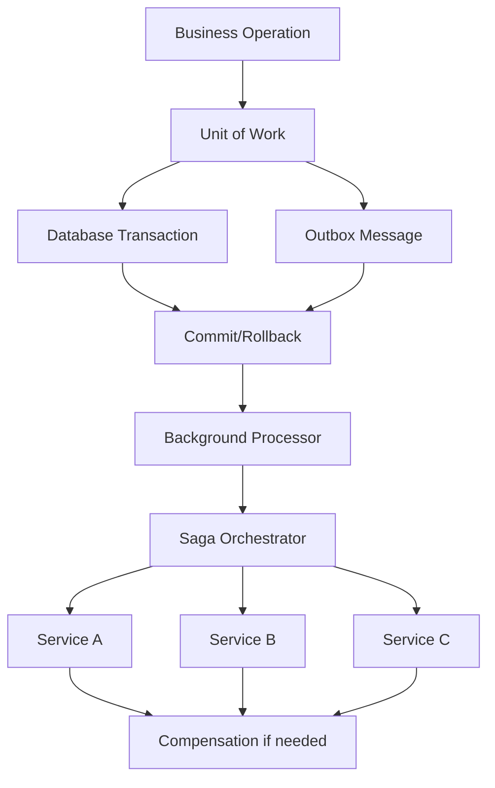

# Outbox Messaging, Saga, and Unit of Work: A Combined Pattern Primer

## The Ultimate Guide to Combining These Three Patterns for Distributed Transaction Management

### Table of Contents
1. [Introduction and Why These Patterns Matter Together](#introduction-and-why-these-patterns-matter-together)
2. [Individual Pattern Recap](#individual-pattern-recap)
3. [The Combined Architecture](#the-combined-architecture)
4. [Implementation Deep Dive](#implementation-deep-dive)
5. [Real-World Scenarios](#real-world-scenarios)
6. [Advanced Patterns and Variations](#advanced-patterns-and-variations)
7. [Performance and Scalability](#performance-and-scalability)
8. [Monitoring and Observability](#monitoring-and-observability)
9. [Common Pitfalls and Solutions](#common-pitfalls-and-solutions)
10. [Future Considerations](#future-considerations)

## Introduction and Why These Patterns Matter Together

In distributed systems, ensuring data consistency across multiple services while maintaining high availability and performance is one of the most challenging problems. The combination of Outbox Messaging, Saga Pattern, and Unit of Work provides a robust solution that addresses:

- **Atomicity**: Ensuring business operations and messaging are atomic
- **Consistency**: Managing distributed transactions across services
- **Reliability**: Handling failures gracefully with compensation
- **Scalability**: Avoiding distributed locks and two-phase commits

### The Problem Space

```yaml
Traditional Monolithic Approach:
  - Single database transaction
  - ACID guarantees
  - Simple rollback on failure
  - Limited scalability

Distributed Microservices Challenges:
  - Multiple databases
  - Network partitions
  - Partial failures
  - No distributed transactions
  - Message delivery guarantees
  - Eventual consistency requirements
```

### Why Combine These Patterns?



## Individual Pattern Recap

### Unit of Work Pattern
Maintains a list of objects affected by a business transaction and coordinates writing out changes and resolving concurrency problems.

```csharp
public interface IUnitOfWork
{
    Task<int> SaveChangesAsync();
    Task BeginTransactionAsync();
    Task CommitAsync();
    Task RollbackAsync();
}
```

### Saga Pattern
Manages data consistency across microservices in distributed transaction scenarios by using a sequence of local transactions.

```csharp
public interface ISaga<TState>
{
    Task<SagaResult> ExecuteAsync(TState state);
    Task CompensateAsync(TState state);
}
```

### Outbox Pattern
Ensures that database operations and message publishing are atomic by storing messages in an "outbox" table within the same database transaction.

```csharp
public class OutboxMessage
{
    public Guid Id { get; set; }
    public string EventType { get; set; }
    public string EventData { get; set; }
    public DateTime CreatedAt { get; set; }
    public DateTime? ProcessedAt { get; set; }
}
```

## The Combined Architecture

### High-Level Architecture

```yaml
Combined Pattern Flow:
  1. Business Operation:
     - Start Unit of Work
     - Begin database transaction
     - Execute business logic
     - Create domain events
     
  2. Outbox Integration:
     - Store events in outbox table
     - Same transaction as business data
     - Atomic operation guaranteed
     
  3. Transaction Completion:
     - Commit Unit of Work
     - Events safely stored
     - Business data persisted
     
  4. Event Processing:
     - Background service reads outbox
     - Publishes events to message bus
     - Marks events as processed
     
  5. Saga Execution:
     - Saga orchestrator receives events
     - Executes distributed transaction
     - Manages compensations if needed
     - Uses Unit of Work for each step
```

### Detailed Component Interaction

```csharp
public class CombinedPatternArchitecture
{
    // Central service that combines all patterns
    public class OrderProcessingService
    {
        private readonly IUnitOfWorkFactory _unitOfWorkFactory;
        private readonly ISagaOrchestrator _sagaOrchestrator;
        private readonly IOutboxProcessor _outboxProcessor;
        
        public async Task<OrderResult> ProcessOrder(OrderRequest request)
        {
            // Step 1: Local transaction with outbox
            using var unitOfWork = _unitOfWorkFactory.Create();
            await unitOfWork.BeginTransactionAsync();
            
            try
            {
                // Business logic
                var order = await CreateOrder(request, unitOfWork);
                
                // Create saga initiation event
                var sagaEvent = new OrderSagaInitiatedEvent
                {
                    SagaId = Guid.NewGuid(),
                    OrderId = order.Id,
                    CustomerId = request.CustomerId,
                    Items = request.Items,
                    TotalAmount = order.TotalAmount
                };
                
                // Store in outbox (same transaction)
                await unitOfWork.Outbox.AddAsync(sagaEvent);
                
                // Commit local changes and outbox message atomically
                await unitOfWork.CommitAsync();
                
                return new OrderResult 
                { 
                    Success = true, 
                    OrderId = order.Id,
                    SagaId = sagaEvent.SagaId 
                };
            }
            catch
            {
                await unitOfWork.RollbackAsync();
                throw;
            }
        }
    }
}
```

## Implementation Deep Dive

### Complete Unit of Work with Outbox

```csharp
public interface IUnitOfWork : IDisposable
{
    // Repositories
    IRepository<Order> Orders { get; }
    IRepository<Customer> Customers { get; }
    IRepository<Product> Products { get; }
    
    // Outbox for events
    IOutboxRepository Outbox { get; }
    
    // Transaction management
    Task BeginTransactionAsync(IsolationLevel isolationLevel = IsolationLevel.ReadCommitted);
    Task<int> SaveChangesAsync();
    Task CommitAsync();
    Task RollbackAsync();
}

public class SqlUnitOfWork : IUnitOfWork
{
    private readonly DbContext _context;
    private IDbContextTransaction _transaction;
    
    // Lazy-loaded repositories
    private IRepository<Order> _orders;
    private IRepository<Customer> _customers;
    private IRepository<Product> _products;
    private IOutboxRepository _outbox;
    
    public SqlUnitOfWork(DbContext context)
    {
        _context = context;
    }
    
    public IRepository<Order> Orders => 
        _orders ??= new Repository<Order>(_context);
        
    public IRepository<Customer> Customers => 
        _customers ??= new Repository<Customer>(_context);
        
    public IRepository<Product> Products => 
        _products ??= new Repository<Product>(_context);
        
    public IOutboxRepository Outbox => 
        _outbox ??= new OutboxRepository(_context);
    
    public async Task BeginTransactionAsync(IsolationLevel isolationLevel)
    {
        _transaction = await _context.Database.BeginTransactionAsync(isolationLevel);
    }
    
    public async Task<int> SaveChangesAsync()
    {
        // Add audit information
        foreach (var entry in _context.ChangeTracker.Entries())
        {
            if (entry.Entity is IAuditable auditable)
            {
                if (entry.State == EntityState.Added)
                {
                    auditable.CreatedAt = DateTime.UtcNow;
                }
                else if (entry.State == EntityState.Modified)
                {
                    auditable.UpdatedAt = DateTime.UtcNow;
                }
            }
        }
        
        return await _context.SaveChangesAsync();
    }
    
    public async Task CommitAsync()
    {
        try
        {
            await SaveChangesAsync();
            await _transaction?.CommitAsync();
        }
        catch
        {
            await RollbackAsync();
            throw;
        }
        finally
        {
            _transaction?.Dispose();
            _transaction = null;
        }
    }
    
    public async Task RollbackAsync()
    {
        try
        {
            await _transaction?.RollbackAsync();
        }
        finally
        {
            _transaction?.Dispose();
            _transaction = null;
        }
    }
    
    public void Dispose()
    {
        _transaction?.Dispose();
        _context?.Dispose();
    }
}
```

### Outbox Repository Implementation

```csharp
public interface IOutboxRepository
{
    Task AddAsync<TEvent>(TEvent @event) where TEvent : IEvent;
    Task<IEnumerable<OutboxMessage>> GetUnprocessedAsync(int batchSize = 100);
    Task MarkAsProcessedAsync(Guid messageId);
    Task MarkAsFailedAsync(Guid messageId, string error);
}

public class OutboxRepository : IOutboxRepository
{
    private readonly DbContext _context;
    
    public OutboxRepository(DbContext context)
    {
        _context = context;
    }
    
    public async Task AddAsync<TEvent>(TEvent @event) where TEvent : IEvent
    {
        var outboxMessage = new OutboxMessage
        {
            Id = Guid.NewGuid(),
            AggregateId = @event.AggregateId,
            EventType = @event.GetType().AssemblyQualifiedName,
            EventData = JsonSerializer.Serialize(@event),
            CreatedAt = DateTime.UtcNow,
            CorrelationId = @event.CorrelationId,
            SagaId = @event is ISagaEvent sagaEvent ? sagaEvent.SagaId : null
        };
        
        await _context.Set<OutboxMessage>().AddAsync(outboxMessage);
    }
    
    public async Task<IEnumerable<OutboxMessage>> GetUnprocessedAsync(int batchSize = 100)
    {
        return await _context.Set<OutboxMessage>()
            .Where(m => m.ProcessedAt == null && m.RetryCount < 3)
            .OrderBy(m => m.CreatedAt)
            .Take(batchSize)
            .ToListAsync();
    }
    
    public async Task MarkAsProcessedAsync(Guid messageId)
    {
        var message = await _context.Set<OutboxMessage>().FindAsync(messageId);
        if (message != null)
        {
            message.ProcessedAt = DateTime.UtcNow;
            await _context.SaveChangesAsync();
        }
    }
    
    public async Task MarkAsFailedAsync(Guid messageId, string error)
    {
        var message = await _context.Set<OutboxMessage>().FindAsync(messageId);
        if (message != null)
        {
            message.RetryCount++;
            message.LastError = error;
            message.LastRetryAt = DateTime.UtcNow;
            await _context.SaveChangesAsync();
        }
    }
}
```

### Saga Implementation with Unit of Work

```csharp
public abstract class SagaStep<TState> where TState : SagaState
{
    protected readonly IUnitOfWorkFactory _unitOfWorkFactory;
    
    public abstract string StepName { get; }
    public abstract int Order { get; }
    
    public async Task<StepResult> ExecuteAsync(TState state)
    {
        using var unitOfWork = _unitOfWorkFactory.Create();
        await unitOfWork.BeginTransactionAsync();
        
        try
        {
            var result = await ExecuteInternalAsync(state, unitOfWork);
            
            // Store any events in outbox
            foreach (var @event in result.Events)
            {
                await unitOfWork.Outbox.AddAsync(@event);
            }
            
            await unitOfWork.CommitAsync();
            
            return result;
        }
        catch (Exception ex)
        {
            await unitOfWork.RollbackAsync();
            return StepResult.Failure(ex.Message);
        }
    }
    
    public async Task<StepResult> CompensateAsync(TState state)
    {
        using var unitOfWork = _unitOfWorkFactory.Create();
        await unitOfWork.BeginTransactionAsync();
        
        try
        {
            var result = await CompensateInternalAsync(state, unitOfWork);
            
            // Store compensation events in outbox
            foreach (var @event in result.Events)
            {
                await unitOfWork.Outbox.AddAsync(@event);
            }
            
            await unitOfWork.CommitAsync();
            
            return result;
        }
        catch (Exception ex)
        {
            await unitOfWork.RollbackAsync();
            return StepResult.Failure($"Compensation failed: {ex.Message}");
        }
    }
    
    protected abstract Task<StepResult> ExecuteInternalAsync(TState state, IUnitOfWork unitOfWork);
    protected abstract Task<StepResult> CompensateInternalAsync(TState state, IUnitOfWork unitOfWork);
}

// Example saga step
public class ReserveInventoryStep : SagaStep<OrderSagaState>
{
    public override string StepName => "Reserve Inventory";
    public override int Order => 2;
    
    protected override async Task<StepResult> ExecuteInternalAsync(
        OrderSagaState state, 
        IUnitOfWork unitOfWork)
    {
        var events = new List<IEvent>();
        
        foreach (var item in state.Items)
        {
            var product = await unitOfWork.Products.GetByIdAsync(item.ProductId);
            
            if (product.AvailableQuantity < item.Quantity)
            {
                return StepResult.Failure($"Insufficient inventory for product {product.Name}");
            }
            
            product.AvailableQuantity -= item.Quantity;
            product.ReservedQuantity += item.Quantity;
            
            await unitOfWork.Products.UpdateAsync(product);
            
            events.Add(new InventoryReservedEvent
            {
                SagaId = state.SagaId,
                ProductId = product.Id,
                Quantity = item.Quantity,
                OrderId = state.OrderId
            });
        }
        
        return StepResult.Success(events);
    }
    
    protected override async Task<StepResult> CompensateInternalAsync(
        OrderSagaState state, 
        IUnitOfWork unitOfWork)
    {
        var events = new List<IEvent>();
        
        foreach (var item in state.Items)
        {
            var product = await unitOfWork.Products.GetByIdAsync(item.ProductId);
            
            product.AvailableQuantity += item.Quantity;
            product.ReservedQuantity -= item.Quantity;
            
            await unitOfWork.Products.UpdateAsync(product);
            
            events.Add(new InventoryReleasedEvent
            {
                SagaId = state.SagaId,
                ProductId = product.Id,
                Quantity = item.Quantity,
                OrderId = state.OrderId
            });
        }
        
        return StepResult.Success(events);
    }
}
```

### Outbox Processor with Saga Integration

```csharp
public class OutboxProcessor : BackgroundService
{
    private readonly IServiceProvider _serviceProvider;
    private readonly IMessageBus _messageBus;
    private readonly ILogger<OutboxProcessor> _logger;
    
    protected override async Task ExecuteAsync(CancellationToken stoppingToken)
    {
        while (!stoppingToken.IsCancellationRequested)
        {
            try
            {
                await ProcessOutboxMessages(stoppingToken);
                await Task.Delay(TimeSpan.FromSeconds(5), stoppingToken);
            }
            catch (Exception ex)
            {
                _logger.LogError(ex, "Error processing outbox messages");
                await Task.Delay(TimeSpan.FromSeconds(30), stoppingToken);
            }
        }
    }
    
    private async Task ProcessOutboxMessages(CancellationToken stoppingToken)
    {
        using var scope = _serviceProvider.CreateScope();
        var unitOfWork = scope.ServiceProvider.GetRequiredService<IUnitOfWork>();
        
        var messages = await unitOfWork.Outbox.GetUnprocessedAsync();
        
        foreach (var message in messages)
        {
            if (stoppingToken.IsCancellationRequested)
                break;
            
            try
            {
                // Deserialize event
                var eventType = Type.GetType(message.EventType);
                var @event = JsonSerializer.Deserialize(message.EventData, eventType) as IEvent;
                
                // Publish to message bus
                await _messageBus.PublishAsync(@event, stoppingToken);
                
                // Mark as processed
                await unitOfWork.Outbox.MarkAsProcessedAsync(message.Id);
                
                _logger.LogInformation(
                    "Published event {EventType} with ID {EventId}", 
                    eventType.Name, 
                    message.Id);
                
                // If this is a saga event, notify saga orchestrator
                if (@event is ISagaEvent sagaEvent)
                {
                    await NotifySagaOrchestrator(sagaEvent);
                }
            }
            catch (Exception ex)
            {
                _logger.LogError(ex, 
                    "Failed to process outbox message {MessageId}", 
                    message.Id);
                
                await unitOfWork.Outbox.MarkAsFailedAsync(message.Id, ex.Message);
            }
        }
    }
    
    private async Task NotifySagaOrchestrator(ISagaEvent sagaEvent)
    {
        // Saga orchestrator handles the event
        using var scope = _serviceProvider.CreateScope();
        var orchestrator = scope.ServiceProvider.GetRequiredService<ISagaOrchestrator>();
        
        await orchestrator.HandleEventAsync(sagaEvent);
    }
}
```

## Real-World Scenarios

### E-Commerce Order Processing

```csharp
public class ECommerceOrderSaga
{
    private readonly IUnitOfWorkFactory _unitOfWorkFactory;
    private readonly List<ISagaStep<OrderSagaState>> _steps;
    
    public ECommerceOrderSaga(IUnitOfWorkFactory unitOfWorkFactory)
    {
        _unitOfWorkFactory = unitOfWorkFactory;
        
        // Define saga steps
        _steps = new List<ISagaStep<OrderSagaState>>
        {
            new ValidateCustomerStep(_unitOfWorkFactory),
            new ReserveInventoryStep(_unitOfWorkFactory),
            new ProcessPaymentStep(_unitOfWorkFactory),
            new CreateShipmentStep(_unitOfWorkFactory),
            new SendNotificationStep(_unitOfWorkFactory)
        };
    }
    
    public async Task<SagaResult> ProcessOrderAsync(OrderRequest request)
    {
        // Initialize saga state
        var state = new OrderSagaState
        {
            SagaId = Guid.NewGuid(),
            OrderId = Guid.NewGuid(),
            CustomerId = request.CustomerId,
            Items = request.Items,
            Status = SagaStatus.Started,
            CreatedAt = DateTime.UtcNow
        };
        
        // Store initial state using unit of work
        using (var unitOfWork = _unitOfWorkFactory.Create())
        {
            await unitOfWork.BeginTransactionAsync();
            
            try
            {
                // Create order in pending state
                var order = new Order
                {
                    Id = state.OrderId,
                    CustomerId = state.CustomerId,
                    Status = OrderStatus.Pending,
                    CreatedAt = DateTime.UtcNow
                };
                
                await unitOfWork.Orders.AddAsync(order);
                
                // Add saga initiated event to outbox
                await unitOfWork.Outbox.AddAsync(new OrderSagaInitiatedEvent
                {
                    SagaId = state.SagaId,
                    OrderId = state.OrderId,
                    CustomerId = state.CustomerId
                });
                
                await unitOfWork.CommitAsync();
            }
            catch
            {
                await unitOfWork.RollbackAsync();
                throw;
            }
        }
        
        // Execute saga steps
        var executedSteps = new Stack<ISagaStep<OrderSagaState>>();
        
        try
        {
            foreach (var step in _steps.OrderBy(s => s.Order))
            {
                var result = await step.ExecuteAsync(state);
                
                if (!result.Success)
                {
                    // Start compensation
                    await CompensateAsync(executedSteps, state);
                    
                    return new SagaResult
                    {
                        Success = false,
                        SagaId = state.SagaId,
                        Error = result.Error
                    };
                }
                
                executedSteps.Push(step);
                state.CurrentStep = step.StepName;
                
                // Update saga state
                await UpdateSagaStateAsync(state);
            }
            
            // Mark order as completed
            await CompleteOrderAsync(state);
            
            return new SagaResult
            {
                Success = true,
                SagaId = state.SagaId,
                OrderId = state.OrderId
            };
        }
        catch (Exception ex)
        {
            // Compensate executed steps
            await CompensateAsync(executedSteps, state);
            throw;
        }
    }
    
    private async Task CompensateAsync(
        Stack<ISagaStep<OrderSagaState>> executedSteps, 
        OrderSagaState state)
    {
        state.Status = SagaStatus.Compensating;
        
        while (executedSteps.Count > 0)
        {
            var step = executedSteps.Pop();
            
            try
            {
                await step.CompensateAsync(state);
            }
            catch (Exception ex)
            {
                _logger.LogError(ex, 
                    "Failed to compensate step {StepName} for saga {SagaId}", 
                    step.StepName, 
                    state.SagaId);
            }
        }
        
        state.Status = SagaStatus.Compensated;
        await UpdateSagaStateAsync(state);
    }
}
```

### Financial Transfer Saga

```csharp
public class FinancialTransferSaga
{
    // This saga ensures money is never lost or duplicated
    
    public async Task<TransferResult> TransferMoneyAsync(TransferRequest request)
    {
        var sagaId = Guid.NewGuid();
        
        using var unitOfWork = _unitOfWorkFactory.Create();
        await unitOfWork.BeginTransactionAsync(IsolationLevel.RepeatableRead);
        
        try
        {
            // Step 1: Validate and lock source account
            var sourceAccount = await unitOfWork.Accounts
                .GetByIdAsync(request.SourceAccountId);
                
            if (sourceAccount.Balance < request.Amount)
            {
                throw new InsufficientFundsException();
            }
            
            sourceAccount.Balance -= request.Amount;
            sourceAccount.PendingTransfers.Add(new PendingTransfer
            {
                SagaId = sagaId,
                Amount = request.Amount,
                Direction = TransferDirection.Outgoing
            });
            
            // Create transfer record
            var transfer = new Transfer
            {
                Id = Guid.NewGuid(),
                SagaId = sagaId,
                SourceAccountId = request.SourceAccountId,
                TargetAccountId = request.TargetAccountId,
                Amount = request.Amount,
                Status = TransferStatus.Pending,
                CreatedAt = DateTime.UtcNow
            };
            
            await unitOfWork.Transfers.AddAsync(transfer);
            
            // Add event to outbox
            await unitOfWork.Outbox.AddAsync(new MoneyDebitedEvent
            {
                SagaId = sagaId,
                AccountId = request.SourceAccountId,
                Amount = request.Amount,
                TransferId = transfer.Id
            });
            
            await unitOfWork.CommitAsync();
            
            // Continue with saga...
            return new TransferResult 
            { 
                Success = true, 
                TransferId = transfer.Id 
            };
        }
        catch
        {
            await unitOfWork.RollbackAsync();
            throw;
        }
    }
}
```

## Advanced Patterns and Variations

### Hierarchical Sagas

```csharp
public class HierarchicalSaga
{
    // Parent saga can spawn child sagas
    
    public class OrderFulfillmentSaga : ISaga<OrderFulfillmentState>
    {
        private readonly ISagaOrchestrator _orchestrator;
        
        public async Task<SagaResult> ExecuteAsync(OrderFulfillmentState state)
        {
            // Main saga creates child sagas for each fulfillment center
            
            var childSagas = new List<Task<SagaResult>>();
            
            foreach (var fulfillmentCenter in state.FulfillmentCenters)
            {
                var childState = new FulfillmentCenterSagaState
                {
                    ParentSagaId = state.SagaId,
                    FulfillmentCenterId = fulfillmentCenter.Id,
                    Items = fulfillmentCenter.Items
                };
                
                // Each child saga has its own unit of work and outbox
                var childSaga = _orchestrator.StartSagaAsync<FulfillmentCenterSaga>(childState);
                childSagas.Add(childSaga);
            }
            
            // Wait for all child sagas
            var results = await Task.WhenAll(childSagas);
            
            if (results.All(r => r.Success))
            {
                return SagaResult.Success();
            }
            
            // Compensate successful child sagas
            await CompensateChildSagas(results);
            
            return SagaResult.Failure("One or more fulfillment centers failed");
        }
    }
}
```

### Saga with External Service Integration

```csharp
public class ExternalServiceSagaStep : SagaStep<PaymentSagaState>
{
    private readonly IPaymentGateway _paymentGateway;
    private readonly ICircuitBreaker _circuitBreaker;
    
    protected override async Task<StepResult> ExecuteInternalAsync(
        PaymentSagaState state, 
        IUnitOfWork unitOfWork)
    {
        // Store intent in database first
        var paymentIntent = new PaymentIntent
        {
            Id = Guid.NewGuid(),
            SagaId = state.SagaId,
            Amount = state.Amount,
            Status = PaymentIntentStatus.Pending
        };
        
        await unitOfWork.PaymentIntents.AddAsync(paymentIntent);
        
        // Try external service with circuit breaker
        var externalResult = await _circuitBreaker.ExecuteAsync(async () =>
        {
            return await _paymentGateway.ChargeAsync(new ChargeRequest
            {
                Amount = state.Amount,
                CustomerId = state.CustomerId,
                IdempotencyKey = state.SagaId.ToString()
            });
        });
        
        if (externalResult.Success)
        {
            paymentIntent.Status = PaymentIntentStatus.Completed;
            paymentIntent.ExternalId = externalResult.TransactionId;
            
            // Add success event to outbox
            await unitOfWork.Outbox.AddAsync(new PaymentCompletedEvent
            {
                SagaId = state.SagaId,
                PaymentIntentId = paymentIntent.Id,
                ExternalTransactionId = externalResult.TransactionId
            });
            
            return StepResult.Success();
        }
        
        return StepResult.Failure(externalResult.Error);
    }
}
```

### Optimistic Concurrency with Saga

```csharp
public class OptimisticConcurrencySaga
{
    public async Task<StepResult> ExecuteWithRetryAsync<TState>(
        TState state, 
        Func<TState, IUnitOfWork, Task<StepResult>> operation) 
        where TState : SagaState
    {
        const int maxRetries = 3;
        var retryCount = 0;
        
        while (retryCount < maxRetries)
        {
            using var unitOfWork = _unitOfWorkFactory.Create();
            await unitOfWork.BeginTransactionAsync();
            
            try
            {
                var result = await operation(state, unitOfWork);
                
                if (result.Success)
                {
                    await unitOfWork.CommitAsync();
                    return result;
                }
                
                await unitOfWork.RollbackAsync();
                return result;
            }
            catch (DbUpdateConcurrencyException ex)
            {
                await unitOfWork.RollbackAsync();
                
                retryCount++;
                if (retryCount >= maxRetries)
                {
                    return StepResult.Failure($"Concurrency conflict after {maxRetries} retries");
                }
                
                // Exponential backoff
                await Task.Delay(TimeSpan.FromMilliseconds(100 * Math.Pow(2, retryCount)));
                
                // Reload state
                state = await ReloadStateAsync(state.SagaId);
            }
        }
        
        return StepResult.Failure("Max retries exceeded");
    }
}
```

## Performance and Scalability

### Batched Outbox Processing

```csharp
public class BatchedOutboxProcessor : BackgroundService
{
    protected override async Task ExecuteAsync(CancellationToken stoppingToken)
    {
        while (!stoppingToken.IsCancellationRequested)
        {
            try
            {
                await ProcessBatchAsync(stoppingToken);
                await Task.Delay(TimeSpan.FromSeconds(1), stoppingToken);
            }
            catch (Exception ex)
            {
                _logger.LogError(ex, "Batch processing failed");
                await Task.Delay(TimeSpan.FromSeconds(10), stoppingToken);
            }
        }
    }
    
    private async Task ProcessBatchAsync(CancellationToken cancellationToken)
    {
        using var scope = _serviceProvider.CreateScope();
        var unitOfWork = scope.ServiceProvider.GetRequiredService<IUnitOfWork>();
        
        // Get batch of messages
        var messages = await unitOfWork.Outbox.GetUnprocessedAsync(batchSize: 1000);
        
        if (!messages.Any())
            return;
        
        // Group by event type for efficient processing
        var groupedMessages = messages.GroupBy(m => m.EventType);
        
        // Process each group in parallel
        var tasks = groupedMessages.Select(group => 
            ProcessEventGroupAsync(group, cancellationToken));
        
        await Task.WhenAll(tasks);
    }
    
    private async Task ProcessEventGroupAsync(
        IGrouping<string, OutboxMessage> group, 
        CancellationToken cancellationToken)
    {
        var eventType = Type.GetType(group.Key);
        var events = new List<IEvent>();
        
        foreach (var message in group)
        {
            try
            {
                var @event = JsonSerializer.Deserialize(message.EventData, eventType) as IEvent;
                events.Add(@event);
            }
            catch (Exception ex)
            {
                _logger.LogError(ex, "Failed to deserialize message {MessageId}", message.Id);
            }
        }
        
        // Bulk publish
        if (events.Any())
        {
            await _messageBus.PublishBatchAsync(events, cancellationToken);
            
            // Mark all as processed
            var messageIds = group.Select(m => m.Id).ToList();
            await MarkBatchAsProcessedAsync(messageIds);
        }
    }
}
```

### Parallel Saga Execution

```csharp
public class ParallelSagaOrchestrator
{
    public async Task<SagaResult> ExecuteParallelStepsAsync<TState>(
        TState state,
        IEnumerable<ISagaStep<TState>> parallelSteps) where TState : SagaState
    {
        var tasks = parallelSteps.Select(step => ExecuteStepWithIsolationAsync(step, state));
        var results = await Task.WhenAll(tasks);
        
        if (results.All(r => r.Success))
        {
            return SagaResult.Success();
        }
        
        // Compensate successful steps
        var successfulSteps = parallelSteps
            .Zip(results, (step, result) => new { step, result })
            .Where(x => x.result.Success)
            .Select(x => x.step);
        
        await CompensateParallelStepsAsync(state, successfulSteps);
        
        return SagaResult.Failure("One or more parallel steps failed");
    }
    
    private async Task<StepResult> ExecuteStepWithIsolationAsync<TState>(
        ISagaStep<TState> step,
        TState state) where TState : SagaState
    {
        // Each step gets its own unit of work
        using var unitOfWork = _unitOfWorkFactory.Create();
        await unitOfWork.BeginTransactionAsync(IsolationLevel.ReadCommitted);
        
        try
        {
            var result = await step.ExecuteAsync(state, unitOfWork);
            await unitOfWork.CommitAsync();
            return result;
        }
        catch (Exception ex)
        {
            await unitOfWork.RollbackAsync();
            return StepResult.Failure(ex.Message);
        }
    }
}
```

## Monitoring and Observability

### Comprehensive Saga Monitoring

```csharp
public class SagaMonitoring
{
    private readonly IMetrics _metrics;
    private readonly ILogger<SagaMonitoring> _logger;
    
    public void RecordSagaStarted(string sagaType, Guid sagaId)
    {
        _metrics.Increment($"saga.{sagaType}.started");
        _logger.LogInformation("Saga {SagaType} started with ID {SagaId}", sagaType, sagaId);
    }
    
    public void RecordStepCompleted(string sagaType, string stepName, TimeSpan duration)
    {
        _metrics.Increment($"saga.{sagaType}.step.{stepName}.completed");
        _metrics.RecordTime($"saga.{sagaType}.step.{stepName}.duration", duration);
    }
    
    public void RecordOutboxMessagePublished(string eventType, TimeSpan lagTime)
    {
        _metrics.Increment($"outbox.published.{eventType}");
        _metrics.RecordTime($"outbox.lag.{eventType}", lagTime);
    }
    
    public void RecordUnitOfWorkMetrics(string operation, TimeSpan duration, bool success)
    {
        var status = success ? "success" : "failure";
        _metrics.Increment($"unitofwork.{operation}.{status}");
        _metrics.RecordTime($"unitofwork.{operation}.duration", duration);
    }
}

// Correlation across all patterns
public class CorrelationContext
{
    public Guid CorrelationId { get; set; }
    public Guid? SagaId { get; set; }
    public string UserId { get; set; }
    public Dictionary<string, string> Properties { get; set; } = new();
    
    public void EnrichLogContext(ILogger logger)
    {
        using (logger.BeginScope(new Dictionary<string, object>
        {
            ["CorrelationId"] = CorrelationId,
            ["SagaId"] = SagaId,
            ["UserId"] = UserId
        }))
        {
            // Logs within this scope will have correlation info
        }
    }
}
```

### Health Checks

```csharp
public class CombinedPatternHealthCheck : IHealthCheck
{
    private readonly IServiceProvider _serviceProvider;
    
    public async Task<HealthCheckResult> CheckHealthAsync(
        HealthCheckContext context,
        CancellationToken cancellationToken = default)
    {
        var data = new Dictionary<string, object>();
        
        try
        {
            using var scope = _serviceProvider.CreateScope();
            var unitOfWork = scope.ServiceProvider.GetRequiredService<IUnitOfWork>();
            
            // Check database connectivity
            var dbHealthy = await CheckDatabaseHealthAsync(unitOfWork);
            data["database"] = dbHealthy ? "healthy" : "unhealthy";
            
            // Check outbox backlog
            var outboxBacklog = await GetOutboxBacklogAsync(unitOfWork);
            data["outbox_backlog"] = outboxBacklog;
            
            if (outboxBacklog > 1000)
            {
                return HealthCheckResult.Degraded(
                    $"Outbox backlog is high: {outboxBacklog} messages");
            }
            
            // Check saga completion rate
            var sagaMetrics = await GetSagaMetricsAsync();
            data["saga_success_rate"] = sagaMetrics.SuccessRate;
            
            if (sagaMetrics.SuccessRate < 0.95)
            {
                return HealthCheckResult.Degraded(
                    $"Saga success rate is low: {sagaMetrics.SuccessRate:P}");
            }
            
            return HealthCheckResult.Healthy("All systems operational", data);
        }
        catch (Exception ex)
        {
            return HealthCheckResult.Unhealthy("Health check failed", ex, data);
        }
    }
}
```

## Common Pitfalls and Solutions

### Pitfall 1: Infinite Compensation Loops

```csharp
public class CompensationGuard
{
    private readonly HashSet<string> _compensatedSteps = new();
    
    public async Task<bool> TryCompensateAsync(
        string stepId, 
        Func<Task> compensationAction)
    {
        var key = $"{stepId}";
        
        if (_compensatedSteps.Contains(key))
        {
            _logger.LogWarning("Step {StepId} already compensated, skipping", stepId);
            return false;
        }
        
        try
        {
            await compensationAction();
            _compensatedSteps.Add(key);
            return true;
        }
        catch (Exception ex)
        {
            _logger.LogError(ex, "Compensation failed for step {StepId}", stepId);
            throw;
        }
    }
}
```

### Pitfall 2: Outbox Message Ordering

```csharp
public class OrderedOutboxProcessor
{
    public async Task ProcessMessagesWithOrderingAsync()
    {
        // Group messages by aggregate to maintain order
        var messages = await GetUnprocessedMessagesAsync();
        var groupedByAggregate = messages.GroupBy(m => m.AggregateId);
        
        foreach (var group in groupedByAggregate)
        {
            // Process messages for each aggregate sequentially
            foreach (var message in group.OrderBy(m => m.CreatedAt))
            {
                await ProcessSingleMessageAsync(message);
            }
        }
    }
}
```

### Pitfall 3: Transaction Timeout

```csharp
public class TimeoutAwareUnitOfWork : IUnitOfWork
{
    private readonly TimeSpan _defaultTimeout = TimeSpan.FromSeconds(30);
    private Timer _timeoutTimer;
    
    public async Task BeginTransactionAsync(
        IsolationLevel isolationLevel = IsolationLevel.ReadCommitted,
        TimeSpan? timeout = null)
    {
        var effectiveTimeout = timeout ?? _defaultTimeout;
        
        _transaction = await _context.Database.BeginTransactionAsync(isolationLevel);
        
        // Set up timeout timer
        _timeoutTimer = new Timer(
            _ => HandleTimeout(),
            null,
            effectiveTimeout,
            Timeout.InfiniteTimeSpan);
    }
    
    private void HandleTimeout()
    {
        _logger.LogWarning("Transaction timeout reached, rolling back");
        RollbackAsync().GetAwaiter().GetResult();
    }
}
```

## Future Considerations

### Event Sourcing Integration

```csharp
public class EventSourcedSaga
{
    // Combine event sourcing with saga pattern
    
    public async Task<SagaResult> ExecuteAsync(Guid sagaId)
    {
        // Load saga from event stream
        var events = await _eventStore.GetEventsAsync(sagaId);
        var state = ReplayEvents(events);
        
        // Continue execution
        var nextStep = DetermineNextStep(state);
        var result = await nextStep.ExecuteAsync(state);
        
        // Store new events
        var newEvents = result.GeneratedEvents;
        await _eventStore.AppendEventsAsync(sagaId, newEvents);
        
        // Outbox pattern ensures events are published
        using var unitOfWork = _unitOfWorkFactory.Create();
        await unitOfWork.BeginTransactionAsync();
        
        foreach (var @event in newEvents)
        {
            await unitOfWork.Outbox.AddAsync(@event);
        }
        
        await unitOfWork.CommitAsync();
        
        return result;
    }
}
```

### Cloud-Native Patterns

```yaml
Serverless Saga Execution:
  - Each step as a separate function
  - Outbox in cloud storage
  - Managed message queues
  - Auto-scaling based on load

Container-Based Architecture:
  - Saga orchestrator in Kubernetes
  - Outbox processor as CronJob
  - Unit of Work with connection pooling
  - Distributed tracing with OpenTelemetry

Multi-Region Considerations:
  - Geo-replicated outbox tables
  - Regional saga execution
  - Cross-region compensation
  - Eventually consistent global state
```

### AI-Enhanced Saga Management

```csharp
public class IntelligentSagaOrchestrator
{
    private readonly IMLModel _mlModel;
    
    public async Task<SagaExecutionPlan> OptimizeExecutionPlanAsync(SagaState state)
    {
        // Use ML to predict optimal execution path
        var features = ExtractFeatures(state);
        var prediction = await _mlModel.PredictAsync(features);
        
        // Adjust timeouts based on historical data
        var timeoutPrediction = prediction.ExpectedDuration * 1.5;
        
        // Predict failure likelihood and pre-allocate resources
        if (prediction.FailureProbability > 0.3)
        {
            return new SagaExecutionPlan
            {
                EnableDetailedLogging = true,
                PreAllocateCompensationResources = true,
                Timeout = timeoutPrediction
            };
        }
        
        return new SagaExecutionPlan
        {
            EnableParallelExecution = true,
            Timeout = timeoutPrediction
        };
    }
}
```

## Conclusion

The combination of Outbox Messaging, Saga Pattern, and Unit of Work provides a robust foundation for building distributed systems that can handle complex business transactions reliably. This pattern combination ensures:

1. **Atomicity** between business operations and messaging
2. **Consistency** across distributed services
3. **Reliability** through automatic retry and compensation
4. **Scalability** without distributed locks
5. **Observability** through clear transaction boundaries

By following the patterns and practices outlined in this guide, you can build systems that gracefully handle the complexities of distributed transactions while maintaining data integrity and system reliability.