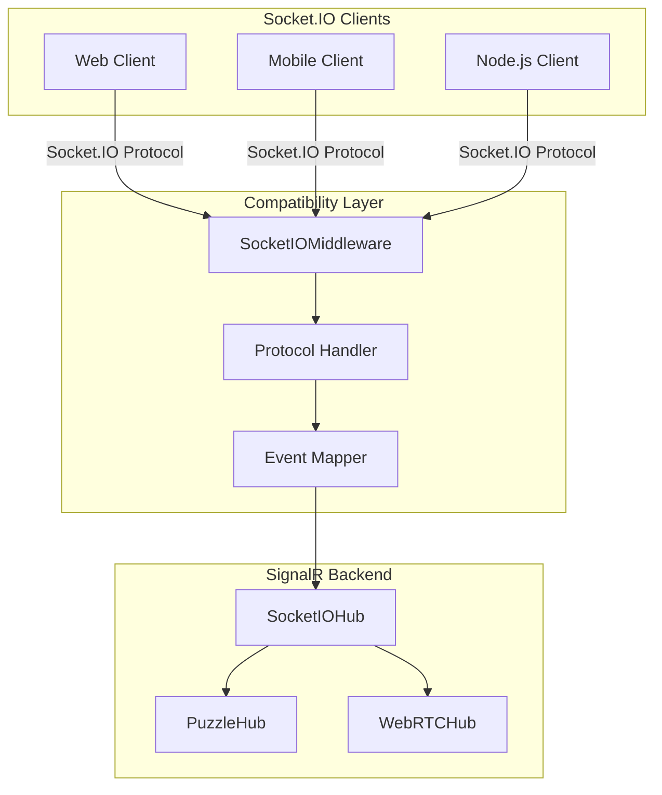

# Socket.IO to SignalR Compatibility Layer

## Overview

This document describes the Socket.IO compatibility layer that allows Socket.IO clients to connect to our SignalR-based backend. This demonstrates interoperability between different real-time communication protocols.

## Architecture



## Implementation Details

### 1. SocketIOMiddleware

The middleware intercepts Socket.IO connections at `/socket.io/` and translates the protocol:

```csharp
public class SocketIOMiddleware
{
    // Handles WebSocket upgrade requests
    // Translates Socket.IO messages to SignalR calls
    // Manages connection lifecycle
}
```

### 2. Protocol Translation

Socket.IO uses a numbered protocol for message types:

| Socket.IO Type | Number | SignalR Equivalent |
|----------------|--------|-------------------|
| CONNECT | 0 | OnConnectedAsync |
| DISCONNECT | 1 | OnDisconnectedAsync |
| EVENT | 2 | Hub method calls |
| ACK | 3 | Method return values |
| ERROR | 4 | Hub exceptions |
| PING | 2 | Keep-alive |
| PONG | 3 | Keep-alive response |

### 3. Event Mapping

Socket.IO events are mapped to SignalR hub methods:

```javascript
// Socket.IO Client
socket.emit('join', { room: 'puzzle-123' });
socket.emit('message', 'Hello world');
socket.emit('custom-event', { data: 'value' });

// Translated to SignalR
await hubContext.Invoke("JoinRoom", "puzzle-123");
await hubContext.Invoke("SendMessage", "Hello world");
await hubContext.Invoke("HandleCustomEvent", "custom-event", { data: "value" });
```

## Usage

### Socket.IO Client Connection

```javascript
// Connect with Socket.IO client
const socket = io('/socket.io/', {
    transports: ['websocket', 'polling']
});

// Join a room
socket.emit('join', { room: 'puzzle-room-1' });

// Send a message
socket.emit('message', 'Hello from Socket.IO');

// Listen for events
socket.on('message', (data) => {
    console.log('Received:', data);
});

socket.on('joined', (data) => {
    console.log('Joined room:', data.room);
});
```

### SignalR Client Connection

```javascript
// Connect with SignalR client
const connection = new signalR.HubConnectionBuilder()
    .withUrl('/socketiohub')
    .build();

// Join a room
await connection.invoke('JoinRoom', 'puzzle-room-1');

// Send a message
await connection.invoke('SendMessage', 'Hello from SignalR');

// Listen for events
connection.on('ReceiveMessage', (connectionId, message) => {
    console.log(`[${connectionId}] ${message}`);
});
```

## Features

### 1. Room Management
- Socket.IO rooms are mapped to SignalR groups
- Join/leave operations are synchronized
- Room-based broadcasting is supported

### 2. Event Broadcasting
- `socket.broadcast` maps to `Clients.Others`
- `io.to(room).emit` maps to `Clients.Group(room)`
- Custom events are forwarded appropriately

### 3. Protocol Features
- Automatic reconnection
- Heartbeat/keep-alive
- Binary data support (limited)
- Acknowledgments

## Testing

Use the provided test page at `/socketio-test.html` to:

1. Connect both Socket.IO and SignalR clients
2. Send messages between protocols
3. Test room functionality
4. Verify event propagation
5. Run automated compatibility tests

## Limitations

1. **Binary Events**: Limited support for Socket.IO binary events
2. **Namespaces**: Socket.IO namespaces not fully implemented
3. **Volatile Messages**: Not supported
4. **Compression**: Uses SignalR's compression instead
5. **Middleware**: Socket.IO middleware concept doesn't translate

## Performance Considerations

- Additional protocol translation overhead (~1-2ms per message)
- Memory usage for connection mapping
- CPU usage for JSON parsing/serialization

## Security

- Same authentication/authorization as SignalR
- CORS policies apply equally
- Connection tokens passed through headers

## Best Practices

1. **Use SignalR Directly**: When possible, use native SignalR clients for better performance
2. **Event Naming**: Use consistent event names across protocols
3. **Error Handling**: Implement proper error handling for protocol mismatches
4. **Monitoring**: Track both Socket.IO and SignalR metrics

## Migration Path

To migrate from Socket.IO to SignalR:

1. Start with compatibility layer
2. Gradually update clients to SignalR
3. Monitor for issues during transition
4. Remove compatibility layer once migration complete

## Example: Puzzle Game Integration

```javascript
// Socket.IO client for puzzle game
socket.emit('puzzle-move', {
    pieceId: '123',
    x: 100,
    y: 200,
    rotation: 90
});

socket.on('puzzle-update', (update) => {
    updatePuzzleBoard(update);
});

// Equivalent SignalR code
await connection.invoke('MovePiece', '123', 100, 200, 90);

connection.on('PiecePositionUpdated', (update) => {
    updatePuzzleBoard(update);
});
```

## Troubleshooting

### Connection Issues
- Check WebSocket support
- Verify CORS configuration
- Ensure proper URL routing

### Message Issues
- Validate JSON formatting
- Check event name mapping
- Verify parameter types

### Performance Issues
- Monitor message frequency
- Check payload sizes
- Consider batching updates

## References

- [Socket.IO Protocol](https://socket.io/docs/v4/socket-io-protocol/)
- [SignalR Documentation](https://docs.microsoft.com/aspnet/core/signalr/)
- [WebSocket RFC](https://tools.ietf.org/html/rfc6455)