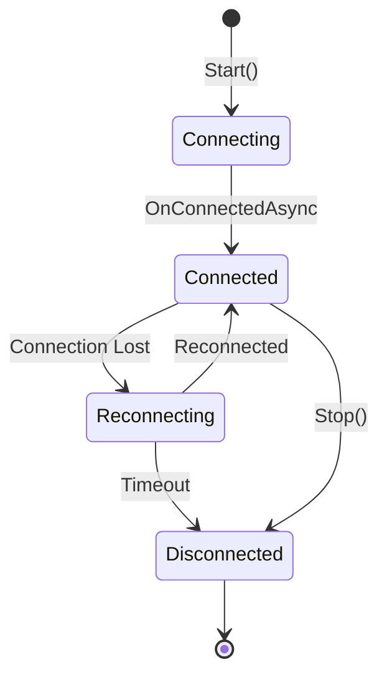
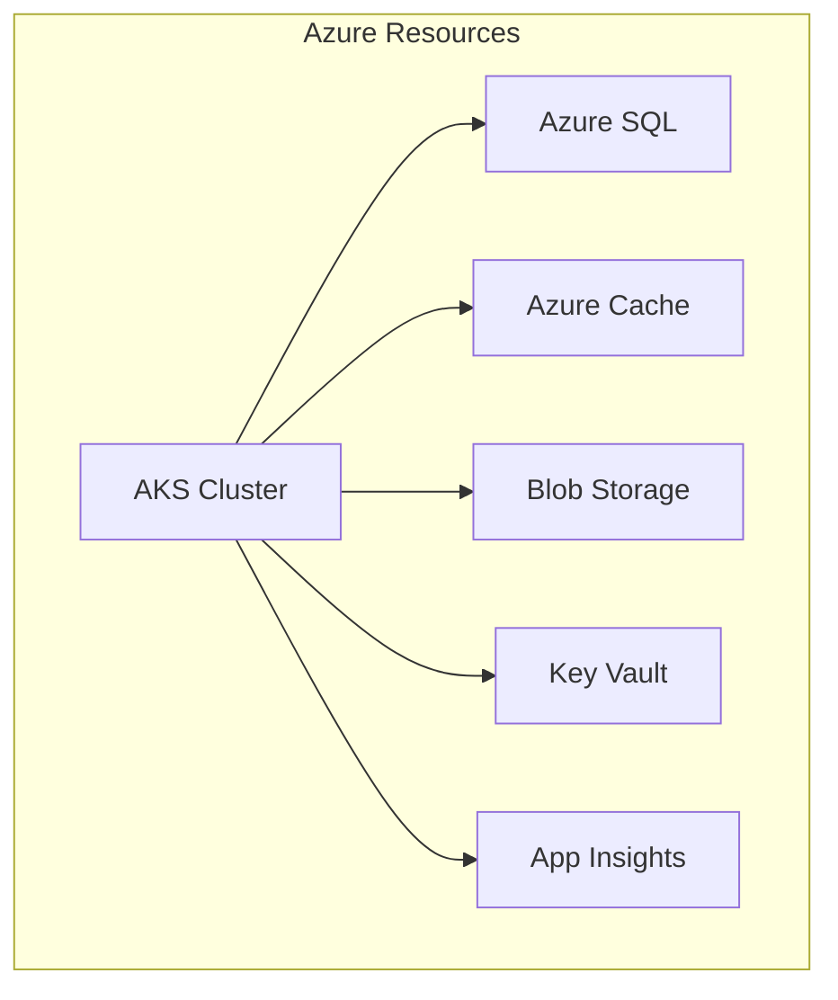

# Collaborative Puzzle Platform - Study Guide

## Table of Contents

1. [Prerequisites](#prerequisites)
2. [Module 1: Project Setup & Architecture](#module-1-project-setup--architecture)
3. [Module 2: Test-Driven Development](#module-2-test-driven-development)
4. [Module 3: SignalR Fundamentals](#module-3-signalr-fundamentals)
5. [Module 4: Redis Integration](#module-4-redis-integration)
6. [Module 5: Distributed Systems Patterns](#module-5-distributed-systems-patterns)
7. [Module 6: WebSocket Deep Dive](#module-6-websocket-deep-dive)
8. [Module 7: WebRTC Implementation](#module-7-webrtc-implementation)
9. [Module 8: MQTT for IoT](#module-8-mqtt-for-iot)
10. [Module 9: Container Orchestration](#module-9-container-orchestration)
11. [Module 10: Production Deployment](#module-10-production-deployment)

## Prerequisites

Before starting this tutorial, ensure you have:
- .NET 9.0 SDK
- Docker Desktop
- Visual Studio 2022 or VS Code
- Redis (via Docker)
- SQL Server (via Docker)
- Basic knowledge of C# and ASP.NET Core

## Module 1: Project Setup & Architecture

### Learning Objectives
- Understand Clean Architecture principles
- Set up a multi-project solution
- Configure code quality tools

### Key Files to Study

1. **Solution Structure** - [`CollaborativePuzzle.sln`](../CollaborativePuzzle.sln)
   - Observe the project organization
   - Note the separation of concerns

2. **Build Configuration** - [`Directory.Build.props`](../Directory.Build.props)
   ```xml
   <!-- Key learnings: Central configuration, analyzers, nullable reference types -->
   <PropertyGroup>
     <LangVersion>latest</LangVersion>
     <Nullable>enable</Nullable>
     <AnalysisMode>AllEnabledByDefault</AnalysisMode>
   </PropertyGroup>
   ```

3. **Package Management** - [`Directory.Packages.props`](../Directory.Packages.props)
   - Central package version management
   - Consistent dependencies across projects

### Hands-on Exercise
1. Create a new project in the solution
2. Add appropriate package references
3. Configure code analysis

### Code Walkthrough

Start with the entry point:
```csharp
// src/CollaborativePuzzle.Api/Program.cs
var builder = WebApplication.CreateBuilder(args);
// Note: Minimal API pattern for reduced boilerplate
```

## Module 2: Test-Driven Development

### Learning Objectives
- Write tests before implementation
- Use mocking effectively
- Create maintainable test suites

### Key Files to Study

1. **Test Base Classes** - [`tests/CollaborativePuzzle.Tests/TestBase/TestBase.cs`](../tests/CollaborativePuzzle.Tests/TestBase/TestBase.cs)
   ```csharp
   // Key pattern: Base class for common test functionality
   public abstract class TestBase : IAsyncLifetime
   {
       protected MockRepository MockRepository { get; }
       protected IServiceProvider ServiceProvider { get; private set; }
   }
   ```

2. **Test Data Builders** - [`tests/CollaborativePuzzle.Tests/Helpers/TestDataBuilder.cs`](../tests/CollaborativePuzzle.Tests/Helpers/TestDataBuilder.cs)
   ```csharp
   // Fluent builder pattern for readable tests
   var puzzle = TestDataBuilder.Puzzle()
       .WithTitle("Test Puzzle")
       .WithPieceCount(100)
       .Build();
   ```

3. **Hub Tests** - [`tests/CollaborativePuzzle.Tests/Hubs/PuzzleHubTests.cs`](../tests/CollaborativePuzzle.Tests/Hubs/PuzzleHubTests.cs)
   - Mock SignalR components
   - Test async hub methods
   - Verify client notifications

### Hands-on Exercise
1. Write a failing test for a new feature
2. Implement the minimum code to pass
3. Refactor while keeping tests green

## Module 3: SignalR Fundamentals

### Learning Objectives
- Understand Hub-based architecture
- Implement real-time messaging
- Handle connection lifecycle

### Key Files to Study

1. **Hub Implementation** - [`src/CollaborativePuzzle.Hubs/PuzzleHub.cs`](../src/CollaborativePuzzle.Hubs/PuzzleHub.cs)
   ```csharp
   // Lines 113-176: Join session implementation
   public async Task<JoinSessionResult> JoinPuzzleSession(string sessionId)
   {
       // Validate session
       // Add to SignalR group
       // Track in Redis
       // Notify others
   }
   ```

2. **Hub Models** - [`src/CollaborativePuzzle.Core/Models/HubModels.cs`](../src/CollaborativePuzzle.Core/Models/HubModels.cs)
   - Strongly typed hub results
   - Notification DTOs

### Connection Lifecycle



### Hands-on Exercise
1. Create a new hub method
2. Implement group management
3. Add connection tracking

## Module 4: Redis Integration

### Learning Objectives
- Use Redis for caching
- Implement pub/sub patterns
- Handle distributed state

### Key Files to Study

1. **Redis Service Interface** - [`src/CollaborativePuzzle.Core/Interfaces/IRedisService.cs`](../src/CollaborativePuzzle.Core/Interfaces/IRedisService.cs)
   ```csharp
   // Key methods for different Redis operations
   Task<bool> SetAsync<T>(string key, T value, TimeSpan expiry, When when);
   Task PublishAsync<T>(string channel, T message);
   ```

2. **Distributed Locking** - [`src/CollaborativePuzzle.Hubs/PuzzleHub.cs#L285`](../src/CollaborativePuzzle.Hubs/PuzzleHub.cs#L285)
   ```csharp
   // Redis-based distributed lock
   var lockAcquired = await _redisService.SetAsync(
       $"piece-lock:{pieceId}", 
       userId.ToString(), 
       TimeSpan.FromSeconds(30), 
       When.NotExists);
   ```

### Redis Patterns Used

1. **Caching**: Store frequently accessed data
2. **Pub/Sub**: Cross-server communication
3. **Distributed Locks**: Prevent race conditions
4. **Session State**: Track user connections

### Hands-on Exercise
1. Implement a new cache pattern
2. Create a pub/sub channel
3. Add TTL management

## Module 5: Distributed Systems Patterns

### Learning Objectives
- Handle concurrency in distributed systems
- Implement idempotency
- Manage eventual consistency

### Key Patterns Demonstrated

1. **Distributed Locking** (Lines 266-340 in PuzzleHub.cs)
   ```csharp
   // Pattern: Try to acquire lock, rollback on failure
   if (!lockAcquired)
   {
       return new LockPieceResult
       {
           Success = false,
           Error = "Piece is already locked"
       };
   }
   ```

2. **Message Throttling** (Lines 445-477)
   ```csharp
   // Channel-based throttling for high-frequency updates
   var channel = _cursorChannels.GetOrAdd(Context.ConnectionId, _ =>
   {
       var ch = Channel.CreateUnbounded<CursorUpdateNotification>();
       _ = ProcessCursorUpdates(ch.Reader, sessionId);
       return ch;
   });
   ```

3. **Connection Resilience** (Lines 61-106)
   - Graceful disconnection handling
   - State cleanup
   - Resource deallocation

### Hands-on Exercise
1. Implement a saga pattern
2. Add compensation logic
3. Handle network partitions

## Module 6: WebSocket Deep Dive

### Learning Objectives
- Understand WebSocket protocol
- Implement raw WebSocket handler
- Compare with SignalR abstraction

### Implementation Roadmap

```csharp
// TODO: Implement in next iteration
app.UseWebSockets();
app.Map("/ws", async context =>
{
    if (context.WebSockets.IsWebSocketRequest)
    {
        var webSocket = await context.WebSockets.AcceptWebSocketAsync();
        await HandleWebSocket(webSocket);
    }
});
```

### WebSocket vs SignalR

| Feature | WebSocket | SignalR |
|---------|-----------|---------|
| Protocol | Single | Multiple fallbacks |
| Reconnection | Manual | Automatic |
| Message Format | Custom | Structured |
| Groups | Manual | Built-in |
| Scale-out | Manual | Redis backplane |

## Module 7: WebRTC Implementation

### Learning Objectives
- Understand WebRTC architecture
- Implement signaling server
- Configure STUN/TURN

### Signaling Flow

```mermaid
sequenceDiagram
    participant A as Alice
    participant S as Signaling Server
    participant B as Bob
    
    A->>S: Create Offer
    S->>B: Forward Offer
    B->>S: Create Answer
    S->>A: Forward Answer
    A->>S: ICE Candidate
    S->>B: Forward ICE
    B->>S: ICE Candidate
    S->>A: Forward ICE
    A<->B: P2P Connection
```

### Hands-on Exercise
1. Implement offer/answer exchange
2. Add ICE candidate handling
3. Configure TURN server

## Module 8: MQTT for IoT

### Learning Objectives
- Understand MQTT protocol
- Implement broker integration
- Bridge MQTT with SignalR

### MQTT Topics Structure

```
puzzle/
├── {sessionId}/
│   ├── moves        # Piece movements
│   ├── chat         # Chat messages
│   ├── status       # Session status
│   └── telemetry    # Performance data
```

### Quality of Service Levels

1. **QoS 0**: At most once (fire and forget)
2. **QoS 1**: At least once (acknowledged)
3. **QoS 2**: Exactly once (4-way handshake)

## Module 9: Container Orchestration

### Learning Objectives
- Create Docker images
- Compose multi-container apps
- Deploy to Kubernetes

### Dockerfile Best Practices

```dockerfile
# Multi-stage build pattern
FROM mcr.microsoft.com/dotnet/sdk:9.0 AS build
WORKDIR /src
COPY ["src/CollaborativePuzzle.Api/CollaborativePuzzle.Api.csproj", "src/CollaborativePuzzle.Api/"]
RUN dotnet restore

FROM build AS publish
RUN dotnet publish -c Release -o /app/publish

FROM mcr.microsoft.com/dotnet/aspnet:9.0 AS final
WORKDIR /app
COPY --from=publish /app/publish .
ENTRYPOINT ["dotnet", "CollaborativePuzzle.Api.dll"]
```

### Kubernetes Resources

1. **Deployment**: Application pods
2. **Service**: Load balancing
3. **ConfigMap**: Configuration
4. **Secret**: Sensitive data
5. **Ingress**: External access

## Module 10: Production Deployment

### Learning Objectives
- Configure Azure resources
- Implement monitoring
- Set up CI/CD

### Azure Architecture



### Monitoring Stack

1. **Application Insights**: APM
2. **Azure Monitor**: Infrastructure
3. **Log Analytics**: Centralized logging
4. **Grafana**: Custom dashboards

## Final Project

Build a complete real-time feature using learned concepts:

1. Design the architecture
2. Write tests first (TDD)
3. Implement SignalR hub
4. Add Redis caching
5. Handle edge cases
6. Deploy to containers
7. Monitor performance

## Additional Resources

### Documentation
- [SignalR Guide](SIGNALR_REDIS_GUIDE.md)
- [TDD Guide](TDD_GUIDE.md)
- [Architecture Overview](ARCHITECTURE_OVERVIEW.md)

### External Links
- [ASP.NET Core Documentation](https://docs.microsoft.com/aspnet/core)
- [Redis Documentation](https://redis.io/documentation)
- [Docker Documentation](https://docs.docker.com)

## Assessment Checklist

- [ ] Can explain Clean Architecture principles
- [ ] Can write tests before implementation
- [ ] Can implement SignalR hub with groups
- [ ] Can use Redis for distributed locking
- [ ] Can handle connection lifecycle
- [ ] Can implement message throttling
- [ ] Can containerize the application
- [ ] Can deploy to Kubernetes
- [ ] Can monitor application health
- [ ] Can troubleshoot production issues